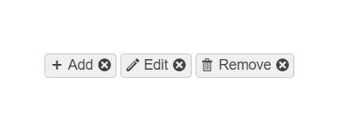

# ChipList Overview


The Telerik UI ChipList TagHelper and HtmlHelper for {{ site.framework }} are server-side wrappers for the Kendo UI ChipList component.

The Telerik UI ChipList HtmlHelper for {{ site.framework }} is a server-side wrapper for the Kendo UI ChipList component.


The ChipList acts as a container for two or more individual Chip components and allows you to maintain a set of selected chips. They represent a complex piece of information in a compact form—for example, an entity that can be a person, a place, or a thing. Each chip from the list can be selected or removed and supports various styling options. The ChipList component is commonly used for single or multiple selections such as additions to an ordered meal.

* [Demo page for the ChipList HtmlHelper](https://demos.telerik.com/{{ site.platform }}/chiplist/index)

* [Demo page for the ChipList TagHelper](https://demos.telerik.com/aspnet-core/chiplist/tag-helper)




## Initializing the Chip

The following example demonstrates how to initialize the ChipList.

```HtmlHelper
    @using Kendo.Mvc.UI

    @(Html.Kendo().ChipList()
        .Name("chiplist")
        .Items(item=>{
            item.Add().Label("One");
            item.Add().Label("Two");
            item.Add().Label("Three");
        })
    )
```

```TagHelper
    @addTagHelper *, Kendo.Mvc

    <kendo-chiplist name="chiplist">
        <items>
            <item label="One"></item>
            <item label="Two"></item>
            <item label="Three"></item>
        </items>
    </kendo-chiplist>
```



## Functionality and Features

* [Customization]()&mdash;You can specify icons for the item content of the chips displayed in the ChipList.
* [Appearance]()—The ChipList delivers a number of ready-to-use, predefined sets of styling options.

## Next Steps
 
* [Getting Started with the Telerik UI Chip for {{ site.framework }}]()
* [Basic Usage of the ChipList HtmlHelper for {{ site.framework }} (Demo)](https://demos.telerik.com/{{ site.platform }}/chiplist/index)
* [JavaScript API Reference of the ChipList HtmlHelper for {{ site.framework }}](https://docs.telerik.com/kendo-ui/api/javascript/ui/chiplist#methods)
* [Server-Side API of the ChipList HtmlHelper for {{ site.framework }}](/api/chiplist)

## See Also

* [Applying the ChipList API (Demo)](https://demos.telerik.com/{{ site.platform }}/chiplist/api)
* [Basic Events in the ChipList (Demo)](https://demos.telerik.com/{{ site.platform }}/chiplist/events)

