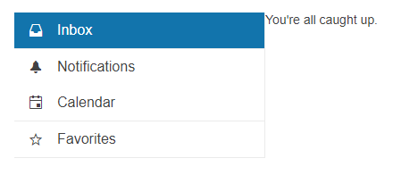

# Getting Started with the Drawer

This tutorial explains how to set up a basic Telerik UI for {{ site.framework }} Drawer and highlights the major steps in the configuration of the component.

You will initialize a drawer with four items. To display dedicated textual content for each Drawer item, you will add event handling. Finally, you can run the sample code in [Telerik REPL](https://netcorerepl.telerik.com/) and continue exploring the components.

 

@[template](/_contentTemplates/core/getting-started-prerequisites.md#repl-component-gs-prerequisites)

## 1. Prepare the CSHTML File

The first step is to add the required directives at the top of the `.cshtml` document:

* To use the Telerik UI for {{ site.framework }} HtmlHelpers:
    ```
    @using Kendo.Mvc.UI
    ```

* To use the Telerik UI for {{ site.framework }} TagHelpers:
    ```
    @addTagHelper *, Kendo.Mvc
    ```


## 2. Initialize the Drawer

Use the Drawer HtmlHelper or TagHelper to add the component to a page:

* The `Name()` configuration method is mandatory as its value is used for the `id` and the name attributes of the Drawer element.

* The `Mini()` configuration method enables the compact view of the drawer. You can use the mini mode to display the icons of the items when the Drawer is collapsed.

* [The `Templates()`]() allow you to configure the individual Drawer items and their rendering:

  * To define each item that you want to render, use the `drawer-item` data role.
  * To render separators between the items, use the `drawer-separator` data role.
  * To add icons with a span, use the `k-icon` class combined with the desired [Kendo UI for jQuery web font icon class](https://docs.telerik.com/kendo-ui/styles-and-layout/sass-themes/font-icons).
  * To ensure that the icons and the text have sufficient padding, wrap the item template text in a span with the `k-item-text` class.

    >tipTo learn more about the CSS and state classes that you can use to customize the appearance of the components, see the [Components Rendering](#styling-options) article.

```HtmlHelper
    @using Kendo.Mvc.UI

    @(Html.Kendo().Drawer()
        .Name("drawer")
        .Mini(true)
        .Template(@"
            <ul>
                <li data-role='drawer-item' class='k-selected'><span class='k-icon k-i-inbox'></span><span class='k-item-text' data-id='Inbox'>Inbox</span></li>
                <li data-role='drawer-separator'></li>
                <li data-role='drawer-item'><span class='k-icon k-i-notification k-i-bell'></span><span class='k-item-text' data-id='Notifications'>Notifications</span></li>
                <li data-role='drawer-item'><span class='k-icon k-i-calendar'></span><span class='k-item-text' data-id='Calendar'>Calendar</span></li>
                <li data-role='drawer-separator'></li>
                <li data-role='drawer-item'><span class='k-icon k-i-star-outline k-i-bookmark-outline'></span><span class='k-item-text' data-id='Favorites'>Favorites</span></li>
                <li data-role='drawer-separator'></li>
            </ul>
        "))
```

```TagHelper
    @addTagHelper *, Kendo.Mvc

    <script id="template" type="text/x-kendo-template">
        <ul>
            <li data-role='drawer-item' class='k-selected'><span class='k-icon k-i-inbox'></span><span class='k-item-text' data-id='Inbox'>Inbox</span></li>
            <li data-role='drawer-separator'></li>
            <li data-role='drawer-item'><span class='k-icon k-i-notification k-i-bell'></span><span class='k-item-text' data-id='Notifications'>Notifications</span></li>
            <li data-role='drawer-item'><span class='k-icon k-i-calendar'></span><span class='k-item-text' data-id='Calendar'>Calendar</span></li>
            <li data-role='drawer-separator'></li>
            <li data-role='drawer-item'><span class='k-icon k-i-star-outline k-i-bookmark-outline'></span><span class='k-item-text' data-id='Favourites'>Favourites</span></li>
            <li data-role='drawer-separator'></li>
        </ul>
    </script>

    <kendo-drawer name="drawer"
        template-id="template">
        <mini enabled="true"/>
    </kendo-drawer>
```


## 3. Configure the Drawer Interaction Mode

You can define how the Drawer [interacts with the content in its items](). In this tutorial, you will configure the drawer to push the content to the side by using `Mode("push")`.

In addition, you can use the `AutoCollapse` method to stop the Drawer from automatically collapsing when the user clicks an item.

```HtmlHelper
    @using Kendo.Mvc.UI

    @(Html.Kendo().Drawer()
        .Name("drawer")
        .Mini(true)
        .Mode("push")
        .AutoCollapse(false)
        .Template(@"
            <ul>
                <li data-role='drawer-item' class='k-selected'><span class='k-icon k-i-inbox'></span><span class='k-item-text' data-id='Inbox'>Inbox</span></li>
                <li data-role='drawer-separator'></li>
                <li data-role='drawer-item'><span class='k-icon k-i-notification k-i-bell'></span><span class='k-item-text' data-id='Notifications'>Notifications</span></li>
                <li data-role='drawer-item'><span class='k-icon k-i-calendar'></span><span class='k-item-text' data-id='Calendar'>Calendar</span></li>
                <li data-role='drawer-separator'></li>
                <li data-role='drawer-item'><span class='k-icon k-i-star-outline k-i-bookmark-outline'></span><span class='k-item-text' data-id='Favorites'>Favorites</span></li>
                <li data-role='drawer-separator'></li>
            </ul>
        "))
```

```TagHelper
    @addTagHelper *, Kendo.Mvc

    <script id="template" type="text/x-kendo-template">
        <ul>
            <li data-role='drawer-item' class='k-selected'><span class='k-icon k-i-inbox'></span><span class='k-item-text' data-id='Inbox'>Inbox</span></li>
            <li data-role='drawer-separator'></li>
            <li data-role='drawer-item'><span class='k-icon k-i-notification k-i-bell'></span><span class='k-item-text' data-id='Notifications'>Notifications</span></li>
            <li data-role='drawer-item'><span class='k-icon k-i-calendar'></span><span class='k-item-text' data-id='Calendar'>Calendar</span></li>
            <li data-role='drawer-separator'></li>
            <li data-role='drawer-item'><span class='k-icon k-i-star-outline k-i-bookmark-outline'></span><span class='k-item-text' data-id='Favourites'>Favorites</span></li>
            <li data-role='drawer-separator'></li>
        </ul>
    </script>

    <kendo-drawer name="drawer"
        template-id="template"
        auto-collapse="false"
        mode="push"    >
        <mini enabled="true"/>
    </kendo-drawer>
```



## 4. Add Content

Next, add some basic content to the Drawer items by using the `Content()` method. Later in this tutorial, you will configure the Drawer to show only the content for the selected Drawer item.

```HtmlHelper
    @using Kendo.Mvc.UI

    @(Html.Kendo().Drawer()
        .Name("drawer")
        .Mini(true)
        .Template(@"
            <ul>
                <li data-role='drawer-item' class='k-selected'><span class='k-icon k-i-inbox'></span><span class='k-item-text' data-id='Inbox'>Inbox</span></li>
                <li data-role='drawer-separator'></li>
                <li data-role='drawer-item'><span class='k-icon k-i-notification k-i-bell'></span><span class='k-item-text' data-id='Notifications'>Notifications</span></li>
                <li data-role='drawer-item'><span class='k-icon k-i-calendar'></span><span class='k-item-text' data-id='Calendar'>Calendar</span></li>
                <li data-role='drawer-separator'></li>
                <li data-role='drawer-item'><span class='k-icon k-i-star-outline k-i-bookmark-outline'></span><span class='k-item-text' data-id='Favorites'>Favorites</span></li>
                <li data-role='drawer-separator'></li>
            </ul>
        ")
        .Content(@"
            <div id='drawer-content'>
                <div id='Inbox' >
                    <p>You're all caught up.</p>
                </div>
                <div id='Notifications' class='hidden'>
                    <p>You don't have any notifications.</p>
                </div>
                <div id='Calendar' class='hidden'>
                    <p>Nothing scheduled for today.</p>
                </div>

                <div id='Favorites' class='hidden'>
                    <p>Your favorites will appear here.</p>                    
                </div>
            </div>
        "))
```

```TagHelper
    @addTagHelper *, Kendo.Mvc

    <script id="template" type="text/x-kendo-template">
        <ul>
            <li data-role='drawer-item' class='k-selected'><span class='k-icon k-i-inbox'></span><span class='k-item-text' data-id='Inbox'>Inbox</span></li>
            <li data-role='drawer-separator'></li>
            <li data-role='drawer-item'><span class='k-icon k-i-notification k-i-bell'></span><span class='k-item-text' data-id='Notifications'>Notifications</span></li>
            <li data-role='drawer-item'><span class='k-icon k-i-calendar'></span><span class='k-item-text' data-id='Calendar'>Calendar</span></li>
            <li data-role='drawer-separator'></li>
            <li data-role='drawer-item'><span class='k-icon k-i-star-outline k-i-bookmark-outline'></span><span class='k-item-text' data-id='Favourites'>Favorites</span></li>
            <li data-role='drawer-separator'></li>
        </ul>
    </script>

    <kendo-drawer name="drawer"
        template-id="template"
        auto-collapse="false"
        mode="push"    >
        <mini enabled="true"/>
        <content>
            <div id='drawer-content'>
                <div id='Inbox'>
                    <p>You're all caught up.</p>
                </div>
                <div id='Notifications' class='hidden'>
                    <p>You don't have any notifications.</p>
                </div>
                <div id='Calendar' class='hidden'>
                    <p>Nothing scheduled for today.</p>
                </div>

                <div id='Favorites' class='hidden'>
                    <p>Your favorites will appear here.</p> 
                </div>
            </div>
        </content>
    </kendo-drawer>
```


## 5. Handle a Drawer Event

The Drawer exposes an [`ItemClick()` event](https://docs.telerik.com/aspnet-core/api/Kendo.Mvc.UI.Fluent/DrawerEventBuilder) that you can handle and assign specific functions to the component. In this tutorial, you will use the `ItemClick()` event to display the content in the selected Drawer item.

To hide the content for the items that aren't currently selected, you will apply the `hidden` CSS style.

```HtmlHelper
    @using Kendo.Mvc.UI

    @(Html.Kendo().Drawer()
        .Name("drawer")
        .Mini(true)
        .Mode("push")
        .AutoCollapse(false)
        .Template(@"
            <ul>
                <li data-role='drawer-item' class='k-selected'><span class='k-icon k-i-inbox'></span><span class='k-item-text' data-id='Inbox'>Inbox</span></li>
                <li data-role='drawer-separator'></li>
                <li data-role='drawer-item'><span class='k-icon k-i-notification k-i-bell'></span><span class='k-item-text' data-id='Notifications'>Notifications</span></li>
                <li data-role='drawer-item'><span class='k-icon k-i-calendar'></span><span class='k-item-text' data-id='Calendar'>Calendar</span></li>
                <li data-role='drawer-separator'></li>
                <li data-role='drawer-item'><span class='k-icon k-i-star-outline k-i-bookmark-outline'></span><span class='k-item-text' data-id='Favorites'>Favorites</span></li>
                <li data-role='drawer-separator'></li>
            </ul>
        ")
        .Content(@"
            <div id='drawer-content'>
                <div id='Inbox' >
                    <p>You're all caught up.</p>
                </div>
                <div id='Notifications' class='hidden'>
                    <p>You don't have any notifications.</p>
                </div>
                <div id='Calendar' class='hidden'>
                    <p>Nothing scheduled for today.</p>
                </div>

                <div id='Favorites' class='hidden'>
                    <p>Your favorites will appear here.</p>                    
                </div>
            </div>
        ")
        .Events(x => x.ItemClick("onItemClick")))

    <script>
        function onItemClick(e) {
            if(!e.item.hasClass("k-drawer-separator")){
                e.sender.drawerContainer.find("#drawer-content > div").addClass("hidden");
                e.sender.drawerContainer.find("#drawer-content").find("#" + e.item.find(".k-item-text").attr("data-id")).removeClass("hidden");
            }
        }
    </script>

    <style>
        .hidden {
            display: none;
        }
    </style>

```

```TagHelper
    @addTagHelper *, Kendo.Mvc

    <script id="template" type="text/x-kendo-template">
        <ul>
            <li data-role='drawer-item' class='k-selected'><span class='k-icon k-i-inbox'></span><span class='k-item-text' data-id='Inbox'>Inbox</span></li>
            <li data-role='drawer-separator'></li>
            <li data-role='drawer-item'><span class='k-icon k-i-notification k-i-bell'></span><span class='k-item-text' data-id='Notifications'>Notifications</span></li>
            <li data-role='drawer-item'><span class='k-icon k-i-calendar'></span><span class='k-item-text' data-id='Calendar'>Calendar</span></li>
            <li data-role='drawer-separator'></li>
            <li data-role='drawer-item'><span class='k-icon k-i-star-outline k-i-bookmark-outline'></span><span class='k-item-text' data-id='Favourites'>Favourites</span></li>
            <li data-role='drawer-separator'></li>
        </ul>
    </script>

    <kendo-drawer name="drawer"
                template-id="template" 
                mode="push" 
                auto-collapse="false" 
                on-item-click="onItemClick">
                <mini enabled="true"/>

                <content>
                    <div id='drawer-content'>
                        <div id='Inbox'>
                            <p>You're all caught up.</p>
                        </div>
                        <div id='Notifications' class='hidden'>
                            <p>You don't have any notifications.</p>
                        </div>
                        <div id='Calendar' class='hidden'>
                            <p>Nothing scheduled for today.</p>
                        </div>
    
                        <div id='Favorites' class='hidden'>
                            <p>Your favorites will appear here.</p> 
                        </div>
                    </div>
                </content>
    </kendo-drawer>

    <script>
        function onItemClick(e) {
            if(!e.item.hasClass("k-drawer-separator")){
                e.sender.drawerContainer.find("#drawer-content > div").addClass("hidden");
                e.sender.drawerContainer.find("#drawer-content").find("#" + e.item.find(".k-item-text").attr("data-id")).removeClass("hidden");
            }
        }
    </script>

    <style>
        .hidden {
            display: none;
        }
    </style>
```


For more examples, refer to the [demo on using the events of the Drawer](https://demos.telerik.com/{{ site.platform }}/drawer/events).

## 6. (Optional) Reference Existing Drawer Instances

You can reference the Drawer instances that you have created and build on top of their existing configuration:

1. Use the `id` attribute of the component instance to establish a reference.

    ```script
    <script>
        var drawerReference = $("#drawer").data("kendoDrawer"); // drawerReference is a reference to the existing instance of the helper.
    </script>
    ```

1. Use the [Drawer client-side API](https://docs.telerik.com/kendo-ui/api/javascript/ui/drawer#methods) to control the behavior of the widget. In this example, you will use the `hide` method to hide the Drawer.

    ```script
    <script>
        var drawerReference = $("#drawer").data("kendoDrawer"); // drawerReference is a reference to the existing instance of the helper.
        drawerReference.show(); // Show (expand) the Drawer instance.
    </script>
    ```

For more information on referencing specific helper instances, see the [Methods and Events]() article.


## Explore this Tutorial in REPL

You can continue experimenting with the code sample above by running it in the Telerik REPL server playground:

* [Sample code with the Drawer HtmlHelper](https://netcorerepl.telerik.com/QmFbbIcc23RcK6rd18)
* [Sample code with the Drawer TagHelper](https://netcorerepl.telerik.com/mQlblemG23ELRarz55)



## Next Steps

* [Creating Hierarchical Drawer Structures]()
* [Setting the Display Mode the Drawer]()

## See Also

* [Using the API of the Drawer for {{ site.framework }} (Demo)](https://demos.telerik.com/{{ site.platform }}/drawer/api)
* [Drawer Client-Side API](https://docs.telerik.com/kendo-ui/api/javascript/ui/drawer)
* [Server-Side API of the Drawer](/api/drawer)
* [Knowledge Base Section](/knowledge-base)
