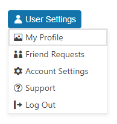

# Getting Started with the DropDownButton

This tutorial explains how to set up a basic Telerik UI for {{ site.framework }} DropDownButton and highlights the major steps in the configuration of the component.

You will initialize a DropDownButton control with five items. Next, you will handle the DropDownButton events and display messages in the browser console. Finally, you can run the sample code in [Telerik REPL](https://netcorerepl.telerik.com/) and continue exploring the components.

 

@[template](/_contentTemplates/core/getting-started-prerequisites.md#repl-component-gs-prerequisites)

## 1. Prepare the CSHTML File

@[template](/_contentTemplates/core/getting-started-directives.md#gs-adding-directives)

Optionally, you can structure the document by adding the desired HTML elements like headings, divs, paragraphs, and apply some basic styles.

## 2. Initialize the DropDownButton

Use the DropDownButton HtmlHelper or TagHelper to add the component to a page:

* The `Name()` configuration method is mandatory as its value is used for the `id` and the name attributes of the DropDownButton element.
* The `Text` defines the textual content of the DropDownButton.

```HtmlHelper
    @using Kendo.Mvc.UI

    @(Html.Kendo().DropDownButton()
        .Name("dropDownButton")
        .Text("User Settings"))
```

```TagHelper
    @addTagHelper *, Kendo.Mvc

    <kendo-dropdownbutton name="dropDownButton" text="User Settings">
    </kendo-dropdownbutton>
```


## 3. Add the DropDownButton Items

The [`Items()` configuration]() specifies the items that will be rendered in the DropDownButton.

```HtmlHelper
    @(Html.Kendo().DropDownButton()
        .Name("dropDownButton")
        .Text("User Settings")
        .Items(items=>{
            items.Add().Id("profile").Text("My Profile");
            items.Add().Id("friend-request").Text("Friend Requests");
            items.Add().Id("settings").Text("Account Settings");
            items.Add().Id("support").Text("Support");
            items.Add().Id("logout").Text("Log Out");
        }))
```

```TagHelper
    @addTagHelper *, Kendo.Mvc

    <kendo-dropdownbutton name="dropDownButton" text="User Settings">
        <dropdownbutton-items>
            <item id="profile" text="My Profile"></item>
            <item id="friend-request" text="Friend Requests"></item>
            <item id="settings" text="Account Settings"></item>
            <item id="support" text="Support"></item>
            <item id="logout" text="Log Out"></item>
        </dropdownbutton-items>
    </kendo-dropdownbutton>
```


## 3. Configure the Appearance

To alter the [appearance]() of the component, use the `ThemeColor` and `FillMode` methods. Additionally, you can also add [icons]() to the DropDownButton and its items.

```HtmlHelper
    @(Html.Kendo().DropDownButton()
        .Name("dropDownButton")
        .Text("User Settings")
        .Icon("user")
        .ThemeColor(ThemeColor.Primary)
        .FillMode(FillMode.Solid)
        .Items(items=>{
            items.Add().Id("profile").Text("My Profile").Icon("image");
            items.Add().Id("friend-request").Text("Friend Requests").Icon("tell-a-friend");
            items.Add().Id("settings").Text("Account Settings").Icon("gear");
            items.Add().Id("support").Text("Support").Icon("question-circle");
            items.Add().Id("logout").Text("Log Out").Icon("logout");
        }))
```

```TagHelper
    @addTagHelper *, Kendo.Mvc

    <kendo-dropdownbutton name="dropDownButton" text="User Settings" theme-color="ThemeColor.Primary" fill-mode="FillMode.Solid" icon="user">
        <dropdownbutton-items>
            <item id="profile" text="My Profile" icon="image"></item>
            <item id="friend-request" text="Friend Requests" icon="tell-a-friend"></item>
            <item id="settings" text="Account Settings" icon="gear"></item>
            <item id="support" text="Support" icon="question-circle"></item>
            <item id="logout" text="Log Out" icon="logout"></item>
        </dropdownbutton-items>
    </kendo-dropdownbutton>
```


## 4. Handle DropDownButton Events

The DropDownButton component exposes the `Click()`, `Open()`, and `Close()` events that you can handle and further customize the functionality of the component.

```HtmlHelper
    @(Html.Kendo().DropDownButton()
        .Name("dropDownButton")
        .Text("User Settings")
        .Icon("user")
        .ThemeColor(ThemeColor.Primary)
        .FillMode(FillMode.Solid)
        .Items(items=>{
            items.Add().Id("profile").Text("My Profile").Icon("image");
            items.Add().Id("friend-request").Text("Friend Requests").Icon("tell-a-friend");
            items.Add().Id("settings").Text("Account Settings").Icon("gear");
            items.Add().Id("support").Text("Support").Icon("question-circle");
            items.Add().Id("logout").Text("Log Out").Icon("logout");
        })
        .Events(e=>e.Click("onClick").Open("onOpen").Close("onClose"))
    )

    <script>
        function onClick(e) {
            console.log("event :: click (#" + e.id + ")" );
        }

        function onOpen(e) {
            console.log("event :: open" );
        }

        function onClose(e) {
            console.log("event :: close" );
        }
    </script>
```

```TagHelper
    @addTagHelper *, Kendo.Mvc

    <kendo-dropdownbutton name="dropDownButton" text="User Settings" theme-color="ThemeColor.Primary" fill-mode="FillMode.Solid" icon="user" on-click="onClick" on-open="onOpen" on-close="onClose">
        <dropdownbutton-items>
            <item id="profile" text="My Profile" icon="image"></item>
            <item id="friend-request" text="Friend Requests" icon="tell-a-friend"></item>
            <item id="settings" text="Account Settings" icon="gear"></item>
            <item id="support" text="Support" icon="question-circle"></item>
            <item id="logout" text="Log Out" icon="logout"></item>
        </dropdownbutton-items>
    </kendo-dropdownbutton>

    <script>
        function onClick(e) {
            console.log("event :: click (#" + e.id + ")" );
        }

        function onOpen(e) {
            console.log("event :: open" );
        }

        function onClose(e) {
            console.log("event :: close" );
        }
    </script>
```


For more examples, refer to the [demo on using the events of the DropDownButton](https://demos.telerik.com/{{ site.platform }}/dropdownbutton/events).

## 5. (Optional) Reference Existing DropDownButton Instances

You can reference the DropDownButton instances that you have created and build on top of their existing configuration:

1. Use the `id` attribute of the component instance to establish a reference.

    ```script
    <script>
        var dropDownButtonReference = $("#dropDownButton").data("kendoDropDownButton"); // dropDownButtonReference is a reference to the existing instance of the helper.
    </script>
    ```

1. Use the [DropDownButton client-side API](https://docs.telerik.com/kendo-ui/api/javascript/ui/dropdownbutton#methods) to control the behavior of the widget. In this example, you will use the `enable` method to control the state of the DropDownButton items.

    ```script
    <script>
        var dropDownButtonReference = $("#dropDownButton").data("kendoDropDownButton"); // dropDownButtonReference is a reference to the existing instance of the helper.
        dropDownButtonReference.enable(false, "#settings"); // Disable the settings item.
    </script>
    ```

For more information on referencing specific helper instances, see the [Methods and Events]() article.


## Explore this Tutorial in REPL

You can continue experimenting with the code sample above by running it in the Telerik REPL server playground:

* [Sample code with the DropDownButton HtmlHelper](https://netcorerepl.telerik.com/QclQEpvH57JjD6KI27)
* [Sample code with the DropDownButton TagHelper](https://netcorerepl.telerik.com/cwlcOfvx584kCSKB07)



## Next Steps

* [Configuring the Items of the DropDownButton]()
* [Customizing the DropDownButton Appearance]()
* [Using Icons in the DropDownButton]()

## See Also

* [Using the API of the DropDownButton for {{ site.framework }} (Demo)](https://demos.telerik.com/{{ site.platform }}/dropdownbutton/api)
* [DropDownButton Client-Side API](https://docs.telerik.com/kendo-ui/api/javascript/ui/dropdownbutton)
* [Server-Side API of the DropDownButton](/api/dropdownbutton)
* [Knowledge Base Section](/knowledge-base)
