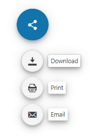

# Getting Started with the FloatingActionButton

This tutorial explains how to set up a basic Telerik UI for {{ site.framework }} FloatingActionButton and highlights the major steps in the configuration of the component.

You will initialize a FloatingActionButton control with three items. Next, you will handle the FloatingActionButton events and display messages in the browser console. Finally, you can run the sample code in [Telerik REPL](https://netcorerepl.telerik.com/) and continue exploring the components.

 

@[template](/_contentTemplates/core/getting-started-prerequisites.md#repl-component-gs-prerequisites)

## 1. Prepare the CSHTML File

@[template](/_contentTemplates/core/getting-started-directives.md#gs-adding-directives)

Optionally, you can structure the document by adding the desired HTML elements like headings, divs, paragraphs, and apply some basic styles.

## 2. Initialize the FloatingActionButton

Use the FloatingActionButton HtmlHelper or TagHelper to add the component to a page:

* The `Name()` configuration method is mandatory as its value is used for the `id` and the name attributes of the FloatingActionButton element.

* The `Align()` configuration method specifies the position of the component relative to its container.

```HtmlHelper
    @using Kendo.Mvc.UI

    @(Html.Kendo().FloatingActionButton()
        .Name("fab")
        .Align(FloatingActionButtonAlign.TopCenter)
        .Icon("share"))
```

```TagHelper
    @addTagHelper *, Kendo.Mvc

    <kendo-floatingactionbutton name="fab"
                                align="FloatingActionButtonAlign.TopCenter"
                                icon="share">
    </kendo-floatingactionbutton>
```


## 3. Add Items to the FloatingActionButton

Next, use the `Items()` method to specify the items that you want to render in the component's popup container. Add their labels and icons. When the user selects the FloatingActionButton, this action will open the popup container with the list of items.

```HtmlHelper
    @using Kendo.Mvc.UI

    @(Html.Kendo().FloatingActionButton()
        .Name("fab")
        .Align(FloatingActionButtonAlign.TopCenter)
        .Icon("share")
        .Items(items =>
        {
            items.Add().Label("Download").Icon("download");
            items.Add().Label("Print").Icon("print");
            items.Add().Label("Email").Icon("email");
        }))
```

```TagHelper
    @addTagHelper *, Kendo.Mvc

    <kendo-floatingactionbutton name="fab"
                                align="FloatingActionButtonAlign.TopCenter"
                                icon="share">
        <floatingactionbutton-items>
            <floatingactionbutton-item label="Download" 
                                        icon="download">
            </floatingactionbutton-item>
            <floatingactionbutton-item label="Print"
                                        icon="print">
            </floatingactionbutton-item>
            <floatingactionbutton-item label="Email"
                                        icon="email">
            </floatingactionbutton-item>
        </floatingactionbutton-items>
    </kendo-floatingactionbutton>
```


## 4. Customize the FloatingActionButton

To change the [appearance]() of the FloatingActionButton, use any of its built-in styling options, for example, `Size()` and `ThemeColor()`.

```HtmlHelper
    @using Kendo.Mvc.UI

    @(Html.Kendo().FloatingActionButton()
        .Name("fab")
        .Align(FloatingActionButtonAlign.TopCenter)
        .Icon("share")
        .ThemeColor(FloatingActionButtonThemeColor.Primary)
        .Size(FloatingActionButtonSize.Medium)
        .Items(items =>
        {
            items.Add().Label("Download").Icon("download");
            items.Add().Label("Print").Icon("print");
            items.Add().Label("Email").Icon("email");
        }))
```

```TagHelper
    @addTagHelper *, Kendo.Mvc

    <kendo-floatingactionbutton name="fab"
                                align="FloatingActionButtonAlign.TopCenter"
                                theme-color="FloatingActionButtonThemeColor.Primary"
                                size="FloatingActionButtonSize.Medium"
                                icon="share">
        <floatingactionbutton-items>
            <floatingactionbutton-item label="Download" 
                                        icon="download">
            </floatingactionbutton-item>
            <floatingactionbutton-item label="Print"
                                        icon="print">
            </floatingactionbutton-item>
            <floatingactionbutton-item label="Email"
                                        icon="email">
            </floatingactionbutton-item>
        </floatingactionbutton-items>
    </kendo-floatingactionbutton>
```


## 5. Handle the FloatingActionButton Events

The FloatingActionButton [exposes the `Click()`, `Expand()`, and `Collapse()` events](https://docs.telerik.com/aspnet-core/api/Kendo.Mvc.UI.Fluent/FloatingActionButtonEventBuilder) that you can handle and assign specific functions to the component. In this tutorial, you will use these events to log messages in the browser's console.

```HtmlHelper
    @using Kendo.Mvc.UI

    @(Html.Kendo().FloatingActionButton()
        .Name("fab")
        .Align(FloatingActionButtonAlign.TopCenter)    
        .ThemeColor(FloatingActionButtonThemeColor.Primary)
        .Size(FloatingActionButtonSize.Medium)
        .Icon("share")
        .Items(items =>
        {
            items.Add().Label("Download").Icon("download").Click("onItemClick");
            items.Add().Label("Print").Icon("print").Click("onItemClick");
            items.Add().Label("Email").Icon("email").Click("onItemClick");
        })
        .Events(ev=>ev.Click("onClick").Collapse("onCollapse").Expand("onExpand"))
        )

    <script>
        function onClick() {
            console.log("event: click");
        };
        function onExpand() {
            console.log("event: expand");
        };
        function onCollapse() {
            console.log("event: collapse");
        };
        function onItemClick(e) {
            console.log($(e.target).text() + " item clicked");
        };
    </script>
```

```TagHelper
    @addTagHelper *, Kendo.Mvc

    <kendo-floatingactionbutton name="fab"
                                on-click="onClick"
                                on-expand="onExpand"
                                on-collapse="onCollapse"
                                align="FloatingActionButtonAlign.TopCenter"
                                theme-color="FloatingActionButtonThemeColor.Primary"
                                size="FloatingActionButtonSize.Medium"
                                icon="share">
        <floatingactionbutton-items>
            <floatingactionbutton-item label="Download" 
                                        icon="download"
                                        click="onItemClick">
            </floatingactionbutton-item>
            <floatingactionbutton-item label="Print"
                                        icon="print"
                                        click="onItemClick">
            </floatingactionbutton-item>
            <floatingactionbutton-item label="Email"
                                        icon="email"
                                        click="onItemClick">
            </floatingactionbutton-item>
        </floatingactionbutton-items>
    </kendo-floatingactionbutton>

    <script>
        function onClick() {
            console.log("event: click");
        };
        function onExpand() {
            console.log("event: expand");
        };
        function onCollapse() {
            console.log("event: collapse");
        };
        function onItemClick(e) {
            console.log($(e.target).text() + " item clicked");
        };
    </script>
```


For more examples, refer to the [demo on using the events of the FloatingActionButton](https://demos.telerik.com/{{ site.platform }}/floatingactionbutton/events).

## 6. (Optional) Reference Existing FloatingActionButton Instances

You can reference the FloatingActionButton instances that you have created and build on top of their existing configuration:

1. Use the `id` attribute of the component instance to establish a reference.

    ```script
    <script>
        var floatingActionButtonReference = $("#fab").data("kendoFloatingActionButton"); // floatingActionButtonReference is a reference to the existing instance of the helper.
    </script>
    ```

1. Use the [FloatingActionButton client-side API](https://docs.telerik.com/kendo-ui/api/javascript/ui/floatingactionbutton#methods) to control the behavior of the widget. In this example, you will use the `enable` method to disable the FloatingActionButton.

    ```script
    <script>
        var floatingActionButtonReference = $("#fab").data("kendoFloatingActionButton"); // floatingActionButtonReference is a reference to the existing instance of the helper.
        floatingActionButtonReference.enable(false); // Disable the FloatingActionButton instance.
    </script>
    ```

For more information on referencing specific helper instances, see the [Methods and Events]() article.


## Explore this Tutorial in REPL

You can continue experimenting with the code sample above by running it in the Telerik REPL server playground:

* [Sample code with the FloatingActionButton HtmlHelper](https://netcorerepl.telerik.com/mwFmEBFQ22BoA8lA02)
* [Sample code with the FloatingActionButton TagHelper](https://netcorerepl.telerik.com/wwlckrvc22GCs2nu17)



## Next Steps

* [Using the Item Templates of the FloatingActionButton]()
* [Customizing the Appearance of the FloatingActionButton]()
* [Configuring the position of the FloatingActionButton]()

## See Also

* [Using the API of the FloatingActionButton for {{ site.framework }} (Demo)](https://demos.telerik.com/{{ site.platform }}/floatingactionbutton/api)
* [FloatingActionButton Client-Side API](https://docs.telerik.com/kendo-ui/api/javascript/ui/floatingactionbutton)
* [Server-Side API of the FloatingActionButton](/api/floatingactionbutton)
* [Knowledge Base Section](/knowledge-base)
