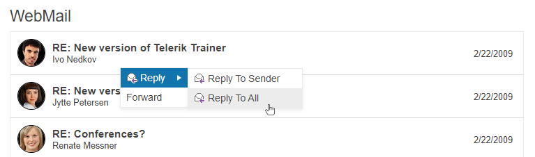

# Getting Started with the ContextMenu

This tutorial explains how to set up a basic Telerik UI for {{ site.framework }} Context Menu and highlights the major steps in the configuration of the component.

You will initialize a ContextMenu control with two items and a submenu. Finally, you can run the sample code in [Telerik REPL](https://netcorerepl.telerik.com/) and continue exploring the components.

 

@[template](/_contentTemplates/core/getting-started-prerequisites.md#repl-component-gs-prerequisites)

## 1. Prepare the CSHTML File

@[template](/_contentTemplates/core/getting-started-directives.md#gs-adding-directives)

Optionally, you can structure the document by adding the desired HTML elements like headings, divs, paragraphs, and apply some basic styles.

In this step, you will also configure a ListView component that will serve as a target for the ContextMenu. Right-clicking a ListView item will open the ContextMenu. For more information about configuring the ListView control, refer to the [Getting Started with the ListView ]() article.


```HtmlHelper
    @using Kendo.Mvc.UI

    <script type="text/x-kendo-template" id="template">
        <div class="product">
            

            <h3>#:Title#</h3>
            <p class="date">#:Date#</p>
            <p>#:From#</p>
        </div>
    </script>

    <div class="demo-section wide">
        <h4>WebMail</h4>
        @(Html.Kendo().ListView<Kendo.Mvc.Examples.Models.WebMail>()
        .Name("listview-context-menu")
        .TagName("div")
        .ClientTemplateId("template")
        .DataSource(dataSource => dataSource
            .Ajax()
            .Read(read => read.Action("WebMailData", "Menu"))
            .PageSize(5)
        ))

        <!-- configure Context Menu here -->
    </div>

    

    <style>
        #listview-context-menu {
            padding: 0;
            margin-bottom: -1px;
            min-height: 300px;
        }

        .product {
            position: relative;
            height: 62px;
            margin: 0;
            padding: 0;
            border-bottom: 1px solid rgba(128,128,128,.3);
        }

        .product img {
            width: 40px;
            height: 40px;
            border-radius: 40px;
            margin: 10px;
            border: 1px solid #000;
            float: left;
        }

        .product h3 {
            margin: 0;
            padding: 15px 5px 1px 0;
            overflow: hidden;
            line-height: 1em;
            font-size: 1.1em;
            font-weight: bold;
        }

        .product p {
            font-size: .9em;
        }

        .product .date {
            float: right;
            margin: -8px 15px 0 0;
        }

        .k-listview:after {
            content: ".";
            display: block;
            height: 0;
            clear: both;
            visibility: hidden;
        }
    </style>
```
```TagHelper
    @using Kendo.Mvc.UI

    <script type="text/x-kendo-template" id="template">
        <div class="product">
            

            <h3>#:Title#</h3>
            <p class="date">#:Date#</p>
            <p>#:From#</p>
        </div>
    </script>

    <div class="demo-section wide">
        <h4>WebMail</h4>
        <kendo-listview name="listview-context-menu"
                        tag-name="div"
                        template-id="template">
            <datasource type="DataSourceTagHelperType.Ajax" page-size="5">
                <transport>
                    <read url="@Url.Action("WebMailData", "Menu")" />
                </transport>
            </datasource>
        </kendo-listview>

        <!-- configure Context Menu here -->
    </div>

    

    <style>
        #listview-context-menu {
            padding: 0;
            margin-bottom: -1px;
            min-height: 300px;
        }

        .product {
            position: relative;
            height: 62px;
            margin: 0;
            padding: 0;
            border-bottom: 1px solid rgba(128,128,128,.3);
        }

        .product img {
            width: 40px;
            height: 40px;
            border-radius: 40px;
            margin: 10px;
            border: 1px solid #000;
            float: left;
        }

        .product h3 {
            margin: 0;
            padding: 15px 5px 1px 0;
            overflow: hidden;
            line-height: 1em;
            font-size: 1.1em;
            font-weight: bold;
        }

        .product p {
            font-size: .9em;
        }

        .product .date {
            float: right;
            margin: -8px 15px 0 0;
        }

        .k-listview:after {
            content: ".";
            display: block;
            height: 0;
            clear: both;
            visibility: hidden;
        }
    </style>
```

## 2. Initialize the ContextMenu

Use the ContextMenu HtmlHelper or TagHelper to add the component to a page:

* Assign a name to the component by using the `Name()` configuration method—this is mandatory as the assigned value is used for the `id` and the `name` attributes of the ContextMenu element.

* Use the `Target` and `Filter` configuration properties to determine over which elements on the page a right mouse opens the ContextMenu.

* The `Items` configuration method lets you add the desired Context Menu items. In this tutorial, you will define two root items and two submenu items for the first root item.

* Add images for the context menu items through the `ImageUrl` property.

```HtmlHelper
    @using Kendo.Mvc.UI

    <script type="text/x-kendo-template" id="template">
        <div class="product">
            

            <h3>#:Title#</h3>
            <p class="date">#:Date#</p>
            <p>#:From#</p>
        </div>
    </script>

    <div class="demo-section wide">
        <h4>WebMail</h4>
        @(Html.Kendo().ListView<Kendo.Mvc.Examples.Models.WebMail>()
        .Name("listview-context-menu")
        .TagName("div")
        .ClientTemplateId("template")
        .DataSource(dataSource => dataSource
            .Ajax()
            .Read(read => read.Action("WebMailData", "Menu"))
            .PageSize(5)
        ))

        @(Html.Kendo().ContextMenu()
            .Name("menu")
            .Target("#listview-context-menu")
            .Filter(".product")
            .Items(items =>
            {
                items.Add()
                    .Text("Reply")
                    .ImageUrl(Url.Content("~/shared/web/toolbar/reply.png"))
                    .Items(children =>
                    {
                        children.Add().Text("Reply To Sender").ImageUrl(Url.Content("~/shared/web/toolbar/reply.png"));
                        children.Add().Text("Reply To All").ImageUrl(Url.Content("~/shared/web/toolbar/reply.png"));
                    });

                items.Add()
                    .Text("Forward");
            })
        )
    </div>

    <style>
        #listview-context-menu {
            padding: 0;
            margin-bottom: -1px;
            min-height: 300px;
        }

        .product {
            position: relative;
            height: 62px;
            margin: 0;
            padding: 0;
            border-bottom: 1px solid rgba(128,128,128,.3);
        }

        .product img {
            width: 40px;
            height: 40px;
            border-radius: 40px;
            margin: 10px;
            border: 1px solid #000;
            float: left;
        }

        .product h3 {
            margin: 0;
            padding: 15px 5px 1px 0;
            overflow: hidden;
            line-height: 1em;
            font-size: 1.1em;
            font-weight: bold;
        }

        .product p {
            font-size: .9em;
        }

        .product .date {
            float: right;
            margin: -8px 15px 0 0;
        }

        .k-listview:after {
            content: ".";
            display: block;
            height: 0;
            clear: both;
            visibility: hidden;
        }
    </style>
```

```TagHelper
    @addTagHelper *, Kendo.Mvc
    @using Kendo.Mvc.UI

    <script type="text/x-kendo-template" id="template">
        <div class="product">
            

            <h3>#:Title#</h3>
            <p class="date">#:Date#</p>
            <p>#:From#</p>
        </div>
    </script>
    <div class="demo-section wide">
        <h4>WebMail</h4>
        <kendo-listview name="listview-context-menu"
                        tag-name="div"
                        template-id="template">
            <datasource type="DataSourceTagHelperType.Ajax" page-size="5">
                <transport>
                    <read url="@Url.Action("WebMailData", "Menu")" />
                </transport>
            </datasource>
        </kendo-listview>

        <kendo-contextmenu name="menu" target="#listview-context-menu" filter=".product">
            <items>
                <menu-item text="Reply" image-url="@Url.Content("~/shared/web/toolbar/reply.png")">
                    <sub-items>
                        <menu-item text="Reply To Sender" image-url="@Url.Content("~/shared/web/toolbar/reply.png")"></menu-item>
                        <menu-item text="Reply To All" image-url="@Url.Content("~/shared/web/toolbar/reply.png")"></menu-item>
                    </sub-items>
                </menu-item>
                <menu-item text="Forward"></menu-item>
            </items>
        </kendo-contextmenu>
    </div>

    <style>
        #listview-context-menu {
            padding: 0;
            margin-bottom: -1px;
            min-height: 300px;
        }

        .product {
            position: relative;
            height: 62px;
            margin: 0;
            padding: 0;
            border-bottom: 1px solid rgba(128,128,128,.3);
        }

        .product img {
            width: 40px;
            height: 40px;
            border-radius: 40px;
            margin: 10px;
            border: 1px solid #000;
            float: left;
        }

        .product h3 {
            margin: 0;
            padding: 15px 5px 1px 0;
            overflow: hidden;
            line-height: 1em;
            font-size: 1.1em;
            font-weight: bold;
        }

        .product p {
            font-size: .9em;
        }

        .product .date {
            float: right;
            margin: -8px 15px 0 0;
        }

        .k-listview:after {
            content: ".";
            display: block;
            height: 0;
            clear: both;
            visibility: hidden;
        }
    </style>
```



## 3. (Optional) Reference Existing ContextMenu Instances

You can reference the ContextMenu instances that you have created and build on top of their existing configuration:

1. Use the `id` attribute of the component instance to establish a reference.

    ```JS script
        <script>
            var contextMenuReference = $("#menu").data("kendoContextMenu"); //contextMenuReference is a reference to the existing instance of the helper.
        </script>
    ```

1. Use the [ContextMenu client-side API](https://docs.telerik.com/kendo-ui/api/javascript/ui/contextmenu#methods) to control the behavior of the widget. In this example, you will use the `enable` method to disable one of the Context Menu items.

    ```JS script
        <script>
            $(document).ready(function () {
                var contextMenuReference = $("#menu").data("kendoContextMenu"); //contextMenuReference is a reference to the existing instance of the helper.
                contextMenuReference.enable("#Roadmap", false); // Disable the desired item in the referenced Context Menu instance.
            })
        </script>
    ```


## Explore this Tutorial in REPL

You can continue experimenting with the code sample above by running it in the Telerik REPL server playground:

* [Sample code with the ContextMenu HtmlHelper](https://netcorerepl.telerik.com/cRYWbsva0163L7OI25)
* [Sample code with the ContextMenu TagHelper](https://netcorerepl.telerik.com/QnuiPMvY00Afzd4f23)



## Next Steps

* [Binding the ContextMenu to Data]()
* [Subscribing to the ContextMenu Events]()
* [Customizing the Appearance of the ContextMenu]()

## See Also

* [Using the API of the Menu for {{ site.framework }} (Demo)](https://demos.telerik.com/{{ site.platform }}/menu/api)
* [Client-Side API of the ContextMenu](https://docs.telerik.com/kendo-ui/api/javascript/ui/contextmenu)
* [Server-Side API of the ContextMenu](/api/contextmenu)
* [Knowledge Base Section](/knowledge-base)
