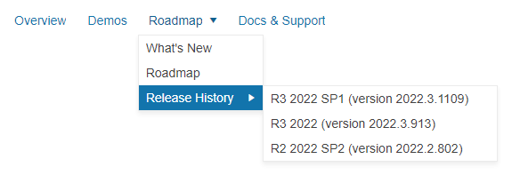

# Getting Started with the Menu

This tutorial explains how to set up a basic Telerik UI for {{ site.framework }} Menu and highlights the major steps in the configuration of the component.

You will initialize a Menu control with four items and two submenus. Next, you will handle the menu events and display messages in the browser console. Finally, you can run the sample code in [Telerik REPL](https://netcorerepl.telerik.com/) and continue exploring the components.

 

@[template](/_contentTemplates/core/getting-started-prerequisites.md#repl-component-gs-prerequisites)

## 1. Prepare the CSHTML File

@[template](/_contentTemplates/core/getting-started-directives.md#gs-adding-directives)

Optionally, you can structure the document by adding the desired HTML elements like headings, divs, paragraphs, and apply some basic styles.

## 2. Initialize the Menu

Use the Menu HtmlHelper or TagHelper to add the component to a page:

* The `Name()` configuration method is mandatory as its value is used for the `id` and the name attributes of the Menu element.

* The `Items()` configuration method lets you add the desired Menu items.

* The `HoverDelay()` allows you to specify the delay before the Menu items open or close on hover. This helps you to prevent the unintended opening or closing of the Menu popups.

* The `Orientation()` method controls the direction in which the menu items are ordered.

* The `HtmlAttributes()` are optional. The `id` attribute allows you to control the state of the **Roadmap** menu item [in step 5 of this tutorial](#5-optional-reference-existing-menu-instances).

```HtmlHelper
    @using Kendo.Mvc.UI

    @(Html.Kendo().Menu()
        .Name("menu")
        .HoverDelay(200)
        .Orientation(MenuOrientation.Horizontal)
        .Items(items =>
        {
            items.Add()
                .Text("Overview");
            items.Add()
                .Text("Demos");
            items.Add()
                .Text("Roadmap")
                .HtmlAttributes(new {@id= "Roadmap" })
                .Items(children =>
                {
                    children.Add().Text("What's New");
                    children.Add().Text("Roadmap");
                    children.Add().Text("Release History")
                        .Items(innerChildren =>
                            {
                                innerChildren.Add().Text("R3 2022 SP1 (version 2022.3.1109)");
                                innerChildren.Add().Text("R3 2022 (version 2022.3.913)");
                                innerChildren.Add().Text("R2 2022 SP2 (version 2022.2.802)");
                            });

                });
            items.Add()
                .Text("Docs & Support");
        })
    )
```

```TagHelper
    @addTagHelper *, Kendo.Mvc

    <kendo-menu name="menu" hover-delay="200" orientation="MenuOrientation.Horizontal">
        <items>
            <menu-item text="Overview">
            </menu-item>
            <menu-item text="Demos">
            </menu-item>
            <menu-item text="Roadmap" id="Roadmap">       
                <sub-items>
                    <menu-item text="What's New"/>
                    <menu-item text="Roadmap" />
                    <menu-item text="Release History" >
                        <sub-items>
                            <menu-item text="R3 2022 SP1 (version 2022.3.1109)"/>
                            <menu-item text="R3 2022 (version 2022.3.913)" />
                            <menu-item text="R2 2022 SP2 (version 2022.2.802)" />
                        </sub-items>
                    </menu-item>
                </sub-items>
            </menu-item>
            <menu-item text="Docs & Support">
            </menu-item>
        </items>
    </kendo-menu>
```


## 3. Configure the Animation

Next, use the `Animation()` method to configure the effects that the component renders when the user opens and closes the Menu.

```HtmlHelper
    @using Kendo.Mvc.UI

    @(Html.Kendo().Menu()
        .Name("menu")
        .HoverDelay(200)
        .Orientation(MenuOrientation.Horizontal)
        .Items(items =>
        {
            items.Add()
                .Text("Overview");
            items.Add()
                .Text("Demos");
            items.Add()
                .Text("Roadmap")
                .HtmlAttributes(new {@id= "Roadmap" })
                .Items(children =>
                {
                    children.Add().Text("What's New");
                    children.Add().Text("Roadmap");
                    children.Add().Text("Release History")
                        .Items(innerChildren =>
                            {
                                innerChildren.Add().Text("R3 2022 SP1 (version 2022.3.1109)");
                                innerChildren.Add().Text("R3 2022 (version 2022.3.913)");
                                innerChildren.Add().Text("R2 2022 SP2 (version 2022.2.802)");
                            });

                });
            items.Add()
                .Text("Docs & Support");
        })
        .Animation(animation =>
        {   
            animation.Open(open =>
            {
                open.Expand(ExpandDirection.Vertical);
                open.Fade(FadeDirection.In);
            });
        })
    )
```

```TagHelper
    @addTagHelper *, Kendo.Mvc

    <kendo-menu name="menu" hover-delay="200" orientation="MenuOrientation.Horizontal">
        <items>
            <menu-item text="Overview">
            </menu-item>
            <menu-item text="Demos">
            </menu-item>
            <menu-item text="Roadmap" id="Roadmap">
                <sub-items>
                    <menu-item text="What's New"/>
                    <menu-item text="Roadmap" />
                    <menu-item text="Release History" >
                        <sub-items>
                            <menu-item text="R3 2022 SP1 (version 2022.3.1109)"/>
                            <menu-item text="R3 2022 (version 2022.3.913)" />
                            <menu-item text="R2 2022 SP2 (version 2022.2.802)" />
                        </sub-items>
                    </menu-item>
                </sub-items>
            </menu-item>
            <menu-item text="Docs & Support">
            </menu-item>
        </items>
        <popup-animation>
                <open effects="expand:vertical fade:in" />
        </popup-animation>
    </kendo-menu>

```


## 4. Handle the Menu Events

The Menu [exposes various events](/api/Kendo.Mvc.UI.Fluent/MenuEventBuilder) that you can handle and further customize the functionality of the component. In this tutorial, you will use the `Open()`, `Close()`, and `Select()` events to log messages in the browser's console.

```HtmlHelper
    @using Kendo.Mvc.UI

    @(Html.Kendo().Menu()
        .Name("menu")
        .Animation(animation =>
        {
            animation.Open(open =>
            {
                open.Expand(ExpandDirection.Vertical);
                open.Fade(FadeDirection.In);
            });
        })
        .HoverDelay(200)
        .Orientation(MenuOrientation.Horizontal)
        .Events(e => e.Open("open").Close("close").Select("select"))
        .Items(items =>
        {
            items.Add()
                .Text("Overview");
            items.Add()
                .Text("Demos");
            items.Add()
                .Text("Roadmap")
                .HtmlAttributes(new {@id= "Roadmap" })
                .Items(children =>
                {
                    children.Add().Text("What's New");
                    children.Add().Text("Roadmap");
                    children.Add().Text("Release History")
                        .Items(innerChildren =>
                        {
                            innerChildren.Add().Text("R3 2022 SP1 (version 2022.3.1109)");
                            innerChildren.Add().Text("R3 2022 (version 2022.3.913)");
                            innerChildren.Add().Text("R2 2022 SP2 (version 2022.2.802)");
                        });

                });
            items.Add()
                .Text("Docs & Support");
        })
    )

    <script>
        function open(e) {
            console.log("Opened: " + ($(e.item).children(".k-link").text()));
        }

        function close(e) {
            console.log("Closed: " + ($(e.item).children(".k-link").text()));
        }

        function select(e) {
            console.log("Selected: " + $(e.item).children(".k-link").text());
        }
    </script>
```

```TagHelper
    @addTagHelper *, Kendo.Mvc

    <kendo-menu name="menu" hover-delay="200" orientation="MenuOrientation.Horizontal" on-open="open" on-close="close" on-select="select" >
        <items>
            <menu-item text="Overview">
            </menu-item>
            <menu-item text="Demos">
            </menu-item>
            <menu-item text="Roadmap" id="Roadmap">
                <sub-items>
                    <menu-item text="What's New"/>
                    <menu-item text="Roadmap" />
                    <menu-item text="Release History" >
                        <sub-items>
                            <menu-item text="R3 2022 SP1 (version 2022.3.1109)"/>
                            <menu-item text="R3 2022 (version 2022.3.913)" />
                            <menu-item text="R2 2022 SP2 (version 2022.2.802)" />
                        </sub-items>
                    </menu-item>
                </sub-items>
            </menu-item>
            <menu-item text="Docs & Support">
            </menu-item>
        </items>
        <popup-animation>
            <open effects="expand:vertical fade:in" />
        </popup-animation>
    </kendo-menu>

    <script>
        function open(e) {
            console.log("Opened: " + ($(e.item).children(".k-link").text()));
        }

        function close(e) {
            console.log("Closed: " + ($(e.item).children(".k-link").text()));
        }

        function select(e) {
            console.log("Selected: " + $(e.item).children(".k-link").text());
        }
    </script>
```


For more examples, refer to the [demo on using the events of the Menu](https://demos.telerik.com/{{ site.platform }}/menu/events).

## 5. (Optional) Reference Existing Menu Instances

You can reference the Menu instances that you have created and build on top of their existing configuration:

1. Use the `id` attribute of the component instance to establish a reference.

    ```script
    <script>
        var menuReference = $("#menu").data("kendoMenu"); // menuReference is a reference to the existing instance of the helper.
    </script>
    ```

1. Use the [Menu client-side API](https://docs.telerik.com/kendo-ui/api/javascript/ui/menu#methods) to control the behavior of the widget. In this example, you will use the `enable` method to disable one of the Menu items.

    ```script
    <script>
        $(document).ready(function () {
            var menuReference = $("#menu").data("kendoMenu"); // menuReference is a reference to the existing instance of the helper.
            menuReference.enable("#Roadmap", false); // Disable the desired item in the referenced Menu instance.
        })
    </script>
    ```

For more information on referencing specific helper instances, see the [Methods and Events]() article.


## Explore this Tutorial in REPL

You can continue experimenting with the code sample above by running it in the Telerik REPL server playground:

* [Sample code with the Menu HtmlHelper](https://netcorerepl.telerik.com/cQPGkNld15urL1OR08)
* [Sample code with the Menu TagHelper](https://netcorerepl.telerik.com/ccvmkZPd16jCl5Cd09)



## Next Steps

* [Binding the Menu to Data]()
* [Customizing the Appearance of the Menu]()
* [Using the ContextMenu]()

## See Also

* [Using the API of the Menu for {{ site.framework }} (Demo)](https://demos.telerik.com/{{ site.platform }}/menu/api)
* [Client-Side API of the Menu](https://docs.telerik.com/kendo-ui/api/javascript/ui/menu)
* [Server-Side API of the Menu](/api/menu)
* [Knowledge Base Section](/knowledge-base)
