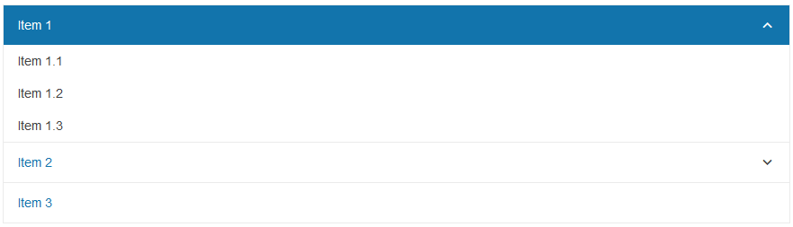

# Getting Started with the PanelBar

This tutorial explains how to set up a basic Telerik UI for {{ site.framework }} PanelBar and highlights the major steps in the configuration of the component.

You will initialize a PanelBar component with several parent and child items. Finally, you can run the sample code in [Telerik REPL](https://netcorerepl.telerik.com/) and continue exploring the components.

 

@[template](/_contentTemplates/core/getting-started-prerequisites.md#repl-component-gs-prerequisites)

## 1. Prepare the CSHTML File

@[template](/_contentTemplates/core/getting-started-directives.md#gs-adding-directives)

Optionally, you can structure the document by adding the desired HTML elements like headings, divs, paragraphs, and others.

```HtmlHelper
    @using Kendo.Mvc.UI

    <h4>PanelBar</h4>
    <div>

    </div>
```

```TagHelper
    @addTagHelper *, Kendo.Mvc

    <h4>PanelBar</h4>
    <div>

    </div>
```


## 2. Initialize the PanelBar

Use the PanelBar HtmlHelper or TagHelper to add the component to the view:

* The `Name()` configuration method is mandatory as its value is used for the `id` and the `name` attributes of the PanelBar element.
* The `Selected()` configuration of a PanelBar item specifies whether it will be selected initially. 
* The `Expanded()` configuration of a PanelBar item specifies whether it will be expanded initially. 

```HtmlHelper
@using Kendo.Mvc.UI

<h4>PanelBar</h4>
<div>
    @(Html.Kendo().PanelBar()
        .Name("panelbar")
        .Items(items =>
        {
            items.Add().Text("Item 1").Selected(true).Expanded(true)
                .Items(subItems =>
                {
                    subItems.Add().Text("Item 1.1");
                    subItems.Add().Text("Item 1.2");
                    subItems.Add().Text("Item 1.3");
                });
            items.Add().Text("Item 2")
                .Items(subItems =>
                {
                    subItems.Add().Text("Item 2.1");
                    subItems.Add().Text("Item 2.2");
                    subItems.Add().Text("Item 2.3");
                });
            items.Add().Text("Item 3");
        })
    )
</div>

```

```TagHelper
@addTagHelper *, Kendo.Mvc

<h4>PanelBar</h4>
<div>
    <kendo-panelbar name="panelbar">
        <items>
            <panelbar-item text="Item 1" selected="true" expanded="true">
                <items>
                    <panelbar-item text="Item 1.1"></panelbar-item>
                    <panelbar-item text="Item 1.2"></panelbar-item>
                    <panelbar-item text="Item 1.3"></panelbar-item>
                </items>
            </panelbar-item>
            <panelbar-item text="Item 2">
                <items>
                    <panelbar-item text="Item 2.1"></panelbar-item>
                    <panelbar-item text="Item 2.2"></panelbar-item>
                    <panelbar-item text="Item 2.3"></panelbar-item>
                </items>
            </panelbar-item>
            <panelbar-item text="Item 3">
            </panelbar-item>
        </items>
    </kendo-panelbar>
</div>

```


## 3. Handle a PanelBar Event

The PanelBar exposes various [events](/api/kendo.mvc.ui.fluent/panelbareventbuilder) that you can handle and further customize the functionality of the component. In this example, you will use the `Select` event, which provides information about the selected item.

```HtmlHelper
@using Kendo.Mvc.UI

<h4>PanelBar</h4>
<div>
    @(Html.Kendo().PanelBar()
        .Name("panelbar")
        .Items(items =>
        {
            items.Add().Text("Item 1").Selected(true).Expanded(true)
                .Items(subItems =>
                {
                    subItems.Add().Text("Item 1.1");
                    subItems.Add().Text("Item 1.2");
                    subItems.Add().Text("Item 1.3");
                });
            items.Add().Text("Item 2")
                .Items(subItems =>
                {
                    subItems.Add().Text("Item 2.1");
                    subItems.Add().Text("Item 2.2");
                    subItems.Add().Text("Item 2.3");
                });
            items.Add().Text("Item 3");
        })
        .Events(e => e.Select("onSelect"))
    )

    <script>
        function onSelect(e) {
            var itemText = $(e.item).find("> .k-link").text();
            console.log(itemText);
        }
    </script>  
</div>
```

```TagHelper
@addTagHelper *, Kendo.Mvc

<h4>PanelBar</h4>
<div>
    <kendo-panelbar name="panelbar" on-select="onSelect">
        <items>
            <panelbar-item text="Item 1" selected="true" expanded="true">
                <items>
                    <panelbar-item text="Item 1.1"></panelbar-item>
                    <panelbar-item text="Item 1.2"></panelbar-item>
                    <panelbar-item text="Item 1.3"></panelbar-item>
                </items>
            </panelbar-item>
            <panelbar-item text="Item 2">
                <items>
                    <panelbar-item text="Item 2.1"></panelbar-item>
                    <panelbar-item text="Item 2.2"></panelbar-item>
                    <panelbar-item text="Item 2.3"></panelbar-item>
                </items>
            </panelbar-item>
            <panelbar-item text="Item 3">
            </panelbar-item>
        </items>
    </kendo-panelbar>

    <script>
        function onSelect(e) {
            var itemText = $(e.item).find("> .k-link").text();
            console.log(itemText);
        }
    </script> 
</div>

```


## 4. (Optional) Reference Existing PanelBar Instances

You can reference the PanelBar instances that you have created and build on top of their existing configuration:

1. Use the `id` attribute of the component instance to establish a reference.

    ```script
    <script>
        var panelBarReference = $("#panelbar").data("kendoPanelBar"); // panelBarReference is a reference to the existing PanelBar instance of the helper.
    </script>
    ```

1. Use the [PanelBar client-side API](https://docs.telerik.com/kendo-ui/api/javascript/ui/panelbar#methods) to control the behavior of the widget. In this example, you will use the `expand` method to expand a parent item.

    ```script
    <script>
        $(document).ready(function() {
            //get a reference to the PanelBar instance
            var panelBar = $("#panelbar").data("kendoPanelBar");
            // expand the second root parent item
            panelBar.expand($("#panelbar>.k-panelbar-item").eq(1));
        })
    </script>
    ```


## Explore this Tutorial in REPL

You can continue experimenting with the code sample above by running it in the Telerik REPL server playground:

* [Sample code with the PanelBar HtmlHelper](https://netcorerepl.telerik.com/QxOUkeFi09Iy58OM22)
* [Sample code with the PanelBar TagHelper](https://netcorerepl.telerik.com/QHkgYovi10Cg9IMC00)



## Next Steps

* [Binding the PanelBar to Data]()
* [Using the Expand Modes of the PanelBar]()

## See Also

* [Using the API of the PanelBar for {{ site.framework }} (Demo)](https://demos.telerik.com/{{ site.platform }}/panelbar/api)
* [Client-Side API of the PanelBar](https://docs.telerik.com/kendo-ui/api/javascript/ui/panelbar)
* [Server-Side API of the PanelBar](/api/panelbar)
* [Knowledge Base Section](/knowledge-base)
