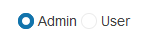

# Getting Started with the RadioButton

This tutorial explains how to set up a basic Telerik UI for {{ site.framework }} RadioButton and highlights the major steps in the configuration of the component.

You will initialize two RadioButton components and set one of them as checked by default. Finally, you can run the sample code in [Telerik REPL](https://netcorerepl.telerik.com/) and continue exploring the components.

 

@[template](/_contentTemplates/core/getting-started-prerequisites.md#repl-component-gs-prerequisites)

## 1. Prepare the CSHTML File

@[template](/_contentTemplates/core/getting-started-directives.md#gs-adding-directives)

Optionally, you can structure the document by adding the desired HTML elements like headings, divs, paragraphs, and others.

```HtmlHelper
    @using Kendo.Mvc.UI

    <h4>RadioButton</h4>
    <div>

    </div>
```

```TagHelper
    @addTagHelper *, Kendo.Mvc

    <h4>RadioButton</h4>
    <div>

    </div>
```


## 2. Initialize the RadioButton

Use the RadioButton HtmlHelper or TagHelper to add the component to the view:

* The `Name()` configuration method is mandatory as its value is used for the `id` and the `name` attributes of the RadioButton element.
* The `HtmlAttributes()` configuration can be used to set the values of various RadioButton Html attributes. In this tutorial, we use the `HtmlAttributes()` option to set an identical `name` attribute value to the two RadioButton components.  
* The `Checked()` configuration is used to set the checked/unchecked state of the RadioButton.

```HtmlHelper
@using Kendo.Mvc.UI

<h4>RadioButton</h4>
<div>
    @(Html.Kendo().RadioButton()
        .Name("role1")
        .Checked(true)
        .HtmlAttributes(new { @name = "role" })
        .Label("Admin")
    )

    @(Html.Kendo().RadioButton()
        .Name("role2")
        .Checked(false)
        .HtmlAttributes(new { @name = "role" })
        .Label("User")
    )
</div>

```

```TagHelper
@addTagHelper *, Kendo.Mvc

<h4>RadioButton</h4>
<div>
    <kendo-radiobutton id="role1" name="role" checked="true" label="Admin"></kendo-radiobutton>
    <kendo-radiobutton id="role2" name="role" label="User"></kendo-radiobutton>
</div>

```


## 3. Handle a RadioButton Event

The RadioButton exposes a `Change` event. In this tutorial, you will handle the `Change` event to detect any changes in the state of the component.

```HtmlHelper
@using Kendo.Mvc.UI

<h4>RadioButton</h4>
<div>
    @(Html.Kendo().RadioButton()
        .Name("role1")
        .Checked(true)
        .HtmlAttributes(new { @name = "role" })
        .Label("Admin")
        .Events(ev => ev.Change("onChange"))
    )

    @(Html.Kendo().RadioButton()
        .Name("role2")
        .Checked(false)
        .HtmlAttributes(new { @name = "role" })
        .Events(ev => ev.Change("onChange"))
        .Label("User")
    )
</div>

<script>
    function onChange(e) {
        console.log(e.checked);
    }
</script>

```

```TagHelper
@addTagHelper *, Kendo.Mvc

<h4>RadioButton</h4>
<div>
    <kendo-radiobutton id="role1" 
        name="role" 
        checked="true" 
        label="Admin"
        on-change="onChange">
    </kendo-radiobutton>

    <kendo-radiobutton id="role2" 
        name="role" 
        label="User" 
        on-change="onChange">
    </kendo-radiobutton>
</div>

<script>
    function onChange(e) {
        console.log(e.checked);
    }
</script>

```


## 4. (Optional) Reference Existing RadioButton Instances

You can reference the RadioButton instances that you have created and build on top of their existing configuration:

1. Use the `id` attribute of the component instance to establish a reference.

    ```JS script
    <script>
        var radiobuttonReference = $("#role2").data("kendoRadioButton"); // radiobuttonReference is a reference to the existing RadioButton instance of the helper.
    </script>
    ```

1. Use the [RadioButton client-side API](https://docs.telerik.com/kendo-ui/api/javascript/ui/radiobutton#methods) to control the behavior of the widget. In this example, you will use the `check` method to check the RadioButton.

    ```JS script
    <script>
        $(document).ready(function() {
            //get a reference to the RadioButton instance
             var radiobuttonReference = $("#role2").data("kendoRadioButton");
            //call the "check()" method
            radiobuttonReference.check(true);
        })
    </script>
    ```


## Explore this Tutorial in REPL

You can continue experimenting with the code sample above by running it in the Telerik REPL server playground:

* [Sample code with the RadioButton HtmlHelper](https://netcorerepl.telerik.com/wRkUuzYj31oSE74d56)
* [Sample code with the RadioButton TagHelper](https://netcorerepl.telerik.com/cRkAuTkj388hsXaE27)



## Next Steps

* [Configuring the Checked State of the RadioButton]()
* [Configuring the Disabled State of the RadioButton]()

## See Also

* [Basic Usage of the RadioButton for {{ site.framework }} (Demo)](https://demos.telerik.com/{{ site.platform }}/radiobutton)
* [Changing the Appearance of the RadioButton for {{ site.framework }} (Demo)](https://demos.telerik.com/{{ site.platform }}/radiobutton/appearance)
* [Client-Side API of the RadioButton](https://docs.telerik.com/kendo-ui/api/javascript/ui/radiobutton)
* [Server-Side API of the RadioButton](/api/radiobutton)
* [Knowledge Base Section](/knowledge-base)
