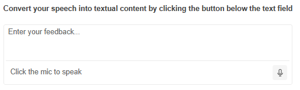

# Getting Started with the SpeechToTextButton

This tutorial explains how to set up the Telerik UI for {{ site.framework }} SpeechToTextButton and goes through the steps in the configuration of the component.

The SpeechToTextButton converts voice input into written text, which makes it suitable for form filling, content creation, search functionality, and displaying results directly in editor components like TextArea or TextBox.

You will integrate a SpeechToTextButton into a [TextArea]() editor to display the converted speech-to-text results. Then, you will enable the continuous speech recognition functionality and reference the existing instance of the component. Finally, you can run the sample code in [Telerik REPL](https://netcorerepl.telerik.com/) and continue exploring the components.

After completing this guide, you will achieve the following results:

 

@[template](/_contentTemplates/core/getting-started-prerequisites.md#component-gs-prerequisites)

## 1. Prepare the CSHTML File

@[template](/_contentTemplates/core/getting-started-directives.md#gs-adding-directives)

Optionally, you can structure the document by adding the desired HTML elements like headings, divs, paragraphs, and others.

```HtmlHelper
    @using Kendo.Mvc.UI

    <h4>Convert your speech into textual content by clicking the button below the text field</h4>
    <div>

    </div>
```

```TagHelper
    @addTagHelper *, Kendo.Mvc

    <h4>Convert your speech into textual content by clicking the button below the text field</h4>
    <div>

    </div>
```


## 2. Initialize the SpeechToTextButton

Use the SpeechToTextButton HtmlHelper or TagHelper to configure the component. By default, the component relies on the [Web Speech API](https://developer.mozilla.org/en-US/docs/Web/API/Web_Speech_API) to perform speech recognition.

The following example shows how to initialize a basic SpeechToTextButton component. The `Name()` configuration method is mandatory as its value is used for the `id` and the `name` attributes of the SpeechToTextButton element.

```HtmlHelper
@(Html.Kendo().SpeechToTextButton()
    .Name("speechButton")
)
```

```TagHelper
@addTagHelper *, Kendo.Mvc

<kendo-speechtotextbutton name="speechButton">
</kendo-speechtotextbutton>
```


## 3. Integrate the SpeechToTextButton into the TextArea

Create a [TextArea]() and add the SpeechToTextButton after it using the `SuffixOptions()` configuration. Define the SpeechToTextButton in a [Template]() component.

```HtmlHelper
@(Html.Kendo().TextArea()
    .Name("feedbackForm")
    .SuffixOptions(suffix =>
    {
        suffix.Template(Html.Kendo().Template()
        .AddHtml("<div class='description k-ml-xs'>Click the mic to speak</div>")
        .AddComponent(btn => btn
        .SpeechToTextButton()
        .Name("speechButton")
        ));
    })
)
```

```TagHelper
@addTagHelper *, Kendo.Mvc

<kendo-textarea name="feedbackForm">
    <suffix-options>
        <suffix-template>
            <div class='description k-ml-xs'>Click the mic to speak</div>
            <kendo-speechtotextbutton name="speechButton">
            </kendo-speechtotextbutton>
        </suffix-template>
    </suffix-options>
</kendo-textarea>
```


## 4. Handle Speech Recognition Results

Next, handle the `Result` event of the SpeechToTextButton to capture the transformed speech-to-text and display the result within the TextArea.

```HtmlHelper
@(Html.Kendo().TextArea()
    .Name("feedbackForm")
    .SuffixOptions(suffix =>
    {
        suffix.Template(Html.Kendo().Template()
        .AddHtml("<div class='description k-ml-xs'>Click the mic to speak</div>")
        .AddComponent(btn => btn
        .SpeechToTextButton()
        .Name("speechButton")
        .Events(ev => ev.Result("onResult"))
        ));
    })
)
```

```TagHelper
@addTagHelper *, Kendo.Mvc

<kendo-textarea name="feedbackForm">
    <suffix-options>
        <suffix-template>
            <div class='description k-ml-xs'>Click the mic to speak</div>
            <kendo-speechtotextbutton name="speechButton" on-result="onResult">
            </kendo-speechtotextbutton>
        </suffix-template>
    </suffix-options>
</kendo-textarea>
```

```JS Scripts
<script>
    function onResult(e) {
        var transcript = e.alternatives[0].transcript; // Access the array of alternative transcripts. 
        $("#feedbackForm").data("kendoTextArea").value(`${transcript}`); // Get a reference to the TextArea and update its value using the client-side value() method.
    }
</script>
```

## 5. Enable Continuous Recognition

By design, the component returns a single result once the recognition process stops. For scenarios where longer dictation or real-time transcription is required, enable the `Continuous()` option to receive ongoing speech recognition results as the user speaks, rather than waiting for the recognition session to end.

```HtmlHelper
@(Html.Kendo().TextArea()
    .Name("feedbackForm")
    .SuffixOptions(suffix =>
    {
        suffix.Template(Html.Kendo().Template()
        .AddHtml("<div class='description k-ml-xs'>Click the mic to speak</div>")
        .AddComponent(btn => btn
        .SpeechToTextButton()
        .Name("speechButton")
        .Continuous(true)
        .Events(ev => ev.Result("onResult"))
        ));
    })
)
```

```TagHelper
@addTagHelper *, Kendo.Mvc

<kendo-textarea name="feedbackForm">
    <suffix-options>
        <suffix-template>
            <div class='description k-ml-xs'>Click the mic to speak</div>
            <kendo-speechtotextbutton name="speechButton" continuous="true" on-result="onResult">
            </kendo-speechtotextbutton>
        </suffix-template>
    </suffix-options>
</kendo-textarea>
```


## 6. (Optional) Reference Existing SpeechToTextButton Instances

Referencing existing component instances allows you to build on top of their configuration. To reference an existing SpeechToTextButton instance, use the [`jQuery.data()`](http://api.jquery.com/jQuery.data/) method.

1. Use the `Name()` option of the component to establish a reference.

    ```JS script
        <script>
            var speechToTextBtnReference = $("#speechButton").data("kendoSpeechToTextButton"); // speechToTextBtnReference is a reference to the existing instance of the helper.
        </script>
    ```

1. Use the [SpeechToTextButton client-side API](https://docs.telerik.com/kendo-ui/api/javascript/ui/speechtotextbutton#methods) to control the behavior of the component. In this example, you will see how to start and stop the speech recognition service dynamically (for example, when clicking a button).

    ```HtmlHelper
        @(Html.Kendo().Button()
            .Name("btnStart")
            .Content("Start the mic")
            .Events(ev => ev.Click("onStartClick")))
        
        @(Html.Kendo().Button()
            .Name("btnStop")
            .Content("Stop the mic")
            .Events(ev => ev.Click("onStopClick")))
    ```
    
    ```TagHelper
        @addTagHelper *, Kendo.Mvc

        <kendo-button name="btnStart" on-click="onStartClick">
            Start the mic
        </kendo-button>

        <kendo-button name="btnStop" on-click="onStopClick">
            Stop the mic
        </kendo-button>
    ```
    
    ```JS Scripts
    <script>
        function onStartClick() {
            var speechToTextBtnReference = $("#speechButton").data("kendoSpeechToTextButton");
            speechToTextBtnReference.startRecognition();
        }

        function onStopClick() {
            var speechToTextBtnReference = $("#speechButton").data("kendoSpeechToTextButton");
            speechToTextBtnReference.stopRecognition();
        }
    </script>
    ```

For more information on referencing specific helper instances, see the [Methods and Events]() article.


## Explore this Tutorial in REPL

You can continue experimenting with the code sample above by running it in the Telerik REPL server playground:

* [Sample code with the SpeechToTextButton HtmlHelper](https://netcorerepl.telerik.com/cTOWaFEh51Fns35j19)
* [Sample code with the SpeechToTextButton TagHelper](https://netcorerepl.telerik.com/QpaikFYr52835A1614)



## Next Steps

* [Customizing the appearance of the SpeechToTextButton]()
* [Handling JavaScript Events of the User Interactions]() 

## See Also

* [Using the API of the SpeechToTextButton for {{ site.framework }} (Demo)](https://demos.telerik.com/{{ site.platform }}/speechtotextbutton/api)
* [Client-Side API of the SpeechToTextButton](https://docs.telerik.com/kendo-ui/api/javascript/ui/speechtotextbutton)
* [Server-Side API of the SpeechToTextButton](/api/speechtotextbutton)

* [Server-Side API of the SpeechToTextButton TagHelper](/api/taghelpers/speechtotextbutton)
