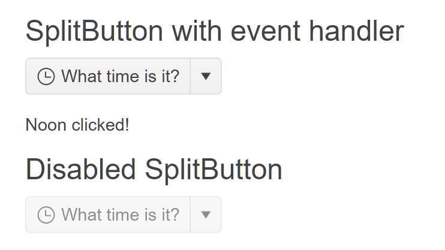

# Getting Started with the SplitButton

This tutorial explains how to set up a basic Telerik UI for {{ site.framework }} SplitButton and highlights the major steps in the configuration of the component.

You will initialize two splitbuttons, one of them will have an event handler and an icon. The other one will be rendered as disabled. Finally, you can run the sample code in [Telerik REPL](https://netcorerepl.telerik.com/) and continue exploring the components.

 

@[template](/_contentTemplates/core/getting-started-prerequisites.md#repl-component-gs-prerequisites)

## 1. Prepare the CSHTML File

@[template](/_contentTemplates/core/getting-started-directives.md#gs-adding-directives)

Optionally, you can structure the document by adding the desired HTML elements like headings, divs, paragraphs, and others.

```HtmlHelper
    @using Kendo.Mvc.UI

    <h4>SplitButton with event handler</h4>
    <p>

    </p>
    <p id="time"></p>

    <h4>Disabled SplitButton</h4>
    <p>

    </p>
```

```TagHelper
    @addTagHelper *, Kendo.Mvc

    <h4>SplitButton with event handler</h4>
    <p>

    </p>
    <p id="time"></p>

    <h4>Disabled SplitButton</h4>
    <p>

    </p>
``` 


## 2. Initialize the SplitButton

Use the SplitButton HtmlHelper or TagHelper to add the component to a page:

* The `Name()` configuration method is mandatory as its value is used for the `id` and the `name` attributes of the SplitButton element.
* The `Text()` configuration specifies the text that is rendered within the SplitButton. This option accepts only string values and no HTML.
* The `Enabled()` configuration defines if the component is enabled or disabled.
* The `Items()` collection contains the Items of the SplitButton's dropdown.

```HtmlHelper
@using Kendo.Mvc.UI

<h4>SplitButton with event handler</h4>
    @(Html.Kendo().SplitButton()
         .Name("timeSplitButton")
         .Text("What time is it?")
         .Items(items =>
          {
              items.Add().Id("morning").Text("Morning");
              items.Add().Id("noon").Text("Noon");
              items.Add().Id("evening").Text("Evening");
          }
         )
)
<p id="time"></p>

<h4>Disabled SplitButton</h4>
@(Html.Kendo().SplitButton()
        .Name("disabledSplitButton")
        .Text("What time is it?")
        .Enabled(false)
)
```

```TagHelper
@addTagHelper *, Kendo.Mvc

<h4>SplitButton with event handler</h4>
<kendo-splitbutton name="timeSplitButton" text="What time is it?">
    <splitbutton-items>
        <item id="morning" text="Morning"></item>
        <item id="noon" text="Noon"></item>
        <item id="evening" text="Evening"></item>
    </splitbutton-items>
</kendo-splitbutton>
<p id="date"></p>

<h4>Disabled SplitButton</h4>
<kendo-splitbutton name="disabledSplitButton" text="What time is it?" 
   enabled="false">
</kendo-splitbutton>
```


## 3. Add an Icon

The next step is to display an icon within the SplitButton. This allows you to enhance its visual representation.

```HtmlHelper
@using Kendo.Mvc.UI

<h4>SplitButton with event handler</h4>
    @(Html.Kendo().SplitButton()
         .Name("timeSplitButton")
         .Text("What time is it?")
         .Icon("clock")
         .Items(items =>
          {
              items.Add().Id("morning").Text("Morning");
              items.Add().Id("noon").Text("Noon");
              items.Add().Id("evening").Text("Evening");
          }
         )
)
<p id="time"></p>

<h4>Disabled SplitButton</h4>
@(Html.Kendo().SplitButton()
        .Name("disabledSplitButton")
        .Text("What time is it?")
        .Icon("clock")
        .Enabled(false)
)
```

```TagHelper
@addTagHelper *, Kendo.Mvc

<h4>SplitButton with event handler</h4>
<kendo-splitbutton name="timeSplitButton" text="What time is it?" icon="clock">
    <splitbutton-items>
        <item id="morning" text="Morning"></item>
        <item id="noon" text="Noon"></item>
        <item id="evening" text="Evening"></item>
    </splitbutton-items>
</kendo-splitbutton>
<p id="date"></p>

<h4>Disabled SplitButton</h4>
<kendo-splitbutton name="disabledSplitButton" text="What time is it?" 
   enabled="false" icon="clock">
</kendo-splitbutton>
```


## 4. Handle a SplitButton Event

The SplitButton exposes a `Click()` event that you can handle and assign specific functions to the component. In this tutorial, you will use the `Click()` event to display a message when the user clicks the button.

```HtmlHelper
@using Kendo.Mvc.UI

<script>
   function onClick(e) {
      $('#time').text(e.target.text() + " clicked!"); 
   }
</script>

<h4>SplitButton with event handler</h4>
    @(Html.Kendo().SplitButton()
         .Name("timeSplitButton")
         .Text("What time is it?")
         .Icon("clock")
         .Events(ev => ev.Click("onClick"))
         .Items(items =>
          {
              items.Add().Id("morning").Text("Morning");
              items.Add().Id("noon").Text("Noon");
              items.Add().Id("evening").Text("Evening");
          }
         )
)

<br/><br/>
<p id="time"></p>

<h4>Disabled SplitButton</h4>
@(Html.Kendo().SplitButton()
        .Name("disabledSplitButton")
        .Text("What time is it?")
        .Icon("clock")
        .Enabled(false)
)
```

```TagHelper
@addTagHelper *, Kendo.Mvc

<script>
   function onClick(e) {
      $('#time').text(e.target.text() + " clicked!"); 
   }
</script>

<h4>SplitButton with event handler</h4>
<kendo-splitbutton name="timeSplitButton" text="What time is it?" 
icon="clock" on-click="onClick">
    <splitbutton-items>
        <item id="morning" text="Morning"></item>
        <item id="noon" text="Noon"></item>
        <item id="evening" text="Evening"></item>
    </splitbutton-items>
</kendo-splitbutton>

<br/><br/>
<p id="time"></p>

<h4>Disabled SplitButton</h4>
<kendo-splitbutton name="disabledSplitButton" text="What time is it?" 
   enabled="false" icon="clock">
</kendo-splitbutton>
```


For more examples, refer to the [demo on using the events of the SplitButton](https://demos.telerik.com/{{ site.platform }}/splitbutton/events).

## 5. (Optional) Reference Existing SplitButton Instances

You can reference the SplitButton instances that you have created and build on top of their existing configuration:

1. Use the `id` attribute of the component instance to establish a reference.

    ```script
    <script>
        var splitbuttonReference = $("#timeSplitButton").data("kendoSplitButton"); // splitbuttonReference is a reference to the existing timeSplitButton instance of the helper.
    </script>
    ```

1. Use the [SplitButton client-side API](https://docs.telerik.com/kendo-ui/api/javascript/ui/splitbutton#methods) to control the behavior of the widget. In this example, you will use the `enable` method to disable the splitbutton.

    ```script
    <script>
        var splitbuttonReference = $("#timeSplitButton").data("kendoSplitButton"); // splitbuttonReference is a reference to the existing timeSplitButton instance of the helper.
        splitbuttonReference.enable(false); // Disable the splitbutton.
    </script>
    ```

For more information on referencing specific helper instances, see the [Methods and Events]() article.


## Explore this Tutorial in REPL

You can continue experimenting with the code sample above by running it in the Telerik REPL server playground:

* [Sample code with the SplitButton HtmlHelper](https://netcorerepl.telerik.com/QHazGRkE58JX1yJS28)
* [Sample code with the SplitButton TagHelper](https://netcorerepl.telerik.com/GHkzQRkE58PJkDDU38)



## Next Steps

* [Customize the Appearance of the SplitButton]()
* [Configure the SplitButton's Icons]()

## See Also

* [Using the API of the SplitButton for {{ site.framework }} (Demo)](https://demos.telerik.com/{{ site.platform }}/splitbutton/api)
* [Client-Side API of the SplitButton](https://docs.telerik.com/kendo-ui/api/javascript/ui/splitbutton)
* [Server-Side API of the SplitButton](/api/splitbutton)
* [Knowledge Base Section](/knowledge-base)
