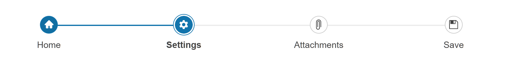

# Getting Started with the Stepper

This tutorial explains how to set up a basic Telerik UI for {{ site.framework }} Stepper and highlights the major steps in the configuration of the component.

You will initialize a Stepper control with predefined items and icons. Next, you will handle some of the Stepper events. Finally, you can run the sample code in [Telerik REPL](https://netcorerepl.telerik.com/) and continue exploring the components.

 

@[template](/_contentTemplates/core/getting-started-prerequisites.md#repl-component-gs-prerequisites)

## 1. Prepare the CSHTML File

@[template](/_contentTemplates/core/getting-started-directives.md#gs-adding-directives)

Optionally, you can structure the document by adding the desired HTML elements like headings, divs, paragraphs, and apply some basic styles.

## 2. Initialize the Stepper

Use the Stepper HtmlHelper or TagHelper to add the component to a page:

* The `Name()` configuration method is mandatory as its value is used for the `id` of the Stepper element.

* The `Items()` configuration method lets you add the desired Stepper items.

* The `Icon()` option of the Stepper individual items can be used to set the desired icon for the step.


```HtmlHelper
    @using Kendo.Mvc.UI

    @(Html.Kendo().Stepper()
        .Name("stepper")
        .Steps(s =>
        {
            s.Add().Label("Home").Icon("home");
            s.Add().Label("Settings").Icon("gear");
            s.Add().Label("Attachments").Icon("paperclip");
            s.Add().Label("Save").Icon("save");
        })
    )
```

```TagHelper
    @addTagHelper *, Kendo.Mvc

    <kendo-stepper name="stepper">
        <steps>
            <step icon="home" label="Home">
            </step>
            <step icon="gear" label="Settings">
            </step>
            <step icon="paperclip" label="Attachments">
            </step>
            <step icon="save" label="Save">
            </step>
        </steps>
    </kendo-stepper>    
```


## 4. Handle the Stepper Events

The Stepper [exposes various events](/api/kendo.mvc.ui.fluent/steppereventbuilder) that you can handle and further customize the functionality of the component. In this tutorial, you will use the `Activate` and `Select` events of the Stepper.

```HtmlHelper
    @using Kendo.Mvc.UI

     @(Html.Kendo().Stepper()
        .Name("stepper")
        .Steps(s =>
        {
            s.Add().Label("Home").Icon("home");
            s.Add().Label("Settings").Icon("gear");
            s.Add().Label("Attachments").Icon("paperclip");
            s.Add().Label("Save").Icon("save");
        })
        .Events(events => events.Activate("onActivate").Select("onSelect"))
    )

<script>
    function onActivate(e) {
        console.log("Activated: " + e.step.options.label);
    }

    function onSelect(e) {
        console.log("Selected: " + e.step.options.label);
    }
</script>
```

```TagHelper
    @addTagHelper *, Kendo.Mvc

    <kendo-stepper name="stepper" on-activate="onActivate" on-select="onSelect">
        <steps>
            <step icon="home" label="Home">
            </step>
            <step icon="gear" label="Settings">
            </step>
            <step icon="paperclip" label="Attachments">
            </step>
            <step icon="save" label="Save">
            </step>
        </steps>
    </kendo-stepper>

<script>
    function onActivate(e) {
        console.log("Activated: " + e.step.options.label);
    }

    function onSelect(e) {
        console.log("Selected: " + e.step.options.label);
    }
</script>
```


For more examples, refer to the [demo on using the events of the Stepper](https://demos.telerik.com/{{ site.platform }}/stepper/events).

## 5. (Optional) Reference Existing Stepper Instances

To use the client-side API of the Stepper and build on top of its initial configuration, you need a reference to the Stepper instance. Once you get a valid reference, you can call the respective API methods:

1. Use the `.Name()` (id attribute) of the component instance to get a reference.

    ```script
    <script>
        var stepperReference = $("#Stepper").data("kendoStepper"); // stepperReference is a reference to the existing instance of the helper.
    </script>
    ```

1. Use the [Stepper client-side API](https://docs.telerik.com/kendo-ui/api/javascript/ui/stepper#methods) to control the behavior of the widget. In this example, you will use the `next` method to selects the step which is immediately after the currently selected step.

    ```script
    <script>
        $(document).ready(function () {
            var stepperReference = $("#Stepper").data("kendoStepper");

            stepperReference.next();
        })
    </script>
    ```

For more information on referencing specific helper instances, see the [Methods and Events]() article.


## Explore this Tutorial in REPL

You can continue experimenting with the code sample above by running it in the Telerik REPL server playground:

* [Sample code with the Stepper HtmlHelper](https://netcorerepl.telerik.com/wyabYrGF14Wl1PNC23)
* [Sample code with the Stepper TagHelper](https://netcorerepl.telerik.com/QSOlOLmv15y0snya08)



## Next Steps

* [Icons]()
* [Steps]()

## See Also

* [Using the API of the Stepper for {{ site.framework }} (Demo)](https://demos.telerik.com/{{ site.platform }}/stepper/api)
* [Client-Side API of the Stepper](https://docs.telerik.com/kendo-ui/api/javascript/ui/stepper)
* [Server-Side API of the Stepper](/api/stepper)
* [Knowledge Base Section](/knowledge-base)
