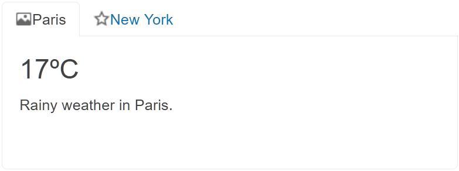

# Getting Started with the TabStrip

This tutorial explains how to set up a basic Telerik UI for {{ site.framework }} TabStrip and highlights the major steps in the configuration of the component.

You will initialize a TabStrip component with several items and a basic content definition. Finally, you can run the sample code in [Telerik REPL](https://netcorerepl.telerik.com/) and continue exploring the components.

 

@[template](/_contentTemplates/core/getting-started-prerequisites.md#repl-component-gs-prerequisites)

## 1. Prepare the CSHTML File

@[template](/_contentTemplates/core/getting-started-directives.md#gs-adding-directives)

Optionally, you can structure the document by adding the desired HTML elements like headings, divs, paragraphs, and others.

```HtmlHelper
    @using Kendo.Mvc.UI

    <h4>TabStrip with cities</h4>
    <div>

    </div>
```

```TagHelper
    @addTagHelper *, Kendo.Mvc

    <h4>TabStrip with cities</h4>
    <div>

    </div>
```


## 2. Initialize the TabStrip

Use the TabStrip HtmlHelper or TagHelper to add the component to a page:

* The `Name()` configuration method is mandatory as its value is used for the `id` and the name attributes of the TabStrip element.
* The `Selected()` configuration of a TabStrip's item specifies which tab is selected initially. 
* The `Image()` property of a TabStrip's item determines the icon or logo path in front of its text.

```HtmlHelper
@using Kendo.Mvc.UI

<h4>TabStrip with cities</h4>
<div>
@(Html.Kendo().TabStrip()
    .Name("tabstrip")
    .Items(tabstrip =>
    {
        tabstrip.Add().Text("Paris")
            .Selected(true)
            .ImageUrl(Url.Content("https://demos.telerik.com/aspnet-core/shared/icons/16/photo.png"))
            .Content(@<text>
            <div class="weather">
                <h2>17<span>ºC</span></h2>
                <p>Rainy weather in Paris.</p>
            </div>
            <span class="rainy"> </span>
            </text>);

        tabstrip.Add().Text("New York")
            .ImageUrl(Url.Content("https://demos.telerik.com/aspnet-core/shared/icons/16/star.png"))
            .Content(@<text>
            <div class="weather">
                <h2>29<span>ºC</span></h2>
                <p>Sunny weather in New York.</p>
            </div>
            <span class="sunny"> </span>
            </text>);
    })
)
</div>
```

```TagHelper
@addTagHelper *, Kendo.Mvc

<h4>TabStrip with cities</h4>
<div>
    <kendo-tabstrip name="tabstrip">
        <items>
            <tabstrip-item text="Paris" selected="true" 
            image-url="@Url.Content("https://demos.telerik.com/aspnet-core/shared/icons/16/photo.png")">
                <content>
                    <div class="weather">
                        <h2>17<span>&ordm;C</span></h2>
                        <p>Rainy weather in Paris.</p>
                    </div>
                    <span class="rainy">&nbsp;</span>
                </content>
            </tabstrip-item>
            <tabstrip-item text="New York" 
            image-url="@Url.Content("https://demos.telerik.com/aspnet-core/shared/icons/16/star.png")">
                <content>
                    <div class="weather">
                        <h2>29<span>&ordm;C</span></h2>
                        <p>Sunny weather in New York.</p>
                    </div>
                    <span class="sunny">&nbsp;</span>
                </content>
            </tabstrip-item>
        </items>
    </kendo-tabstrip>
</div>
```


## 3. Setting the Tab Position

The next step is to demonstrate how you can set the `TabPosition()` option which allows you to dictate where the tabs are rendered. The default setting is `Top`, but you can also use `Left`, `Bottom`, etc.

```HtmlHelper
    @using Kendo.Mvc.UI

<h4>TabStrip with cities</h4>
<div>
@(Html.Kendo().TabStrip()
    .Name("tabstrip")
    .TabPosition(TabStripTabPosition.Top)
    .Items(tabstrip =>
    {
        tabstrip.Add().Text("Paris")
            .Selected(true)
            .ImageUrl(Url.Content("https://demos.telerik.com/aspnet-core/shared/icons/16/photo.png"))
            .Content(@<text>
            <div class="weather">
                <h2>17<span>ºC</span></h2>
                <p>Rainy weather in Paris.</p>
            </div>
            <span class="rainy"> </span>
            </text>);

        tabstrip.Add().Text("New York")
            .ImageUrl(Url.Content("https://demos.telerik.com/aspnet-core/shared/icons/16/star.png"))
            .Content(@<text>
            <div class="weather">
                <h2>29<span>ºC</span></h2>
                <p>Sunny weather in New York.</p>
            </div>
            <span class="sunny"> </span>
            </text>);
    })
)
</div>
```

```TagHelper
   @addTagHelper *, Kendo.Mvc

<h4>TabStrip with cities</h4>
<div>
    <kendo-tabstrip name="tabstrip" tab-position="top">
        <items>
            <tabstrip-item text="Paris" selected="true" 
            image-url="@Url.Content("https://demos.telerik.com/aspnet-core/shared/icons/16/photo.png")">
                <content>
                    <div class="weather">
                        <h2>17<span>&ordm;C</span></h2>
                        <p>Rainy weather in Paris.</p>
                    </div>
                    <span class="rainy">&nbsp;</span>
                </content>
            </tabstrip-item>
            <tabstrip-item text="New York" 
            image-url="@Url.Content("https://demos.telerik.com/aspnet-core/shared/icons/16/star.png")">
                <content>
                    <div class="weather">
                        <h2>29<span>&ordm;C</span></h2>
                        <p>Sunny weather in New York.</p>
                    </div>
                    <span class="sunny">&nbsp;</span>
                </content>
            </tabstrip-item>
        </items>
    </kendo-tabstrip>
</div>
```


## 4. Handle a TabStrip Event

The TabStrip component provides convenient events for implementing your desired logic. In this tutorial, you will use the exposed `Select()` event to log a new entry in the browser's console.

```HtmlHelper
    @using Kendo.Mvc.UI

<h4>TabStrip with cities</h4>
<div>
<script>
    function select(e) {
        console.log("Selected old value :: " + this.value());
    }
</script>

@(Html.Kendo().TabStrip()
    .Name("tabstrip")
    .TabPosition(TabStripTabPosition.Top)
    .Events(e=>e.Select("select"))
    .Items(tabstrip =>
    {
        tabstrip.Add().Text("Paris")
            .Selected(true)
            .ImageUrl(Url.Content("https://demos.telerik.com/aspnet-core/shared/icons/16/photo.png"))
            .Content(@<text>
            <div class="weather">
                <h2>17<span>ºC</span></h2>
                <p>Rainy weather in Paris.</p>
            </div>
            <span class="rainy"> </span>
            </text>);

        tabstrip.Add().Text("New York")
            .ImageUrl(Url.Content("https://demos.telerik.com/aspnet-core/shared/icons/16/star.png"))
            .Content(@<text>
            <div class="weather">
                <h2>29<span>ºC</span></h2>
                <p>Sunny weather in New York.</p>
            </div>
            <span class="sunny"> </span>
            </text>);
    })
)
</div>
```

```TagHelper
   @addTagHelper *, Kendo.Mvc

<h4>TabStrip with cities</h4>
<div>
    <script>
    function select(e) {
        console.log("Selected old value :: " + this.value());
    }
</script>

    <kendo-tabstrip name="tabstrip" tab-position="top" on-select="select">
        <items>
            <tabstrip-item text="Paris" selected="true" 
            image-url="@Url.Content("https://demos.telerik.com/aspnet-core/shared/icons/16/photo.png")">
                <content>
                    <div class="weather">
                        <h2>17<span>&ordm;C</span></h2>
                        <p>Rainy weather in Paris.</p>
                    </div>
                    <span class="rainy">&nbsp;</span>
                </content>
            </tabstrip-item>
            <tabstrip-item text="New York" 
            image-url="@Url.Content("https://demos.telerik.com/aspnet-core/shared/icons/16/star.png")">
                <content>
                    <div class="weather">
                        <h2>29<span>&ordm;C</span></h2>
                        <p>Sunny weather in New York.</p>
                    </div>
                    <span class="sunny">&nbsp;</span>
                </content>
            </tabstrip-item>
        </items>
    </kendo-tabstrip>
</div>
```



## 5. (Optional) Reference Existing TabStrip Instances

You can reference the TabStrip instances that you have created and build on top of their existing configuration:

1. Use the `id` attribute of the component instance to establish a reference.

    ```script
    <script>
        var tabstripReference = $("#tabstrip").data("kendoTabStrip"); // tabstripReference is a reference to the existing TabStrip instance of the helper.
    </script>
    ```

1. Use the [TabStrip client-side API](https://docs.telerik.com/kendo-ui/api/javascript/ui/tabstrip#methods) to control the behavior of the widget. In this example, you will use the `select` method to select an item.

    ```script
    <script>
        var tabstripReference = $("#tabstrip").data("kendoTabStrip"); // tabstripReference is a reference to the existing TabStrip instance of the helper.
        tabstripReference.select(3); 
    </script>
    ```


## Explore this Tutorial in REPL

You can continue experimenting with the code sample above by running it in the Telerik REPL server playground:

* [Sample code with the TabStrip HtmlHelper](https://netcorerepl.telerik.com/Qdalvrlh218JkVt549)
* [Sample code with the TabStrip TagHelper](https://netcorerepl.telerik.com/QHubbrFr23Qwf7NT06)



## Next Steps

* [Binding the TabStrip Items](https://docs.telerik.com/{{ site.platform }}/html-helpers/navigation/tabstrip/binding/items-binding)
* [Configuring the TabStrip Content Area]()
* [Configuring the Animation Effects of the TabStrip]()

## See Also

* [Using the API of the TabStrip for {{ site.framework }} (Demo)](https://demos.telerik.com/{{ site.platform }}/tabstrip/api)
* [TabStrip Client-Side API](https://docs.telerik.com/kendo-ui/api/javascript/ui/tabstrip)
* [Server-Side API of the TabStrip](/api/tabstrip)
* [Knowledge Base Section](/knowledge-base)
