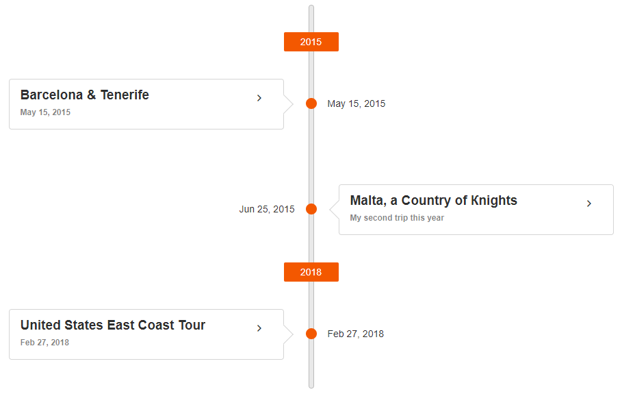

# Timeline Overview

The Telerik UI Timeline HtmlHelper for {{ site.framework }} is a server-side wrapper for the Kendo UI Timeline widget.

The Timeline widget displays a collection of events and their data in a chronological succession for each year.

You can scroll through the events and collapse/expand them. The events order can be vertical or horizontal, and you can customize their templates, as well as respond to events and use API control the widget behavior. You can also control the format of the rendered date for the event. If you provide a list of actions, they will be rendered as links after the description and images.

* [Demo page for the Timeline](https://demos.telerik.com/{{ site.platform }}/timeline/index)



## Initializing the Timeline

The following example demonstrates how to define the Timeline by using the Timeline HtmlHelper. Note the tabs for the controller and model code that show how to feed data to the widget.

```Razor
@(Html.Kendo().Timeline<MyApp.Models.TimelineEventModel>()
           .Name("Timeline")
           .DataDateField("EventDate")
           .DataDescriptionField("Description")
           .DataSubTitleField("Subtitle")
           .DataTitleField("Title")
           .DataImagesField("Images")
           .DataActionsField("Actions")
           .Orientation("vertical") // defines the layout of the widget
           .AlternatingMode() // renders the events on both sides of the axis in vertical mode
           .CollapsibleEvents() // starts all events collapsed in vertical mode
           .DataSource(dt => dt.Read("GetTimelineData", "Timeline"))
)
```
```Controller
public partial class Timeline : BaseController
{
    public JsonResult GetTimelineData()
    {
        List<TimelineEventModel> events = new List<TimelineEventModel>();

        events.Add(new TimelineEventModel() {
            Title = "Barcelona \u0026 Tenerife",
            Subtitle = "May 15, 2015",
            Description = "First event description.",
            EventDate = new System.DateTime(2015, 4, 15),
            Images = new List<TimelineEventImageModel>() {
                new TimelineEventImageModel() { src = "https://demos.telerik.com/aspnet-mvc/tripxpert/Images/Gallery/Barcelona-and-Tenerife/Arc-de-Triomf,-Barcelona,-Spain_Liliya-Karakoleva.JPG?width=500&amp;height=500" }
            },
            Actions = new List<TimelineEventActionModel>() {
                new TimelineEventActionModel() { text = "More info about Barcelona", url="https://en.wikipedia.org/wiki/Barcelona" }
            }
        });

        events.Add(new TimelineEventModel()
        {
            Title = "United States East Coast Tour",
            Subtitle = "Feb 27, 2018",
            Description = "The second event description.",
            EventDate = new System.DateTime(2018, 1, 27),
            Images = new List<TimelineEventImageModel>() {
                new TimelineEventImageModel() { src = "https://demos.telerik.com/aspnet-mvc/tripxpert/Images/Gallery/United-States/Boston-Old-South-Church_Ivo-Igov.JPG?width=500&amp;height=500" }
            },
            Actions = new List<TimelineEventActionModel>() {
                new TimelineEventActionModel() { text = "More info about New York City", url="https://en.wikipedia.org/wiki/New_York_City" }
            }
        });

        events.Add(new TimelineEventModel()
        {
            Title = "Malta, a Country of Кnights",
            Subtitle = "My second trip this year",
            Description = "Third event description.",
            EventDate = new System.DateTime(2015, 5, 25),
            Images = new List<TimelineEventImageModel>() {
                new TimelineEventImageModel() { src = "https://demos.telerik.com/aspnet-mvc/tripxpert/Images/Gallery/Malta/Bibliotheca-National-Library_Marie-Lan-Nguyen.JPG?width=500&amp;height=500" }
            },
            Actions = new List<TimelineEventActionModel>() {
                new TimelineEventActionModel() { text = "More info about Malta", url="https://en.wikipedia.org/wiki/Malta" }
            }
        });

        
        return Json(events);
        return Json(events, JsonRequestBehavior.AllowGet);
    }
}
```
```Model
public class TimelineEventModel
{
    public string Title { get; set; }
    public string Subtitle { get; set; }
    public string Description { get; set; }

    public DateTime EventDate { get; set; }

    public List<TimelineEventImageModel> Images { get; set; }
    public List<TimelineEventActionModel> Actions { get; set; }
}

public class TimelineEventImageModel
{
    public string src { get; set; } // this field name must be "src"
}
public class TimelineEventActionModel
{
    public string text { get; set; } // this field name must be "text"
    public string url { get; set; } // this field name must be "url"
}
```

## Functionality and Features

* [Orientation]()
* [Actions]()
* [Images]()
* [Templates]()


## Events

For a complete example on the Timeline events, refer to the [demo on using the events of the Timeline in {{ site.framework }}](https://demos.telerik.com/{{ site.platform }}/timeline/events).

You can provide an event handler through its [JavaScript function name](#handling-events-by-handler-name), or by [specifying an inline function in a template](#handling-events-by-template-delegate).

### Handling Events by Handler Name

The following example demonstrates how to subscribe to events by using a handler name.

```
@(Html.Kendo().Timeline<MyApp.Models.TimelineEventModel>()
    .Name("Timeline")
    .Events(ev =>
     {
        ev.Change("onChange");
        ev.Navigate("onNavigate");
        ev.DataBound("onDataBound");
        ev.ActionClick("onActionClick");
     })
    .DataDateField("EventDate")
    .DataDescriptionField("Description")
    .DataSubTitleField("Subtitle")
    .DataTitleField("Title")
    .DataImagesField("Images")
    .DataActionsField("Actions")
    .DataSource(dt => dt.Read("GetTimelineData", "Timeline")) // see the first example in this article for a sample data source
)

<script>
    function onChange(e) {
                console.log("OnChange: " + e.dataItem.Title);
            }

            function onNavigate(e) {
                console.log("OnNavigate: " + e.action);
            }

            function onActionClick(e) {
                console.log("OnActionClick: " + e.element.text());
            }

            function onDataBound(e) {
                console.log("OnDataBound: " + e.sender.dataSource.view().length);
            }
</script>
```

### Handling Events by Template Delegate

The following example demonstrates how to subscribe to events by using a template delegate.

```
@(Html.Kendo().Timeline<MyApp.Models.TimelineEventModel>()
    .Name("Timeline")
    .Events(e =>
        e.Change(@<text>
            function(e) {
                // Handle the Change event inline.
            }
        </text>)
       .Navigate(@<text>
            function(e) {
                // Handle the Navigate event inline.
            }
        </text>)
     )
    .DataDateField("EventDate")
    .DataDescriptionField("Description")
    .DataSubTitleField("Subtitle")
    .DataTitleField("Title")
    .DataImagesField("Images")
    .DataActionsField("Actions")
    .DataSource(dt => dt.Read("GetTimelineData", "Timeline")) // see the first example in this article for a sample data source
)
```


## Referencing Existing Instances

To access an existing Timeline instance, use the `.data()` jQuery method, executed by the jQuery object of the originating element. Once you have the reference, you can use the [Timeline client-side API](https://docs.telerik.com/kendo-ui/api/javascript/ui/timeline#methods).

```
@(Html.Kendo().Timeline<MyApp.Models.TimelineEventModel>()
    .Name("Timeline")
    .DataDateField("EventDate")
    .DataDescriptionField("Description")
    .DataSubTitleField("Subtitle")
    .DataTitleField("Title")
    .DataImagesField("Images")
    .DataActionsField("Actions")
    .Orientation("horizontal")
    .DataSource(dt => dt.Read("GetTimelineData", "Timeline")) // see the first example in this article for a sample data source
)
<button onclick="buttonClick();">Go to next event</button>
<script>
    function buttonClick() {
        var timeline = $("#Timeline").data("kendoTimeline");
        timeline.next();
    }
</script>
```


## See Also

* [Basic Usage of the Timeline (Demo)](https://demos.telerik.com/{{ site.platform }}/timeline/index)
* [Using the Events of the Timeline (Demo)](https://demos.telerik.com/{{ site.platform }}/timeline/events)
* [Applying the Timeline API (Demo)](https://demos.telerik.com/{{ site.platform }}/timeline/api)
* [JavaScript API Reference of the Timeline](https://docs.telerik.com/kendo-ui/api/javascript/ui/timeline)

