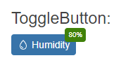

# Getting Started with the ToggleButton

This tutorial explains how to set up a basic Telerik UI for {{ site.framework }} ToggleButton and highlights the major steps in the configuration of the component.

You will initialize two buttons, one of them will have an event handler, an icon, and a badge. The other one will be rendered as disabled. Finally, you can run the sample code in [Telerik REPL](https://netcorerepl.telerik.com/) and continue exploring the components.

 

@[template](/_contentTemplates/core/getting-started-prerequisites.md#repl-component-gs-prerequisites)

## 1. Prepare the CSHTML File

@[template](/_contentTemplates/core/getting-started-directives.md#gs-adding-directives)

Optionally, you can structure the document by adding the desired HTML elements like headings, divs, paragraphs, and others.

```HtmlHelper
    @using Kendo.Mvc.UI

    <h4>ToggleButton:</h4>
```

```TagHelper
    @addTagHelper *, Kendo.Mvc

    <h4>ToggleButton:</h4>
```



## 2. Initialize the ToggleButton

Use the ToggleButton HtmlHelper or TagHelper to add the component to a page:

* The `Name()` configuration method is mandatory as its value is used for the `id` and the name attributes of the ToggleButton element.
* The `Content()` configuration specifies the text that is rendered within the button. This option accepts only string values and no HTML.
* The `Enable()` configuration defines if the component is enabled or disabled.
* The `Group()` configuration is to specify a common `data-group` attribute which allows access for multiple ToggleButton instances.
* The `Selected()` configuration defines whether the component will be selected.

```HtmlHelper
    <h4>ToggleButton:</h4>

    @(Html.Kendo().ToggleButton()
        .Name("toggleButton")
        .Group("badges")
        .Selected(false)
        .Enable(true)
        .Content("Humidity")
    )
```

```TagHelper
    @addTagHelper *, Kendo.Mvc

    <h4>ToggleButton:</h4>

    <kendo-togglebutton name="toggleButton"
                        group="badges"
                        selected="false"
                        enable="true">
                Humidity
    </kendo-togglebutton>
```


## 3. Add an Icon and a Badge

The next step is to display an [icon]() and a [badge]() within the ToggleButton. This allows you to bolster the visual rendering of the component.

```HtmlHelper
    <h4>ToggleButton:</h4>

    @(Html.Kendo().ToggleButton()
        .Name("toggleButton")
        .Group("badges")
        .Selected(false)
        .Icon("droplet")
        .Badge(badge => badge
            .Position(BadgePosition.Edge)
            .Align(BadgeAlign.TopEnd)
            .Shape(BadgeShape.Rectangle)
            .Text("80%")
            .ThemeColor(BadgeColor.Success)
        )
        .Enable(true)
        .Content("Humidity")
    )
```

```TagHelper
    @addTagHelper *, Kendo.Mvc

    <h4>ToggleButton:</h4>
    
    <kendo-togglebutton name="toggleButton"
                        tag="a"
                        group="badges"
                        icon="droplet"
                        selected="false">
                <badge position="BadgePosition.Edge"
                       align="BadgeAlign.TopEnd"
                       shape="BadgeShape.Rectangle"
                       text="80%"
                       theme-color="BadgeColor.Success" />
                Humidity
    </kendo-togglebutton>
```


## 4. Handle a ToggleButton Event

The ToggleButton exposes a `Toggle()` event that you can handle and assign specific functions to the component. In this tutorial, you will use the `Toggle()` event to alert for the checked state of the component.

```HtmlHelper
    <h4>ToggleButton:</h4>

    @(Html.Kendo().ToggleButton()
        .Name("toggleButton")
        .Group("badges")
        .Selected(false)
        .Icon("droplet")
        .Badge(badge => badge
            .Position(BadgePosition.Edge)
            .Align(BadgeAlign.TopEnd)
            .Shape(BadgeShape.Rectangle)
            .Text("80%")
            .ThemeColor(BadgeColor.Success)
        )
        .Events(events => events.Toggle("onToggle"))
        .Enable(true)
        .Content("Humidity")
    )

    <script>
        function onToggle(e) {
            alert("Checked state:" + e.checked);
        }
    </script>
```

```TagHelper
    @addTagHelper *, Kendo.Mvc

    <h4>ToggleButton:</h4>
    
    <kendo-togglebutton name="toggleButton"
                        tag="a"
                        group="badges"
                        icon="droplet"
                        on-toggle="onToggle"
                        selected="false">
                <badge position="BadgePosition.Edge"
                       align="BadgeAlign.TopEnd"
                       shape="BadgeShape.Rectangle"
                       text="80%"
                       theme-color="BadgeColor.Success" />
                Humidity
    </kendo-togglebutton>

    <script>
        function onToggle(e) {
            alert("Checked state:" + e.checked);
        }
    </script>
```


For more examples, refer to the [demo on using the events of the ToggleButton](https://demos.telerik.com/{{ site.platform }}/togglebutton/events).

## 5. (Optional) Reference Existing ToggleButton Instances

You can reference the ToggleButton instances that you have created and build on top of their existing configuration:

1. Use the `id` attribute of the component instance to establish a reference.

    ```JS script
    <script>
        var togglebuttonReference = $("#toggleButton").data("kendoToggleButton"); // togglebuttonReference is a reference to the existing togglebutton instance of the helper.
    </script>
    ```

1. Use the [ToggleButton client-side API](https://docs.telerik.com/kendo-ui/api/javascript/ui/togglebutton#methods) to control the behavior of the widget. In this example, you will use the `enable` method to disable the component. The method is inherited from the Button widget.

    ```JS script
    <script>
        var togglebuttonReference = $("#toggleButton").data("kendoToggleButton"); // togglebuttonReference is a reference to the existing togglebutton instance of the helper.

        togglebuttonReference.enable(false)
    </script>
    ```

For more information on referencing specific helper instances, see the [Methods and Events]() article.


## Explore this Tutorial in REPL

You can continue experimenting with the code sample above by running it in the Telerik REPL server playground:

* [Sample code with the ToggleButton HtmlHelper](https://netcorerepl.telerik.com/cSkIvZaW35sRvYdR06)
* [Sample code with the ToggleButton TagHelper](https://netcorerepl.telerik.com/meOyFXEM347Lklw751)



## Next Steps

* [Customize the Appearance of the ToggleButton]()
* [Configure the ToggleButton's Badge]()

## See Also

* [Using the API of the ToggleButton for {{ site.framework }} (Demo)](https://demos.telerik.com/{{ site.platform }}/togglebutton/api)
* [ToggleButton Client-Side API](https://docs.telerik.com/kendo-ui/api/javascript/ui/togglebutton)
* [Server-Side API of the ToggleButton](/api/togglebutton)

* [TagHelper Server-Side API of the ToggleButton](https://docs.telerik.com/aspnet-core/api/taghelpers/togglebutton)

* [Knowledge Base Section](/knowledge-base)
