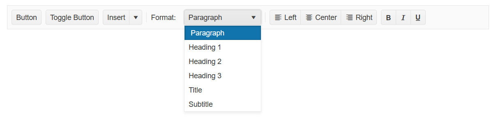

# Getting Started with the ToolBar

This tutorial explains how to set up a basic Telerik UI for {{ site.framework }} ToolBar and highlights the major steps in the configuration of the component.

You will initialize a ToolBar control with a number of tools, including a custom dropdown tool. Next, you will handle some of the ToolBar events. Finally, you can run the sample code in [Telerik REPL](https://netcorerepl.telerik.com/) and continue exploring the components.

 

@[template](/_contentTemplates/core/getting-started-prerequisites.md#repl-component-gs-prerequisites)

## 1. Prepare the CSHTML File

@[template](/_contentTemplates/core/getting-started-directives.md#gs-adding-directives)

Optionally, you can structure the document by adding the desired HTML elements like headings, divs, paragraphs, and apply some basic styles.

## 2. Initialize the ToolBar

Use the ToolBar HtmlHelper or TagHelper to add the component to a page:

* The `Name()` configuration method is mandatory as its value is used for the `id` and the `name` attributes of the ToolBar element.

* The `Items()` configuration method lets you add the desired ToolBar tools.

* The `Resizable()` option, which is enabled by default, is responsible for detecting changes in the viewport width. If the viewport is too narrow to fit all the tools in the ToolBar, the overflowing tools are hidden in a command overflow popup.

* The `NavigateOnTab()` method enables navigation through the ToolBar items by pressing the `Tab` key.

For the custom Format dropdown tool, use a template item. Add an input element in the template and initialize a Kendo UI for jQuery DropDownList from the input element in a `document.ready` handler.

```HtmlHelper
    @using Kendo.Mvc.UI

    @(Html.Kendo().ToolBar()
        .Name("ToolBar")
        .Resizable(true)
        .NavigateOnTab(true)
        .Items(items => {
            items.Add().Type(CommandType.Button).Text("Button");
            items.Add().Type(CommandType.Button).Text("Toggle Button").Togglable(true);
            items.Add().Type(CommandType.SplitButton).Text("Insert").MenuButtons(menuButtons =>
            {
                menuButtons.Add().Text("Insert above").Icon("insert-up");
                menuButtons.Add().Text("Insert between").Icon("insert-middle");
                menuButtons.Add().Text("Insert below").Icon("insert-down");
            });
            items.Add().Type(CommandType.Separator);
            items.Add().Template("<label>Format:</label>");
            items.Add().Template("<input id='dropdown' style='width: 150px;' />").Overflow(ShowInOverflowPopup.Never);
            items.Add().Type(CommandType.Separator);
            items.Add().Type(CommandType.ButtonGroup).Buttons(buttons =>
            {
                buttons.Add().Text("Left").Togglable(true).Group("text-align").Icon("align-left");
                buttons.Add().Text("Center").Togglable(true).Group("text-align").Icon("align-center");
                buttons.Add().Text("Right").Togglable(true).Group("text-align").Icon("align-right");
            });
            items.Add().Type(CommandType.ButtonGroup).Buttons(buttons =>
            {
                buttons.Add().Text("Bold").Togglable(true).Icon("bold").ShowText(ShowIn.Overflow);
                buttons.Add().Text("Italic").Togglable(true).Icon("italic").ShowText(ShowIn.Overflow);
                buttons.Add().Text("Underline").Togglable(true).Icon("underline").ShowText(ShowIn.Overflow);
            });
        })
    )

    <script>
        $(document).ready( function () {
            $("#dropdown").kendoDropDownList({
                optionLabel: "Paragraph",
                dataTextField: "text",
                dataValueField: "value",
                dataSource: [
                    { text: "Heading 1", value: 1 },
                    { text: "Heading 2", value: 2 },
                    { text: "Heading 3", value: 3 },
                    { text: "Title", value: 4 },
                    { text: "Subtitle", value: 5 },
                ]
            });
        });
    </script>
```

```TagHelper
    @addTagHelper *, Kendo.Mvc
 
    <kendo-toolbar name="ToolBar">
        <toolbar-items>
            <item text="Button" type="CommandType.Button">
            </item>
            <item text="Toggle Button" togglable="true" type="CommandType.Button">
            </item>
            <item text="Insert" type="CommandType.SplitButton">
                <menu-buttons>
                    <toolbar-button icon="insert-up" text="Insert above">
                    </toolbar-button>
                    <toolbar-button icon="insert-middle" text="Insert between">
                    </toolbar-button>
                    <toolbar-button icon="insert-down" text="Insert below">
                    </toolbar-button>
                </menu-buttons>
            </item>
            <item type="CommandType.Separator">
            </item>
            <item template="<label>Format:</label>">
            </item>
            <item template="<input id='dropdown' style='width: 150px;' />" overflow="ShowInOverflowPopup.Never">
            </item>
            <item type="CommandType.Separator">
            </item>
            <item type="CommandType.ButtonGroup">
                <buttons>
                    <toolbar-button group="text-align" icon="align-left" togglable="true" text="Left">
                    </toolbar-button>
                    <toolbar-button group="text-align" icon="align-center" togglable="true" text="Center">
                    </toolbar-button>
                    <toolbar-button group="text-align" icon="align-right" togglable="true" text="Right">
                    </toolbar-button>
                </buttons>
            </item>
            <item type="CommandType.ButtonGroup">
                <buttons>
                    <toolbar-button icon="bold" togglable="true" text="Bold" show-text="ShowIn.Overflow">
                    </toolbar-button>
                    <toolbar-button icon="italic" togglable="true" text="Italic" show-text="ShowIn.Overflow">
                    </toolbar-button>
                    <toolbar-button icon="underline" togglable="true" text="Underline" show-text="ShowIn.Overflow">
                    </toolbar-button>
                </buttons>
            </item>
        </toolbar-items>
    </kendo-toolbar>

    <script>
        $(document).ready( function () {
            $("#dropdown").kendoDropDownList({
                optionLabel: "Paragraph",
                dataTextField: "text",
                dataValueField: "value",
                dataSource: [
                    { text: "Heading 1", value: 1 },
                    { text: "Heading 2", value: 2 },
                    { text: "Heading 3", value: 3 },
                    { text: "Title", value: 4 },
                    { text: "Subtitle", value: 5 },
                ]
            });
        });
    </script>
```


## 4. Handle the ToolBar Events

The ToolBar [exposes various events](/api/kendo.mvc.ui.fluent/toolbareventbuilder) that you can handle and further customize the functionality of the component. In this tutorial, you will use the `Click` and `Toggle` events of the ToolBar, and the events of the individual tools.

```HtmlHelper
    @using Kendo.Mvc.UI

    @(Html.Kendo().ToolBar()
        .Name("ToolBar")
        .Items(items =>
        {
            items.Add().Type(CommandType.Button).Text("Button 1").Id("button1").Click("buttonClickHandler");
            items.Add().Type(CommandType.Button).Text("Button 2").Id("button2").Click("buttonClickHandler");
            items.Add().Type(CommandType.Separator);
            items.Add().Type(CommandType.Button).Togglable(true).Text("Toggle 1").Id("toggle1").Toggle("buttonToggleHandler");
            items.Add().Type(CommandType.Button).Togglable(true).Text("Toggle 2").Id("toggle2").Toggle("buttonToggleHandler");
            items.Add().Type(CommandType.Separator);
            items.Add().Type(CommandType.SplitButton).Text("Split Button").Id("mainButton").Click("splitButtonClickHandler").MenuButtons(menuButtons =>
            {
                menuButtons.Add().Text("Action 1").Id("action1");
                menuButtons.Add().Text("Action 2").Id("action2");
                menuButtons.Add().Text("Action 3").Id("action3");
            });
            items.Add().Type(CommandType.Separator);
            items.Add().Type(CommandType.ButtonGroup).Buttons(buttons =>
            {
                buttons.Add().Text("Radio 1").Id("radio1").Togglable(true).Group("radio").Toggle("buttonToggleHandler");
                buttons.Add().Text("Radio 2").Id("radio2").Togglable(true).Group("radio").Toggle("buttonToggleHandler");
                buttons.Add().Text("Radio 3").Id("radio3").Togglable(true).Group("radio").Toggle("buttonToggleHandler");
            });
        })
        .Events(e => e.Click("onClick").Toggle("onToggle"))
    )

    <script>
        function buttonClickHandler(e) {
            console.log(e.target.text() + " 'click' event is fired.");
        }

        function buttonToggleHandler(e) {
            console.log(e.target.text() + " 'toggle' event is fired.");
        }

        function splitButtonClickHandler(e) {
            console.log("SplitButton event: " + e.id + " is clicked.");
        }

        function onClick(e) {
            console.log("ToolBar 'click' event is fired for element with id: " + e.id);
        }

        function onToggle(e) {
            if (e.group == "radio") {
                console.log("Toolbar 'toggle' event: " + e.id + " button is selected from group: " + e.group);
            } else {
                console.log("ToolBar 'toggle' event: " + e.id + " button is changed");
            }
        }
    </script>
```

```TagHelper
    @addTagHelper *, Kendo.Mvc

    <kendo-toolbar name="ToolBar" on-click="onClick" on-toggle="onToggle">
        <toolbar-items>
            <item click="buttonClickHandler" text="Button 1" type="CommandType.Button">
            </item>
            <item click="buttonClickHandler" text="Button 2" type="CommandType.Button">
            </item>
            <item type="CommandType.Separator">
            </item>
            <item text="Toggle 1" togglable="true" toggle="buttonToggleHandler" type="CommandType.Button">
            </item>
            <item text="Toggle 2" togglable="true" toggle="buttonToggleHandler" type="CommandType.Button">
            </item>
            <item type="CommandType.Separator">
            </item>
            <item click="splitButtonClickHandler" text="Split Button" type="CommandType.SplitButton">
                <menu-buttons>
                    <toolbar-button text="Action 1"/>
                    <toolbar-button text="Action 2"/>
                    <toolbar-button text="Action 3"/>
                </menu-buttons>
            </item>
            <item type="CommandType.Separator">
            </item>
            <item type="CommandType.ButtonGroup">
                <buttons>
                    <toolbar-button group="radio" toggle="buttonToggleHandler" togglable="true" text="Radio 1">
                    </toolbar-button>
                    <toolbar-button group="radio" toggle="buttonToggleHandler" togglable="true" text="Radio 2">
                    </toolbar-button>
                    <toolbar-button group="radio" toggle="buttonToggleHandler" togglable="true" text="Radio 3">
                    </toolbar-button>
                </buttons>
            </item>
        </toolbar-items>
    </kendo-toolbar>

    <script>
        function buttonClickHandler(e) {
            console.log(e.target.text() + " 'click' event is fired.");
        }

        function buttonToggleHandler(e) {
            console.log(e.target.text() + " 'toggle' event is fired.");
        }

        function splitButtonClickHandler(e) {
            console.log("SplitButton event: " + e.id + " is clicked.");
        }

        function onClick(e) {
            console.log("ToolBar 'click' event is fired for element with id: " + e.id);
        }

        function onToggle(e) {
            if (e.group == "radio") {
                console.log("Toolbar 'toggle' event: " + e.id + " button is selected from group: " + e.group);
            } else {
                console.log("ToolBar 'toggle' event: " + e.id + " button is changed");
            }
        }
    </script>
```


For more examples, refer to the [demo on using the events of the ToolBar](https://demos.telerik.com/{{ site.platform }}/toolbar/events).

## 5. (Optional) Reference Existing ToolBar Instances

To use the client-side API of the ToolBar and build on top of its initial configuration, you need a reference to the ToolBar instance. Once you get a valid reference, you can call the respective API methods:

1. Use the `.Name()` (id attribute) of the component instance to get a reference.

    ```script
    <script>
        var toolbarReference = $("#ToolBar").data("kendoToolBar"); // toolbarReference is a reference to the existing instance of the helper.
    </script>
    ```

1. Use the [ToolBar client-side API](https://docs.telerik.com/kendo-ui/api/javascript/ui/toolbar#methods) to control the behavior of the widget. In this example, you will use the `hide` method to hide one of the button tools in the ToolBar.

    ```script
    <script>
        $(document).ready(function () {
            var toolbarReference = $("#ToolBar").data("kendoToolBar");

            toolbarReference.hide($("#btn2"));
        })
    </script>
    ```

For more information on referencing specific helper instances, see the [Methods and Events]() article.


## Explore this Tutorial in REPL

You can continue experimenting with the code sample above by running it in the Telerik REPL server playground:

* [Sample code with the ToolBar HtmlHelper](https://netcorerepl.telerik.com/wHknaBYC58UPUg0313)
* [Sample code with the ToolBar TagHelper](https://netcorerepl.telerik.com/mdaRkBai5979pIxE13)



## Next Steps

* [Using the Button Command Types]()
* [Using the FontAwesome Icons in the ToolBar]()

## See Also

* [Using the API of the ToolBar for {{ site.framework }} (Demo)](https://demos.telerik.com/{{ site.platform }}/toolbar/api)
* [Client-Side API of the ToolBar](https://docs.telerik.com/kendo-ui/api/javascript/ui/toolbar)
* [Server-Side API of the ToolBar](/api/toolbar)
* [Knowledge Base Section](/knowledge-base)
