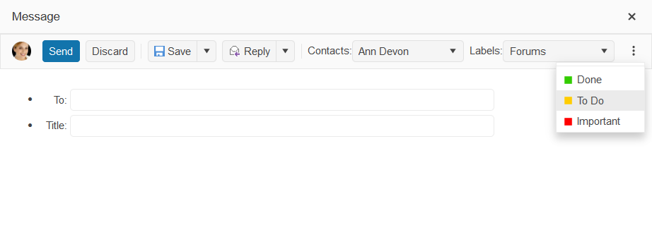

# Resizing

The ToolBar component is designed to hold different UI controls such as buttons, button groups, toggle buttons, split buttons, and more customized elements.

By design, the ToolBar detects changes in the viewport width and automatically shows or hides its elements according to the available space. The overflowing controls are hidden in the command overflow popup (a burger menu with a three-dot icon). 

 

This functionality is provided by default and may be disabled by setting the `Resizable()` option to `false`. To control how a given ToolBar command behaves on resizing, set its `Overflow()` option to `Never`, `Always`, or `Auto`.

## Next Steps

* [Resizing the ToolBar (Demo)](https://demos.telerik.com/{{ site.platform }}/toolbar/resizing)
* [Using the API of the ToolBar for {{ site.framework }} (Demo)](https://demos.telerik.com/{{ site.platform }}/toolbar/api)

## See Also

* [Server-Side API of the ToolBar HtmlHelper](/api/toolbar)

* [Server-Side API of the ToolBar TagHelper](/api/taghelpers/toolbar)

* [Client-Side API of the ToolBar](https://docs.telerik.com/kendo-ui/api/javascript/ui/toolbar)
