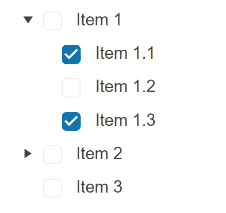

# Getting Started with the TreeView

This tutorial explains how to set up a basic Telerik UI for {{ site.framework }} TreeView and highlights the major steps in the configuration of the component.

You will initialize a TreeView component with several items and checkboxes. Finally, you can run the sample code in [Telerik REPL](https://netcorerepl.telerik.com/) and continue exploring the components.

 

@[template](/_contentTemplates/core/getting-started-prerequisites.md#repl-component-gs-prerequisites)

## 1. Prepare the CSHTML File

@[template](/_contentTemplates/core/getting-started-directives.md#gs-adding-directives)

Optionally, you can structure the document by adding the desired HTML elements like headings, divs, paragraphs, and others.

```HtmlHelper
    @using Kendo.Mvc.UI

    <h4>TreeView with items</h4>
    <div>

    </div>
```

```TagHelper
    @addTagHelper *, Kendo.Mvc

    <h4>TreeView with items</h4>
    <div>

    </div>
```


## 2. Initialize the TreeView

Use the TreeView HtmlHelper or TagHelper to add the component to a page:

* The `Name()` configuration method is mandatory as its value is used for the `id` and the name attributes of the TreeView element.
* The `Expanded()` configuration of a TreeView item specifies whether it will be expanded initially. 

```HtmlHelper
@using Kendo.Mvc.UI

<h4>TreeView with a Placeholder</h4>
<div>
    @(Html.Kendo().TreeView()
        .Name("treeview")
        .Size(ComponentSize.Medium)
        .Items(items =>
        {
            items.Add().Text("Item 1").Expanded(true)
                .Items(subItems =>
                {
                    subItems.Add().Text("Item 1.1");
                    subItems.Add().Text("Item 1.2");
                    subItems.Add().Text("Item 1.3");
                });
            items.Add().Text("Item 2")
                .Items(subItems =>
                {
                    subItems.Add().Text("Item 2.1");
                    subItems.Add().Text("Item 2.2");
                    subItems.Add().Text("Item 2.3");
                });
            items.Add().Text("Item 3");
        })
    )
</div>

```

```TagHelper
@addTagHelper *, Kendo.Mvc

<h4>TreeView with items</h4>
<div>
    <kendo-treeview auto-bind="true" load-on-demand="true" name="treeview" size="ComponentSize.Medium">
        <items>
            <treeview-item expanded="true" checked="false" text="Item 1" selected="false" enabled="true">
                <items>
                    <treeview-item expanded="false" checked="false" text="Item 1.1" selected="false" enabled="true">
                    </treeview-item>
                    <treeview-item expanded="false" checked="false" text="Item 1.2" selected="false" enabled="true">
                    </treeview-item>
                    <treeview-item expanded="false" checked="false" text="Item 1.3" selected="false" enabled="true">
                    </treeview-item>
</items>
            </treeview-item>
            <treeview-item expanded="false" checked="false" text="Item 2" selected="false" enabled="true">
                <items>
                    <treeview-item expanded="false" checked="false" text="Item 2.1" selected="false" enabled="true">
                    </treeview-item>
                    <treeview-item expanded="false" checked="false" text="Item 2.2" selected="false" enabled="true">
                    </treeview-item>
                    <treeview-item expanded="false" checked="false" text="Item 2.3" selected="false" enabled="true">
                    </treeview-item>
                </items>
            </treeview-item>
            <treeview-item expanded="false" checked="false" text="Item 3" selected="false" enabled="true">
            </treeview-item>
        </items>
    </kendo-treeview>
</div>

```


## 3. Select a Default Value

The next step is to enable the `Checkboxes()` of the TreeView and to configure two of the items as checked by default. 

```HtmlHelper
@using Kendo.Mvc.UI

<h4>TreeView with items</h4>
<div>
    @(Html.Kendo().TreeView()
        .Name("treeview")
        .Size(ComponentSize.Medium)
        .Checkboxes(true)
        .Items(items =>
        {
            items.Add().Text("Item 1").Expanded(true)
                .Items(subItems =>
                {
                    subItems.Add().Text("Item 1.1").Checked(true);
                    subItems.Add().Text("Item 1.2");
                    subItems.Add().Text("Item 1.3").Checked(true);
                });
            items.Add().Text("Item 2")
                .Items(subItems =>
                {
                    subItems.Add().Text("Item 2.1");
                    subItems.Add().Text("Item 2.2");
                    subItems.Add().Text("Item 2.3");
                });
            items.Add().Text("Item 3");
        })
    )
</div>

```

```TagHelper
@addTagHelper *, Kendo.Mvc

<h4>TreeView with items</h4>
<div>
    <kendo-treeview auto-bind="true" load-on-demand="true" name="treeview" size="ComponentSize.Medium">
        <checkboxes enabled="true" />
        <items>
            <treeview-item expanded="true" checked="false" text="Item 1" selected="false" enabled="true">
                <items>
                    <treeview-item expanded="false" checked="true" text="Item 1.1" selected="false" enabled="true">
                    </treeview-item>
                    <treeview-item expanded="false" checked="false" text="Item 1.2" selected="false" enabled="true">
                    </treeview-item>
                    <treeview-item expanded="false" checked="true" text="Item 1.3" selected="false" enabled="true">
                    </treeview-item>
</items>
            </treeview-item>
            <treeview-item expanded="false" checked="false" text="Item 2" selected="false" enabled="true">
                <items>
                    <treeview-item expanded="false" checked="false" text="Item 2.1" selected="false" enabled="true">
                    </treeview-item>
                    <treeview-item expanded="false" checked="false" text="Item 2.2" selected="false" enabled="true">
                    </treeview-item>
                    <treeview-item expanded="false" checked="false" text="Item 2.3" selected="false" enabled="true">
                    </treeview-item>
                </items>
            </treeview-item>
            <treeview-item expanded="false" checked="false" text="Item 3" selected="false" enabled="true">
            </treeview-item>
        </items>
    </kendo-treeview>
</div>
```


## 4. Handle a TreeView Event

The TreeView component provides convenient events for implementing your desired logic. In this tutorial, you will use the exposed `Check()` event to log a new entry in the browser's console.

```HtmlHelper
@using Kendo.Mvc.UI

<h4>TreeView with items</h4>
<div>
    <script>
        function check(e) {
            console.log("Check :: " + $(e.node).text());
        }
    </script>   

    @(Html.Kendo().TreeView()
        .Name("treeview")
        .Size(ComponentSize.Medium)
        .Checkboxes(true)
        .Events(e => e.Check("check"))
        .Items(items =>
        {
            items.Add().Text("Item 1").Expanded(true)
                .Items(subItems =>
                {
                    subItems.Add().Text("Item 1.1").Checked(true);
                    subItems.Add().Text("Item 1.2");
                    subItems.Add().Text("Item 1.3").Checked(true);
                });
            items.Add().Text("Item 2")
                .Items(subItems =>
                {
                    subItems.Add().Text("Item 2.1");
                    subItems.Add().Text("Item 2.2");
                    subItems.Add().Text("Item 2.3");
                });
            items.Add().Text("Item 3");
        })
    )
</div>
```

```TagHelper
@addTagHelper *, Kendo.Mvc

<h4>TreeView with items</h4>
<div>
    <script>
        function check(e) {
            console.log("Check :: " + $(e.node).text());
        }
    </script>   

    <kendo-treeview auto-bind="true" load-on-demand="true"
     name="treeview" size="ComponentSize.Medium" on-check="check">
        <checkboxes enabled="true" />
        <items>
            <treeview-item expanded="true" checked="false" text="Item 1" selected="false" enabled="true">
                <items>
                    <treeview-item expanded="false" checked="true" text="Item 1.1" selected="false" enabled="true">
                    </treeview-item>
                    <treeview-item expanded="false" checked="false" text="Item 1.2" selected="false" enabled="true">
                    </treeview-item>
                    <treeview-item expanded="false" checked="true" text="Item 1.3" selected="false" enabled="true">
                    </treeview-item>
</items>
            </treeview-item>
            <treeview-item expanded="false" checked="false" text="Item 2" selected="false" enabled="true">
                <items>
                    <treeview-item expanded="false" checked="false" text="Item 2.1" selected="false" enabled="true">
                    </treeview-item>
                    <treeview-item expanded="false" checked="false" text="Item 2.2" selected="false" enabled="true">
                    </treeview-item>
                    <treeview-item expanded="false" checked="false" text="Item 2.3" selected="false" enabled="true">
                    </treeview-item>
                </items>
            </treeview-item>
            <treeview-item expanded="false" checked="false" text="Item 3" selected="false" enabled="true">
            </treeview-item>
        </items>
    </kendo-treeview>
</div>

```



## 5. (Optional) Reference Existing TreeView Instances

You can reference the TreeView instances that you have created and build on top of their existing configuration:

1. Use the `id` attribute of the component instance to establish a reference.

    ```script
    <script>
        var treeviewReference = $("#treeview").data("kendoTreeView"); // treeviewReference is a reference to the existing TreeView instance of the helper.
    </script>
    ```

1. Use the [TreeView client-side API](https://docs.telerik.com/kendo-ui/api/javascript/ui/treeview#methods) to control the behavior of the widget. In this example, you will use the `findByText` and `select` methods to select an item.

    ```script
    <script>
        var treeviewReference = $("#treeview").data("kendoTreeView"); // treeviewReference is a reference to the existing TreeView instance of the helper.

         var node = treeviewReference.findByText("Item 2");
         treeviewReference.select(node);
    </script>
    ```


## Explore this Tutorial in REPL

You can continue experimenting with the code sample above by running it in the Telerik REPL server playground:

* [Sample code with the TreeView HtmlHelper](https://netcorerepl.telerik.com/mnEFvfwH34yb25FB51)
* [Sample code with the TreeView TagHelper](https://netcorerepl.telerik.com/wRkbPfGd35vvT43F02)



## Next Steps

* [Binding the TreeView to Data]()
* [Customizing the Appearance of the TreeView]()
* [Using Checkboxes]()

## See Also

* [Using the API of the TreeView for {{ site.framework }} (Demo)](https://demos.telerik.com/{{ site.platform }}/treeview/api)
* [TreeView Client-Side API](https://docs.telerik.com/kendo-ui/api/javascript/ui/treeview)
* [Server-Side API of the TreeView](/api/treeview)
* [Knowledge Base Section](/knowledge-base)
