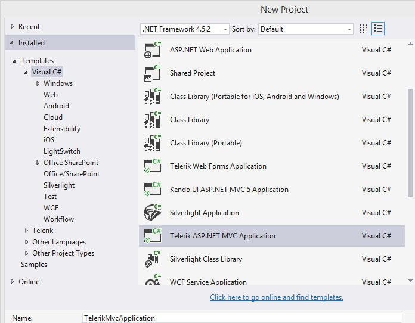
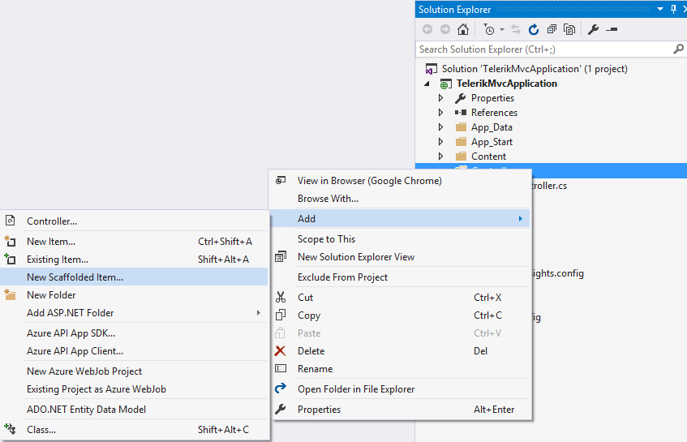
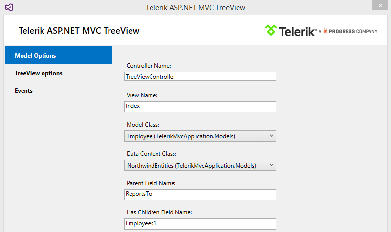
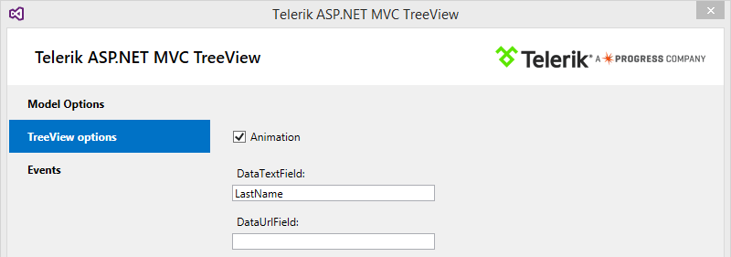
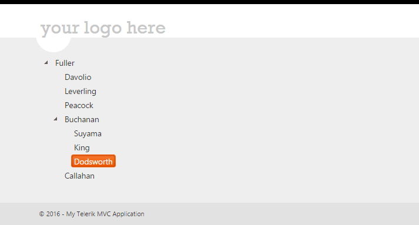

# Scaffolding

The TreeView HtmlHelper for ASP.NET MVC enables you to use the Kendo UI Scaffolder Visual Studio extension.

> The Kendo UI Scaffolder will not include the required UI for ASP.NET MVC files to the project. To automatically achieve this, use the [Telerik UI for ASP.NET MVC Visual Studio Extensions](). To manually achieve this, refer to [this article]().

To scaffold the TreeView HtmlHelper for ASP.NET MVC:

1. Create a new Telerik Application for ASP.NET MVC or create a standard ASP.NET MVC application and add Telerik UI for ASP.NET MVC. If you already have a working Telerik MVC application, skip this step.

    

1. Include an Entity Framework Data Model.

    > * If you are using the [Northwind dummy datasource](https://archive.codeplex.com/?p=northwinddatabase) as is the current example, you might need to upgrade it to match a more recent version of your Visual Studio LocalDb definition. In such case, do that by using the [Server Explorer](https://msdn.microsoft.com/en-us/library/hh873188.aspx). Visual Studio will require you to confirm whether you want to upgrade the database. Upon accepting it, you are ready to go.
    > * You must rebuild your project after adding the Entity Data Model.

1. Right-click the location where the TreeView Controller will be generated. From the displayed menu, select **Add** > **New Scaffolded item...**. In this example, you will generate it in the **Controllers** folder.

    

1. From the list of available scaffolders, select **Kendo UI Scaffolder**. Select **UI for MVC TreeView**.
1. As a result, you are presented with the configuration options for the TreeView scaffolder.

    

    * **Controller Name**&mdash;The scaffolder will automatically generate the action in this new Controller to initiate the query to the database.
    * **View Name**&mdash;Defines the View, which will be created and added to a new corresponding folder. It will hold the markup definition of the TreeView.
    * **Model Class**&mdash;Contains all model types from the active project. In this example, you build a tree which contains the employees depending on their hierarchical roles.
    * **Data Context Class**&mdash;Selects the Entity Framework Data Model class that will be used.
    * **Parent Field Name**&mdash;Indicates the field, which the tree relations would be built upon.
    * **Has Children Field Name**&mdash;Represents an enumerable collection to hint the TreeView about the children records. If not defined, the TreeView will display expand buttons for all of the items, even if they do not contain any child records.

1. Click the **TreeView options** item on the left. It will open the section for configuring the settings of the TreeView.

    

    * **Animation**&mdash;Checks to enable for expand or collapse action.
    * **DataTextField**&mdash;Defines the field, which will be used to display the text of the items.
    * **DataUrlField**&mdash;If entered, defines the field, which will be used to automatically transform the text content of the items to links. These links point to a new site depending on the value&mdash;for example, `~/TreeView/Robert`.

1. You can also add events. When finished with the TreeView configuration, click **Add**. The TreeView Controller and the corresponding view are now generated and you are ready to run the site.

    

## See Also

* [Basic Usage of the TreeView HtmlHelper for ASP.NET MVC (Demo)](https://demos.telerik.com/aspnet-mvc/treeview/index)
* [TreeViewBuilder Server-Side API](https://docs.telerik.com/aspnet-mvc/api/Kendo.Mvc.UI.Fluent/TreeViewBuilder)
* [TreeView Server-Side API](/api/treeview)
