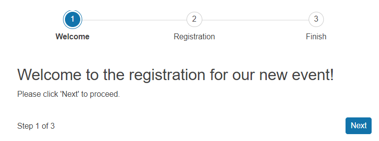

# Getting Started with the Wizard

This tutorial explains how to set up a basic Telerik UI for {{ site.framework }} Wizard and highlights the major steps in the configuration of the component.

You will initialize a Wizard component with several steps and integrate a [Form]() in one of the steps. Next, you will handle the Wizard events and submit the form data to the server.

 

@[template](/_contentTemplates/core/getting-started-prerequisites.md#component-gs-prerequisites)

## 1. Prepare the CSHTML File

@[template](/_contentTemplates/core/getting-started-directives.md#gs-adding-directives)

Optionally, you can structure the View content by adding the desired HTML elements like headings, divs, paragraphs, and others.

```HtmlHelper
    @using Kendo.Mvc.UI

    <h4>Registration progress with Wizard</h4>
    <div>

    </div>
```

```TagHelper
    @addTagHelper *, Kendo.Mvc

    <h4>Registration progress with Wizard</h4>
    <div>

    </div>
```


## 2. Initialize the Wizard

Use the Wizard HtmlHelper or TagHelper to add the component to a page:

* The `Name()` configuration method is mandatory as its value is used for the `id` and the name attributes of the Wizard element.
* The `Tag()` property determines the `HTML` element from which the Wizard will be initialized. Set either a `form` or `div` element. When a Wizard step contains a Form component and the Wizard is initialized as a `<form>` element,  the <strong>Done</strong> button in the last step will act as a `submit` button.
* The `Steps()` configuration specifies the desired steps and their content. 
* The `Buttons()` property of a Wizard's step determines the <strong>Next</strong>, <strong>Previous</strong>, and <strong>Done</strong> buttons.


```HtmlHelper
@using Kendo.Mvc.UI

    @(Html.Kendo().Wizard()
        .Name("wizard")
        .Tag("form")
        .Steps(step =>
        {
             step.Add()
                .Title("Welcome")
                .Content("<h3>Welcome to the registration for our new event!</h3>Please select 'Next' to proceed.")
                .Buttons(b =>
                {
                    b.Next();
                });

            step.Add<UserViewModel>()
                .Title("Registration")
                .Form(...) //the Form integration is implemented in the next step
                .Buttons(b =>
                {
                    b.Previous();
                    b.Next();
                });

            step.Add()
                .Title("Finish")
                .Content("<div style=\"text-align:center\"><h3>Thank you! Click 'Done' to submit your registration.</h3</div>")
                .Buttons(b =>
                {
                    b.Previous();
                    b.Done();
                });
        })
    )
```

```TagHelper
@addTagHelper *, Kendo.Mvc

    <kendo-wizard name="wizard" novalidate="">
        <wizard-steps>
            <wizard-step title="Welcome">
                <wizard-step-content>
                    <h3>Welcome to the registration for our new event!</h3>
                    Please select 'Next' to proceed.
                </wizard-step-content>
                <wizard-step-buttons>
                    <wizard-step-button name="next" text="Next"></wizard-step-button>
                </wizard-step-buttons>
            </wizard-step>
            <wizard-step title="Registration">
                <wizard-step-form>
                    <!-- the Form integration is implemented in the next step -->
                </wizard-step-form>
                <wizard-step-buttons>
                    <wizard-step-button name="previous" text="Previous"></wizard-step-button>
                    <wizard-step-button name="next" text="Next"></wizard-step-button>
                </wizard-step-buttons>
            </wizard-step>
            <wizard-step title="Finish">
                <wizard-step-content>
                    <div style="text-align:center"><h3>Thank you! Click 'Done' to submit your registration.</h3</div>
                </wizard-step-content>
                <wizard-step-buttons>
                    <wizard-step-button name="previous" text="Previous"></wizard-step-button>
                    <wizard-step-button name="done" text="Done"></wizard-step-button>
                </wizard-step-buttons>
            </wizard-step>
        </wizard-steps>
    </kendo-wizard>
```


## 3. Configure the Form Integration

The next step is to integrate a Form component inside the Wizard. The `Form()` configuration method defines the options as they are available in the Telerik UI for {{ site.framework }} Form itself. Each Form defined within the Wizard configuration will have all the functionality available in the stand-alone Form component.


When configuring the Wizard by using HtmlHelpers, specify the `Model` in the `Add` method of the step that will display the form.

When setting up the step that will display the form, specify the `Model` name in the `Add` method of the step.



```HtmlHelper
@using Kendo.Mvc.UI

    @(Html.Kendo().Wizard()
        .Name("wizard")
        .Tag("form")
        .Steps(step =>
        {
            ...
            step.Add<UserViewModel>()
                .Title("Registration")
                .Form(f => f
                    .Validatable(v =>
                    {
                        v.ValidateOnBlur(true);
                        v.ValidationSummary(vs => vs.Enable(false));
                    })
                    .Items(items =>
                    {
                        items.Add().Field(field => field.FirstName).Label(label => label.Text("First name:"));
                        items.Add().Field(field => field.LastName).Label(label => label.Text("Last name:"));
                        items.Add().Field(field => field.Phone).Label(label => label.Text("Phone:"));
                        items.Add().Field(field => field.DateOfBirth).Label(label => label.Text("DateOfBirth:").Optional(true))
                        .Editor(editor => editor.DatePicker());
                    })
                )
                .Buttons(b =>
                {
                    b.Previous();
                    b.Next();
                });
            ...
        })
    )
```

```TagHelper
@addTagHelper *, Kendo.Mvc

<script>
    (function ($, kendo) {
        $.extend(true, kendo.ui.validator, {
            rules: {
                firstname: function (input) {
                    if (input.is("[name='FirstName']") && !input.val()) {
                        input.attr("data-firstname-msg", "First Name is required");
                        return false;
                    }
                    return true;
                },
                lastname: function (input) {
                    if (input.is("[name='LastName']") && !input.val()) {
                        input.attr("data-lastname-msg", "Last Name is required");
                        return false;
                    }
                    return true;
                },
                phone: function (input) {
                    if (input.is("[name='Phone']") && !input.val()) {
                        input.attr("data-phone-msg", "Phone is required");
                        return false;
                    }
                    return true;
                }
            }
        });
    })(jQuery, kendo);
</script>
<kendo-wizard name="wizard" novalidate="">
    <wizard-steps>
        ...
        <wizard-step title="Registration">
            <wizard-step-form>
                <validatable validate-on-blur="true" validation-summary="false" />
                <form-items>
                    <form-item field="FirstName">
                        <item-label text="First name:">
                    </form-item>
                    <form-item field="LastName">
                        <item-label text="Last name:">
                    </form-item>
                    <form-item field="Phone">
                        <item-label text="Phone:">
                    </form-item>
                    <form-item field="DateOfBirth">
                        <datepicker-editor/>
                    </form-item>
                </form-items>
            </wizard-step-form>
            <wizard-step-buttons>
                <wizard-step-button name="previous" text="Previous"></wizard-step-button>
                <wizard-step-button name="next" text="Next"></wizard-step-button>
            </wizard-step-buttons>
        </wizard-step>
        ...
    </wizard-steps>
</kendo-wizard>
```

```Model
public class UserViewModel
{
    public string FirstName { get; set; }

    public string LastName { get; set; }

    public string Phone { get; set; }

    public DateTime DateOfBirth { get; set; }
}

```

## 4. Handle the Wizard Events

The Wizard exposes various [events](/api/Kendo.Mvc.UI.Fluent/WizardEventBuilder) that you can handle and further customize the functionality of the component. In this tutorial, you will use the `Done()` event to submit the form data to the server.


```HtmlHelper
@using Kendo.Mvc.UI

    @(Html.Kendo().Wizard()
        .Name("wizard")
        .Events(events => events.Done("onDone"))
        .Tag("form")
        .Steps(step =>
        {
             step.Add()
                .Title("Welcome")
                .Content("<h3>Welcome to the registration for our new event!</h3>Please select 'Next' to proceed.")
                .Buttons(b =>
                {
                    b.Next();
                });

            step.Add<UserViewModel>()
                .Title("Registration")
                .Form(f => f
                    .Validatable(v =>
                    {
                        v.ValidateOnBlur(true);
                        v.ValidationSummary(vs => vs.Enable(false));
                    })
                    .Items(items =>
                    {
                        items.Add().Field(field => field.FirstName).Label(label => label.Text("First name:"));
                        items.Add().Field(field => field.LastName).Label(label => label.Text("Last name:"));
                        items.Add().Field(field => field.Phone).Label(label => label.Text("Phone:"));
                        items.Add().Field(field => field.DateOfBirth).Label(label => label.Text("DateOfBirth:").Optional(true))
                        .Editor(editor => editor.DatePicker());
                    })
                )
                .Buttons(b =>
                {
                    b.Previous();
                    b.Next();
                });

            step.Add()
                .Title("Finish")
                .Content("<div style=\"text-align:center\"><h3>Thank you! Click 'Done' to submit your registration.</h3</div>")
                .Buttons(b =>
                {
                    b.Previous();
                    b.Done();
                });
        })
    )

    <script>
        function onDone(e) {
            //Prevent the default event action
            e.originalEvent.preventDefault(); 

            //Select the Wizard element
            let form = $("#wizard"); 
            //Initialize an AJAX request to the server
            $.ajax({
                type: 'POST',
                url: "@Url.Action("SubmitRegistration", "Home")",
                data: form.serialize(),
                success: function (data) {
                    alert("Thank you for registering!");
                },
                error: function (data) {
                    alert("Please try again. Something went wrong.");
                }
            });
        }
    </script>
```

```TagHelper
   @addTagHelper *, Kendo.Mvc

    <kendo-wizard name="wizard" novalidate="" on-done="onDone">
        <wizard-steps>
            <wizard-step title="Welcome">
                <wizard-step-content>
                    <h3>Welcome to the registration for our new event!</h3>
                    Please select 'Next' to proceed.
                </wizard-step-content>
                <wizard-step-buttons>
                    <wizard-step-button name="next" text="Next"></wizard-step-button>
                </wizard-step-buttons>
            </wizard-step>
            <wizard-step title="Registration">
                <wizard-step-form>
                    <validatable validate-on-blur="true"
                             validation-summary="false" />
                    <form-items>
                        <form-item field="FirstName">
                            <item-label text="First name:">
                        </form-item>
                        <form-item field="LastName">
                            <item-label text="Last name:">
                        </form-item>
                        <form-item field="Phone">
                            <item-label text="Phone:">
                        </form-item>
                        <form-item field="DateOfBirth">
                            <datepicker-editor/>
                        </form-item>
                    </form-items>
                </wizard-step-form>
                <wizard-step-buttons>
                    <wizard-step-button name="previous" text="Previous"></wizard-step-button>
                    <wizard-step-button name="next" text="Next"></wizard-step-button>
                </wizard-step-buttons>
            </wizard-step>
            <wizard-step title="Finish">
                <wizard-step-content>
                    <div style="text-align:center"><h3>Thank you! Click 'Done' to submit your registration.</h3</div>
                </wizard-step-content>
                <wizard-step-buttons>
                    <wizard-step-button name="previous" text="Previous"></wizard-step-button>
                    <wizard-step-button name="done" text="Done"></wizard-step-button>
                </wizard-step-buttons>
            </wizard-step>
        </wizard-steps>
    </kendo-wizard>

    <script>
        function onDone(e) {
            //Prevent the default event action
            e.originalEvent.preventDefault(); 

            //Select the Wizard element
            let form = $("#wizard"); 
            //Initialize an AJAX request to the server
            $.ajax({
                type: 'POST',
                url: "@Url.Action("SubmitRegistration", "Home")",
                data: form.serialize(),
                success: function (data) {
                    alert("Thank you for registering!");
                },
                error: function (data) {
                    alert("Please try again. Something went wrong.");
                }
            });
        }
    </script>
```

```Controller
    public IActionResult SubmitRegistration(UserViewModel user)
    {
        //Receive and save the data
        ...
        return Json(new { Success = "Form Posted Successfully" });
    }
```

## 5. (Optional) Reference Existing Wizard Instances

You can reference the Wizard instances that you have created and build on top of their existing configuration:

1. Use the value of the `Name()` option of the component to establish a reference.

   ```script
        <script>
            $(document).ready(function() {
                var wizardReference = $("#wizard").data("kendoWizard"); // wizardReference is a reference to the existing Wizard instance of the helper.
            });
        </script>
   ```

1. Use the [Wizard client-side API](https://docs.telerik.com/kendo-ui/api/javascript/ui/wizard#methods) to control the behavior of the control. In this example, you will use the `select` method to select the second step (index 1).

   ```script
        <script>
            $(document).ready(function() {
                var wizardReference = $("#wizard").data("kendoWizard");
                wizardReference.select(1);
            });
        </script>
   ```

## Next Steps

* [Integrating a Form inside the Wizard]()
* [Using the Wizard Content]()

## See Also

* [Using the Events of the Wizard for {{ site.framework }} (Demo)](https://demos.telerik.com/{{ site.platform }}/wizard/events)
* [Client-Side API of the Wizard](https://docs.telerik.com/kendo-ui/api/javascript/ui/wizard)
* [Server-Side API of the Wizard](/api/wizard)
* [Knowledge Base Section](/knowledge-base)
