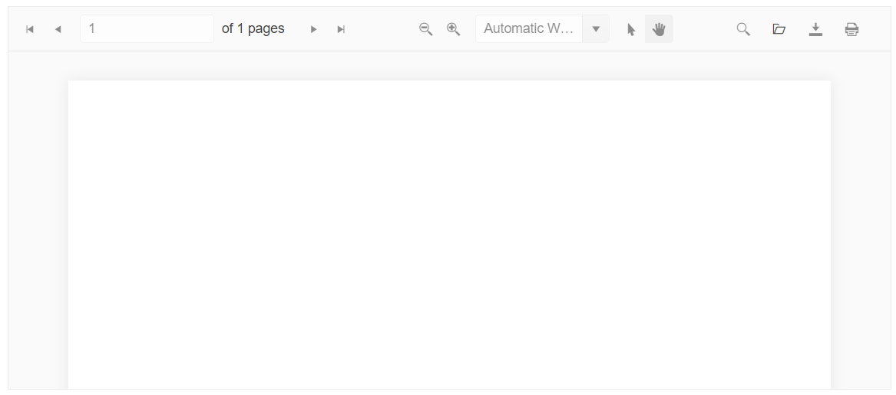

# Getting Started with the PDFViewer

This tutorial explains how to set up a basic Telerik UI for {{ site.framework }} PDFViewer and highlights the major steps in the configuration of the component.

You will initialize a PDFViewer component and visualize a PDF document in it. Finally, you can run the sample code in [Telerik REPL](https://netcorerepl.telerik.com/) and continue exploring the components.

 

@[template](/_contentTemplates/core/getting-started-prerequisites.md#repl-component-gs-prerequisites)

## 1. Prepare the CSHTML File

@[template](/_contentTemplates/core/getting-started-directives.md#gs-adding-directives)

Optionally, you can structure the document by adding the desired HTML elements like headings, divs, paragraphs, and others.

```HtmlHelper
    @using Kendo.Mvc.UI

    <h4>PDFViewer</h4>
    <div>

    </div>
```

```TagHelper
    @addTagHelper *, Kendo.Mvc

    <h4>PDFViewer</h4>
    <div>

    </div>
```


## 2. Initialize the PDFViewer

Load the `pdf.js` library and use the PDFViewer HtmlHelper or TagHelper to add the component to the view:

* The `Name()` configuration method is mandatory as its value is used for the `id` and the `name` attributes of the PDFViewer element.
* The `Height()` configuration allows you to control the height of the component. 

```HtmlHelper
@using Kendo.Mvc.UI

<h4>PDFViewer</h4>
<div>
    <script src="https://cdnjs.cloudflare.com/ajax/libs/pdf.js/2.2.2/pdf.js"></script>

    <div>
        @(Html.Kendo().PDFViewer()
            .Name("pdfviewer")
            .Height(400)
        )
    </div>

    <style>
        html body #pdfviewer {
            width: 100% !important;
        }
    </style>
</div>

```

```TagHelper
@addTagHelper *, Kendo.Mvc

<script src="https://cdnjs.cloudflare.com/ajax/libs/pdf.js/2.2.2/pdf.js"></script>

<div id="example">
    <kendo-pdfviewer name="pdfviewer"
        height="400">
    </kendo-pdfviewer>
</div>

<style>
    html body #pdfviewer {
        width: 100% !important;
    }
</style>

```


## 3. Load an Initial PDF Document

To load and visualize an initial PDF document, set the `PdfjsProcessing` configuration and specify the path to the PDF file.

```HtmlHelper
@using Kendo.Mvc.UI

<h4>PDFViewer</h4>
<div>
    <script src="https://cdnjs.cloudflare.com/ajax/libs/pdf.js/2.2.2/pdf.js"></script>

    <div>
        @(Html.Kendo().PDFViewer()
            .Name("pdfviewer")
            .PdfjsProcessing(pdf => pdf.File(Url.Content("~/shared/web/pdfViewer/sample.pdf")))
            .Height(400)
        )
    </div>

    <style>
        html body #pdfviewer {
            width: 100% !important;
        }
    </style>
</div>

```

```TagHelper
@addTagHelper *, Kendo.Mvc

<script src="https://cdnjs.cloudflare.com/ajax/libs/pdf.js/2.2.2/pdf.js"></script>

<div id="example">
    <kendo-pdfviewer name="pdfviewer"
        height="400">
        <pdfjs-processing file="@Url.Content("~/shared/web/pdfViewer/sample.pdf")" />
    </kendo-pdfviewer>
</div>

<style>
    html body #pdfviewer {
        width: 100% !important;
    }
</style>

```


## 4. Handle a PDFViewer Event

The PDFViewer exposes various [events](/api/kendo.mvc.ui.fluent/pdfviewerbuilder) that you can handle and further customize the functionality of the component. In this example, you will use the `Open` event, which fires when a PDF is opened in the PDFViewer. As a result, the browser console will log a message when you open a PDF file.

```HtmlHelper
@using Kendo.Mvc.UI

<h4>PDFViewer</h4>
<div>
    <script src="https://cdnjs.cloudflare.com/ajax/libs/pdf.js/2.2.2/pdf.js"></script>

    <div>
        @(Html.Kendo().PDFViewer()
            .Name("pdfviewer")
            .PdfjsProcessing(pdf => pdf.File(Url.Content("~/shared/web/pdfViewer/sample.pdf")))
            .Height(400)
            .Events(events => events
                .Open("onOpen")
            )
        )
    </div>

    <script>
        function onOpen(e) {
            console.log("file open: " + e.file.name);
        }
    </script>

    <style>
        html body #pdfviewer {
            width: 100% !important;
        }
    </style>
</div>

```

```TagHelper
@addTagHelper *, Kendo.Mvc

<script src="https://cdnjs.cloudflare.com/ajax/libs/pdf.js/2.2.2/pdf.js"></script>

<div id="example">
    <kendo-pdfviewer name="pdfviewer"
        <pdfjs-processing file="@Url.Content("~/shared/web/pdfViewer/sample.pdf")" />
        height="400"
        on-open="onOpen">
    </kendo-pdfviewer>
</div>

<script>
    function onOpen(e) {
        console.log("file open: " + e.file.name);
    }
</script>

<style>
    html body #pdfviewer {
        width: 100% !important;
    }
</style>

```


## 5. (Optional) Reference Existing PDFViewer Instances

You can reference the PDFViewer instances that you have created and build on top of their existing configuration:

1. Use the `id` attribute of the component instance to establish a reference.

    ```script
    <script>
        var pdfviewerReference = $("#pdfviewer").data("kendoPDFViewer"); // pdfviewerReference is a reference to the existing PDFViewer instance of the helper.
    </script>
    ```

1. Use the [PDFViewer client-side API](https://docs.telerik.com/kendo-ui/api/javascript/ui/pdfviewer#methods) to control the behavior of the widget. In this example, you will use the `activatePage` method to activate a page.

    ```
    <input id="btn1" type="button" value="Load page 3" onclick="changePdfViewerPage()" />

    <script>
        function changePdfViewerPage() {
            //get a reference to the PDFViewer instance
            var pdfViewer = $("#pdfviewer").data("kendoPDFViewer");
            // activate page 3
            pdfViewer.activatePage(3);
        }
    </script>
    ```

## Next Steps

* [Using PDF.js Processing with the PDFViewer]()
* [Using DPL Processing with the PDFViewer]()

## See Also

* [Using the API of the PDFViewer for {{ site.framework }} (Demo)](https://demos.telerik.com/{{ site.platform }}/pdfviewer/api)
* [Client-Side API of the PDFViewer ](https://docs.telerik.com/kendo-ui/api/javascript/ui/pdfviewer)
* [Server-Side API of the PDFViewer](/api/pdfviewer)
* [Knowledge Base Section](/knowledge-base)
