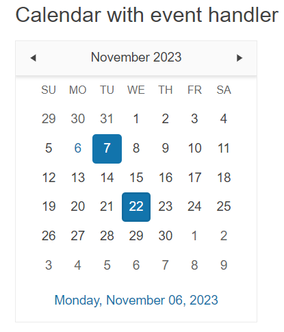

# Getting Started with the Calendar

This tutorial explains how to set up a basic Telerik UI for {{ site.framework }} Calendar and highlights the major steps in the configuration of the component.

You will initialize a Calendar and learn how to disable the selection of every Thursday from the week. Then, you will see how to attach an event handler to the component. Finally, you can run the sample code in [Telerik REPL](https://netcorerepl.telerik.com/) and continue exploring the component.

 

@[template](/_contentTemplates/core/getting-started-prerequisites.md#repl-component-gs-prerequisites)

## 1. Prepare the CSHTML File

@[template](/_contentTemplates/core/getting-started-directives.md#gs-adding-directives)

Optionally, you can structure the document by adding the desired HTML elements like headings, divs, paragraphs, and others.

```HtmlHelper
@using Kendo.Mvc.UI

<h4>Calendar with event handler</h4>

<p>

</p>
```

```TagHelper
@addTagHelper *, Kendo.Mvc

<h4>Calendar with event handler</h4>

<p>

</p>
``` 


## 2. Initialize the Calendar

Use the Calendar HtmlHelper or TagHelper to add the component to a page:

* The `Name()` configuration method is mandatory as its value is used for the `id` and the `name` attributes of the Calendar element.
* The `Selectable()` configuration allows multiple or single selection of dates. By default, single selection is enabled.

```HtmlHelper
@using Kendo.Mvc.UI

<h4>Calendar with event handler</h4>

<p>
    @(Html.Kendo().Calendar()
        .Name("calendar")
    )
</p>
```

```TagHelper
@addTagHelper *, Kendo.Mvc

<h4>Calendar with event handler</h4>

<p>
    <kendo-calendar name="calendar">
    </kendo-calendar>
</p>
```


## 3. Enable Selection of Multiple Days

The next step is to configure the Calendar to allow multiple selection. You can do that by using the `Selectable()` configuration.

```HtmlHelper
@using Kendo.Mvc.UI

<h4>Calendar with event handler</h4>

<p>
    @(Html.Kendo().Calendar()
        .Name("calendar")
        .Selectable("multiple")
    )
</p>
```

```TagHelper
@addTagHelper *, Kendo.Mvc

<h4>Calendar with event handler</h4>

<p>
    <kendo-calendar name="calendar"  
           selectable="multiple">
    </kendo-calendar>
</p>
```


## 4. Handle a Calendar Event

The Calendar exposes a `Change()` event that you can handle and assign specific functions to the component. In this tutorial, you will use the `Change()` event to display a message when the user modifies the selected date.

```HtmlHelper
@using Kendo.Mvc.UI

<script>
   function onChange(e) {
       var value = e.sender.selectDates()[0];
       console.log(value); // the first selected date in the Calendar
   }
</script>

<h4>Calendar with event handler</h4>

<p>
    @(Html.Kendo().Calendar()
        .Name("calendar")
        .Selectable("multiple")
        .Events(e => e.Change("onChange"))
    )
</p>
```

```TagHelper
@addTagHelper *, Kendo.Mvc

<script>
   function onChange(e) {
       var value = e.sender.selectDates()[0];
       console.log(value); // the first selected date in the Calendar
   }
</script>

<h4>Calendar with event handler</h4>

<p>
    <kendo-calendar name="calendar" 
           selectable="multiple" on-change="onChange">
    </kendo-calendar>
</p>
```


For more examples, refer to the [demo on using the events of the Calendar](https://demos.telerik.com/{{ site.platform }}/calendar/events).

## 5. (Optional) Reference Existing Calendar Instances

You can reference the Calendar instances that you have created and build on top of their existing configuration:

1. Use the `id` attribute of the component instance to establish a reference.

    ```script
    <script>
        var calendarReference = $("#calendar").data("kendoCalendar"); // calendarReference is a reference to the existing calendar instance of the helper.
    </script>
    ```

1. Use the [Calendar client-side API](https://docs.telerik.com/kendo-ui/api/javascript/ui/calendar#methods) to control the behavior of the widget. In this example, you will use the `view` method to access the calendar active view.

    ```script
    <script>
        var calendarReference = $("#calendar").data("kendoCalendar"); // calendarReference is a reference to the existing timeCalendar instance of the helper.
        var view = calendarReference.view(); // Gets an instance of the current view used by the Calendar.
    </script>
    ```

For more information on referencing specific helper instances, see the [Methods and Events]() article.


## Explore this Tutorial in REPL

You can continue experimenting with the code sample above by running it in the Telerik REPL server playground:

* [Sample code with the Calendar HtmlHelper](https://netcorerepl.telerik.com/GHbFaqOM19rVSeMq37)
* [Sample code with the Calendar TagHelper](https://netcorerepl.telerik.com/GxFlugaW202oxJiL18)



## Next Steps

* [Customize the Day Template of the Calendar]()
* [Configure the Calendar's Disabled Dates]()

## See Also

* [Using the API of the Calendar for {{ site.framework }} (Demo)](https://demos.telerik.com/{{ site.platform }}/calendar/api)
* [Client-Side API of the Calendar](https://docs.telerik.com/kendo-ui/api/javascript/ui/calendar)
* [Server-Side API of the Calendar](/api/calendar)
* [Knowledge Base Section](/knowledge-base)
