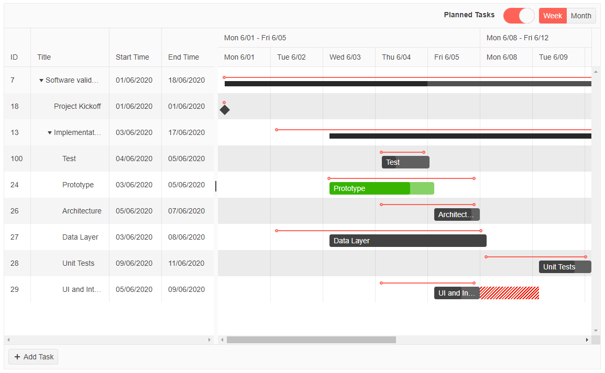

# Getting Started with the Gantt

This tutorial explains how to set up the Telerik UI for {{ site.framework }} Gantt and highlights the major steps in the configuration of the component.

You will declare a view model for the Gantt, initialize the UI component by adding a data source, configure the columns, and enable a few optional Gantt features.  Finally, you will handle a Gantt JavaScript event and reference an existing instance of the component.

After completing this guide, you will achieve the following results:

 

@[template](/_contentTemplates/core/getting-started-prerequisites.md#component-gs-prerequisites)

## 1. Prepare the CSHTML File

@[template](/_contentTemplates/core/getting-started-directives.md#gs-adding-directives)

Optionally, you can structure the document by adding the desired HTML elements like headings, divs, paragraphs, and others.

## 2. Declare the View Models

The Gantt needs two view models, one for the tasks and a second one for the dependencies of the tasks.

1. Declare the `TaskViewModel` view model.

    ```C#
    public class TaskViewModel : IGanttTask
    {
        public int TaskID { get; set; }
        public int? ParentID { get; set; }

        public string Title { get; set; }

        private DateTime start;
        public DateTime Start
        {
            get
            {
                return start;
            }
            set
            {
                start = value.ToUniversalTime();
            }
        }

        private DateTime end;
        public DateTime End
        {
            get
            {
                return end;
            }
            set
            {
                end = value.ToUniversalTime();
            }
        }

        private DateTime plannedStart;
        public DateTime PlannedStart
        {
            get
            {
                return plannedStart;
            }
            set
            {
                plannedStart = value.ToUniversalTime();
            }
        }

        private DateTime plannedEnd;
        public DateTime PlannedEnd
        {
            get
            {
                return plannedEnd;
            }
            set
            {
                plannedEnd = value.ToUniversalTime();
            }
        }

        public bool Summary { get; set; }
        public bool Expanded { get; set; }
        public decimal PercentComplete { get; set; }
        public int OrderId { get; set; }      

    }
    ```

1. Declare the `DependencyViewModel` view model.

    ```C#
    public class DependencyViewModel : IGanttDependency
    {
        public int DependencyID { get; set; }
        public int PredecessorID { get; set; }
        public int SuccessorID { get; set; }
        public DependencyType Type { get; set; }
    }
    ```

Note that the `TaskViewModel` view model implements the `IGanttTask` interface, and the `DependencyViewModel` view model implements the `IGanttDependency` interface. 

## 3. Initialize the Gantt

Use the Gantt HtmlHelper or TagHelper to add the component to a page and set some of its options.

* Use the `Name()` configuration method to assign a name to the instance of the helper&mdash;this is mandatory as its value is used for the `id` and the `name` attributes of the Gantt element.
* Add the `DataSource()` configuration option and set the end points for the CRUD operations.  
* [Configure the columns]() of the Gantt by binding them to the fields of the `TaskViewModel`.
* Enable additional features of the Gantt, such as `ListWidth`, [`Planned vs Actual`](), and the ability to toggle the `Planned vs Actual` feature through the `plannedTasks` tool in the toolbar.

```HtmlHelper
@using Kendo.Mvc.UI
@using MyApplication.Models;

<p class="title">Gantt</p>

@(Html.Kendo().Gantt<TaskViewModel, DependencyViewModel>()
	.Name("gantt")
	.Columns(columns =>
	{
		columns.Bound(c => c.TaskID).Title("ID").Width(50);
		columns.Bound(c => c.Title).Editable(true).Sortable(true);
		columns.Bound(c => c.Start).Title("Start Date").Format("{0:dd/MM/yyyy}").Width(100).Editable(true).Sortable(true);
		columns.Bound(c => c.End).Title("End Date").Format("{0:dd/MM/yyyy}").Width(100).Editable(true).Sortable(true);
		columns.Bound(c => c.PlannedStart).Hidden(true).Title("Planned Start Date").Format("{0:dd/MM/yyyy}");
		columns.Bound(c => c.PlannedEnd).Hidden(true).Title("Planned End Date").Format("{0:dd/MM/yyyy}");
	})
	.Views(views =>
	{
		views.WeekView(weekView => weekView.Selected(true));
		views.MonthView();
	})
	.ListWidth("400px")
	.ShowPlannedTasks(true)
	.Toolbar(t => t.Add().Name("plannedTasks"))
	.Height(700)
	.DataSource(d => d
		.Model(m =>
		{
			m.Id(f => f.TaskID);
			m.ParentId(f => f.ParentID);
			m.OrderId(f => f.OrderId);
			m.Field(f => f.Expanded).DefaultValue(true);
			m.Field(f => f.Start);
			m.Field(f => f.End);
			m.Field(f => f.PercentComplete);
			m.Field(f => f.PlannedStart);
			m.Field(f => f.PlannedEnd);
			m.Field(f => f.Summary);
		})
		.Read(read => read.Action("ReadTasks", "Home"))
		.Destroy(destroy => destroy.Action("DestroyTask", "Home"))
		.Update(update => update.Action("UpdateTask", "Home"))
		.Create(create => create.Action("CreateTask", "Home"))
	)
	.DependenciesDataSource(d => d
		.Model(m =>
		{
			m.Id(f => f.DependencyID);
			m.PredecessorId(f => f.PredecessorID);
			m.SuccessorId(f => f.SuccessorID);
			m.Type(f => f.Type);
		})
		.Read("ReadDependencies", "Home")
		.Create("CreateDependency", "Home")
		.Update("UpdateDependency", "Home")
		.Destroy("DestroyDependency", "Home")
	)
)
```

```TagHelper
@addTagHelper *, Kendo.Mvc

<p class="title">Gantt</p>
<kendo-gantt height="700" list-width="400px" show-planned-tasks="true" name="gantt">
	<columns>
	 	<gantt-column field="TaskID" title="ID" width="50px">
	 	</gantt-column>
		<gantt-column field="title" width="200px" editable="true" sortable="true">
	 	</gantt-column>
	 	<gantt-column field="start" format="{0:dd/MM/yyyy}" title="Start Date" editable="true" sortable="true">
	 	</gantt-column>
	 	<gantt-column field="end" format="{0:dd/MM/yyyy}" title="End Date" editable="true" sortable="true">
	 	</gantt-column>
	 	<gantt-column field="plannedStart" format="{0:dd/MM/yyyy}" title="Planned Start Date" hidden="true">
	 	</gantt-column>
	 	<gantt-column field="plannedEnd" format="{0:dd/MM/yyyy}" title="Planned End Date" hidden="true">
	 	</gantt-column>
	</columns>
	<views>
	 	<gantt-view selected="true" type="GanttViewType.Week">
	 	</gantt-view>
	 	<gantt-view type="GanttViewType.Month">
	 	</gantt-view>
	</views>
	<toolbars>
	 	<toolbar name="plannedTasks">
	 	</toolbar>
	</toolbars>
	<gantt-datasource type="DataSourceTagHelperType.Ajax" server-paging="false">
	 	<schema>
			<model id="TaskID" parent-id="parentID">
				<fields>
					<field name="TaskID" type="number"></field>
					<field name="parentId" from="ParentID" type="number" default-value="null"></field>
					<field name="title" from="Title" type="string"></field>
					<field name="start" from="Start" type="date"></field>
					<field name="end" from="End" type="date"></field>
					<field name="summary" from="Summary" type="boolean"></field>
					<field name="expanded" from="Expanded" type="boolean" default-value="true"></field>
					<field name="percentComplete" from="PercentComplete" type="number"></field>
					<field name="plannedStart" from="PlannedStart" type="date"></field>
                    <field name="plannedEnd" from="PlannedEnd" type="date"></field>
				</fields>
			</model>
	 	</schema>
	 	<transport >
	 	 	<read url="@Url.Action("ReadTasks","Home")" />
			<update url="@Url.Action("UpdateTasks","Home")" />
			<destroy url="@Url.Action("DestroyTasks","Home")" />
			<create url="@Url.Action("CreateTasks","Home")" />
	 	</transport>
	</gantt-datasource>
	<dependency-datasource name="dependencies" type="DataSourceTagHelperType.Ajax">
        <transport>
            <read url="@Url.Action("ReadDependencies", "Home")" />
            <create url="@Url.Action("CreateDependency", "Home")" />
			<update url="@Url.Action("UpdateDependency", "Home")" />
            <destroy url="@Url.Action("DestroyDependency", "Home")" />
        </transport>
        <schema>
            <model id="DependencyID">
                <fields>
                    <field name="DependencyID" type="number"></field>
                    <field name="predecessorId" from="PredecessorID" type="number"></field>
                    <field name="successorId" from="SuccessorID" type="number"></field>
                    <field name="type" from="Type" type="number"></field>
                </fields>
            </model>
        </schema>
    </dependency-datasource>
</kendo-gantt>
```


## 4. Declare the CRUD Actions

In the `Home` controller, declare the CRUD actions. Use the names of the actions you set in the DataSource and the `DependenciesDataSource` configurations in the previous step. 


```Controller
public ActionResult Index()
{
	ViewBag.Message = "Welcome to ASP.NET MVC!";

	return View();
}

public virtual JsonResult ReadTasks([DataSourceRequest] DataSourceRequest request)
{
	return Json(GetAllTasks().ToDataSourceResult(request), JsonRequestBehavior.AllowGet);
}

public virtual JsonResult DestroyTask([DataSourceRequest] DataSourceRequest request, TaskViewModel task)
{
	if (ModelState.IsValid)
	{
		var newTasks = GetAllTasks().Where(t => t.TaskID != task.TaskID);
		Session["tasks"] = newTasks;
	}

	return Json(new[] { task }.ToDataSourceResult(request, ModelState), JsonRequestBehavior.AllowGet);
}

public virtual JsonResult CreateTask([DataSourceRequest] DataSourceRequest request, TaskViewModel task)
{
	if (ModelState.IsValid)
	{
		task.TaskID = GetAllTasks().Last().TaskID + 1;
		var newTasks = GetAllTasks().ToList();
		newTasks.Add(task);
		Session["tasks"] = newTasks;
	}

	return Json(new[] { task }.ToDataSourceResult(request, ModelState), JsonRequestBehavior.AllowGet);
}

public virtual JsonResult UpdateTask([DataSourceRequest] DataSourceRequest request, TaskViewModel task)
{
	if (ModelState.IsValid)
	{
		var newTasks = GetAllTasks().Where(t => t.TaskID != task.TaskID).ToList();
		newTasks.Add(task);
		Session["tasks"] = newTasks;
	}

	return Json(new[] { task }.ToDataSourceResult(request, ModelState), JsonRequestBehavior.AllowGet);
}

private IEnumerable<TaskViewModel> GetAllTasks()
{
	List<TaskViewModel> ganttTasks = new List<TaskViewModel>
	{
		new TaskViewModel
		{
			TaskID = 7,
			Title = "Software validation, research and implementation",
			ParentID = null,
			OrderId = 0,
			Start = new DateTime(2020, 6, 1, 3, 0, 0),
			End = new DateTime(2020, 6, 18, 3, 0, 0),
			PlannedStart = new DateTime(2020, 6, 1, 3, 0, 0),
			PlannedEnd = new DateTime(2020, 6, 12, 3, 0, 0),
			PercentComplete = 0.43M,
			Summary = true,
			Expanded = true
		},

		new TaskViewModel
		{
			TaskID = 18,
			Title = "Project Kickoff",
			ParentID = 7,
			OrderId = 0,
			Start = new DateTime(2020, 6, 1, 3, 0, 0),
			End = new DateTime(2020, 6, 1, 3, 0, 0),
			PlannedStart = new DateTime(2020, 6, 1, 3, 0, 0),
			PlannedEnd = new DateTime(2020, 6, 1, 3, 0, 0),
			PercentComplete = 0.23M,
			Summary = false,
			Expanded = true
		},
		new TaskViewModel
		{
			TaskID = 13,
			Title = "Implementation",
			ParentID = 7,
			OrderId = 1,
			Start = new DateTime(2020, 6, 3, 3, 0, 0),
			End = new DateTime(2020, 6, 17, 3, 0, 0),
			PlannedStart = new DateTime(2020, 6, 2, 3, 0, 0),
			PlannedEnd = new DateTime(2020, 6, 17, 3, 0, 0),
			PercentComplete = 0.77M,
			Summary = true,
			Expanded = true
		},
		new TaskViewModel
		{
			TaskID = 100,
			Title = "Test",
			ParentID = 13,
			OrderId = 0,
			Start = new DateTime(2020, 6, 4, 3, 0, 0),
			End = new DateTime(2020, 6, 5, 1, 0, 0),
			PlannedStart = new DateTime(2020, 6, 4, 3, 0, 0),
			PlannedEnd = new DateTime(2020, 6, 5, 1, 0, 0),
			PercentComplete = 0.3M,
			Summary = false,
			Expanded = true
		},
		new TaskViewModel
		{
			TaskID = 24,
			Title = "Prototype",
			ParentID = 13,
			OrderId = 0,
			Start = new DateTime(2020, 6, 3, 3, 0, 0),
			End = new DateTime(2020, 6, 5, 3, 0, 0),
			PlannedStart = new DateTime(2020, 6, 3, 3, 0, 0),
			PlannedEnd = new DateTime(2020, 6, 6, 3, 0, 0),
			PercentComplete = 0.77M,
			Summary = false,
			Expanded = true
		},
		new TaskViewModel
		{
			TaskID = 26,
			Title = "Architecture",
			ParentID = 13,
			OrderId = 1,
			Start = new DateTime(2020, 6, 5, 3, 0, 0),
			End = new DateTime(2020, 6, 7, 3, 0, 0),
			PlannedStart = new DateTime(2020, 6, 4, 3, 0, 0),
			PlannedEnd = new DateTime(2020, 6, 6, 3, 0, 0),
			PercentComplete = 0.82M,
			Summary = false,
			Expanded = true
		},
		new TaskViewModel
		{
			TaskID = 27,
			Title = "Data Layer",
			ParentID = 13,
			OrderId = 2,
			Start = new DateTime(2020, 6, 3, 3, 0, 0),
			End = new DateTime(2020, 6, 8, 3, 0, 0),
			PlannedStart = new DateTime(2020, 6, 2, 3, 0, 0),
			PlannedEnd = new DateTime(2020, 6, 8, 3, 0, 0),
			PercentComplete = 1.00M,
			Summary = false,
			Expanded = true
		},
		new TaskViewModel
		{
			TaskID = 28,
			Title = "Unit Tests",
			ParentID = 13,
			OrderId = 4,
			Start = new DateTime(2020, 6, 9, 3, 0, 0),
			End = new DateTime(2020, 6, 11, 3, 0, 0),
			PlannedStart = new DateTime(2020, 6, 8, 3, 0, 0),
			PlannedEnd = new DateTime(2020, 6, 10, 3, 0, 0),
			PercentComplete = 0.68M,
			Summary = false,
			Expanded = true
		},
		new TaskViewModel
		{
			TaskID = 29,
			Title = "UI and Interaction",
			ParentID = 13,
			OrderId = 5,
			Start = new DateTime(2020, 6, 5, 3, 0, 0),
			End = new DateTime(2020, 6, 9, 3, 0, 0),
			PlannedStart = new DateTime(2020, 6, 4, 3, 0, 0),
			PlannedEnd = new DateTime(2020, 6, 7, 3, 0, 0),
			PercentComplete = 0.60M,
			Summary = false,
			Expanded = true
		},
	};


	Session["tasks"] = ganttTasks;

	return ganttTasks;
}

public virtual JsonResult ReadDependencies([DataSourceRequest] DataSourceRequest request)
{
	List<DependencyViewModel> dependencies = new List<DependencyViewModel>()
	{
		new DependencyViewModel() { DependencyID = 1, PredecessorID = 24 , SuccessorID = 26, Type = DependencyType.FinishStart },
		new DependencyViewModel() { DependencyID = 2, PredecessorID = 26 , SuccessorID = 27, Type = DependencyType.FinishStart },

	};

	var result = dependencies.Select(o =>
		new {
			DependencyID = o.DependencyID,
			PredecessorID = o.PredecessorID,
			SuccessorID = o.SuccessorID,
			Type = (int)o.Type
		}).ToList();
	return Json(result.ToDataSourceResult(request), JsonRequestBehavior.AllowGet);
}

public virtual JsonResult CreateDependency([DataSourceRequest] DataSourceRequest request, DependencyViewModel task)
{
	if (ModelState.IsValid)
	{
		// ... 
	}

	return Json(new[] { task }.ToDataSourceResult(request, ModelState), JsonRequestBehavior.AllowGet);
}

public virtual JsonResult UpdateDependency([DataSourceRequest] DataSourceRequest request, DependencyViewModel task)
{
	if (ModelState.IsValid)
	{
		// ...
	}

	return Json(new[] { task }.ToDataSourceResult(request, ModelState), JsonRequestBehavior.AllowGet);
}

public virtual JsonResult DestroyDependency([DataSourceRequest] DataSourceRequest request, DependencyViewModel task)
{
	if (ModelState.IsValid)
	{
		// ...
	}

	return Json(new[] { task }.ToDataSourceResult(request, ModelState), JsonRequestBehavior.AllowGet);
}
```

```Controller
public ActionResult Index()
{
	ViewBag.Message = "Welcome to ASP.NET Core!";

	return View();
}

public virtual JsonResult ReadTasks([DataSourceRequest] DataSourceRequest request)
{
	return Json(GetAllTasks().ToDataSourceResult(request));
}

public virtual JsonResult DestroyTask([DataSourceRequest] DataSourceRequest request, TaskViewModel task)
{
	if (ModelState.IsValid)
	{
		var newTasks = GetAllTasks().Where(t => t.TaskID != task.TaskID);
		HttpContext.Session.SetObjectAsJson("tasks", newTasks);
	}

	return Json(new[] { task }.ToDataSourceResult(request, ModelState));
}

public virtual JsonResult CreateTask([DataSourceRequest] DataSourceRequest request, TaskViewModel task)
{
	if (ModelState.IsValid)
	{
		task.TaskID = GetAllTasks().Last().TaskID + 1;
		var newTasks = GetAllTasks().ToList();
		newTasks.Add(task);
		HttpContext.Session.SetObjectAsJson("tasks", newTasks);
	}

	return Json(new[] { task }.ToDataSourceResult(request, ModelState));
}

public virtual JsonResult UpdateTask([DataSourceRequest] DataSourceRequest request, TaskViewModel task)
{
	if (ModelState.IsValid)
	{
		var newTasks = GetAllTasks().Where(t => t.TaskID != task.TaskID).ToList();
		newTasks.Add(task);
		HttpContext.Session.SetObjectAsJson("tasks", newTasks);
	}

	return Json(new[] { task }.ToDataSourceResult(request, ModelState), JsonRequestBehavior.AllowGet);
}

private IEnumerable<TaskViewModel> GetAllTasks()
{
	List<TaskViewModel> ganttTasks = new List<TaskViewModel>
	{
		new TaskViewModel
		{
			TaskID = 7,
			Title = "Software validation, research and implementation",
			ParentID = null,
			OrderId = 0,
			Start = new DateTime(2020, 6, 1, 3, 0, 0),
			End = new DateTime(2020, 6, 18, 3, 0, 0),
			PlannedStart = new DateTime(2020, 6, 1, 3, 0, 0),
			PlannedEnd = new DateTime(2020, 6, 12, 3, 0, 0),
			PercentComplete = 0.43M,
			Summary = true,
			Expanded = true
		},

		new TaskViewModel
		{
			TaskID = 18,
			Title = "Project Kickoff",
			ParentID = 7,
			OrderId = 0,
			Start = new DateTime(2020, 6, 1, 3, 0, 0),
			End = new DateTime(2020, 6, 1, 3, 0, 0),
			PlannedStart = new DateTime(2020, 6, 1, 3, 0, 0),
			PlannedEnd = new DateTime(2020, 6, 1, 3, 0, 0),
			PercentComplete = 0.23M,
			Summary = false,
			Expanded = true
		},
		new TaskViewModel
		{
			TaskID = 13,
			Title = "Implementation",
			ParentID = 7,
			OrderId = 1,
			Start = new DateTime(2020, 6, 3, 3, 0, 0),
			End = new DateTime(2020, 6, 17, 3, 0, 0),
			PlannedStart = new DateTime(2020, 6, 2, 3, 0, 0),
			PlannedEnd = new DateTime(2020, 6, 17, 3, 0, 0),
			PercentComplete = 0.77M,
			Summary = true,
			Expanded = true
		},
		new TaskViewModel
		{
			TaskID = 100,
			Title = "Test",
			ParentID = 13,
			OrderId = 0,
			Start = new DateTime(2020, 6, 4, 3, 0, 0),
			End = new DateTime(2020, 6, 5, 1, 0, 0),
			PlannedStart = new DateTime(2020, 6, 4, 3, 0, 0),
			PlannedEnd = new DateTime(2020, 6, 5, 1, 0, 0),
			PercentComplete = 0.3M,
			Summary = false,
			Expanded = true
		},
		new TaskViewModel
		{
			TaskID = 24,
			Title = "Prototype",
			ParentID = 13,
			OrderId = 0,
			Start = new DateTime(2020, 6, 3, 3, 0, 0),
			End = new DateTime(2020, 6, 5, 3, 0, 0),
			PlannedStart = new DateTime(2020, 6, 3, 3, 0, 0),
			PlannedEnd = new DateTime(2020, 6, 6, 3, 0, 0),
			PercentComplete = 0.77M,
			Summary = false,
			Expanded = true
		},
		new TaskViewModel
		{
			TaskID = 26,
			Title = "Architecture",
			ParentID = 13,
			OrderId = 1,
			Start = new DateTime(2020, 6, 5, 3, 0, 0),
			End = new DateTime(2020, 6, 7, 3, 0, 0),
			PlannedStart = new DateTime(2020, 6, 4, 3, 0, 0),
			PlannedEnd = new DateTime(2020, 6, 6, 3, 0, 0),
			PercentComplete = 0.82M,
			Summary = false,
			Expanded = true
		},
		new TaskViewModel
		{
			TaskID = 27,
			Title = "Data Layer",
			ParentID = 13,
			OrderId = 2,
			Start = new DateTime(2020, 6, 3, 3, 0, 0),
			End = new DateTime(2020, 6, 8, 3, 0, 0),
			PlannedStart = new DateTime(2020, 6, 2, 3, 0, 0),
			PlannedEnd = new DateTime(2020, 6, 8, 3, 0, 0),
			PercentComplete = 1.00M,
			Summary = false,
			Expanded = true
		},
		new TaskViewModel
		{
			TaskID = 28,
			Title = "Unit Tests",
			ParentID = 13,
			OrderId = 4,
			Start = new DateTime(2020, 6, 9, 3, 0, 0),
			End = new DateTime(2020, 6, 11, 3, 0, 0),
			PlannedStart = new DateTime(2020, 6, 8, 3, 0, 0),
			PlannedEnd = new DateTime(2020, 6, 10, 3, 0, 0),
			PercentComplete = 0.68M,
			Summary = false,
			Expanded = true
		},
		new TaskViewModel
		{
			TaskID = 29,
			Title = "UI and Interaction",
			ParentID = 13,
			OrderId = 5,
			Start = new DateTime(2020, 6, 5, 3, 0, 0),
			End = new DateTime(2020, 6, 9, 3, 0, 0),
			PlannedStart = new DateTime(2020, 6, 4, 3, 0, 0),
			PlannedEnd = new DateTime(2020, 6, 7, 3, 0, 0),
			PercentComplete = 0.60M,
			Summary = false,
			Expanded = true
		},
	};

	HttpContext.Session.SetObjectAsJson("tasks", ganttTasks);

	return ganttTasks;
}

public virtual JsonResult ReadDependencies([DataSourceRequest] DataSourceRequest request)
{
	List<DependencyViewModel> dependencies = new List<DependencyViewModel>()
	{
		new DependencyViewModel() { DependencyID = 1, PredecessorID = 24 , SuccessorID = 26, Type = DependencyType.FinishStart },
		new DependencyViewModel() { DependencyID = 2, PredecessorID = 26 , SuccessorID = 27, Type = DependencyType.FinishStart },

	};

	var result = dependencies.Select(o =>
		new {
			DependencyID = o.DependencyID,
			PredecessorID = o.PredecessorID,
			SuccessorID = o.SuccessorID,
			Type = (int)o.Type
		}).ToList();
	return Json(result.ToDataSourceResult(request));
}

public virtual JsonResult CreateDependency([DataSourceRequest] DataSourceRequest request, DependencyViewModel task)
{
	if (ModelState.IsValid)
	{
		// ... 
	}

	return Json(new[] { task }.ToDataSourceResult(request, ModelState));
}

public virtual JsonResult UpdateDependency([DataSourceRequest] DataSourceRequest request, DependencyViewModel task)
{
	if (ModelState.IsValid)
	{
		// ...
	}

	return Json(new[] { task }.ToDataSourceResult(request, ModelState));
}

public virtual JsonResult DestroyDependency([DataSourceRequest] DataSourceRequest request, DependencyViewModel task)
{
	if (ModelState.IsValid)
	{
		// ...
	}

	return Json(new[] { task }.ToDataSourceResult(request, ModelState));
}
```


## (Optional) Reference Existing Gantt Instances

Referencing existing instances allows you to build on top of their configuration. To reference an existing Gantt instance, use the [`jQuery.data()`](http://api.jquery.com/jQuery.data/) method:

1. Use the `id` attribute of the component instance to establish a reference.

    ```JS script
    <script>
        var ganttReference = $("#gantt").data("kendoGantt"); // ganttReference is a reference to the existing instance of the helper.
    </script>
    ```

1. Use the [Gantt client-side API](https://docs.telerik.com/kendo-ui/api/javascript/ui/gantt#methods) to control the behavior of the widget. In this example, you will programmatically select the `month` view of the Gantt by using the `view` method.

    ```JS script
    <script>
        var ganttReference = $("#gantt").data("kendoGantt"); // ganttReference is a reference to the existing instance of the helper.
		ganttReference.view("month"); // Pass the name of the view to the `view` method.
    </script>
    ```

For more information on referencing specific helper instances, see the [Methods and Events]() article.

## Next Steps

* [Configuring the Gantt Columns]()
* [Binding the Gantt to Data]()
* [Planned vs Actual Functionality]()

## See Also

* [Using the API of the Gantt for {{ site.framework }} (Demo)](https://demos.telerik.com/{{ site.platform }}/gantt/api)
* [Client-Side API of the Gantt](https://docs.telerik.com/kendo-ui/api/javascript/ui/gantt)
* [Server-Side API of the Gantt](/api/gantt)
* [Knowledge Base Section](/knowledge-base)
