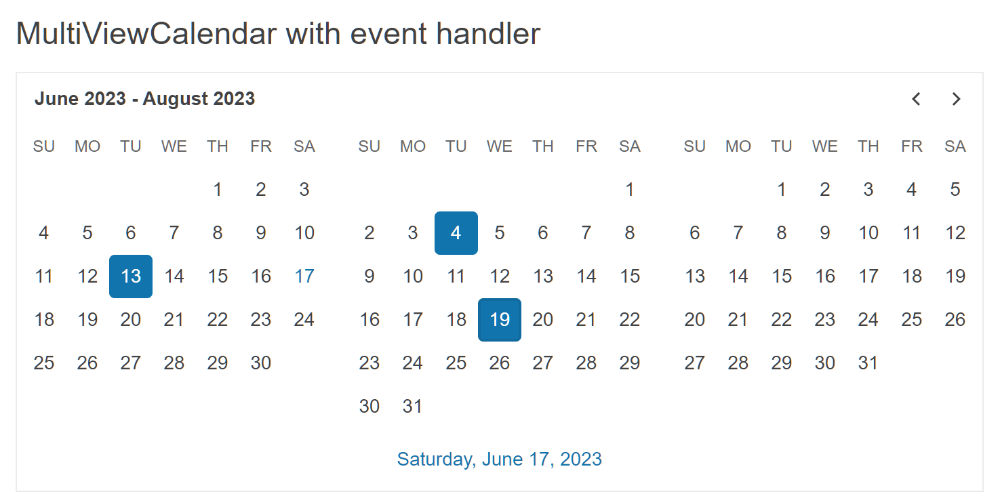

# Getting Started with the MultiViewCalendar

This tutorial explains how to set up a basic Telerik UI for {{ site.framework }} MultiViewCalendar and highlights the major steps in the configuration of the component.

You will initialize a MultiViewCalendar and learn how to disable the selection of every Thursday from the week. Then, you will see how to attach an event handler to the component. Finally, you can run the sample code in [Telerik REPL](https://netcorerepl.telerik.com/) and continue exploring the component.

 

@[template](/_contentTemplates/core/getting-started-prerequisites.md#repl-component-gs-prerequisites)

## 1. Prepare the CSHTML File

@[template](/_contentTemplates/core/getting-started-directives.md#gs-adding-directives)

Optionally, you can structure the document by adding the desired HTML elements like headings, divs, paragraphs, and others.

```HtmlHelper
@using Kendo.Mvc.UI

<h4>MultiViewCalendar with event handler</h4>

<p>

</p>
```

```TagHelper
@addTagHelper *, Kendo.Mvc

<h4>MultiViewCalendar with event handler</h4>

<p>

</p>
```


## 2. Initialize the MultiViewCalendar

Use the MultiViewCalendar HtmlHelper or TagHelper to add the component to a page:

* The `Name()` configuration method is mandatory as its value is used for the `id` and the `name` attributes of the MultiViewCalendar element.
* The `Views()` configuration controls how many months will show at same time. By default, the value is two months.
* The `Selectable()` configuration allows multiple or single selection of dates. By default, single selection is enabled.

```HtmlHelper
@using Kendo.Mvc.UI

<h4>MultiViewCalendar with event handler</h4>

<p>
    @(Html.Kendo().MultiViewCalendar()
        .Name("multiViewCalendar")
        .Views(3)
    )
</p>
```

```TagHelper
@addTagHelper *, Kendo.Mvc

<h4>MultiViewCalendar with event handler</h4>

<p>
    <kendo-multiviewcalendar name="multiViewCalendar" views="3">
    </kendo-multiviewcalendar>
</p>
```


## 3. Enable Selection of Multiple Days

The next step is to configure the MultiViewCalendar to allow multiple selection. You can do that by using the `Selectable()` configuration.

```HtmlHelper
@using Kendo.Mvc.UI

<h4>MultiViewCalendar with event handler</h4>

<p>
    @(Html.Kendo().MultiViewCalendar()
        .Name("multiViewCalendar")
        .Views(3)
        .Selectable("multiple")
    )
</p>
```

```TagHelper
@addTagHelper *, Kendo.Mvc

<h4>MultiViewCalendar with event handler</h4>

<p>
    <kendo-multiviewcalendar name="multiViewCalendar" views="3" 
           selectable="multiple">
    </kendo-multiviewcalendar>
</p>
```


## 4. Handle a MultiViewCalendar Event

The MultiViewCalendar exposes a `Change()` event that you can handle and assign specific functions to the component. In this tutorial, you will use the `Change()` event to display a message when the user modifies the selected date.

```HtmlHelper
@using Kendo.Mvc.UI

<script>
   function onChange(e) {
       var value = e.sender.selectDates()[0];
       console.log(value); // the first selected date in the MultiViewCalendar
   }
</script>

<h4>MultiViewCalendar with event handler</h4>

<p>
    @(Html.Kendo().MultiViewCalendar()
        .Name("multiViewCalendar")
        .Views(3)
        .Selectable("multiple")
        .Events(e => e.Change("onChange"))
    )
</p>
```

```TagHelper
@addTagHelper *, Kendo.Mvc

<script>
   function onChange(e) {
       var value = e.sender.selectDates()[0];
       console.log(value); // the first selected date in the MultiViewCalendar
   }
</script>

<h4>MultiViewCalendar with event handler</h4>

<p>
    <kendo-multiviewcalendar name="multiViewCalendar" views="3" 
           selectable="multiple" on-change="onChange">
    </kendo-multiviewcalendar>
</p>
```


## 5. (Optional) Reference Existing MultiViewCalendar Instances

You can reference the MultiViewCalendar instances that you have created and build on top of their existing configuration:

1. Use the `id` attribute of the component instance to establish a reference.

    ```JS script
    <script>
        var multiviewcalendarReference = $("#multiViewCalendar").data("kendoMultiViewCalendar"); // multiviewcalendarReference is a reference to the existing multiViewCalendar instance of the helper.
    </script>
    ```

1. Use the [MultiViewCalendar client-side API](https://docs.telerik.com/kendo-ui/api/javascript/ui/multiviewcalendar#methods) to control the behavior of the widget. In this example, you will use the `enable` method to disable the multiviewcalendar.

    ```JS script
    <script>
        var multiviewcalendarReference = $("#multiViewCalendar").data("kendoMultiViewCalendar"); // multiviewcalendarReference is a reference to the existing timeMultiViewCalendar instance of the helper.
        var view = multiviewcalendarReference.view(); // Gets an instance of the current view used by the MultiViewCalendar.
    </script>
    ```

For more information on referencing specific helper instances, see the [Methods and Events]() article.


## Explore this Tutorial in REPL

You can continue experimenting with the code sample above by running it in the Telerik REPL server playground:

* [Sample code with the MultiViewCalendar HtmlHelper](https://netcorerepl.telerik.com/QxuUbVay17tcipG514)
* [Sample code with the MultiViewCalendar TagHelper](https://netcorerepl.telerik.com/mxEgPhao17C5ECa224)



## Next Steps

* [Customize the Day Template of the MultiViewCalendar]()
* [Configure the MultiViewCalendar's Multiple Views]()

## See Also

* [Using the API of the MultiViewCalendar for {{ site.framework }} (Demo)](https://demos.telerik.com/{{ site.platform }}/multiviewcalendar/api)
* [Client-Side API of the MultiViewCalendar](https://docs.telerik.com/kendo-ui/api/javascript/ui/multiviewcalendar)
* [Server-Side API of the MultiViewCalendar](/api/multiviewcalendar)
* [Knowledge Base Section](/knowledge-base)
