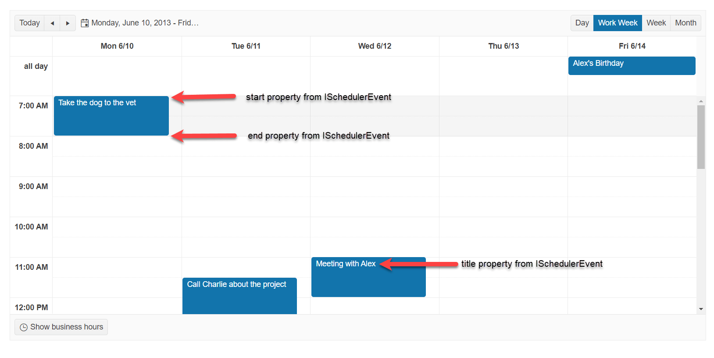

# Getting Started with the Scheduler

This tutorial explains how to set up the Telerik UI for {{ site.framework }} Scheduler and highlights the major steps in the configuration of the component.

You will declare a Task view model and bind it to an instance of the Scheduler component. Then you will configure the DataSource, CRUD operations for the Scheduler, and server endpoints to handle the client-side requests. You'll add Scheduler Views, some optional configurations, and will learn how to reference the client-side instance of the component.

After completing this guide, you will achieve the following results:

 

@[template](/_contentTemplates/core/getting-started-prerequisites.md#repl-component-gs-prerequisites)

## 1. Prepare the CSHTML File

@[template](/_contentTemplates/core/getting-started-directives.md#gs-adding-directives)

Optionally, you can structure the document by adding the desired HTML elements like headings, divs, paragraphs, and others.

## 2. Declare the View Model

Declare the `TaskViewModel` view model. It must implement the `ISchedulerEvent` interface.

```Model
	using Kendo.Mvc.UI;

    public class TaskViewModel : ISchedulerEvent
    {
        public int TaskID { get; set; }
        public string Title { get; set; }
        public string Description { get; set; }

        private DateTime start;
        public DateTime Start
        {
            get
            {
                return start;
            }
            set
            {
                start = value.ToUniversalTime();
            }
        }

        public string StartTimezone { get; set; }

        private DateTime end;
        public DateTime End
        {
            get
            {
                return end;
            }
            set
            {
                end = value.ToUniversalTime();
            }
        }

        public string EndTimezone { get; set; }

        public string RecurrenceRule { get; set; }
        public int? RecurrenceID { get; set; }
        public string RecurrenceException { get; set; }
        public bool IsAllDay { get; set; }
        public int? OwnerID { get; set; }

        public Task ToEntity()
        {
            return new Task
            {
                TaskID = TaskID,
                Title = Title,
                Start = Start,
                StartTimezone = StartTimezone,
                End = End,
                EndTimezone = EndTimezone,
                Description = Description,
                RecurrenceRule = RecurrenceRule,
                RecurrenceException = RecurrenceException,
                RecurrenceID = RecurrenceID,
                IsAllDay = IsAllDay,
                OwnerID = OwnerID
            };
        }
    }
```
```Interface
    public interface ISchedulerEvent
    {
        string Title { get; set; }
        string Description { get; set; }
        bool IsAllDay { get; set; }
        DateTime Start { get; set; }
        DateTime End { get; set; }
        string StartTimezone { get; set; }
        string EndTimezone { get; set; }
        string RecurrenceRule { get; set; }
        string RecurrenceException { get; set; }
    }
```

## 3. Initialize the Scheduler

Use the Scheduler HtmlHelper or TagHelper to add the component to a page and set some of its options.

* Use the `Name()` configuration method to assign a name to the instance of the helper&mdash;this is mandatory as its value is used for the id and the name attributes of the Scheduler element.
* Add the `DataSource()` configuration option and set the end points for the [CRUD operations]().
* In the DataSource configuration, set the model's ID, fields, and recurrence ID.
* Set the current `Date`, `StartTime`,  and `Timezone`.

```HtmlHelper
@using Kendo.Mvc.UI

@(Html.Kendo().Scheduler<Kendo.Mvc.Examples.Models.Scheduler.TaskViewModel>()
    .Name("scheduler")
    .Date(new DateTime(2013, 6, 13))
    .StartTime(new DateTime(2013, 6, 13, 7, 00, 00))
    .Height(600)
    .Timezone("Etc/UTC")
    .DataSource(d => d
        .Model(m =>
        {
            m.Id(f => f.TaskID);
            m.Field(f => f.Title).DefaultValue("No title");
            m.Field(f => f.OwnerID).DefaultValue(1);
            m.RecurrenceId(f => f.RecurrenceID);
        })
        .Read("Basic_Usage_Read", "Scheduler")
        .Create("Basic_Usage_Create", "Scheduler")
        .Destroy("Basic_Usage_Destroy", "Scheduler")
        .Update("Basic_Usage_Update", "Scheduler")
    )
)
```

```TagHelper
@addTagHelper *, Kendo.Mvc

<kendo-scheduler name="scheduler" 
    date="new DateTime(2013, 6, 13)" 
    start-time="new DateTime(2013, 6, 13, 7, 00, 00)"
    height="600"
    timezone="Etc/UTC">
    <scheduler-datasource type="@DataSourceTagHelperType.Ajax">
        <transport>
            <read url="@Url.Action("Basic_Usage_Read", "Scheduler")" />
            <create url="@Url.Action("Basic_Usage_Create", "Scheduler")" />
            <destroy url="@Url.Action("Basic_Usage_Destroy", "Scheduler")" />
            <update url="@Url.Action("Basic_Usage_Update", "Scheduler")" />
        </transport>
        <schema data="Data" total="Total" errors="Errors">
            <scheduler-model id="TaskID">
                <fields>
                    <field name="TaskID" type="number"></field>
                    <field name="title" from="Title" type="string"></field>
                    <field name="start" from="Start" type="date"></field>
                    <field name="end" from="End" type="date"></field>
                    <field name="description" from="Description" type="string"></field>
                    <field name="recurrenceId" from="RecurrenceID" type="number" default-value=null></field>
                    <field name="recurrenceRule" from="RecurrenceRule" type="string" ></field>
                    <field name="recurrenceException" from="RecurrenceException" type="string"></field>
                    <field name="OwnerID" type="number" default-value="1"></field>
                    <field name="startTimezone" from="StartTimezone" type="string"></field>
                    <field name="endTimezone" from="EndTimezone" type="string"></field>
                    <field name="isAllDay" from="IsAllDay" type="boolean"></field>
                </fields>
            </scheduler-model>
        </schema>
    </scheduler-datasource>
</kendo-scheduler>
```


## 4. Declare the CRUD Actions

In the `Scheduler` controller, declare the CRUD actions. Use the names of the actions you set in the DataSource configuration in the previous step. 

```Controller
public ActionResult Index()
{
    return View();
}

private List<TaskViewModel> tasks = new List<TaskViewModel> {
   new TaskViewModel { TaskID= 5, Title="Take the dog to the vet", Start= new DateTime(2013, 06, 10, 07, 00, 00, DateTimeKind.Utc), End=new DateTime(2013, 06, 10, 08, 00, 00, DateTimeKind.Utc), IsAllDay= false, OwnerID= 2 },
   new TaskViewModel { TaskID= 6, Title="Call Charlie about the project", Start=new DateTime(2013, 06, 11, 11, 30, 00, DateTimeKind.Utc), End=new DateTime(2013, 06, 11, 13, 00, 00, DateTimeKind.Utc), IsAllDay= false, OwnerID= 2 },
   new TaskViewModel { TaskID= 7, Title="Meeting with Alex", Start=new DateTime(2013, 06, 12, 11, 00, 00, DateTimeKind.Utc), End=new DateTime(2013, 06, 12, 12, 00, 00, DateTimeKind.Utc), IsAllDay= false, OwnerID= 3 },
   new TaskViewModel { TaskID= 9, Title="Alex's Birthday", Start=new DateTime(2013, 06, 14, 02, 00, 00, DateTimeKind.Utc), End=new DateTime(2013, 06, 14, 02, 00, 00, DateTimeKind.Utc), IsAllDay= true, OwnerID= 2 },
   new TaskViewModel { TaskID= 25, Title="HR Lecture", Start=new DateTime(2013, 06, 04, 19, 00, 00, DateTimeKind.Utc), End=new DateTime(2013, 06, 04, 21, 00, 00, DateTimeKind.Utc), RecurrenceRule="FREQ=WEEKLY;BYDAY=TU,TH", IsAllDay= false, OwnerID= 1 },
   new TaskViewModel { TaskID= 95, Title="Dance Practice", Start=new DateTime(2013, 06, 03, 18, 30, 00, DateTimeKind.Utc), End=new DateTime(2013, 06, 03, 20, 00, 00, DateTimeKind.Utc), RecurrenceRule="FREQ=WEEKLY;BYDAY=MO,WE", IsAllDay= false, OwnerID= 2 },
   new TaskViewModel { TaskID= 119, Title="Helpdesk weekly meeting", Start=new DateTime(2013, 06, 05, 15, 00, 00, DateTimeKind.Utc), End=new DateTime(2013, 06, 05, 16, 00, 00, DateTimeKind.Utc), RecurrenceRule="FREQ=WEEKLY;BYDAY=WE", IsAllDay= false, OwnerID= 3 }

}

public virtual JsonResult Basic_Usage_Read([DataSourceRequest] DataSourceRequest request)
{
    return Json(tasks.ToDataSourceResult(request));
}

public virtual JsonResult Basic_Usage_Destroy([DataSourceRequest] DataSourceRequest request, TaskViewModel task)
{
    if (ModelState.IsValid)
    {
        tasks.Delete(task, ModelState);
    }

    return Json(new[] { task }.ToDataSourceResult(request, ModelState));
}

public virtual JsonResult Basic_Usage_Create([DataSourceRequest] DataSourceRequest request, TaskViewModel task)
{
    if (ModelState.IsValid)
    {
        tasks.Insert(task, ModelState);
    }

    return Json(new[] { task }.ToDataSourceResult(request, ModelState));
}

public virtual JsonResult Basic_Usage_Update([DataSourceRequest] DataSourceRequest request, TaskViewModel task)
{
    //example custom validation:
    if (task.Start.Hour < 8 || task.Start.Hour > 22)
    {
        ModelState.AddModelError("start", "Start date must be in working hours (8h - 22h)");
    }

    if (ModelState.IsValid)
    {
        tasks.Update(task, ModelState);
    }

    return Json(new[] { task }.ToDataSourceResult(request, ModelState));
}
```

## 5. Configure the Scheduler Views

The Scheduler supports different views to display its events. In this tutorial, you will configure the `Day`, `Work Week`, `Week`, and `Month` views and then set the `Work Week` view as selected by default.

```HtmlHelper
@using Kendo.Mvc.UI

@(Html.Kendo().Scheduler<Kendo.Mvc.Examples.Models.Scheduler.TaskViewModel>()
    .Name("scheduler")
    .Date(new DateTime(2013, 6, 13))
    .StartTime(new DateTime(2013, 6, 13, 7, 00, 00))
    .Height(600)
    .Views(views =>
    {
        views.DayView();
        views.WorkWeekView(workWeekView =>
        {
            workWeekView.Selected(true);
        });
        views.WeekView();
        views.MonthView();
    })
    .Timezone("Etc/UTC")
    .DataSource(d => d
        .Model(m =>
        {
            m.Id(f => f.TaskID);
            m.Field(f => f.Title).DefaultValue("No title");
            m.Field(f => f.OwnerID).DefaultValue(1);
            m.RecurrenceId(f => f.RecurrenceID);
        })
        .Read("Basic_Usage_Read", "Scheduler")
        .Create("Basic_Usage_Create", "Scheduler")
        .Destroy("Basic_Usage_Destroy", "Scheduler")
        .Update("Basic_Usage_Update", "Scheduler")
    )
)
```

```TagHelper
@addTagHelper *, Kendo.Mvc

<kendo-scheduler name="scheduler" 
    date="new DateTime(2013, 6, 13)" 
    start-time="new DateTime(2013, 6, 13, 7, 00, 00)"
    height="600"
    timezone="Etc/UTC">
    <views>
        <view type="day"></view>
        <view type="workWeek" selected="true"></view>
        <view type="week"></view>
        <view type="month"></view>
    </views>
    <scheduler-datasource type="@DataSourceTagHelperType.Ajax">
        <transport>
            <read url="@Url.Action("Basic_Usage_Read", "Scheduler")" />
            <create url="@Url.Action("Basic_Usage_Create", "Scheduler")" />
            <destroy url="@Url.Action("Basic_Usage_Destroy", "Scheduler")" />
            <update url="@Url.Action("Basic_Usage_Update", "Scheduler")" />
        </transport>
        <schema data="Data" total="Total" errors="Errors">
            <scheduler-model id="TaskID">
                <fields>
                    <field name="TaskID" type="number"></field>
                    <field name="title" from="Title" type="string"></field>
                    <field name="start" from="Start" type="date"></field>
                    <field name="end" from="End" type="date"></field>
                    <field name="description" from="Description" type="string"></field>
                    <field name="recurrenceId" from="RecurrenceID" type="number" default-value=null></field>
                    <field name="recurrenceRule" from="RecurrenceRule" type="string" ></field>
                    <field name="recurrenceException" from="RecurrenceException" type="string"></field>
                    <field name="OwnerID" type="number" default-value="1"></field>
                    <field name="startTimezone" from="StartTimezone" type="string"></field>
                    <field name="endTimezone" from="EndTimezone" type="string"></field>
                    <field name="isAllDay" from="IsAllDay" type="boolean"></field>
                </fields>
            </scheduler-model>
        </schema>
    </scheduler-datasource>
</kendo-scheduler>
```


## (Optional) Reference Existing Scheduler Instances

Referencing existing component instances allows you to build on top of their configuration. To reference an existing Scheduler instance, use the [`jQuery.data()`](http://api.jquery.com/jQuery.data/) method. Once a reference is established, use the [Scheduler client-side API](https://docs.telerik.com/kendo-ui/api/javascript/ui/scheduler#methods) to control its behavior.

1. Use the `id` attribute of the component instance to establish a reference.

    ```script
    <script>
        var schedulerReference = $("#scheduler").data("kendoScheduler"); // schedulerReference is a reference to the existing instance of the helper.
    </script>
    ```

1. Use the [Scheduler client-side API](https://docs.telerik.com/kendo-ui/api/javascript/ui/scheduler#methods) to control the behavior of the widget. In this example, you will see how to get or set the current Scheduler date with the `date` method.

```script
    <script>
        var scheduler = $("#scheduler").data("kendoScheduler");
		var currentDate = scheduler.date(); // Get the date set by the Date configuration of the helper.
		scheduler.date(new Date("2013/6/6")); // Programmatically set a new date of the Scheduler.
    </script>
```


## Explore this Tutorial in REPL

You can continue experimenting with the code sample above by running it in the Telerik REPL server playground:

* [Sample code with the Scheduler HtmlHelper](https://netcorerepl.telerik.com/QnuQwSlE14blnTFG03)
* [Sample code with the Scheduler TagHelper](https://netcorerepl.telerik.com/QdEmQIbk12lLwWhJ59)



## Next Steps

* [Assigning Resources to the Scheduler's events]()
* [Handling JavaScript Events of the User Interactions](https://demos.telerik.com/{{ site.platform }}/scheduler/events) and [Applying Validation and Restrictions to the Editing of the Scheduler Events](https://demos.telerik.com/{{ site.platform }}/scheduler/restriction)
* [Implementing Adaptive Rendering in the Scheduler]()

## See Also

* [Using the API of the Scheduler for {{ site.framework }} (Demo)](https://demos.telerik.com/{{ site.platform }}/scheduler/api)
* [Client-Side API of the Scheduler](https://docs.telerik.com/kendo-ui/api/javascript/ui/scheduler)
* [Server-Side API of the Scheduler](/api/scheduler)
* [Knowledge Base Section](/knowledge-base)
