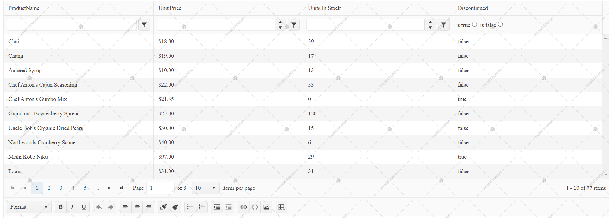
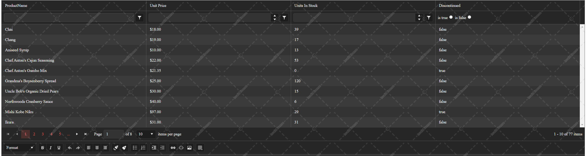
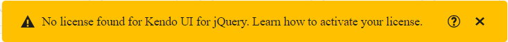
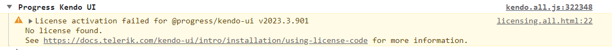

# Adding a License File

Using any [Kendo UI client-side assets]() that are [installed through NPM](https://www.npmjs.com/package/@progress/kendo-ui) or imported through the [Kendo UI CDN]() requires you to provide a license file. Follow the steps in this article to download a license file, add it to your application, and then reference it.

Providing a license file is not required when using locally downloaded client-side assets that come with the commercial [MSI installer]() or [commercial ZIP and 7Z asset archives](#adding-the-resources).

A missing license file causes a banner, a watermark, and a message in the browser's console to appear:

* Example of a watermark in the Light Theme
     
 
* Example of a watermark in the Dark Theme
    

* A banner on pages that use unlicensed Kendo UI for jQuery components
    

* A message in the browser's console
    

To add a client-side assets license file to your application:

1. [Download a license file](#step-1-get-the-license-file)
2. [Add the license file in your application](#step-2-add-the-license-file)
3. [Add a reference to the license file](#step-3-add-a-reference-to-the-license-file)

## Step 1: Get the License File

> This section contains auto-generated content based on the license information for your account.

To get a license file, generate it:

<link rel="stylesheet" href="https://d3fu8oi3wk1rz4.cloudfront.net/kendo-docs-demos-assets/2.1.2/styles/license-key/styles.css" />
<script src="https://d3fu8oi3wk1rz4.cloudfront.net/kendo-docs-demos-assets/2.1.2/scripts/license-key/index.js"></script>


<license-download-link
product-codes="KENDOUICOMPLETE, KENDOUI, KENDOUIMVC, UIASPCORE, KENDOMVC"
product-name="Telerik UI for ASP.NET Core";
purchase-url="https://www.telerik.com/purchase/aspnet-core-ui"
trial-url="https://www.telerik.com/try/aspnet-core-ui"
download-code-url="https://docs.telerik.com/kendo-ui/my-license/download">
</license-download-link>

<license-download-link
product-codes="KENDOUICOMPLETE, KENDOUI, KENDOUIMVC, UIASPCORE, KENDOMVC"
product-name="Telerik UI for ASP.NET MVC";
purchase-url="https://www.telerik.com/purchase/aspnet-mvc"
trial-url="https://www.telerik.com/try/ui-for-asp.net-mvc"
download-code-url="https://docs.telerik.com/kendo-ui/my-license/download">
</license-download-link>


## Step 2: Add the License File

Place the `kendo-ui-license.js` file in the root of the application or in the main scripts folder.

The following table shows the most common location where you can include the license file in your application.


|Type of Application|Common Locations
|:---|:---
|ASP.NET Core applications|<ul><li><code>~/wwwroot</code></li><li><code>~/wwwroot/scripts</code></li><li><code>~/wwwroot/js</code></li></ul>

|Type of Application|Common Locations
|:---|:---
|ASP.NET MVC applications|<ul><li><code>~/</code></li><li><code>~/Scripts</code></li></ul>


## Step 3: Add a Reference to the License File

Add the `kendo-ui-license.js` file as a script reference right after the `kendo.aspnetmvc.min.js` reference or the Kendo scripts you are using. For example:

* Adding the license file after a CDN reference to `kendo.all.min.js` and `kendo.aspnetmvc.min.js`
    ```html
    <script src="https://kendo.cdn.telerik.com/***/kendo.all.min.js"></script>
    <script src="https://kendo.cdn.telerik.com/***/kendo.aspnetmvc.min.js"></script>
    <script src="~/kendo-ui-license.js"></script>

    <!-- Rest of the HTML -->
    ```

* Adding the license file after a CDN reference to a predefined list of scripts
    ```html
    <script src="https://kendo.cdn.telerik.com/***/kendo.core.min.js"></script>
    <script src="https://kendo.cdn.telerik.com/***/kendo.userevents.min.js"></script>
    <script src="https://kendo.cdn.telerik.com/***/kendo.draganddrop.min.js"></script>
    <script src="https://kendo.cdn.telerik.com/***/kendo.popup.min.js	"></script>
    <script src="https://kendo.cdn.telerik.com/***/kendo.fx.min.js"></script>
    <script src="https://kendo.cdn.telerik.com/***/kendo.window.min.js"></script>
    <script src="https://kendo.cdn.telerik.com/***/kendo.aspnetmvc.min.js"></script>
    <script src="~/kendo-ui-license.js"></script>

    <!-- Rest of the HTML -->
    ```

## Next Steps

* [License File Frequently Asked Questions (Kendo UI for jQuery Documentation)](https://docs.telerik.com/kendo-ui/intro/installation/license-code-faq)
* [Troubleshooting a Failed Client-Side Assets License Activation (Kendo UI for jQuery Knowledge Base)](https://docs.telerik.com/kendo-ui/knowledge-base/invalid-license)

## See Also

* [Using CDN to Add Client-Side Resources]()
* [Using Local Files to Add Client-Side Resources]()
* [Creating Your Own Custom Script Bundles with Client-Side Resources]()

* [Using LibMan to Add Client-Side Resources]()

