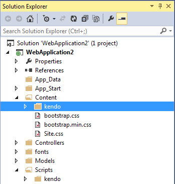

# Using Local Files

To render correctly, the Telerik UI components need the corresponding client-side JavaScript and CSS files. This guide demonstrates how to import these client-side assets in your project by using files that you will download from the Telerik website to your local machine.

>tip If you used the [automated MSI installer]() to install {{ site.product }}, all required files are already available on your machine and you can skip the downloading instructions and jump to Step 4 below. By default, these js and CSS files are located in the Telerik UI installation folder under `C:\Program Files (x86)\Progress\{{ site.product }} <version>`.

## Adding the Resources

To add the client-side resources to your project:


1. Go to the [UI for ASP.NET Core download page](https://www.telerik.com/account/product-download?product=UIASPCORE) or to **Account Overview** > **Downloads** > **Progress<sup>®</sup> Telerik<sup>®</sup> UI for ASP.NET Core**.

1. Go to the [UI for ASP.NET MVC download page](https://www.telerik.com/account/product-download?product=KENDOUIMVC) or to **Account Overview** > **Downloads** > **Progress<sup>®</sup> Telerik<sup>®</sup> UI for ASP.NET MVC**.


1. Download the archive that matches the `Kendo.Mvc.UI` version in your project. For example, if your project references `Kendo.Mvc.UI` version `{{ site.mvcCoreVersion }}`, then download the `telerik.ui.for.aspnetcore.{{ site.mvcCoreVersion }}.commercial``telerik.ui.for.aspnetmvc.{{ site.mvcCoreVersion }}.commercial` zip or 7z archive.


    - `telerik.ui.for.aspnet.core.{{ site.mvcCoreVersion }}.commercial-source` includes non-minified scripts and styles.
    - `telerik.ui.for.aspnet.core.{{ site.mvcCoreVersion }}.commercial` includes minified scripts and styles.

1. Copy the `js` and `styles` folders from the archive to your project under `wwwroot\lib\kendo-ui`.


    The culture and localization (the translation of component messages) scripts are included in the `js` folder. For more information on using localization, internationalization, and right-to-left (RTL) support with {{ site.product }} helpers, refer to the article on [globalization support by {{ site.product }}]().

1. Register the UI styles and scripts in `~/Views/Shared/_Layout.cshtml`.

    > * The CDN links and/or package versions have to point to the same UI for ASP.NET Core version which your project references.
    > * In the default .NET Core template, the jQuery scripts are included at the end of the `<body>` element. To properly load the Telerik UI for ASP.NET HTML Helpers, move the jQuery scripts and the Kendo UI client-side scripts to the `<head>` element and make sure that the Kendo UI scripts are loaded after the jQuery ones.

        <head>
            ...

            <environment include="Development">
                ...

                <link rel="stylesheet" href="~/lib/kendo-ui/styles/default-main.css" />
            </environment>
            <environment exclude="Development">
                ...

                <link rel="stylesheet"
                    href="https://kendo.cdn.telerik.com/themes/{{ site.themesCdnVersion }}/default/default-main.css"
                    asp-fallback-href="~/lib/kendo-ui/styles/default-main.css"
                    asp-fallback-test-class="k-theme-test-class"
                    asp-fallback-test-property="opacity" asp-fallback-test-value="0" />
            </environment>

            <environment include="Development">
                ...

                <script src="~/lib/jquery/dist/jquery.js"></script>

                @* Place the Kendo UI scripts after jQuery. *@
                <script src="~/lib/kendo-ui/js/kendo.all.min.js"></script>
                <script src="~/lib/kendo-ui/js/kendo.aspnetmvc.min.js"></script>
            </environment>
            <environment exclude="Development">
                ...

                <script src="https://ajax.aspnetcdn.com/ajax/jquery/jquery-2.2.0.min.js"
                        asp-fallback-src="~/lib/jquery/dist/jquery.min.js"
                        asp-fallback-test="window.jQuery"
                        crossorigin="anonymous"
                        integrity="sha384-K+ctZQ+LL8q6tP7I94W+qzQsfRV2a+AfHIi9k8z8l9ggpc8X+Ytst4yBo/hH+8Fk">
                </script>

                @* Place the Kendo UI scripts after jQuery. *@
                <script src="https://kendo.cdn.telerik.com/{{ site.cdnVersion }}/js/kendo.all.min.js"
                        asp-fallback-src="~/lib/kendo-ui/js/kendo.all.min.js"
                        asp-fallback-test="window.kendo">
                </script>
                <script src="https://kendo.cdn.telerik.com/{{ site.cdnVersion }}/js/kendo.aspnetmvc.min.js"
                        asp-fallback-src="~/lib/kendo-ui/js/kendo.aspnetmvc.min.js"
                        asp-fallback-test="kendo.data.transports['aspnetmvc-ajax']">
                </script>
            </environment>

            ...
        </head>


1. Extract the files from the archive.

1. Drag the `js` directory from the archive and drop it in Visual Studio over the `Scripts` folder of the application.

1. Drag the `styles` directory from the archive and drop it in Visual Studio over the `Content` folder of the application.

1. Rename the `Scripts/js` directory to `Scripts/kendo`. Rename `Content/styles` to `Content/kendo`. After the needed JavaScript and CSS files are added to the application, you can include them.

    

1. Open `App_Start/BundleConfig.cs` to add bundles for Telerik UI for ASP.NET MVC.

1. Add a script bundle for Telerik UI for ASP.NET MVC.

        bundles.Add(new ScriptBundle("~/bundles/kendo").Include(
            "~/Scripts/kendo/kendo.all.min.js",
            // Uncomment below if you use the Scheduler.
            // "~/Scripts/kendo/kendo.timezones.min.js",
            "~/Scripts/kendo/kendo.aspnetmvc.min.js"));

1. If you are using UI for ASP.NET MVC R1 2023 (version 2023.1.117) or older version with LESS themes - Add a style bundle for Telerik UI for ASP.NET MVC. For the SASS themes, Telerik is shipping one file and CSS bundling is not needed.

    > Make sure you are familiar with the [Telerik UI for ASP.NET MVC fundamentals and CSS bundling]().

        bundles.Add(new StyleBundle("~/Content/kendo/css").Include(
            "~/Content/kendo/kendo.common-bootstrap.min.css",
            "~/Content/kendo/kendo.bootstrap.min.css"));

1. Set the ASP.NET bundles to allow minified files in debug mode.

        bundles.IgnoreList.Clear();

1. Open the layout of the application. By default, if using ASPX, it is `Views/Shared/_Layout.cshtml`, or `Site.master`.

1. For Less themes - Render the Telerik UI for ASP.NET MVC style bundle. For SASS themes - add reference to the respective css file, e.g. `default-main.css`.

    ```ASPX
        <%: Styles.Render("~/Content/kendo/css") %>
    ```
    ```Razor
        @Styles.Render("~/Content/kendo/css")
    ```

1. Move the jQuery bundle to the `head` tag of the page. By default, it is located at the end of the page.

1. Render the Telerik UI for ASP.NET MVC script bundle after jQuery. Make sure that the jQuery version you load is [supported]()

    ```ASPX
        <%: Scripts.Render("~/bundles/jquery") %>
        <%: Scripts.Render("~/bundles/kendo") %>
    ```
    ```Razor
        @Scripts.Render("~/bundles/jquery")
        @Scripts.Render("~/bundles/kendo")
    ```

1. Register the UI styles and scripts in `~/Views/Shared/_Layout.cshtml`.

    > * The CDN links and/or package versions have to point to the same UI for ASP.NET MVC version which your project references.
    > * In the default .NET MVC template, the jQuery scripts are included at the end of the `<body>` element. To properly load the Telerik UI for ASP.NET HTML Helpers, move the jQuery scripts and the Kendo UI client-side scripts to the `<head>` element and make sure that the Kendo UI scripts are loaded after the jQuery ones.

        <head>
            ...

            <environment include="Development">
                ...

                <link rel="stylesheet" href="~/lib/kendo-ui/styles/default-main.css" />
            </environment>
            <environment exclude="Development">
                ...

                <link rel="stylesheet"
                    href="https://kendo.cdn.telerik.com/themes/{{ site.themesCdnVersion }}/default/default-main.css"
                    asp-fallback-href="~/lib/kendo-ui/styles/default-main.css"
                    asp-fallback-test-class="k-common-test-class"
                    asp-fallback-test-property="opacity" asp-fallback-test-value="0" />

                <link rel="stylesheet"
                    href="https://kendo.cdn.telerik.com/themes/{{ site.themesCdnVersion }}/default/default-main.css"
                    asp-fallback-href="~/lib/kendo-ui/styles/default-main.css"
                    asp-fallback-test-class="k-theme-test-class"
                    asp-fallback-test-property="opacity" asp-fallback-test-value="0" />
            </environment>

            <environment include="Development">
                ...

                <script src="~/lib/jquery/dist/jquery.js"></script>

                @* Place the Kendo UI scripts after jQuery. *@
                <script src="~/lib/kendo-ui/js/kendo.all.min.js"></script>
                <script src="~/lib/kendo-ui/js/kendo.aspnetmvc.min.js"></script>
            </environment>
            <environment exclude="Development">
                ...

                <script src="https://ajax.aspnetcdn.com/ajax/jquery/jquery-2.2.0.min.js"
                        asp-fallback-src="~/lib/jquery/dist/jquery.min.js"
                        asp-fallback-test="window.jQuery"
                        crossorigin="anonymous"
                        integrity="sha384-K+ctZQ+LL8q6tP7I94W+qzQsfRV2a+AfHIi9k8z8l9ggpc8X+Ytst4yBo/hH+8Fk">
                </script>

                @* Place the Kendo UI scripts after jQuery. *@
                <script src="https://kendo.cdn.telerik.com/{{ site.mvcCoreVersion }}/js/kendo.all.min.js"
                        asp-fallback-src="~/lib/kendo-ui/js/kendo.all.min.js"
                        asp-fallback-test="window.kendo">
                </script>
                <script src="https://kendo.cdn.telerik.com/{{ site.mvcCoreVersion }}/js/kendo.aspnetmvc.min.js"
                        asp-fallback-src="~/lib/kendo-ui/js/kendo.aspnetmvc.min.js"
                        asp-fallback-test="kendo.data.transports['aspnetmvc-ajax']">
                </script>
            </environment>

            ...
        </head>


## Additional Local Files

Starting with {{ site.product }} version `2022.3.1109`, you can choose between three module systems that allow you to [import the client-side assets]() into your project: ECMAScript, UMD, and CommonJS.

The files for all of these module systems are available in the [downloaded zip or 7z archive](#adding-the-resources) or in the local installation directory of {{ site.product }}:

* ECMAScript—The script files are located in the **mjs** folder. Available as of `2022.3.1109`.
* UMD—The script files are located in the **umd** folder. Available as of `2022.3.1109`.
* CommonJS—The script files are located in the **js** folder.

## See Also


* [Using LibMan to Add Client-Side Resources]()
* [Creating Your Own Custom Script Bundles with Client-Side Resources]()

* [Using ECMAScript Resources]()
* [Using CDN to Add Client-Side Resources]()
* [{{ site.product }} Download and Installation]()
