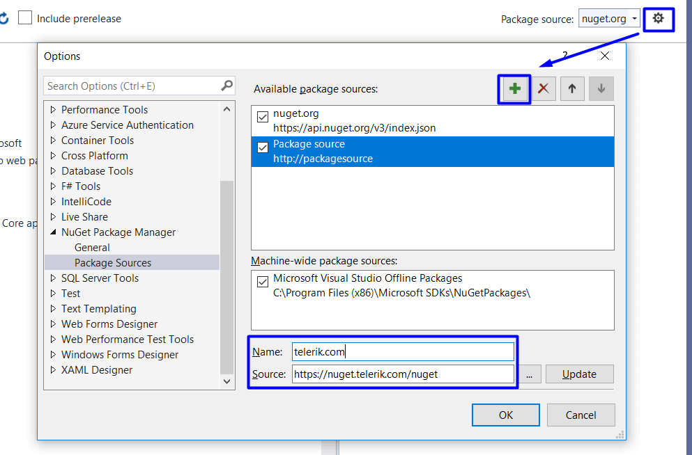
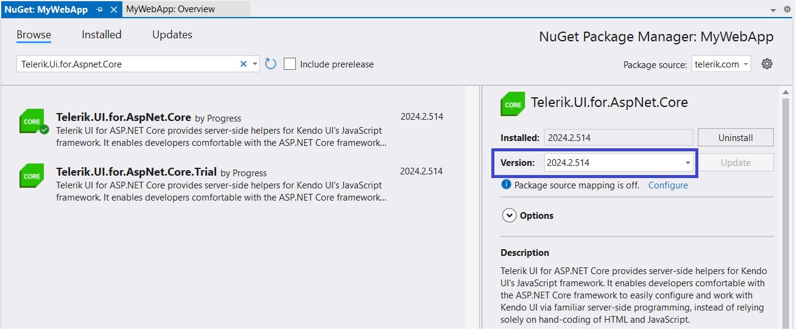

# Installing {{ site.product }} with NuGet

This article describes how to configure your system for the Telerik NuGet source and then use it to install {{ site.product }} in your project.

[NuGet](https://www.nuget.org) is a popular .NET package manager. Telerik maintains a private NuGet feed with official {{ site.product }} releases and service packs. In the Telerik NuGet feed, you will see packages that your account has a license for; trials (active) and commercial (active and expired).


>tip Looking for a complete tutorial? Check out the [Getting Started guide that uses NuGet]() to add Telerik UI to the project.

>tip Looking for a complete tutorial? Check out the [Getting Started guide that uses NuGet]() to add Telerik UI to the project.


## Generate a NuGet API Key

@[template](/_contentTemplates/get-started.md#generate-nuget-api-key)

## Set Up the Telerik NuGet Feed

The Telerik NuGet feed allows you instant access to various Telerik and Kendo packages that you can install in your project. You can access either the latest or older versions of the suites.

Before you can use the Telerik NuGet feed as a **Package source**, you must configure your machine by utilizing any of the following methods:

* [Use the NuGet Package Manager in Visual Studio](#setup-with-the-nuget-package-manager)

* [Use the .NET CLI](#setup-with-net-cli)

* [Use NuGet CLI](#setup-with-nuget-cli)

* [Edit the `NuGet.Config` file](#setup-with-nugetconfig)
* [Use the Progress Control Panel application](#setup-with-the-progress-control-panel-application)

Regardless of how you set up the Telerik NuGet feed, you must first [generate a NuGet API key](#generate-a-nuget-api-key) needed for the authentication.

>warning Never hard-code your Telerik NuGet API keys in a `NuGet.Config` file in a GitHub repository, Docker image, or any location that may be accessed by unauthorized parties. An API key is valuable and bad actors can use it to access the NuGet packages that are licensed under your account. A credentials abuse can lead to a review of the affected Telerik account.

### Setup with the NuGet Package Manager

Refer to the [Microsoft documentation about using packages in Visual Studio](https://learn.microsoft.com/en-us/nuget/consume-packages/install-use-packages-visual-studio), or follow the steps below for Visual Studio on Windows.

1. Open Visual Studio.

1. Go to **Tools > NuGet Package Manager > Package Manager Settings**, select **Package Manager Sources**, and then click the **+** button.

1. Enter a **Name** for the Telerik NuGet feed, for example, `telerik.com`.

1. In the **Source** field, enter `https://nuget.telerik.com/v3/index.json` and click **OK**.


    

    


You have successfully added the Telerik NuGet feed as a Package source.

The next steps describe how to authenticate your local NuGet instance and display the available packages:

1. Create a new project or open an existing project.

1. Right-click the solution in the **Solution Explorer** window.

1. Select **Manage NuGet Packages for Solution...**


	 


1. Select the Telerik NuGet **Package source** from the drop-down list.

1. Click on the **Browse** tab to see the available packages.

1. In the Windows authentication prompt:

   6.1. Enter `api-key` in the **User Name** field.

   6.2. Enter your [NuGet API key](#generate-a-nuget-api-key) in the **Password** field.

   6.3. Check the **Remember My Password** checkbox.

1. In the Visual Studio Package Manager, you will see all packages that are licensed to your user account.

> If you experience issues, see the [NuGet Feed Troubleshooting](slug:troubleshooting_telerik_nuget) article.


### Setup with .NET CLI

To add the Telerik NuGet package source with the .NET CLI, use the [`dotnet nuget add source`](https://learn.microsoft.com/en-us/dotnet/core/tools/dotnet-nuget-add-source) command. The command shown below creates or updates a `NuGet.Config` file for you, so you do not have to [edit it manually](#setup-with-nugetconfig):

* The command adds the Telerik NuGet source, uses your [NuGet API key](#generate-a-nuget-api-key) for authentication, and stores the API key in plain text in the [global config file](https://learn.microsoft.com/en-us/nuget/consume-packages/configuring-nuget-behavior#config-file-locations-and-uses).
* The backslashes `\` enable multi-line commands for better readability in terminals that support them.

>caption Use the .NET CLI to add the Telerik NuGet source

```SH
dotnet nuget add source https://nuget.telerik.com/v3/index.json \
--name TelerikOnlineFeed \
--username api-key \
--password <YOUR-NUGET-API-KEY> \
--store-password-in-clear-text
```

If you have already stored the Telerik package source, you can update the configuration with the command below.

>caption Use the .NET CLI to update the Telerik NuGet source

```SH
dotnet nuget update source "TelerikOnlineFeed" \
--source "https://nuget.telerik.com/v3/index.json" \
--username api-key \
--password <YOUR-NUGET-API-KEY> \
--store-password-in-clear-text
```

### Setup with NuGet CLI

To add the Telerik NuGet feed by using the NuGet CLI:

1. Download the [latest NuGet executable](https://dist.nuget.org/win-x86-commandline/latest/nuget.exe).
1. Open a command prompt and change the path to where the `nuget.exe` was downloaded.
1. Execute the command:

   ```SH
   NuGet Sources Add -Name "telerik.com" -Source "https://nuget.telerik.com/v3/index.json" -UserName "api-key" -Password "YOUR-NUGET-API-KEY" -StorePasswordInClearText
   ```

    The command adds the Telerik NuGet source, uses your NuGet API key for authentication, and stores the API key in plain text in the global config file (in `%AppData%\NuGet\NuGet.config`).

    > If you experience connection issues with encrypted credentials, the `-StorePasswordInClearText` parameter ensures the credentials are stored in clear text for reliable authentication.

    If you have already stored the Telerik package source, you can update the definition in the `%AppData%\NuGet\NuGet.config` file by using the following command:

   ```SH
   NuGet Sources Update -Name "telerik.com" -Source "https://nuget.telerik.com/v3/index.json" -UserName "api-key" -Password "YOUR-NUGET-API-KEY" -StorePasswordInClearText
   ```


### Setup with NuGet.Config

NuGet package sources and other settings are stored in a `NuGet.Config` file. You can read more about the file structure in the Microsoft article [NuGet.Config Reference](https://learn.microsoft.com/en-us/nuget/reference/nuget-config-file).

Ensure you are familiar with how such configurations work. Refer to [Common NuGet Configurations](https://learn.microsoft.com/en-us/nuget/consume-packages/configuring-nuget-behavior) for details about the possible file locations and how multiple `NuGet.Config` files work.

To edit a `NuGet.Config` file and add the Telerik feed, you need to:

1. Ensure you are editing the [correct and desired config file](https://learn.microsoft.com/en-us/nuget/consume-packages/configuring-nuget-behavior#config-file-locations-and-uses). You can also create a new one with the [`dotnet new nugetconfig` command](https://docs.microsoft.com/en-us/dotnet/core/tools/dotnet-new).

2. Add the Telerik package source to the config file. For the authentication, use your [NuGet API key](#generate-a-nuget-api-key) as a password and `api-key` as a username. Add the API key in plain text, because the NuGet tooling does not fully support encrypted credentials. Here is an example of how your `NuGet.Config` file can look like:

```XML
<?xml version="1.0" encoding="utf-8"?>
<configuration>
    <packageSources>
    <!--To inherit the global NuGet package sources remove the <clear/> line below -->
    <clear />
    <add key="nuget.org" value="https://api.nuget.org/v3/index.json" />
    <add key="TelerikOnlineFeed" value="https://nuget.telerik.com/v3/index.json" />
    </packageSources>
    <packageSourceCredentials>
    <TelerikOnlineFeed>
        <add key="Username" value="api-key" />
        <add key="ClearTextPassword" value="YOUR-NUGET-API-KEY" />
    </TelerikOnlineFeed>
    </packageSourceCredentials>
</configuration>
```

### Setup with the Progress Control Panel Application

You can use the <a href="https://www.telerik.com/try/control-panel" target="_blank">Progress Control Panel application</a> to configure the Telerik NuGet. The Control Panel has an option that you can select, and it will configure the Visual Studio Package Manager to use the Telerik NuGet feed.

## Install Telerik NuGet Packages

After setting up the Telerik NuGet package source, install the [packages](#list-of-provided-packages) either through the [Package Manager Dialog](https://docs.nuget.org/consume/package-manager-dialog) or the [Package Manager Console](http://docs.nuget.org/Consume/Package-Manager-Console).

The NuGet packages enable you to use Telerik UI Tag Helpers and HTML Helpers HTML Helpers  in your application. To ensure proper component rendering, you must also include the necessary [client-side resources]().

To install a particular {{ site.product }} version:

1. Choose the desired package from the [NuGet package manager](https://docs.nuget.org/consume/package-manager-dialog).
2. In the right panel, pick a **Version** from the dropdown menu.

     

     


>tip To check the status of the Progress Live Services, like Telerik NuGet, Kendo UI CDN, Kendo UI Dojo playground and others, visit the [Progress<sup>®</sup> Telerik<sup>®</sup> Live Services Status Page](http://status.telerik.com/).

## List of Provided Packages

Some of the {{ site.product_short }} NuGet packages are provided through the Telerik NuGet feed. Others are publicly available through the default NuGet package source `nuget.org`.

### Telerik Packages Available on the Telerik NuGet Feed

The Telerik NuGet feed provides the following packages related to {{ site.product_short }}:


- `Telerik.UI.for.AspNet.Core`&mdash;Telerik UI for ASP.NET Core Commercial.

- `Telerik.UI.for.AspNet.Mvc5.Lite`&mdash;Telerik UI for ASP.NET MVC 5 Lite. Installs only the `Kendo.Mvc.dll` assembly and the ready-to-use editor templates based on Telerik UI for ASP.NET components.
- `Telerik.UI.for.AspNet.Mvc5`&mdash;Telerik UI for ASP.NET MVC 5 Commercial. Installs the `Kendo.Mvc.dll` assembly, the ready-to-use editor templates based on Telerik UI for ASP.NET components, the CSS files used by the themes, and the Kendo JavaScript files.


### Telerik Packages Available on nuget.org

The following three packages are not provided by the Telerik NuGet feed. They are available through the default NuGet package source `nuget.org`:

- [`Telerik.Licensing`](https://www.nuget.org/packages/Telerik.Licensing)&mdash;Verifies the licensing status of the developer during app build. Requires a [license key](). Available on `nuget.org`.
- [`Telerik.SvgIcons`](https://www.nuget.org/packages/Telerik.SvgIcons)&mdash;Contains all Telerik SVG icons. Available on `nuget.org`.
- [`Telerik.FontIcons`](https://www.nuget.org/packages/Telerik.FontIcons)&mdash;Contains all Telerik font icons. Available on `nuget.org`.

To [use a local NuGet feed](https://learn.microsoft.com/en-us/nuget/hosting-packages/local-feeds), download the packages from:

* [Telerik.Licensing](https://www.nuget.org/packages/Telerik.Licensing)
* [Telerik.SvgIcons](https://www.nuget.org/packages/Telerik.SvgIcons)
* [Telerik.FontIcons](https://www.nuget.org/packages/Telerik.FontIcons)


>As of the R3 2022 release, NuGet packages for MVC 3 and MVC 4 are no longer provided for Telerik UI for ASP.NET MVC.



## Troubleshooting

If you experience any issues while configuring or using the Telerik NuGet feed, refer to the [NuGet Troubleshooting]() article.

## Next Steps


Once you have the Telerik NuGet source set up, follow the instructions to [create a {{ site.product }} app]().

Once you have the Telerik NuGet source set up, follow the instructions to [create a {{ site.product }} app]().


## Further Reading

@[template](/_contentTemplates/issues-and-warnings.md#nuget-security-links)

## See Also

* [Including Client-Side Resources]()
* [Adding Kendo UI Client-Side Resources by Using the CDN Services]()
* [Set Up Private NuGet Feed for Azure](https://docs.telerik.com/aspnet-core/knowledge-base/setup-private-nuget-feed-azure)

* [Scaffolding the Telerik UI for ASP.NET Core Project]()

* [Scaffolding the Telerik UI for ASP.NET MVC Project]()

