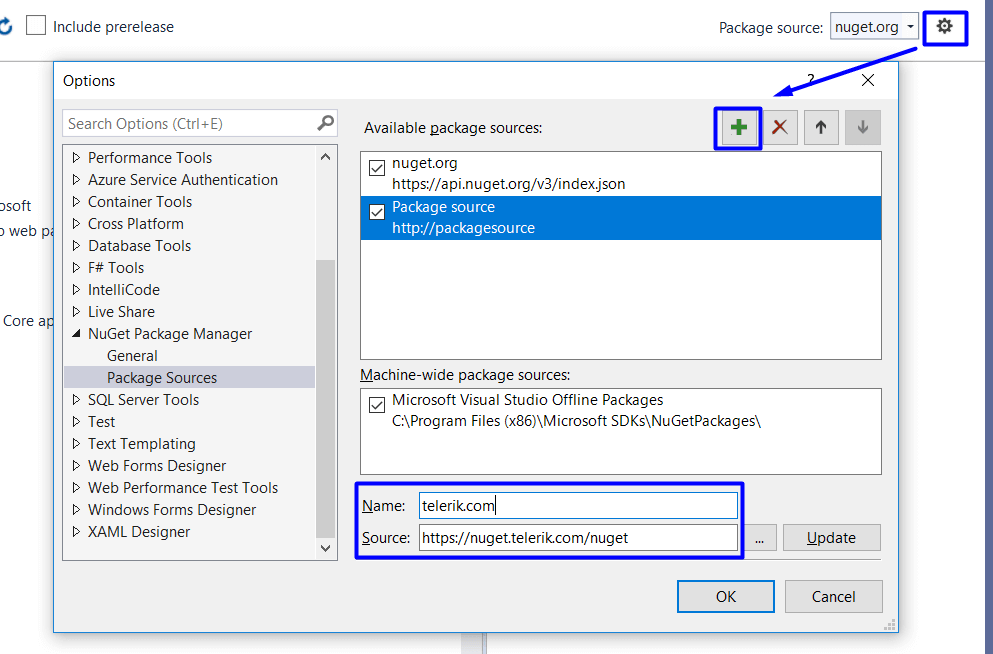
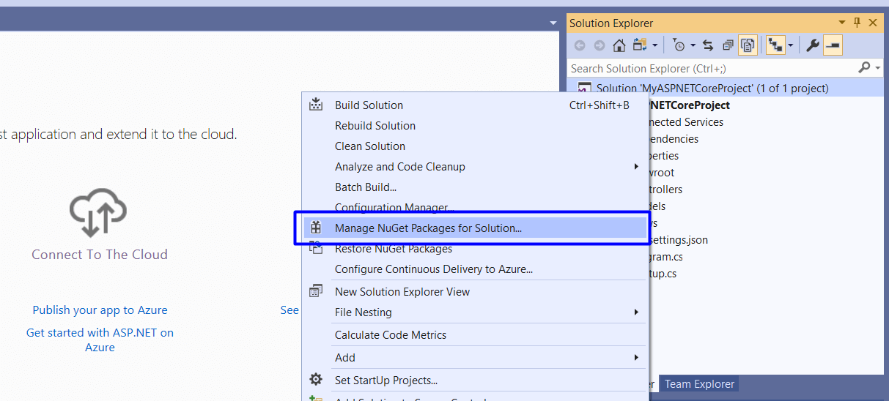
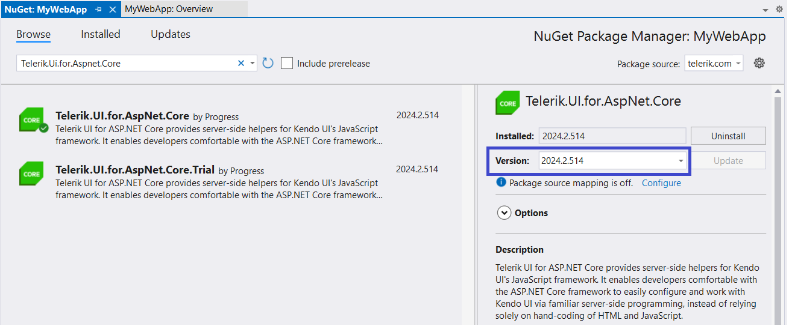
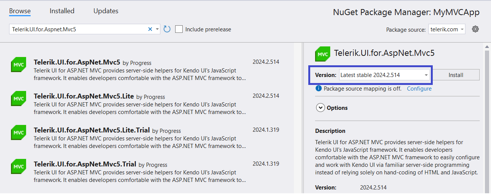

# Installing {{ site.product }} with NuGet

This article describes how to configure your system for the Telerik NuGet source and then use it to install {{ site.product }} in your project.

[NuGet](https://www.nuget.org) is a popular .NET package manager. Telerik maintains a private NuGet feed with official {{ site.product }} releases and service packs. In the Telerik NuGet feed, you will see packages that your account has a license for; trials (active) and commercial (active and expired).


>tip Looking for a complete tutorial? Check out the [Getting Started guide that uses NuGet]() to add Telerik UI to the project.

>tip Looking for a complete tutorial? Check out the [Getting Started guide that uses NuGet]() to add Telerik UI to the project.


## Setting Up the Telerik NuGet Feed

The Telerik NuGet feed allows you instant access to various Telerik and Kendo packages that you can install in your project. You can access either the latest or older versions of the suites.

Before you can use the Telerik NuGet Feed as a **Package source**, you must configure your machine by utilizing any of the following methods:

* [Use the NuGet Package Manager in Visual Studio](#setup-with-the-nuget-package-manager).

* [Use the {{ site.product }} trial installer](#setup-with-the-trial-installer).

* [Use the Progress Control Panel application](#setup-with-the-progress-control-panel-application).

* [Use NuGet CLI](#setup-with-nuget-cli).

* [Edit the `nuget.config` file](#setup-with-nugetconfig).

> The NuGet v2 server at `https://nuget.telerik.com/nuget` will be sunset in November 2024.
>
> The new v3 protocol offers faster package searches and restores, improved security, and more reliable infrastructure.
>
> To redirect your feed to the NuGet v3 protocol, all you have to do is to change your NuGet package source URL to `https://nuget.telerik.com/v3/index.json`.

### Setup with the NuGet Package Manager

The following video demonstrates how to add the Telerik NuGet feed through the NuGet Package Manager tool in Visual Studio. Scroll below the video to find the required steps.

<iframe width="560" height="315" src="https://www.youtube.com/embed/dJo1Ij4CcIY" title="YouTube video player" frameborder="0" allow="accelerometer; autoplay; clipboard-write; encrypted-media; gyroscope; picture-in-picture" allowfullscreen></iframe>

To configure the Telerik NuGet feed in Visual Studio:

1. Open Visual Studio.

1. Go to **Tools > NuGet Package Manager > Package Manager Settings**, select **Package Manager Sources**, and then click the **+** button.

1. Enter a **Name** for the Telerik NuGet feed, for example, `telerik.com`.

1. In the **Source** field, enter `https://nuget.telerik.com/v3/index.json` and click **OK**.


    

    


You have successfully added the Telerik NuGet feed as a Package source.

The next steps describe how to authenticate your local NuGet instance and display the available packages:

1. Create a new project or open an existing project.

1. Right-click the solution in the **Solution Explorer** window.

1. Select **Manage NuGet Packages for Solution...**


	 


1. Select the Telerik NuGet **Package source** from the drop-down list.

1. Click on the **Browse** tab to see the available packages.

1. Enter your Telerik credentials in the Windows Authentication dialog.

1. In the Visual Studio Package Manager, you will see all packages that are licensed to your user account.

### Setup with the Trial Installer


The UI for ASP.NET Core <a href="https://www.telerik.com/try/aspnet-core-ui" target="_blank">free trial installer package</a> comes with an option that will automatically configure the Telerik NuGet feed for you. Refer to the [NuGet feed setup section](#adding-the-telerik-nuget-feed-for-trial-license-users) in the First Steps article for step-by-step instructions.

The UI for ASP.NET MVC free trial installer package comes with an option that will automatically configure the Telerik NuGet feed for you. Refer to the [Getting Started article](#adding-the-telerik-nuget-feed-for-trial-license-users) for more details.


### Setup with the Progress Control Panel Application

If you have already purchased a commercial Telerik UI license, you can use the <a href="https://www.telerik.com/try/control-panel" target="_blank">Progress Control Panel application</a> to configure the Telerik NuGet. The Control Panel has an option that you can select, and it will configure the Visual Studio Package Manager to use the Telerik NuGet feed.

Refer to the [NuGet feed setup section](#adding-the-telerik-nuget-feed-for-users-with-commercial-license) in the First Steps article for step-by-step instructions.

Refer to the [Getting Started article](#adding-the-telerik-nuget-feed-for-users-with-commercial-license) for step-by-step instructions.


### Setup with NuGet CLI

The following video demonstrates how to add the Telerik NuGet feed by using the NuGet CLI or directly editing the `nuget.config` file. Scroll below the video to find the required steps.

<iframe width="560" height="315" src="https://www.youtube.com/embed/c3m_BLMXNDk" frameborder="0" allow="accelerometer; autoplay; encrypted-media; gyroscope; picture-in-picture" allowfullscreen></iframe>

To add the Telerik NuGet feed by using the NuGet CLI:

1. Download the [latest NuGet executable](https://dist.nuget.org/win-x86-commandline/latest/nuget.exe).
1. Open a command prompt and change the path to where the `nuget.exe` was downloaded.
1. Execute the command:

   ```
   NuGet Sources Add -Name "telerik.com" -Source "https://nuget.telerik.com/v3/index.json" -UserName "your login email" -Password "your password"
   ```

   The above command stores a token in the `%AppData%\NuGet\NuGet.config` file. Your original credentials cannot be obtained from this token.

If you are unable to connect to the feed by using encrypted credentials, try the alternative approach of storing credentials in clear text:

   ```
   NuGet Sources Add -Name "telerik.com" -Source "https://nuget.telerik.com/v3/index.json" -UserName "your login email" -Password "your password" -StorePasswordInClearText
   ```

If you have already stored a token instead of storing the credentials as clear text, you can update the definition in the `%AppData%\NuGet\NuGet.config` file by using the following command:

   ```
   NuGet Sources Update -Name "telerik.com" -Source "https://nuget.telerik.com/v3/index.json" -UserName "your login email" -Password "your password" -StorePasswordInClearText
   ```

### Setup with nuget.config

An alternative way to add the Telerik NuGet feed is to directly edit the `nuget.config` file. For more details about this config file, see [Microsoft's dedicated article](https://docs.microsoft.com/en-us/nuget/reference/nuget-config-file#packagesources).

To learn more about how this configuration works, see the [Common NuGet Configurations](https://docs.microsoft.com/en-us/nuget/consume-packages/configuring-nuget-behavior#creating-a-new-config-file) article.

To use a `nuget.config` file for the Telerik feed, you need to:

1. Ensure you have the relevant config file: `%AppData%\NuGet\NuGet.Config`. You can create a new one by via the [dotnet new command](https://docs.microsoft.com/en-us/dotnet/core/tools/dotnet-new) by calling `dotnet new nugetconfig`.

2. Add the Telerik feed to the `nuget.config` file, and make sure to use plain-text credentials because the .NET Core NuGet tooling does not fully support encrypted credentials. Here is an example of how your config file can look like:

    ```
        <?xml version="1.0" encoding="utf-8"?>
        <configuration>
         <packageSources>
            <!--To inherit the global NuGet package sources remove the <clear/> line below -->
            <clear />
            <add key="nuget" value="https://api.nuget.org/v3/index.json" />
            <add key="telerik" value="https://nuget.telerik.com/v3/index.json" />
         </packageSources>
         <packageSourceCredentials>
            <telerik>
              <add key="Username" value="your telerik account email" />
              <add key="ClearTextPassword" value="your plain text password" />
           </telerik>
         </packageSourceCredentials>
        </configuration>
    ```

Refer to the [Telerik NuGet feed instructional video](https://youtu.be/c3m_BLMXNDk?t=129) for more details.

## Installing the NuGet Packages

After setting up the Telerik NuGet package source, install the [packages](#list-of-provided-packages) either through the [Package Manager Dialog](https://docs.nuget.org/consume/package-manager-dialog) or the [Package Manager Console](http://docs.nuget.org/Consume/Package-Manager-Console).

The NuGet packages allow you to use the Telerik UI Tag Helpers and HTML Helpers HTML Helpers  in your application. For the UI components to render correctly, you must also provide the required [client-side resources]().

>tip To check the status of the Progress Live Services, like Telerik NuGet, Kendo UI CDN, Kendo UI Dojo playground and others, visit the [Progress<sup>®</sup> Telerik<sup>®</sup> Live Services Status Page](http://status.telerik.com/).

## List of Provided Packages

The NuGet feed provides the following packages related to {{ site.product_short }}:


- `Telerik.UI.for.AspNet.Core`&mdash;Telerik UI for ASP.NET Core Commercial.
- `Telerik.UI.for.AspNet.Core.Trial`&mdash;Telerik UI for ASP.NET Core Trial.

- `Telerik.UI.for.AspNet.Mvc5.Lite`&mdash;Telerik UI for ASP.NET MVC 5 Lite. Installs only the `Kendo.Mvc.dll` assembly and the ready-to-use editor templates based on Telerik UI for ASP.NET components.
- `Telerik.UI.for.AspNet.Mvc5`&mdash;Telerik UI for ASP.NET MVC 5 Commercial. Installs the `Kendo.Mvc.dll` assembly, the ready-to-use editor templates based on Telerik UI for ASP.NET components, the CSS files used by the themes, and the Kendo JavaScript files.
- `Telerik.UI.for.AspNet.Mvc5.Trial`&mdash;Telerik UI for ASP.NET MVC 5 Trial. Installs a trial version of the `Kendo.Mvc.dll` assembly and the rest of the files included in the Commercial package.
- `Telerik.UI.for.AspNet.Mvc5.Lite.Trial`&mdash;Telerik UI for ASP.NET MVC 5 Lite Trial. Installs a trial version of the `Kendo.Mvc.dll` assembly and the ready-to-use editor templates based on Telerik UI for ASP.NET components.

>As of the R3 2022 release, NuGet packages for MVC 3 and MVC 4 are no longer provided for Telerik UI for ASP.NET MVC.


To install a specified {{ site.product }} version:

1. Select the package in the [NuGet package manager](https://docs.nuget.org/consume/package-manager-dialog).
1. In the right pane, select a **Version** from the dropdown list.


	 

	 


For more information on the list of the provided Kendo UI packages, refer to the article on [installing Kendo UI for jQuery with NuGet](https://docs.telerik.com/kendo-ui/intro/installation/nuget-install).

## Troubleshooting Issues with NuGet

If you experience any issues while configuring or using the Telerik NuGet server, check the dedicated [Telerik NuGet Troubleshooting]() article.

## Further Reading

To learn more about securing your NuGet feed setup and supply chain, check the following Microsoft articles with general best practices:

* [Lock down your dependencies using configurable trust policies - Blog Post](https://devblogs.microsoft.com/nuget/lock-down-your-dependencies-using-configurable-trust-policies/)

* [How to Scan NuGet Packages for Security Vulnerabilities - Blog Post](https://devblogs.microsoft.com/nuget/how-to-scan-nuget-packages-for-security-vulnerabilities/)

* [Best practices for a secure software supply chain - MSDN docs](https://docs.microsoft.com/en-us/nuget/concepts/security-best-practices)

## See Also

* [Including Client-Side Resources]()
* [Adding Kendo UI Client-Side Resources by Using the CDN Services]()
* [Set Up Private NuGet Feed for Azure](https://docs.telerik.com/aspnet-core/knowledge-base/setup-private-nuget-feed-azure)

* [Scaffolding the Telerik UI for ASP.NET Core Project]()

* [Scaffolding the Telerik UI for ASP.NET MVC Project]()

