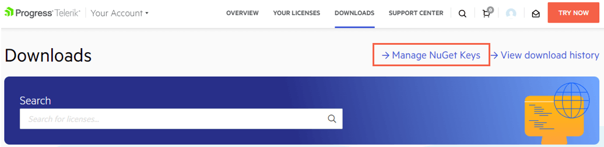

# Restoring NuGet Packages in Your CI Workflow

This article provides an overview of the most popular approaches for using token-based authentication to restore Telerik NuGet packages in your CI (Continuous Integration) workflow.

The Telerik NuGet server allows you to authenticate by using two methods:

* Basic authentication by providing your Telerik user name and password.
* Token-based authentication by providing a NuGet Key.

When you need to restore Telerik NuGet packages as part of your CI, using NuGet keys is the more secure way to authenticate. This method does not require you to provide your Telerik username and password anywhere in the CI workflow.

Unlike your Telerik credentials, a NuGet Key has a limited scope and can be used only with the Telerik NuGet server. If any of your NuGet keys is compromised, you can quickly delete it and create a new one.

## Generating NuGet Keys

1. Go to the [**Manage NuGet Keys**](https://www.telerik.com/account/downloads/nuget-keys) page in your Telerik account.

1. Select the **DOWNLOADS** tab and then **Manage NuGet Keys**.

    

1. To create a new key, select the **Generate New Key** button.

1. Enter a name for the NuGet Key, and then select **Generate Key**.

1. To copy the key, select **Copy and Close**. Once you close the window, you can no longer copy the generated key. For security reasons, the **NuGet Keys** page displays only a portion of the key.

    

## Storing a NuGet Key

> Never check in a NuGet Key with your source code or leave it publicly visible in plain text, for example, as a raw key value in a `nuget.config` file. A NuGet Key is valuable as bad actors can use it to access the NuGet packages that are licensed under your account. A potential key abuse could lead to a review of the affected account.

To protect the NuGet Key, store it as a secret environment variable. The exact steps depend on your workflow:

* In GitHub Actions, save the key as a GitHub Actions Secret. Go to **Settings** > **Security** > **Secrets** > **Actions** > **Add new secret**.

* In Azure DevOps Classic, save the key as a secret pipeline variable. Go to the **Variables** tab and then select **Pipeline variables**.

* In Azure DevOps YAML pipelines, save the key as a secret variable as well. Click the YAML editor's **Variables** button and complete the **New variable** form.

If you use Azure DevOps Service connection instead of secret environment variables, enter `api-key` in the username filed and the NuGet Key as the password in the **New NuGet service connection** form editor.

For more details on storing and protecting your NuGet Key, check the [Announcing NuGet Keys](https://www.telerik.com/blogs/announcing-nuget-keys) blog post by Lance McCarthy.

## Using a NuGet Key

There are two popular ways to use the Telerik NuGet server in a build:

* [Using a nuget.config file with your projects](#using-a-nugetconfig-file-with-your-projects)

* [Using only CLI commands](#using-only-cli-commands)

For more information on how to use NuGet keys in a build, check the [Announcing NuGet Keys](https://www.telerik.com/blogs/announcing-nuget-keys) blog post by Lance McCarthy.

### Using a nuget.config File with Your Projects

1. In your `nuget.config` file, set the `Username` value to `api-key` and the `ClearTextPassword` value to an environment variable name:

    ```xml
        <configuration>
        <packageSources>
            <clear/>
            <add key="nuget.org" value="https://api.nuget.org/v3/index.json" protocolVersion="3" />
            <add key="MyTelerikFeed" value="https://nuget.telerik.com/v3/index.json" protocolVersion="3"/>
        </packageSources>
        <packageSourceCredentials>
            <MyTelerikFeed>
            <add key="Username" value="api-key" />
            <add key="ClearTextPassword" value="%MY_API_KEY%" />
            </MyTelerikFeed>
        </packageSourceCredentials>
        ...
        </configuration>
    ```

1. Set the `MY_API_KEY` environment variable by using the value of your pipeline/workflow secret.

The exact steps to set the `MY_API_KEY` environment variable depend on your workflow. For more details, refer to the [Announcing NuGet Keys](https://www.telerik.com/blogs/announcing-nuget-keys) blog post by Lance McCarthy.

### Using Only CLI Commands

You can use the CLI `add source` (or `update source`) command to set the credentials of a package source. This CLI approach is applicable if your CI system doesn't support default environment variable secrets or if you do not use a custom `nuget.config`.

* To set the credentials in Azure DevOps:

    ```
    dotnet nuget add source 'MyTelerikFeed' --source 'https://nuget.telerik.com/v3/index.json' --username 'api-key' --password '$(TELERIK_NUGET_KEY)' --configfile './nuget.config' --store-password-in-clear-text
    ```

* To set the credentials in GitHub Actions:

    ```
    dotnet nuget add source 'MyTelerikFeed' --source 'https://nuget.telerik.com/v3/index.json' --username 'api-key' --password '${{ secrets.TELERIK_NUGET_KEY }}' --configfile './nuget.config' --store-password-in-clear-text
    ```

## Additional Resources

If you just start using the Telerik NuGet server in your CI or inter-department workflows, check the two blog posts below. You will learn about the various use cases and find practical implementation details.

* [Azure DevOps and Telerik NuGet Packages](https://www.telerik.com/blogs/azure-devops-and-telerik-nuget-packages)

* [Announcing NuGet Keys](https://www.telerik.com/blogs/announcing-nuget-keys)

## See Also

* [Set Up Private NuGet Feed for Azure](https://docs.telerik.com/aspnet-core/knowledge-base/setup-private-nuget-feed-azure)

* [Including Client-Side Resources]()

* [Scaffolding the Telerik UI for ASP.NET MVC Project]()
