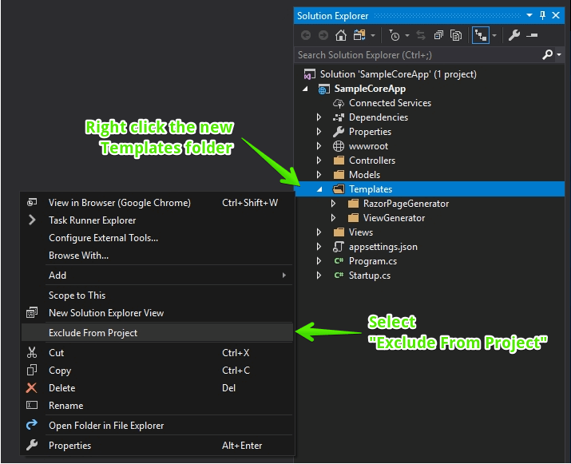
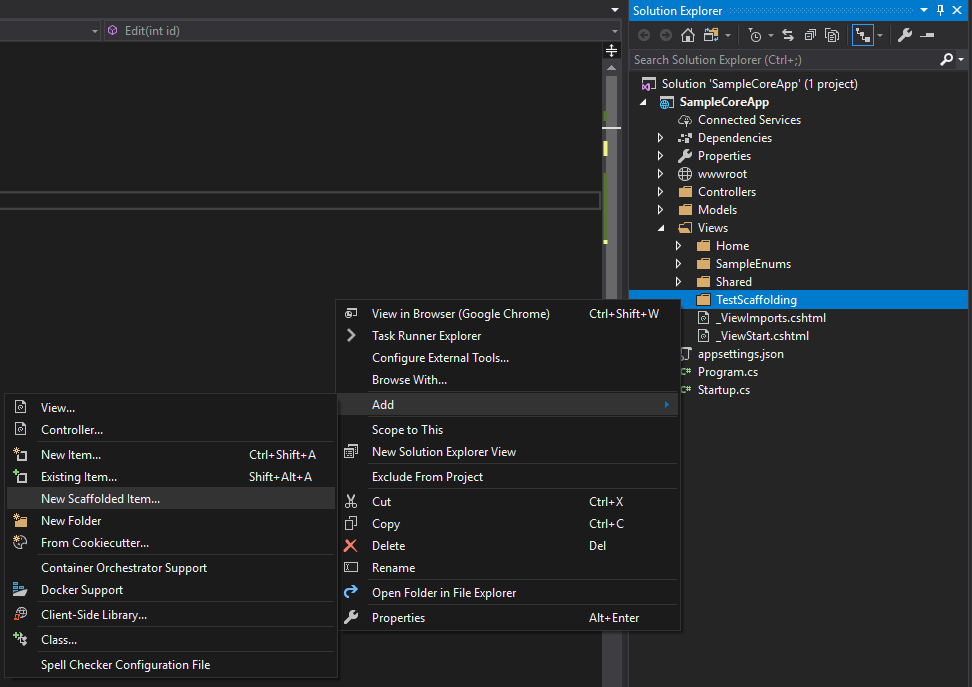
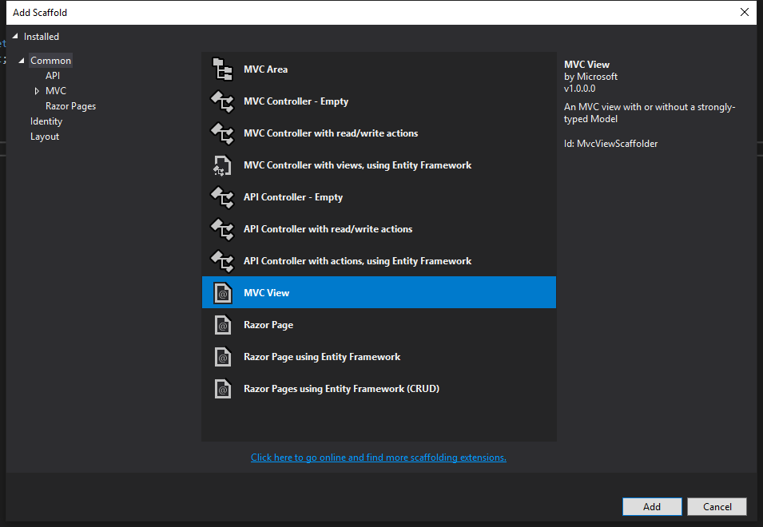
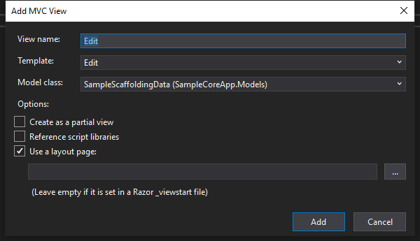

# Scaffolding

As of the R1 2019 release, Telerik UI for ASP.NET Core provides **Scaffold templates**.

ASP.NET Scaffolding is a code generation framework for ASP.NET Web applications. Telerik UI for ASP.NET Core makes use of this framework and offers Scaffold templates that aim to accelerate and ease the process of building an application for both Razor Pages and MVC.


## Prerequisites

Install and set up Telerik UI for ASP.NET Core in your project by either of the following ways:
* [Use Visual Studio](https://docs.telerik.com/aspnet-core/getting-started/getting-started)
* [Use the CLI](https://docs.telerik.com/aspnet-core/getting-started/getting-started-cli)

## Installation

To install the UI for ASP.NET Core Scaffolding templates and extensions in your project:

1. Clone or download the [https://github.com/telerik/scaffold-templates-core](https://github.com/telerik/scaffold-templates-core) repository.
1. Copy the `Templates` folder from the `scaffold-templates-core` repository to the root of your project.
1. Exclude the `Templates` folder from the project to avoid its compilation when you build the application. To exclude the repository, use either of the following approaches:

    * Add the following lines directly to the project file.

        ```.csproj
          <ItemGroup>
            <Compile Remove="Templates\**" />
            <Content Remove="Templates\**" />
            <EmbeddedResource Remove="Templates\**" />
            <None Remove="Templates\**" />
          </ItemGroup>
        ```

    * Use the Visual Studio interface.

        

As of the 2019 R1 release, the **Create New Project Wizard** that comes with the Telerik UI for ASP.NET Core [Visual Studio Extensions](https://docs.telerik.com/aspnet-core/vs-integration/introduction), automatically creates the `Templates` folder in the root of the application. For more information on the wizard, refer to the article on [creating projects](https://docs.telerik.com/aspnet-core/vs-integration/new-project-wizard).

> As of .NET Core 2.2, the Bootstrap 3 content goes to the `ViewGenerator_Versioned\Bootstrap3\` directory, whereas the Bootstrap 4 content goes to the `ViewGenerator\` directory. If you are upgrading your project, make sure to update the folder's name.

## Telerik UI Scaffold Templates

The Telerik UI Scaffold Templates produces the code for `Razor View`, `RazorPage` and `Controller` files based on an existent C# class. To add a Scaffold template:

1. Right-click either the project or a folder within the project, and select **Add** > **New Scaffolded Item...** as shown in the following image.

    

1. From the **Add Scaffold** window, select the type of scaffold to add.

    

1. Set the View properties (name, template, and model to match the code you already have) and click **Add**. For example, an `Edit` view for the `SampleScaffoldingData` model.

    

As a result, in your project you have an output that is similar to the following code. You can also use the sample class and controller to test the behavior with dummy data instead of actual models.

```Model
using System;
using System.Collections.Generic;
using System.ComponentModel.DataAnnotations;
using System.Linq;
using System.Threading.Tasks;

namespace SampleCoreApp.Models
{
	public class SampleScaffoldingData
	{
		public string SingleLineString { get; set; }
		[DataType(DataType.MultilineText)]
		public string MultiLineString { get; set; }
		public int SomeNumber { get; set; }
		public DateTime SomeDate { get; set; }
		public bool SomeBoolean { get; set; }
	}
}
```
```View
@model SampleCoreApp.Models.SampleScaffoldingData

@{
    ViewData["Title"] = "Edit";
}

<h1>Edit</h1>

<h4>SampleScaffoldingData</h4>
<hr />
<div class="row">
    <div class="col-md-4">
        <form asp-action="Edit" id="SampleScaffoldingDataForm">
            <div asp-validation-summary="ModelOnly" class="text-danger"></div>
            <div class="form-group">
                <label asp-for="SingleLineString"></label>
                <input asp-for="SingleLineString" class="k-textbox" />
                <span asp-validation-for="SingleLineString" class="text-danger k-invalid-msg" data-for="SingleLineString"></span>
            </div>
            <div class="form-group">
                <label asp-for="MultiLineString"></label>
                <textarea asp-for="MultiLineString" class="k-textbox"></textarea>
                <span asp-validation-for="MultiLineString" class="text-danger k-invalid-msg" data-for="MultiLineString"></span>
            </div>
            <div class="form-group">
                <label asp-for="SomeNumber"></label>
                <kendo-numerictextbox for="SomeNumber" />
                <span asp-validation-for="SomeNumber" class="text-danger k-invalid-msg" data-for="SomeNumber"></span>
            </div>
            <div class="form-group">
                <label asp-for="SomeDate"></label>
                <kendo-datetimepicker for="SomeDate" />
                <span asp-validation-for="SomeDate" class="text-danger k-invalid-msg" data-for="SomeDate"></span>
             </div>
            <div class="form-group">
                @Html.Kendo().CheckBoxFor(m => m.SomeBoolean)
                <label asp-for="SomeBoolean"></label>
                <span asp-validation-for="SomeBoolean" class="text-danger k-invalid-msg" data-for="SomeBoolean"></span>
            </div>
            <div class="form-group">
                <input type="submit" value="Save" class="k-button k-primary" />
            </div>
        </form>
    </div>
</div>

<div>
    <a asp-action="Index" class="k-button">Back to List</a>
</div>
```
```Controller
using System;
using System.Collections.Generic;
using System.Linq;
using System.Threading.Tasks;
using Microsoft.AspNetCore.Http;
using Microsoft.AspNetCore.Mvc;
using SampleCoreApp.Models;

namespace SampleCoreApp.Controllers
{
    public class TestScaffoldingController : Controller
    {
		// The rest of the controller is omitted for brevity

        // GET: TestScaffolding/Edit/5
        public ActionResult Edit(int id)
        {
			SampleScaffoldingData sampleData = new SampleScaffoldingData() {
				MultiLineString = string.Format("{0}\n{1}", id, id + 1),
				SingleLineString = id.ToString(),
				SomeBoolean = id % 3 == 0,
				SomeDate = DateTime.Now,
				SomeNumber = id
			};

			return View(sampleData);
        }
    }
}
```

For general information about Scaffolding, refer to the following resources by Microsoft:

- [Add a model to an ASP.NET Core MVC app](https://docs.microsoft.com/en-us/aspnet/core/tutorials/first-mvc-app/adding-model?view=aspnetcore-2.1)
- [Add a model to a Razor Pages app in ASP.NET Core](https://docs.microsoft.com/en-us/aspnet/core/tutorials/razor-pages/model?view=aspnetcore-2.1)


> The Scaffolding generates templates based on C# classes. They are different from the editor templates that are used for editing by widgets such as the Grid, for example. The editor templates are located in your installation folder at `C:\Program Files (x86)\Progress\Telerik UI for ASP.NET Core <your version>\wrappers\aspnetcore\EditorTemplates`.

## See Also

* [First Steps on Visual Studio for Windows (Online Guide)]()
* [First Steps on Visual Studio for Mac (Online Guide)]()
* [First Steps with CLI (Online Guide)]()
* [Official .Net Documentation on Scaffolding](https://github.com/aspnet/Scaffolding)
* [Default ASP.NET Scaffolding Templates](https://github.com/aspnet/Scaffolding/tree/master/src/VS.Web.CG.Mvc/Templates)
* [Telerik UI for ASP.NET Core Scaffolding Templates](https://github.com/telerik/scaffold-templates-core)
* [How to add a model to an ASP.NET Core MVC app (Microsoft Tutorial)](https://docs.microsoft.com/en-us/aspnet/core/tutorials/first-mvc-app/adding-model?view=aspnetcore-2.1)
* [How to add a model to a Razor Pages app in ASP.NET Core (Microsoft Tutorial)](https://docs.microsoft.com/en-us/aspnet/core/tutorials/razor-pages/model?view=aspnetcore-2.1)
