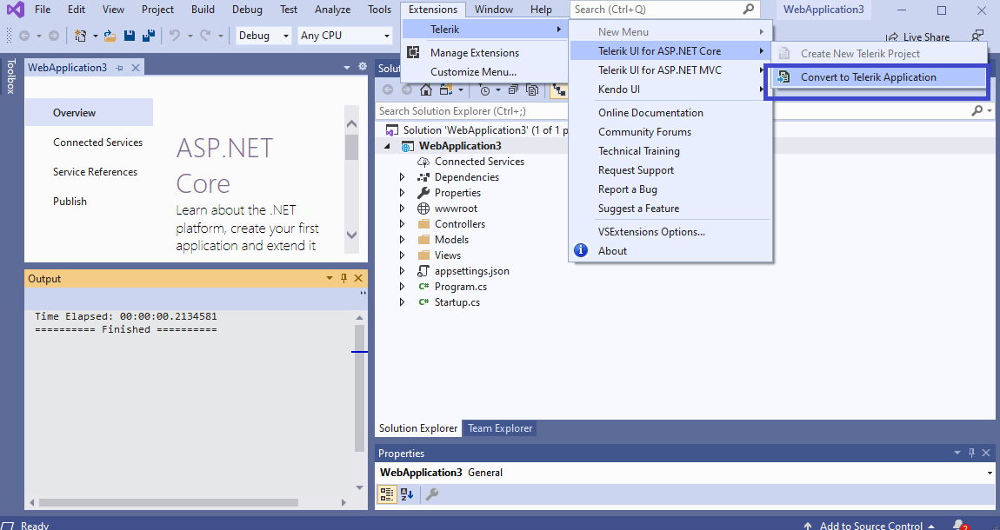
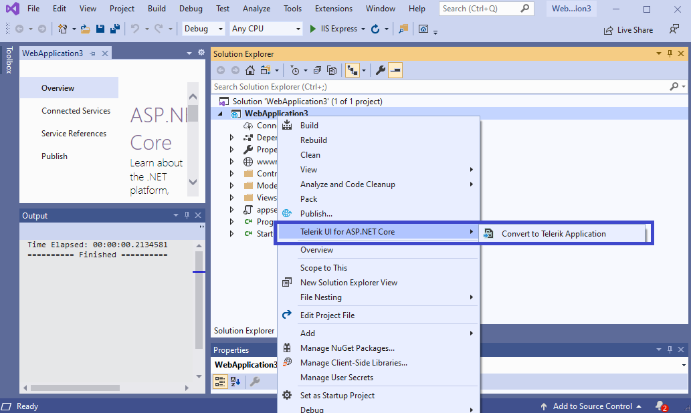
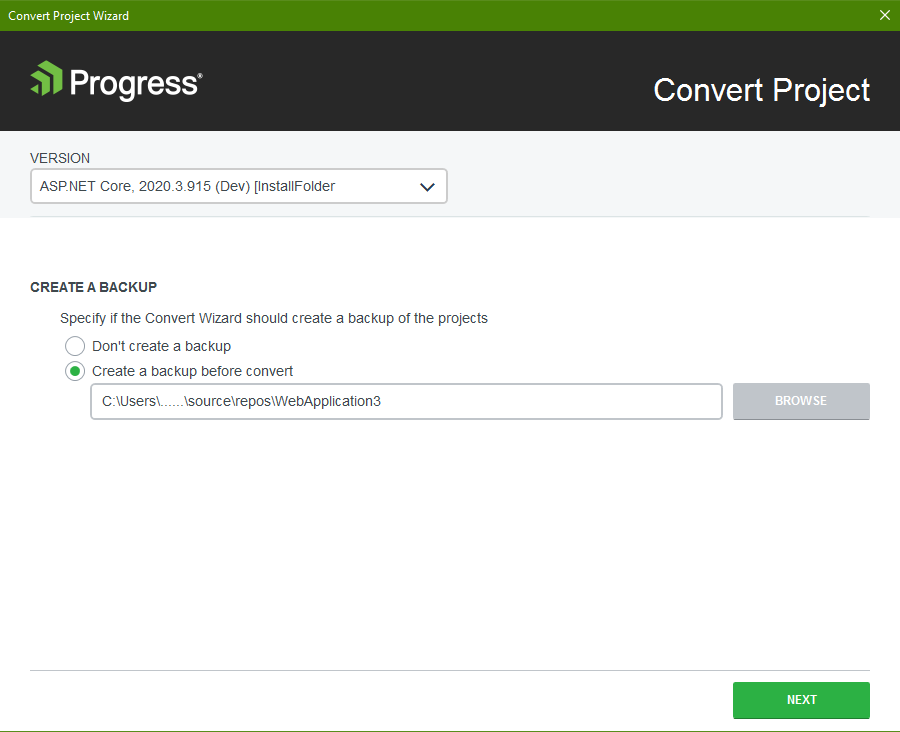
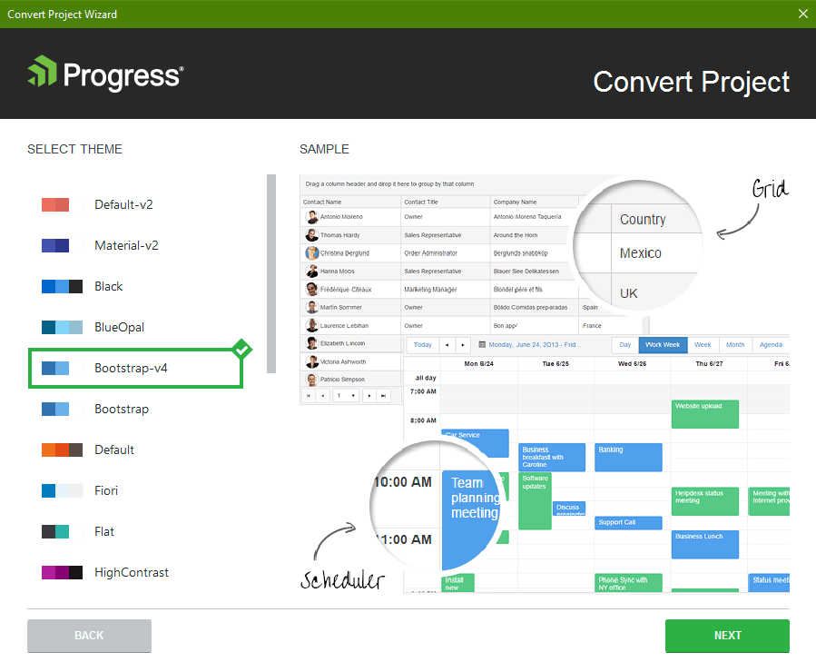
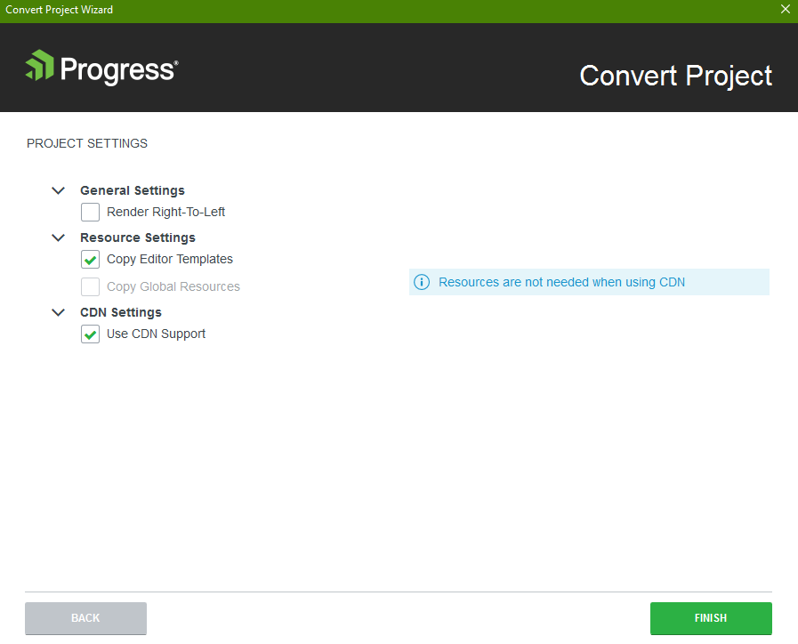

# Converting Projects

Enhance existing ASP.NET Core applications with Telerik UI Components such as [Grid, Chart, DropDownList, etc.](https://demos.telerik.com/aspnet-core) with just a few mouse clicks. The Convert Wizard does the necessary NuGet packages and resources setup for you and once completed you can directly reference specific release version of Telerik UI for ASP.NET Core components to your app.

## Get the Wizard

To use the **Convert Project Wizard**, install the Telerik UI for ASP.NET Core Visual Studio Extensions. You can get them from the:

- [Visual Studio MarketPlace](https://marketplace.visualstudio.com/items?itemName=TelerikInc.TelerikASPNETCoreVSExtensions) (for Windows) 
- **Telerik UI for ASP.NET Core automated installer** - from the `Downloads` tab of your [Telerik.com account](https://www.telerik.com/account/product-download?product=UIASPCORE) choose the [.msi (for Windows)]() or .pkg (for Mac) installer.

## Start the Wizard

- You can start the **Convert Project Wizard** from the Extensions menu at the top. In Visual Studio 2019 click **Extensions** > **Telerik** > **Telerik UI for ASP.NET Core** > **Convert to Telerik Application**.

- Alternatively you could use the context menu in the **Solution Explorer**

1. In the **Solution Explorer**, select the ASP.NET Core app you want to convert to Telerik Application.
1. Right click the project file and select **Telerik UI for ASP.NET Core** > **Convert to Telerik Application**.
1. Follow the wizard.

The conversion wizard provides the following steps:  
- [Version selection](#distribution-selection)
- [Theme selection](#theme-selection)
- [Project settings](#project-settings)

## Version Selection

The distribution selection allows you to choose the version of the Telerik UI for ASP.NET Core you want to use.
	

## Theme Selection

The theme selection allows you to choose from large list of professionally styled built-in themes for your Telerik UI for ASP.NET Core application.

## Project Settings

The **Project Settings** page enables you to modify the project settings by configuring the following options:

- **Render Right-To-Left**&mdash;Updates the master page with the Right-to-left support class and adds CSS reference for RTL styles.
- **Copy Editor Templates**&mdash;Copies the predefined editor templates to `~/Views/Shared/EditorTemplates`. Existing editor templates will be overwritten.
- **Copy Global Resources**&mdash;Copies the localization files to `~/Scripts/kendo/{version}/cultures`.
- **Use CDN Support**&mdash;Enables or disables the [Kendo UI CDN support](https://docs.telerik.com/kendo-ui/intro/installation/cdn-service).

The wizard automates several steps for you, that you can also perform manually. To get a better understanding of what the wizard  does for you, see either of the following links:

- [Adding the NuGet Package](#adding-the-nuget-package)
- [Set JSON Serialization for ASP.NET Core 2 or 3]() 
- [Add reference to Kendo.MVC.UI](#adding-reference-to-kendomvcui)
- [Including the client-side resources](#including-the-telerik-ui-for-aspnet-core-client-side-resources)

## See Also

* [Installing UI for ASP.NET Core with Bower]()
* [Installing UI for ASP.NET Core by Using the CDN Services]()
* [Installing UI for ASP.NET Core with NPM]()
* [Installing UI for ASP.NET Core with NuGet]()
