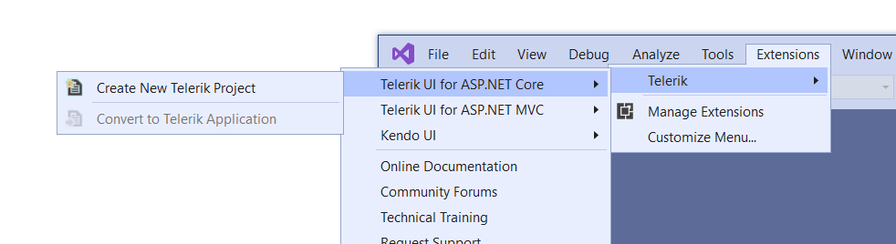
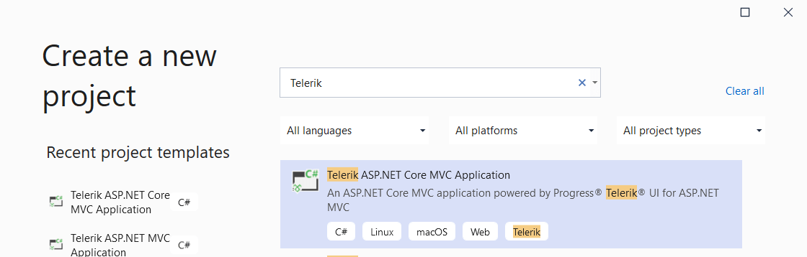
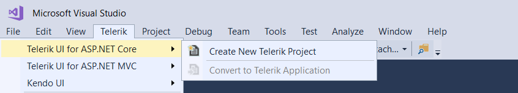
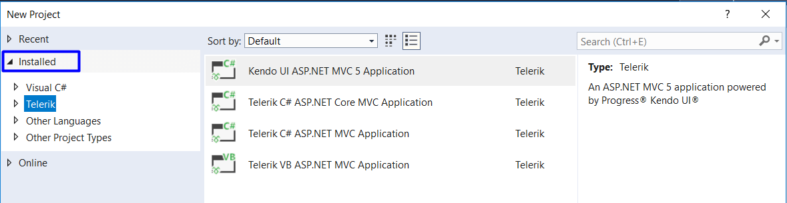

# Visual Studio Integration Overview

The {{ site.product_long }} Visual Studio (VS) Extensions enhance the experience in developing MVC web applications with {{ site.product }}.
The VS Extensions come with handy templates that ease the creation of new projects. They also help you to add {{ site.product_short }} to an existing project or to upgrade the {{ site.product_short }} version.
The {{ site.product_short }} VS extensions support VS 2017 and 2019 and are distributed with the {{ site.product }} installer.

### Benefits

The VS Extensions help you to increase your productivity by delivering the following:

* Fully configured templates for new projects that include the required package references and client-side resources
* **Convert Project Wizard** that can turn any existing project to a complete Telerik application with everything necessary to run {{ site.product_short }}
* {{ site.framework }} version and target framework selection
* {{ site.product_short }} version selection
* An option to download the latest {{ site.product_short }} version without exiting the **Project Wizard**
* An HTMLHelper and a TagHelper version for every template project
* Selection of CDN support or local copy the client-side resources for converted projects
* Theme selection and preview ensures only the necessary CSS files are included

## Installation

There are two ways to install the VS Extensions: 

### Install from Visual Studio Marketplace

Go to the [`{{ site.product_long }} Extension`](https://marketplace.visualstudio.com/items?itemName=TelerikInc.TelerikASPNETCoreVSExtensions) page and click **Download**. When the download is complete, navigate to the download folder and click on the downloaded file `TelerikUI.ASP.NET.Core.VSPackage.vsix` to install the extensions.

### Install in Visual Studio

1. Launch Visual Studio
1. Select **Extensions** from the menu at the top (in Visual Studio 2017 it is **Tools**)
1. Press **Manage Extensions** from the drop-down menu (in Visual Studio 2017 - **Extensions and Updates**)
1. Click **Online** to the left and select **Visual Studio Marketplace**
1. Enter `Telerik {{ site.framework }} VSExtensions` in the **Search** text box
1. Select the extension and click **Download**
1. Visual Studio will apply the changes automatically when all Microsoft Visual Studio windows are closed

The **VSIX Installer** will handle any missing prerequisites in Visual Studio for you. Click **Modify** when the installer starts.

## Use the Telerik VS Extensions

There are two project wizards available:

1. [Create New Project Wizard]()
1. [Convert Project Wizard]()

### Steps for VS 2019 

- To access the VS extensions from the VS Toolbar go to **Extensions > Telerik > {{ site.product }}**. Choose from one of the two options -  **Create New Project** or **Convert to Telerik Application**.

    

- To access the template projects go to **File** > **New** > **Project** and search for `Telerik`.

    

### Steps for VS 2017

- To access the VS extensions from the VS Toolbar go to **Telerik > {{ site.product }}**. Choose from one of the two options -  **Create New Project** or **Convert to Telerik Application**.

    

- To access the template projects go to **File** > **New** > **Project** and click on **Installed** > **Telerik** or search for `Telerik` in the serach textbox on the right.

    

## Telerik UI for ASP.NET Core Settings

The Telerik UI for ASP.NET Core VS Extensions settings can be found in the standard options dialog in Visual Studio under the Telerik node.

## See Also

* [Creating New Projects with Visual Studio]()
* [Converting Existing Projects with Visual Studio]()
* [Downloading the Latest Telerik UI for ASP.NET Core Versions]()
