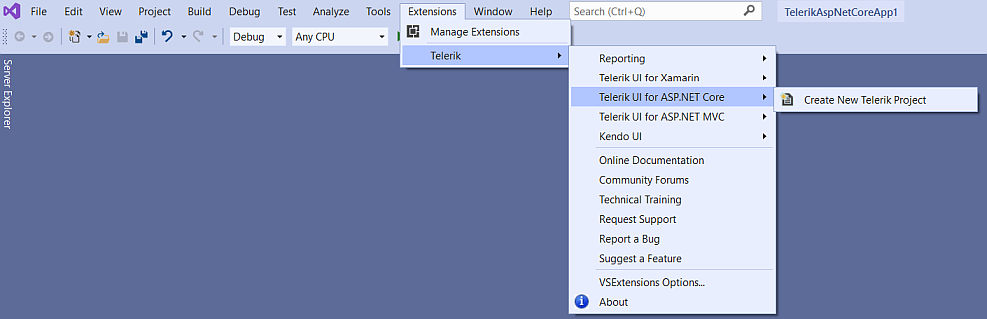

# Visual Studio Integration Overview

The Progress&reg; Telerik&reg; UI for ASP.NET Core Visual Studio (VS) Extensions enhance the experience in developing MVC web applications with Telerik UI for ASP.NET Core. This document describes how to locate the Telerik extensions in VS 2017 and 2019.

The Telerik UI for ASP.NET Core VS extensions support VS 2017 and 2019 and are distributed with the Telerik UI for ASP.NET Core installer. Before you can use them, you must download and run the [installer](#download).

The VS extensions offer the following benefits:

* They include Project Templates.

* They handle the [creation of projects](#configuration-Create) and the related configuration, references, and web.config modifications.

* They help you to keep your project up to date with the new Telerik UI for ASP.NET Core versions.

## Visual Studio 2019

To access the VS extensions in VS 2019, use the **Extensions | Telerik | Telerik UI for ASP.NET Core** menu on the VS 2019 **Menu bar**. Select **Create New Telerik Project** to add the project template.

For more information about the **Create New Project Wizard**, see [Creating New Projects](#setting-up-the-project).

## Visual Studio 2017

To access the VS extensions in VS 2017, use the **Telerik | Telerik UI for ASP.NET Core** menu on the VS 2017 **Menu bar**.

To add the project template, select it from the drop-down list of options. As a result, the added project template becomes available in the language-specific nodes of the dialog as well. Under the **CSharp\Web** node, the **Add New Project** dialog contains the Telerik UI for ASP.NET Core web application.

For more information about the **Create New Project Wizard**, see [Creating New Projects](#setting-up-the-project).

## See Also

* [Creating New Projects with Visual Studio]()
* [Downloading the Latest Telerik UI for ASP.NET Core Versions]()
