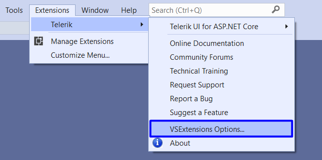
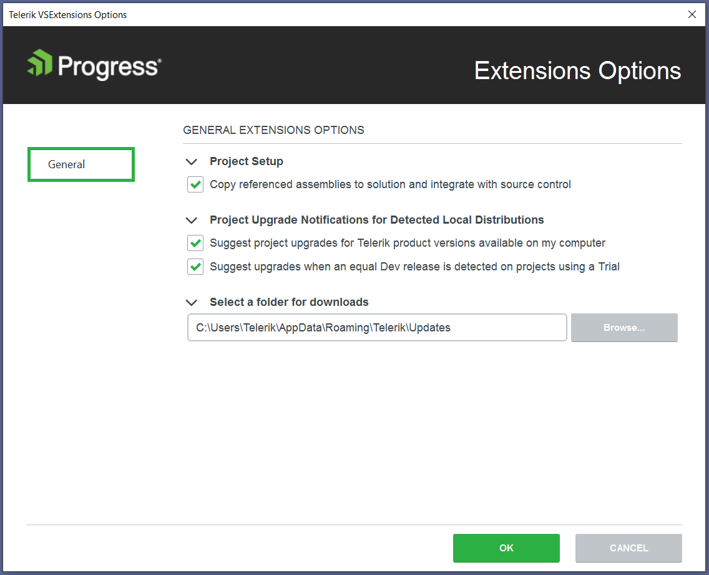

# Visual Studio Extension Options

The Visual Studio (VS) **Extensions Options** dialog provides settings, allowing you to configure the Progress&reg; Telerik&reg; UI for {{ site.framework }} VS Extensions to best suit the  needs of your projects.

It can be accessed by clicking on **Extensions** > **Telerik** > **VSExtensions Options**.

The **Extensions Options** dialog contains two sets of options that affect the {{ site.product }} VS Extensions.

## General Settings

The settings under the General category affect all of the installed {{ site.product }} VS Extensions.

### Project Setup

Set the default value for the **Copy referenced assemblies to solution** option in the Project Configuration Wizard through **Copy referenced assemblies to solution and integrate with source control**.

### Project Upgrade Notifications

Set the project upgrade notifications for detected local distributions by using the options under the **Project Upgrade Notifications for Detected Local Distributions**:

- **Suggest project upgrades for Telerik product versions available on my computer**&mdash;When enabled, you are prompted to upgrade upon opening a project, which is not using the latest version of Telerik products installed on your system.
- **Suggest upgrades when an equal Dev release is detected on projects using a Trial**&mdash;When enabled, you are prompted to upgrade if a licensed version is available on your system, but the current project uses a trial version.

### Download Folder Selection

- **Select a folder for downloads**&mdash;Configures the path where the extensions look for and store distributions.

> Changing the folder path does not move existing folder contents from your previous path. Move your previous folder contents manually if you still want to use them.

## See Also

* [Integrating Visual Studio in Your .Net Project]()
* [Downloading the Latest Telerik UI for ASP.NET Core Versions]()
