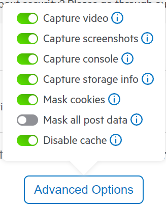

## Fiddler Jam Overview

[Fiddler Jam](https://www.telerik.com/fiddler-jam) is a Telerik tool designed to facilitate the information exchange between the support and end-user. It allows the end-user user to easily create a capture log, which can provide a lot of valuable information to the support team:
* Console logs and errors
* Network requests
* Local and Session Storage logs
* Video recording and screenshots


### Installing Fiddler Jam

You can download and install the Fiddler Jam Chrome extension from [Chrome Web Store page for Fiddler Jam](https://chrome.google.com/webstore/detail/fiddler-jam/fnkjlegmkbicdodlheligomlfbdblpfj). More information on how to install the extension, you can find in the [Fiddler Jam Extension Installation](https://docs.telerik.com/fiddler-jam/extension/installation) article. 


### Fiddler Jam Installation

The Fiddler Jam Chrome extension is available from [Chrome Web Store page for Fiddler Jam](https://chrome.google.com/webstore/detail/fiddler-jam/fnkjlegmkbicdodlheligomlfbdblpfj). You can find more information on how to install the extension in the [Fiddler Jam Extension Installation](https://docs.telerik.com/fiddler-jam/extension/installation) article. 


## Capturing a log


Once you have installed the Fiddler Jam browser extension, you can start capturing your issue and send it to the support team. 

Detailed capturing instructions are available in [Fiddler Jam extension - Recording a log](https://docs.telerik.com/fiddler-jam/extension/recording-a-log). Below you can see a short video demonstrating the Install and Capture process. In addition, summarized instructions for capturing a log are available after the video.

After the Fiddler Jam browser extension is installed, you can start capturing your issue and send it to the support team. 

More detailed instruction on capturing are available in [Fiddler Jam extension - Recording a log](https://docs.telerik.com/fiddler-jam/extension/recording-a-log). Below you can find a short video demonstrating the Install and Capture process. For convenience, summarized instructions to follow when capturing a log are available after the video.


<iframe width="560" height="315" src="https://www.youtube.com/embed/AegKWavRSv0" title="YouTube video player" frameborder="0" allow="accelerometer; autoplay; clipboard-write; encrypted-media; gyroscope; picture-in-picture" allowfullscreen></iframe>

1. Navigate to <a href="about:blank" target="_blank">about:blank</a> or an empty page to ensure a clean capture.
2. Open the Fiddler Jam extension (the default shortcut is `Ctrl+Shift+F`).
3. Configure the options from the `Advanced Options` button (located above the `Start Capture` button):
   * Ensure that the `Mask Post Data` switch is `disabled`, if reproducing the issue triggers a postback or a POST request.
   * Ensure that the `Capture video` is `enabled`. This will provide more details and context in the capture.
           
4. Click the `Start Capture` button.
5. Navigate to your page (for example, `https://mydomain.com/mypagewithissue`) in the same tab. In case you started the capture from your `https://mydomain.com/mypagewithissue` page instead of a blank page, follow the steps below to ensure a proper capture.
   1. Click the address bar.
   2. Press `Enter` to navigate.
    > The page refresh must be from navigating to the page, otherwise the browser will use the requests from its cache and will not include them in the capture.
6. Reproduce or observe the issue.
7. Once the issue is replicated, open the extension again (shortcut `Ctrl+Shift+F`) and click the `Stop Capture` button.
8. Proceed to [Submitting a log](#submitting-a-log)

## Submitting a log

1. *Optional* Toggle the `Password Protection` switch and enter a password. The requirements are: min 8 characters, 1 uppercase leter, 1 lowercase letter, 1 number.
1. Click the `Get Link` button.
1. Copy the generated link and share it in the support ticket.

## See Also

* [Fiddler Jam product page](https://www.telerik.com/fiddler-jam)
* [Fiddler Jam documentation](https://docs.telerik.com/fiddler-jam/introduction)
* [Improve Your Debugging Skills with Chrome DevTools blog](https://www.telerik.com/blogs/improve-your-debugging-skills-with-chrome-devtools)
* [Fiddler Jam Security](https://docs.telerik.com/fiddler-jam/security)
