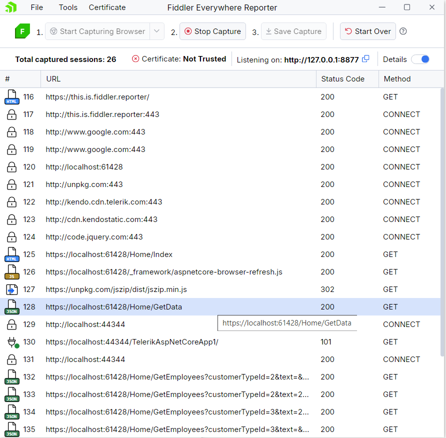
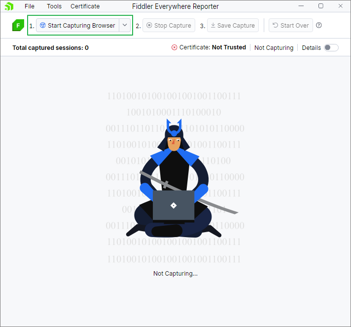
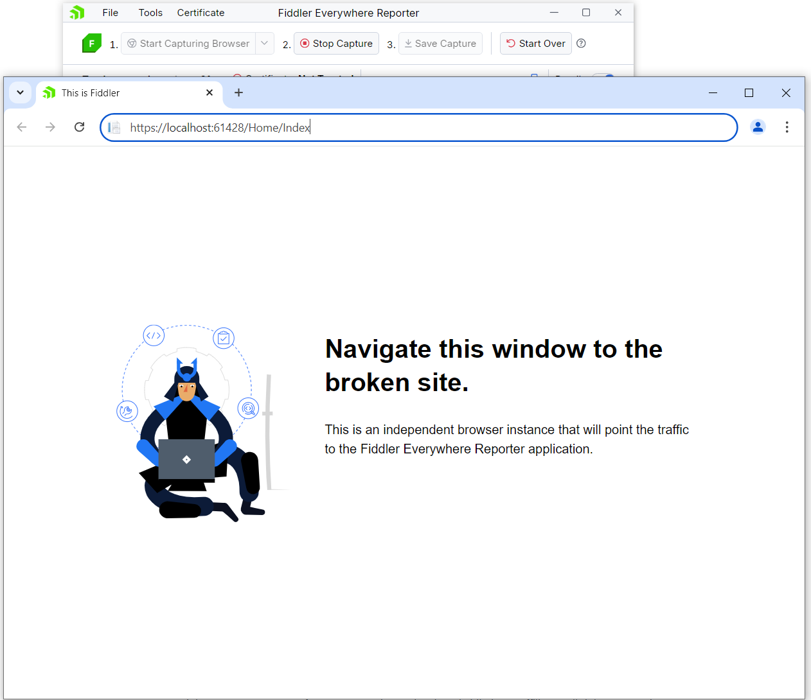
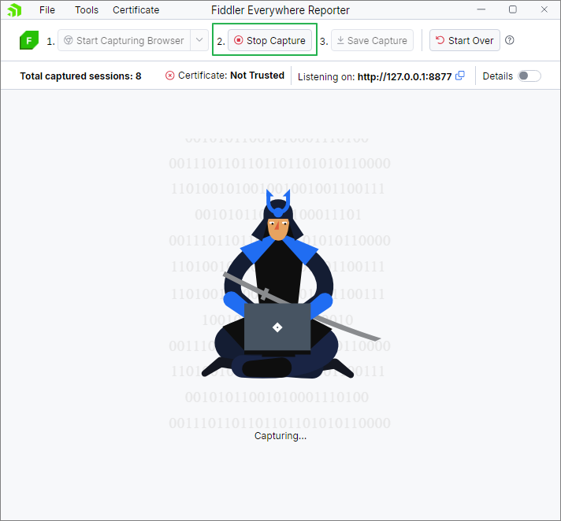
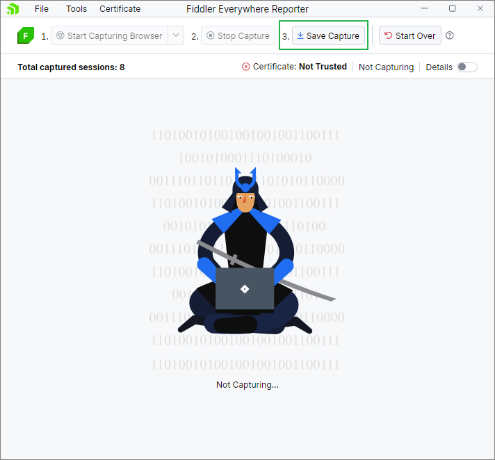
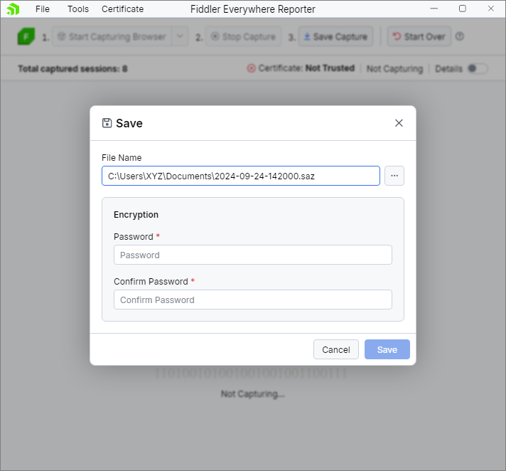

## Environment

<table>
 <tr>
  <td>Supported Browsers:</td>
 </tr>
 <tr>
  <td>Google Chrome</td>
 </tr>
 <tr>
  <td>Microsoft Edge (Chromium)</td>
 </tr>
</table>

## Description

**Fiddler Everywhere Reporter** is an extension tool of [Fiddler Everywhere](https://docs.telerik.com/fiddler-everywhere/introduction) that aims to capture web traffic on the end user's machine and share the log with a user holding an active license for Fiddler Everywhere. 

The captured logs can be analyzed to learn about error messages, malformed requests, currently loaded web resources (for example, JavaScript, CSS style sheets) and more. This can greatly help in troubleshooting issues related to the UI.

## Solution

The Fiddler Everywhere Reporter is a free portable tool requiring NO login or licenses and no installation. 

The Reporter tool has a 3-step usage flow: **Start Capture**, **Stop Capture** and **Save Capture**.

To reset the flow at any point, use the [Start Over](#start-over) button which will delete all captured requests and enable a new capture process.

### Short Instructions

You can follow the short instructions in this section below, or visit the [Start Capture](#start-capture), [Stop Capture](#stop-capture) and [Save Capture](#save-capture) dedicated sections for more details.

**1.** Start the capture using the default option. This will open a Google Chrome or Microsoft Edge (Chromium) instance.

**2.** Within this browser instance, navigate to the web page in question and interact with the page to replicate the issue.

The port number shown in the screenshot above is exemplary.

**3.** When done, click on Stop Capture.

**4.** Finally, click on Save Capture then share this with us. At this point you can password protect the captured logs if you wish and share the password along with the logs.

Detailed sections:

 1. [Start Capture](#start-capture)
 2. [Stop Capture](#stop-capture)
 3. [Save Capture](#save-capture)
 4. [Notes](#notes)

### Start Capture

There are 4 ways for capturing traffic that can be triggered from the button or the dropdown options:

- Start Capturing Browser (Default action)
- Start Capturing Everything
- Start Capturing Terminal
- Manual Setup (Advanced)

**Start Capturing Browser (Default action)**

The Capture Browser option allows capturing of traffic from a `sandboxed` browser instance. As a result, Fiddler Everywhere Reporter starts a pre-configured independent browser instance to respect the Fiddler proxy and to trust its Root Certificate Authority (CA). The `HTTPS` traffic generated will appear in Fiddler Everywhere Reporter. 

Currently, the tool supports independent browser capturing only for **Chrome** and **Edge** browsers. If both exist on the machine, Chrome will be opened by default. A change to the default browser is possible from Tools > Default Browser. Restart the application for the changes to take effect. 

If neither Chrome and Edge aren’t installed on the machine, the tool will display an error message.

>important Users on Mac need to manually quit the browser instance from the dock even after the Fiddler Everywhere reporter tool is closed.

This option is available (enabled) if:
- There aren't active capturing processes.
- There aren't any captured requests.

**Start Capturing Everything**

The Capture Everything option will log all HTTP, HTTPS, WebSocket, SSE, and gRPC traffic between the computer and the Internet. It works by setting the system proxy and will capture all incoming and outgoing traffic from any application that supports a proxy - browsers, desktop applications, CLI tools, and others. This option requires installing and trusting the Fiddler Root Certificate Authority (CA) in the operating system.

Upon first trigger of this capturing mode, a dialog will prompt the user to install and trust the Fiddler CA, to configure the option and enable capturing of HTTPS traffic. After providing credentials, traffic will start generating in Fiddler Everywhere Reporter. Closing the Reporter will not clean up the certificate configuration, and the next time you open the tool the settings will be persisted. You can reset this option from the Tools menu -> Remove Root Certificate. A status message about the certificate's current state will always be displayed in the upper right corner.  

>important If using a VPN, the Fiddler Everywhere Reporter will not be able to capture any traffic. Try using one of the other approaches for capturing traffic.

This option is available (enabled) if:
- There are no currently active capturing processes.
- There are not any captured requests.

**Start Capturing Terminal**

The Capture Terminal option will launch a new, clean terminal instance, and route traffic only from this instance through Fiddler Everywhere Reporter. It will open PowerShell on Windows and the default Terminal on Mac. The option currently supports capturing traffic from cURL, Node.js and Python out of the box. If you need to capture traffic from .NET applications, it is required to manually install and trust the Fiddler Root Certificate Authority (you can find these options in the Tools menu). The terminal capturing mode allows using the proxy in a sandboxed environment without changing the global OS proxy settings.

>important Users on Mac need to manually quit the terminal instance from the dock even after the Fiddler Everywhere Reporter tool is closed.

This option is available (enabled) if:
- There are no currently active capturing processes.
- There are not any captured requests.

**Manual Setup (Advanced)**

When this mode is selected, Fiddler Everywhere Reporter will start listening on the port printed next to the “Details” label. The address can be copied and used to specify the proxy registry setting of your application and manually configure it to send incoming and outgoing traffic to Fiddler Everywhere Reporter. In addition, the Fiddler Root Certificate needs to be trusted from the Tools menu or manually exported and trusted.

This option is available (enabled) if:
- There are no currently active capturing processes.
- There are not any captured requests.

### Stop Capture

After reproducing the problem, the capturing can be terminated with the Stop Capture button on Step 2.
This will close the open port, remove the system proxy (if set) and stop capturing new requests.

This option is available (enabled) if:
- If there is an active capturing process.

### Save Capture

To save the generated requests, use the button on Step 3 - Save Capture. The button will open a save dialog, where users can enter file name and path.
A password encryption is required in order to save the file successfully. The end-user must provide the password to the team that will be reviewing the file later, to ensure it can be opened and analyzed successfully with Fiddler Everywhere.
Password must be at least 8 symbols.

This option is available (enabled) if:
- There are no currently active capturing processes.
- There is at least one captured session.

### Start Over

To restart the capture, use the Start Over button which will delete all captured requests and enable a new capture process.

This will stop the active capturing process and clear the captured requests.

This option is available (enabled) if:
- There is at least one captured session.

### Details (Advanced)

Details toggle button shows a grid with currently captured requests. In the grid, users can select one or more requests and delete them.

## Notes

- In the Tools menu find additional options to manually Trust Root Certificate, Export Root Certificate and Remove Root Certificate.
- When there is no capturing happening, the UI will display a "Not Capturing" indication.
- While capturing is taking place, the label will change to "Capturing."
- To see the list with all captured requests, the end-user can switch on the "Details" toggle.
- To remove one or more of the captured requests before save, select the respective requests and right-click to remove.
- To check the current version, go to
  - File -> About (Windows)
  - Fiddler Everywhere Reporter -> About Fiddler Everywhere Reporter (Mac)
- To turn off anonymous analytics tracking, go to
  - File -> Privacy -> Automatically send data to help us improve the product (Windows)
  - Fiddler Everywhere Reporter -> Privacy -> Automatically send data to help us improve the product
