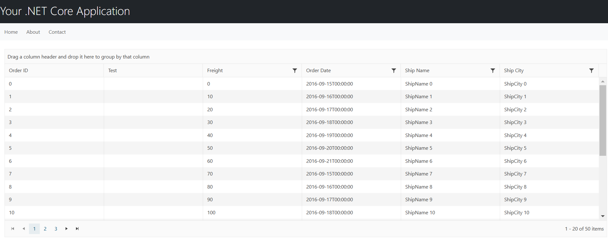
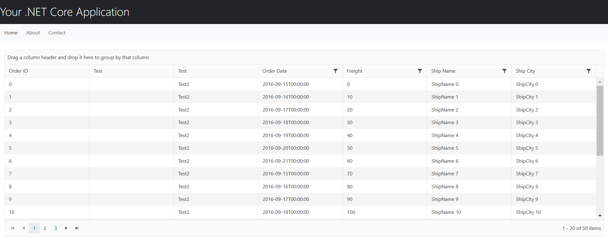
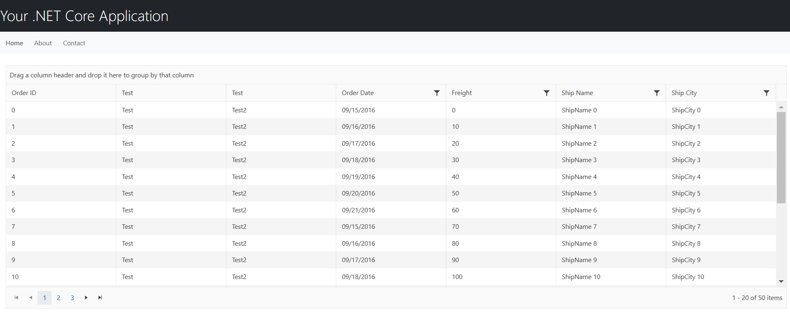

## Environment
<table>
<tbody>
<tr>
<td>Product</td>
<td>Progress® Telerik UI® Grid for ASP.NET Core</td>
</tr>
</tbody>
</table>

## Description
When deploying an ASP.NET Core MVC application using Telerik UI for ASP.NET Core Grid to Azure App Services after upgrading to .NET 9, a column bound with `Bound(null)` fails to render, showing an empty column instead. This issue does not occur when running the application locally or when using .NET 8.

The Grid has a column that binds to `null`, as per the example below:
```Razor
 columns.Bound(null).ClientTemplate("Test").Title("Test");
 ```

The column cells are empty when the application is deployed on an Azure environment that uses .NET 9:


## Cause

The issue itself probably stems from the <a href="https://github.com/dotnet/aspnetcore/issues?q=milestone%3A9.0.2%20is%3Aclosed%20label%3Aservicing-approved%20" target="_blank">breaking changes introduced with .NET 9</a>. More specifically, where fields are nullable by default.

Namely, the following pull request in the **aspnetcore** repository:
https://github.com/dotnet/aspnetcore/pull/59533

The Grid works locally but not in an Azure environment because the version of .NET 9 Azure is older and still has the bug. Your local machine is probably using the newer .NET SDK version 9.0.200.

## Solution

The `Bound(null)` syntax is not expected by default. Apparently, .NET 8 somehow let it slide until now. For more information on how to bind a Grid column to `null`, check out the following discussions:
- https://www.telerik.com/forums/how-do-i-bound-null-object-value
- https://stackoverflow.com/questions/74200047/support-null-columns-on-grid

 In some scenarios, you would want to have a non-defined field like `Bound(null)`. Use any of the following approaches to resolve the issue.

1. Utilize the `Template()` option to display the desired value:

```Razor
columns.Template("Test2").Title("Test");
```

As a result, the **Test2** column shows the specified value:


2. Ensure that your local development environment and Azure deployment environment use the same version of the .NET 9 SDK/ASP.NET runtime. If they differ, consider deploying your application as a self-contained deployment (SCD). This approach packages the .NET runtime with your application, ensuring the same runtime version is used both locally and in Azure.


By following any of these approaches, the Grid columns should be displayed as expected when deploying the ASP.NET Core MVC application to Azure App Services with .NET 9.



## See Also

* [Client-Side API Reference of the Grid for {{ site.framework }}](https://docs.telerik.com/kendo-ui/api/javascript/ui/grid)
* [Server-Side API Reference of the Grid for {{ site.framework }}](https://docs.telerik.com/{{ site.platform }}/api/grid)

* [Server-Side TagHelper API Reference of the Grid for {{ site.framework }}](https://docs.telerik.com/{{ site.platform }}/api/taghelpers/grid)

* [Telerik UI for {{ site.framework }} Breaking Changes]()
* [Telerik UI for {{ site.framework }} Knowledge Base](https://docs.telerik.com/{{ site.platform }}/knowledge-base)
