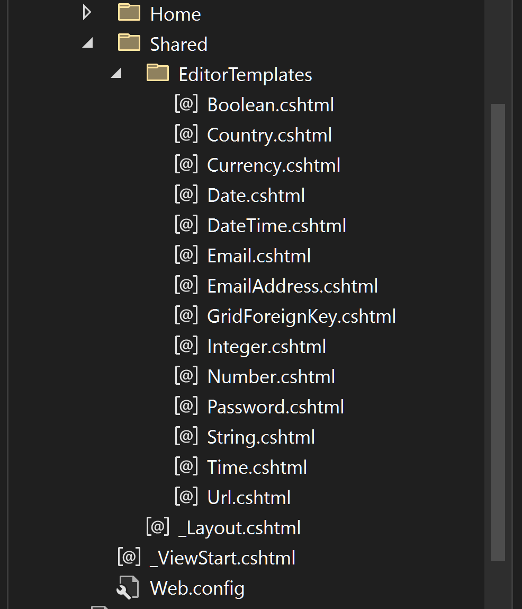
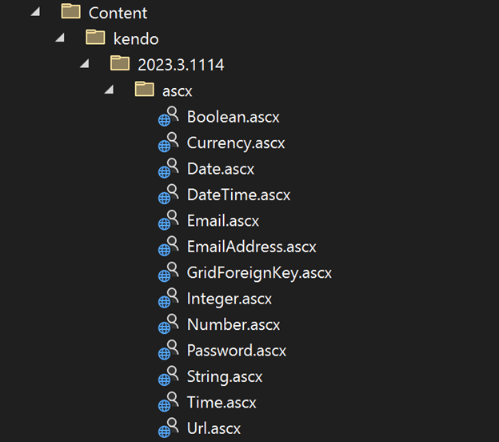

## Environment
<table>
	<tbody>
    <tr>
			<td>Product</td>
			<td>Progress® Kendo UI® Grid for ASP.NET MVC</td>
		</tr>
	</tbody>
</table>


## Issue

How can I enable the built-in Editor Templates of the Telerik Grid component? Why am I facing an error when upgrading the NuGet version of the Telerik UI for MVC toolset?

## Description

The editing templates of the Grid provide built-in capability to generate Telerik input components when a given row is opened in edit form. For string fields the generated input is of type Telerik TextBox for MVC, for date time fields - Telerik DateTimePicker and so on.

These Grid editing files look like this:

```HtmlHelper
@model DateTime?

@(Html.Kendo().DateTimePickerFor(m => m)
    .HtmlAttributes(new {
      title = Html.ViewContext.ViewData.TemplateInfo.GetFullHtmlFieldName("")
    }
))
```

And they are automatically placed inside the Views/Shared folder when you create a new Telerik project. You can also acquire them manually from the installation folder of Progress Telerik UI for MVC.



 Previously, there was alternative way of adding such editors - in the Content folder of the project.



 The extention .ascx is an old file type which is coming from Web Forms technology and old versions of MVC, but it is no longer supported in MVC 5. Therefore, it should be avoided and only .cshtml files should be used going onward.

 The NuGet for Telerik UI for MVC contained the old .ascx files. In 2018 it was considered to remove these files, but they were kept for the sake of backward compatibility and for avoiding breaking changes in projects using old versions of MVC:
 https://github.com/telerik/kendo-ui-core/issues/3793

 At the end of 2022, Telerik UI for MVC dropped the support of MVC 3 and 4 and switched to maintaining only System.MVC version 5.2.9.0+:
https://www.telerik.com/support/whats-new/aspnet-mvc/release-history/ui-for-asp-net-mvc-r3-2022-(version-2022-3-913)


Having these files still in the project was causing several build errors for our users:

**1. error ASPPARSE: Could not load type 'System.Web.Mvc.ViewUserControl**

 You may face this error due to one of these conditions:
   - upgrading from an older MVC version to MVC 5
   - '/Project/PropertyGroup/MvcBuildViews' value is set to 'true'
   - msbuild SolutionName.sln /p:PrecompileBeforePublish=true
    `<PrecompileBeforePublish>True</PrecompileBeforePublish>`


**2. Type or namespace definition, or end-of-file expected**

This error will appear when the editor files (for example Boolean.ascx) will have their 'Build Action' property set to 'Compile'.


**3. 'HtmlHelper' does not contain a definition for 'Kendo' and no accessible extension method 'Kendo' accepting a first argument of type 'HtmlHelper' could be found (are you missing a using directive or an assembly)**

This might be thrown because of unsuccessful build due to one of the previous errors or a missing reference. Ensure that all references are added and then Rebuild the project.

## Solution

We have decided to remove the old .ascx editing files from the NuGet package and they will no longer be included with the R1 2024 release version. Upgrading the version of Telerik.UI.for.AspNet.Mvc5 package should no longer cause these errors.

The alternative solution is to remove the old .ascx editor template files manually from the project.

**Previously, old versions of MVC also supported View Engine of type "WebForms". If you have any issues building the project after upgrading to version 2024+, you can switch to View Engine mode "Razor".**

## More {{ site.framework }} Grid Resources

* [{{ site.framework }} Grid Documentation]()

* [{{ site.framework }} Grid Demos](https://demos.telerik.com/{{ site.platform }}/grid/index)


* [{{ site.framework }} Grid Product Page](https://www.telerik.com/aspnet-core-ui/grid)

* [Telerik UI for {{ site.framework }} Video Onboarding Course (Free for trial users and license holders)]()

* [Telerik UI for {{ site.framework }} Forums](https://www.telerik.com/forums/aspnet-core-ui)


* [{{ site.framework }} Grid Product Page](https://www.telerik.com/aspnet-mvc/grid)

* [Telerik UI for {{ site.framework }} Video Onboarding Course (Free for trial users and license holders)]()

* [Telerik UI for {{ site.framework }} Forums](https://www.telerik.com/forums/aspnet-mvc)


## See Also

* [Client-Side API Reference of the Grid for {{ site.framework }}](https://docs.telerik.com/kendo-ui/api/javascript/ui/grid)
* [Server-Side API Reference of the Grid for {{ site.framework }}](https://docs.telerik.com/{{ site.platform }}/api/grid)
* [Telerik UI for {{ site.framework }} Breaking Changes]()
* [Telerik UI for {{ site.framework }} Knowledge Base](https://docs.telerik.com/{{ site.platform }}/knowledge-base)
