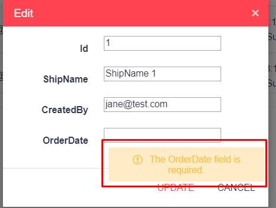
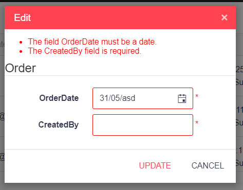

## Environment

<table>
 <tr>
  <td>Product</td>
  <td>Grid for Progress® Telerik® UI for ASP.NET MVC</td>
 </tr>
 <tr>
  <td>Created with Product Version</td>
  <td>2019.1.220</td>
 </tr>
</table>

## Description

I want to display the validation summary instead of tooltips in the grid popup edit template.

## Solution

The Kendo UI Grid with popup editing uses the Kendo UI Validator which is designed to show the errors as tooltips:



You can create a validation summary with a few lines of JavaScript.

1. Override the `errorTemplate` of the editable internal widget which holds the validator
1. Add an `Edit()` event handler and bind to the validate event of the validator
1. Generate the Validation summary and append it to a predefined HTML element in your popup template

```Index.cshtml
    .Events(e => e.Edit("addValidationSummary"))
    <script>
        kendo.ui.Editable.fn.options.errorTemplate = "<span style='color:red;'>*</span>";

        function addValidationSummary(e) {
            var validator = e.container.data("kendoValidator");
            validator.bind("validate", function (e) {
                var errors = this.errors();
                if (errors.length) {
                    var html = "<ul>";
                    for (var i = 0; i < errors.length; i++) {
                        html += "<li>" + errors[i] + "</li>";
                    }
                    html += "</ul>";
                    $("#errors").html($(html));
                }
            });
        }
    </script>
```
```MyCustomPopup.cshtml
    @model ProjectName.Models.Order
    @using Kendo.Mvc.UI
    <div id="errors" style="color:red;"></div>
        <fieldset>
            <legend>Order</legend>
            @Html.HiddenFor(model => model.Id)
            <div class="editor-label">
                @Html.LabelFor(model => model.OrderDate)
            </div>
            <div class="editor-field">
                @Html.Kendo().DatePickerFor(model => model.OrderDate)
                @Html.ValidationMessageFor(model => model.OrderDate)
            </div>
            <div class="editor-label">
                @Html.LabelFor(model => model.CreatedBy)
            </div>
            <div class="editor-field">
                @Html.Kendo().TextBoxFor(model => model.CreatedBy)
                @Html.ValidationMessageFor(model => model.CreatedBy)
            </div>
        </fieldset>
```

This is the result:



## See Also

* [Show server validation errors in grid edit popup]()
* [MVC Validation](https://docs.telerik.com/aspnet-mvc/getting-started/helper-basics/validation)