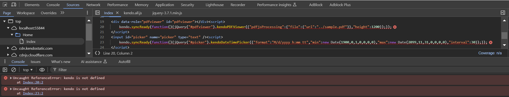
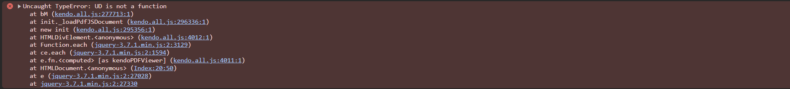

## Environment
<table>
	<tbody>
		<tr>
			<td>Product Version</td>
			<td>2024.4.1112 or later</td>
		</tr>
		<tr>
			<td>Product</td>
			<td>PDFViewer for Progress® Telerik® {{ site.product_short }}</td>
		</tr>
	</tbody>
</table>

## Description
The <a href="https://www.telerik.com/support/whats-new/aspnet-core-ui/release-history/telerik-ui-for-asp-net-core-2024-4-1112-(2024-q4)" target="_blank">2024 Q4 November release (version 2024.4.1112)</a><a href="https://www.telerik.com/support/whats-new/aspnet-mvc/release-history/telerik-ui-for-asp-net-mvc-2024-4-1112-(2024-q4)" target="_blank">2024 Q4 November release (version 2024.4.1112)</a> introduced a new common engine for the PDFViewer component and support for the latest <a href="https://mozilla.github.io/pdf.js/" target="_blank">PDF.js library version 4. x.x</a>. Since PDF.js 4 (versions 4.x.x) uses <a href="https://developer.mozilla.org/en-US/docs/Web/JavaScript/Guide/Modules" target="_blank">ECMAScript modules</a>, the required Kendo UI scripts must be included as modules as well.

The {{ site.product }} versions before 2024.4.1112 are not compatible with PDF.js version 4.x. You must use either PDF.js version 2.x or 3.x. For reference, the example below shows the PDFViewer configured for PDF.js processing when using versions before 2024.4.1112.

```HtmlHelper
    <script src="https://cdnjs.cloudflare.com/ajax/libs/pdf.js/2.2.2/pdf.js"></script>
    <script>
        window.pdfjsLib.GlobalWorkerOptions.workerSrc = 'https://cdnjs.cloudflare.com/ajax/libs/pdf.js/2.2.2/pdf.worker.js';
    </script>

    @(Html.Kendo().PDFViewer()
        .Name("pdfviewer")
        .PdfjsProcessing(pdf => pdf
            .File("")
        )
        .Height(1200)
    )
```

```TagHelper
    <script src="https://cdnjs.cloudflare.com/ajax/libs/pdf.js/2.2.2/pdf.js"></script>
    <script>
        window.pdfjsLib.GlobalWorkerOptions.workerSrc = 'https://cdnjs.cloudflare.com/ajax/libs/pdf.js/2.2.2/pdf.worker.js';
    </script>

    <kendo-pdfviewer name="pdfviewer" height="1200">
        <pdfjs-processing file="@Url.Content("")" />
    </kendo-pdfviewer>
```


When upgrading to version 2024.4.1112 or later, including the [required Kendo UI scripts]() by adding `type="module"` in the script tags will throw the following client-side error:


However, adding the scripts without `type="module"` is also not an option because the PDF.js library requires module scripts:


## Solution

Apply any of the following approaches when using {{ site.product }} PDFViewer (version 2024.4.1112 or later):

- [Using RenderAsModule option for module-based script initialization](#using-renderasmodule-for-module-based-script-initialization)
- [Loading Kendo UI scripts twice](#loading-kendo-ui-scripts-twice)
- [Loading only the required PDFViewer scripts](#loading-only-the-required-pdfviewer-scripts)
- [Compiling the PDF.js scripts to UMD modules](#compiling-pdfjs-scripts-to-umd-modules)

### Using RenderAsModule for Module-Based Script Initialization

The recommended solution is to include the required Kendo UI scripts as modules and enable the `RenderAsModule` option, which will add `type="module"` to the initialization scripts of all Telerik UI components in the application.

Also, it is important to ensure that `type="module"` is added to all script tags that contain custom logic related to the Telerik UI components.


```Program.cs
    builder.Services.AddKendo(x => x.RenderAsModule = true);
```

```Global.asax
    KendoMvc.Setup(options =>
    {
        options.RenderAsModule = true;
    });
```

```_Layout
    <link href="https://kendo.cdn.telerik.com/themes/10.0.1/default/default-ocean-blue.css" rel="stylesheet" type="text/css" />
    <script src="https://code.jquery.com/jquery-3.7.1.min.js" type="module"></script>
    <script src="https://cdnjs.cloudflare.com/ajax/libs/pdf.js/4.8.69/pdf.mjs" type="module"></script>
    <script src="https://cdnjs.cloudflare.com/ajax/libs/pdf.js/4.8.69/pdf.worker.mjs" type="module"></script>
    <script src="https://cdn.kendostatic.com/2024.4.1112/js/kendo.all.min.js" type="module"></script>
    <script src="https://cdn.kendostatic.com/2024.4.1112/js/kendo.aspnetmvc.min.js" type="module"></script>
```
```HtmlHelper
    @(Html.Kendo().PDFViewer()
        .Name("pdfviewer")
        .PdfjsProcessing(pdf => pdf.File(""))
        .Height(800)
    )

    <script type="module">
        $(document).ready(() => {
            var pdfviewer = $('#pdfviewer').data('kendoPdfViewer');
            console.log(pdfviewer);
        })  
    </script>
```

```TagHelper
    <kendo-pdfviewer name="pdfviewer" height="800">
        <pdfjs-processing file="@Url.Content("")" />
    </kendo-pdfviewer>

    <script type="module">
        $(document).ready(() => {
            var pdfviewer = $('#pdfviewer').data('kendoPdfViewer');
            console.log(pdfviewer);
        })
    </script>
```


### Loading Kendo UI Scripts Twice

Another workaround is to include the Kendo UI scripts twice—with and without `type="module"`:

```HtmlHelper
    <link href="https://kendo.cdn.telerik.com/themes/10.0.1/default/default-ocean-blue.css" rel="stylesheet" type="text/css" />

    <script src="https://code.jquery.com/jquery-3.7.1.min.js"></script>

    <!-- Add the Kendo UI scripts in standard fashion. -->
    <script src="https://cdn.kendostatic.com/2024.4.1112/js/kendo.all.min.js"></script>
    <script src="https://cdn.kendostatic.com/2024.4.1112/js/kendo.aspnetmvc.min.js"></script>

    <!-- Add the "pdf.mjs" and "pdf.worker.mjs" module scripts. -->
    <script src="https://cdnjs.cloudflare.com/ajax/libs/pdf.js/4.3.136/pdf.mjs" type="module"></script>
    <script src="https://cdnjs.cloudflare.com/ajax/libs/pdf.js/4.3.136/pdf.worker.mjs" type="module"></script>

    <!-- Add the Kendo UI script as a module afterwards -->
    <script src="https://cdn.kendostatic.com/2024.4.1112/js/kendo.all.min.js" type="module"></script>

    @(Html.Kendo().PDFViewer().Name("pdfviewer")
        .PdfjsProcessing(pdf => pdf.File(@Url.Content("../sample.pdf")))
            .Height(1200)
        )
    @(Html.Kendo().DateTimePicker().Name("picker"))
```

```TagHelper
    <link href="https://kendo.cdn.telerik.com/themes/10.0.1/default/default-ocean-blue.css" rel="stylesheet" type="text/css" />

    <script src="https://code.jquery.com/jquery-3.7.1.min.js"></script>

    <!-- Add the Kendo UI scripts in standard fashion. -->
    <script src="https://cdn.kendostatic.com/2024.4.1112/js/kendo.all.min.js"></script>
    <script src="https://cdn.kendostatic.com/2024.4.1112/js/kendo.aspnetmvc.min.js"></script>

    <!-- Add the "pdf.mjs" and "pdf.worker.mjs" module scripts. -->
    <script src="https://cdnjs.cloudflare.com/ajax/libs/pdf.js/4.3.136/pdf.mjs" type="module"></script>
    <script src="https://cdnjs.cloudflare.com/ajax/libs/pdf.js/4.3.136/pdf.worker.mjs" type="module"></script>

    <!-- Add the Kendo UI script as a module afterwards -->
    <script src="https://cdn.kendostatic.com/2024.4.1112/js/kendo.all.min.js" type="module"></script>

    <kendo-pdfviewer name="pdfviewer" height="1200">
        <pdfjs-processing file-url="@Url.Content("../sample.pdf")" />
    </kendo-pdfviewer>

    <kendo-datetimepicker name="picker"/>
```


### Loading Only the Required PDFViewer Scripts

Instead of loading the whole "kendo.all.min.js" script file twice, you can include only the specific PDFViewer scripts. Also, you can load the scripts and the PDFViewer declaration through a Partial View:

```_Layout
    <link rel="stylesheet" href="https://kendo.cdn.telerik.com/themes/10.0.1/default/default-ocean-blue.css">
    <script src="https://code.jquery.com/jquery-3.4.1.min.js"></script>
    <script src="https://kendo.cdn.telerik.com/2024.4.1112/js/kendo.all.min.js"></script>
    <script src="https://kendo.cdn.telerik.com/2024.4.1112/js/kendo.aspnetmvc.min.js"></script>

    <partial name="PDFViewer" />
```
```HtmlHelper
    <script src="https://cdnjs.cloudflare.com/ajax/libs/pdf.js/4.3.136/pdf.mjs" type="module"></script>
    <script src="https://cdnjs.cloudflare.com/ajax/libs/pdf.js/4.3.136/pdf.worker.mjs" type="module"></script>
    <script src="https://kendo.cdn.telerik.com/2024.4.1112/mjs/kendo.pdfviewer-common.cmn.chunk.js" type="module"></script>
    <script src="https://kendo.cdn.telerik.com/2024.4.1112/mjs/kendo.pdfviewer.js" type="module"></script>

    @(Html.Kendo().PDFViewer()
        .Name("pdfviewer")
        .PdfjsProcessing(pdf => pdf.File(""))
        .Height(1200)
    )
```

```TagHelper
    <script src="https://cdnjs.cloudflare.com/ajax/libs/pdf.js/4.3.136/pdf.mjs" type="module"></script>
    <script src="https://cdnjs.cloudflare.com/ajax/libs/pdf.js/4.3.136/pdf.worker.mjs" type="module"></script>
    <script src="https://kendo.cdn.telerik.com/2024.4.1112/mjs/kendo.pdfviewer-common.cmn.chunk.js" type="module"></script>
    <script src="https://kendo.cdn.telerik.com/2024.4.1112/mjs/kendo.pdfviewer.js" type="module"></script>

    <kendo-pdfviewer name="pdfviewer1" height="1200">
        <pdfjs-processing />
    </kendo-pdfviewer>
```


### Compiling PDF.js Scripts to UMD Modules

Theoretically, you can download the PDF.js scripts and use a JS bundler tool like [webpack](https://webpack.js.org/) to compile them to UMD modules.

## More {{ site.framework }} PDFViewer Resources

* [{{ site.framework }} PDFViewer Documentation]()

* [{{ site.framework }} PDFViewer Demos](https://demos.telerik.com/{{ site.platform }}/pdfviewer/index)


* [{{ site.framework }} PDFViewer Product Page](https://www.telerik.com/aspnet-core-ui/pdf-viewer)

* [Telerik UI for {{ site.framework }} Video Onboarding Course (Free for trial users and license holders)]()

* [Telerik UI for {{ site.framework }} Forums](https://www.telerik.com/forums/aspnet-core-ui)


* [{{ site.framework }} PDFViewer Product Page](https://www.telerik.com/aspnet-mvc/pdf-viewer)

* [Telerik UI for {{ site.framework }} Video Onboarding Course (Free for trial users and license holders)]()

* [Telerik UI for {{ site.framework }} Forums](https://www.telerik.com/forums/aspnet-mvc)


## See Also

* [Client-Side API Reference of the PDFViewer for {{ site.framework }}](https://docs.telerik.com/kendo-ui/api/javascript/ui/pdfviewer)
* [Server-Side API Reference of the PDFViewer for {{ site.framework }}](https://docs.telerik.com/{{ site.platform }}/api/pdfviewer)

* [Server-Side TagHelper API Reference of the PDFViewer for {{ site.framework }}](https://docs.telerik.com/{{ site.platform }}/api/taghelpers/pdfviewer)

* [Telerik UI for {{ site.framework }} Breaking Changes]()
* [Telerik UI for {{ site.framework }} Knowledge Base](https://docs.telerik.com/{{ site.platform }}/knowledge-base)