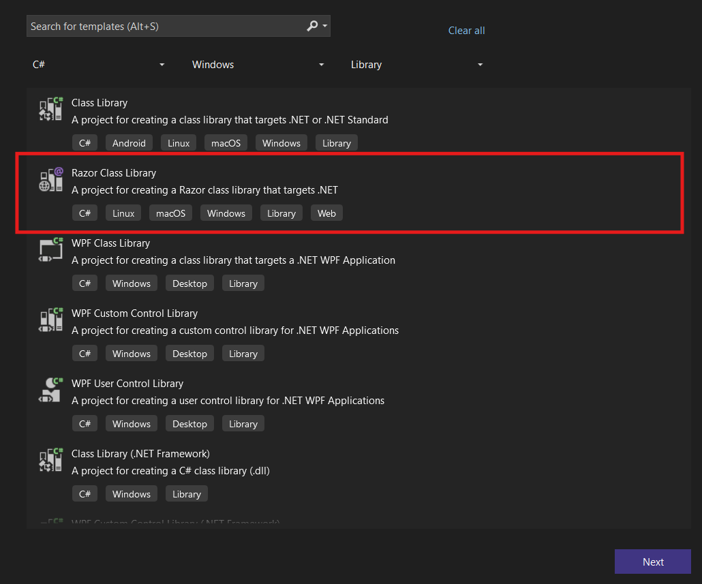
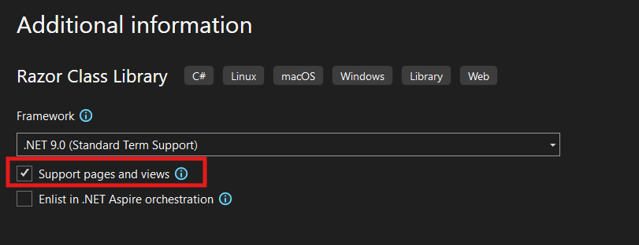

## Environment

<table>
 <tr>
  <td>Product</td>
  <td>{{ site.product }}</td>
 </tr>
</table>

## Description

How can I use Telerik UI for {{ site.framework }} HtmlHelpers and TagHelpers components in a <a href="https://learn.microsoft.com/en-us/aspnet/core/razor-pages/ui-class?view=aspnetcore-9.0&tabs=visual-studio" target="_blank">Razor Class Library</a> applications?

## Solution

1. Create a new ASP.NET Core application.

2. Choose the Project Template:

    * In the project template search box, type **Razor Class Library**.
    * Select the **Razor Class Library** template.

        

    * In the **Additional information** dialog, ensure the **Support pages and views** option is selected, if you plan to include Razor views. By default, only Razor Pages are supported.

        

3. Install Telerik UI for ASP.NET Core:

    * Open the NuGet Package Manager.
    * Search for **Telerik.UI.for.AspNet.Core** and install it. 

4. Add the Views folder:

    * Right-click your RCL project in **Solution Explorer**.
    * Select **Add > New Folder**
    * Name the folder **Views**.

5. Add the `_ViewImports.cshtml` file:

    * Right-click the Views folder
    * Select **Add > New Item**
    * Choose Razor View and name it **_ViewImports.cshtml**

6. Configure the `_ViewImports.cshtml` file:

    ```
    @using Kendo.Mvc.UI
    @addTagHelper *, Microsoft.AspNetCore.Mvc.TagHelpers
    @addTagHelper *, Kendo.Mvc
    ```

7. Add Razor Views:

    * Add a new Razor view to your RCL application (for example, `~/Views/Shared/_Index.cshtml`).
    * Define the desired HtmlHelper or TagHelper component in the created view.

        ```HtmlHelper
            @(Html.Kendo().Button()
                .Name("button")
                .Content("Click")
            )
        ```
        ```TagHelper
            <kendo-button name="button2">Click</kendo-button>
        ```

8. Reference the RCL in your main project:

    * Right-click your main project.
    * Select **Add > Project Reference** and choose your RCL project.

9. Use the views from the RCL by referecing them in the main project:

    ```
    @Html.Partial("_Index")
    ```

## See Also

* [Getting Started with Telerik UI for {{ site.framework }}](https://www.telerik.com/aspnet-core-ui/documentation/getting-started/first-steps)
* [Telerik UI for {{ site.framework }} Breaking Changes]()
* [Telerik UI for {{ site.framework }} Knowledge Base](https://docs.telerik.com/{{ site.platform }}/knowledge-base)
