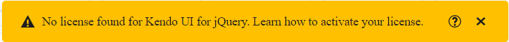

## Environment

<table>
 <tr>
  <td>Product</td>
  <td>{{ site.product }}</td>
 </tr>
 <tr>
  <td>Progress {{ site.product }} version</td>
  <td>2022.3.913</td>
 </tr>
</table>

## Description 

After upgrading, there is a warning in the console stating the following:

```
 License Activation failed for @progress/kendo-ui
 No license found
```
A watermark for the component I have been using:


And a banner which indicates that my license is not found:
 

The application seems to be running. How can I remove the warning, watermark, and banner?

## Solution

The license warning will surface because of the [new licensing mechanism](https://docs.telerik.com/{{ site.platform }}/installation/adding-client-side-resources/using-license-code) introduced with the `R3 2022` release. To remove the warning:

* Generate a [license file](https://docs.telerik.com/{{ site.platform }}/installation/adding-client-side-resources/using-license-code#step-1-get-the-license-file).
* Add the license file after the CDN reference to `kendo.all.min.js` and `kendo.aspnetmvc.min.js`.
    ```
    <script src="https://kendo.cdn.telerik.com/***/kendo.all.min.js"></script>
    <script src="https://kendo.cdn.telerik.com/***/kendo.aspnetmvc.min.js"></script>
    <script src="~/kendo-ui-license.js"></script>

    <!-- Rest of the HTML -->
    ```

> The license file mechanism does not break any builds and does not affect existing applications. It acts as verification when the CDN or NPM distribution channel is utilized for the client-side resources.


## See Also

* [Upgrade Troubleshooting]()
* [Telerik UI for {{ site.framework }} Breaking Changes]()
* [Telerik UI for {{ site.framework }} Knowledge Base](https://docs.telerik.com/{{ site.platform }}/knowledge-base)