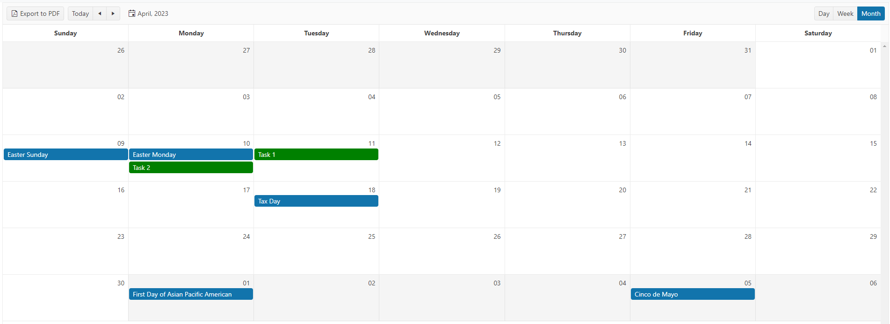

## Environment

<table>
 <tr>
  <td>Product</td>
  <td>Telerik {{ site.product_short }} Scheduler</td>
 </tr>
</table>

## Description

How can I connect a Scheduler HtmlHelper with the Google Calendar?

## Solution

1. Declare the Base calendar Url.
1. Declare the Base calendar Id for public holidays.
1. Get and declare your [API_KEY](https://support.google.com/googleapi/answer/6158862?hl=en).
1. Declare the specification for the region of the calendar.
1. Concatenate the steps above to use the complete resul Url.
1. Fetch the url to get the result response.
1. Add the needed properties of the events of the calendar to the [dataSource](https://docs.telerik.com/kendo-ui/api/javascript/ui/scheduler/fields/datasource) of the Scheduler.

```JavaScript
	$(document).ready(function () {
        const BASE_CALENDAR_URL = "https://www.googleapis.com/calendar/v3/calendars";
        const BASE_CALENDAR_ID_FOR_PUBLIC_HOLIDAY = "holiday@group.v.calendar.google.com";
        const API_KEY = "YourAPI_KEY";
		const CALENDAR_REGION = "en.usa"; 

        const url = `${BASE_CALENDAR_URL}/${CALENDAR_REGION}%23${BASE_CALENDAR_ID_FOR_PUBLIC_HOLIDAY}/events?key=${API_KEY}`

        fetch(url).then(response => response.json()).then(data => {
			const holidays = data.items;
			var scheduler = $("#scheduler").data("kendoScheduler");

			for (var i = 0; i < holidays.length; i++) {

                scheduler.dataSource.add({
					start: new Date(holidays[i].start.date),
                    isAllDay: true,
                    end: new Date(holidays[i].start.date),
					title: holidays[i].summary,
					description: holidays[i].description,
					TaskID: i + 3,
					RoomID: 3,
                    editable: {
                        destroy: false
					}
                });
            }
        })
	})
```

The following image represents the result view of the Scheduler:



For the complete implementation on how to connect a Telerik UI Scheduler with the Google Calendar, refer to [this ASP.NET Core GitHub project](https://github.com/telerik/ui-for-aspnet-core-examples/tree/master/Telerik.Examples.Mvc).


For the complete implementation on how to connect a Telerik UI Scheduler with the Google Calendar, refer to [this ASP.NET MVC GitHub project](https://github.com/telerik/ui-for-aspnet-mvc-examples/tree/master/Telerik.Examples.Mvc/Telerik.Examples.Mvc/Areas/SchedulerGoogleAPI).


## See Also

* [API Reference of the Scheduler](https://docs.telerik.com/kendo-ui/api/javascript/ui/scheduler)
