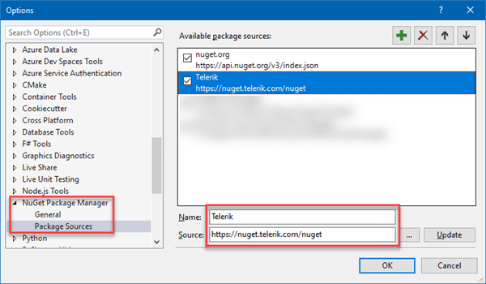
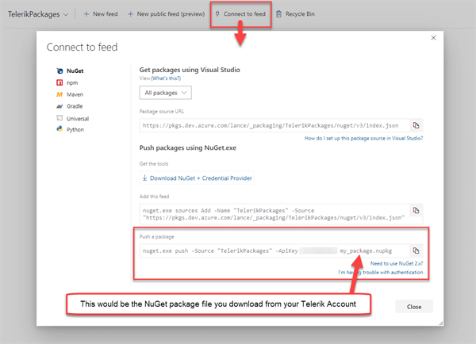

## Environment

<table>
 <tr>
  <td>Product</td>
  <td>Progress® Telerik® UI for ASP.NET Core</td>
 </tr>
</table>

## Description

How can I set up the private NuGet feed in Azure to publish an ASP.NET Core application that references the Telerik UI for ASP.NET Core package?

## Solution

Тwo options are available when restoring Telerik NuGet packages in your build definitions.

* A Service Connection
* Azure Artifacts

Both require that a privat NuGet feed is set up along with a *nuget.config* file.

### Package Sources

1. In Visual Studio add a private NuGet feed by going into the *Tools > Options > NuGet > Package Sources* and add a *Package Source*.

    

1. Visual Studio will prompt you for your Telerik credentials the first time the feed is accessed. These credentials can be later accessed via the Windows Credentials tab in the Credential Manager app (e.g. to update password).

    

### Setting up the *nuget.config* file

The NuGet config file allows you to set package sources as well as where to get the credentials. 

1. Add `NuGet.config` to the WebApp project in Visual Studio.
1. Add a new `NuGet.config` item to the same directory as the `project.json` file is located.
1. Set your own username and password (in clear text) that are needed to log in to the Telerik site. The following example demonstrates how to do this.

        <?xml version="1.0" encoding="utf-8"?>
        <configuration>
            <packageSources>
                <add key="Telerik" value="https://nuget.telerik.com/nuget" />
                <add key="nuget.org" value="https://api.nuget.org/v3/index.json" protocolVersion="3" />
            </packageSources>
            <packageSourceCredentials>
            <Telerik>
                <add key="Username" value="user.name@telerik.com" />
                <add key="ClearTextPassword" value="********" />
            </Telerik>
            </packageSourceCredentials>
        </configuration>

However this could be a security issue in a CI/CD environment where another user might be able to read the values of environment variables. The [Azure DevOps Service Connection](https://docs.microsoft.com/en-us/azure/devops/pipelines/library/service-endpoints?view=azure-devops&tabs=yaml) resolves this as it lets you enter credentials in a secure manner without unnecessarily exposing account details. That Service Connection can now be used by multiple pipelines to authenticate private NuGet feeds (and other services that need authentication).

### Setting up the Service Connection

1. Go to the *Project Settings* in your DevOps project portal.

    

1. On the *Project Settings* page, select the *Service Connections* menu item under *Pipelines* and then open the *New Service Connection* drop down.

    

1. Select NuGet from the drop-down list.

    

1. Enter the URL and authentication credentials in the dialog window. For the Telerik NuGet server select **Basic Authentication**.  Once that selection is made, you can enter the Telerik server URL and use your Telerik account credentials.

    

1. Once the setup is completed your build pipelines can now fetch packages from the Telerik NuGet feed. 

### Using the Telerik Service Connection

In your build pipeline, there's a *NuGet Restore* step. Select that step and look to the properties panel. Change the *Feeds to Use* selection to **Feeds in my NuGet.config**. A new drop-down will appear titled "*Credentials for feeds outside this organization/collection.*" Open it and select the newly available *Telerik NuGet Service Connection*.

When you queue and run the pipeline, the Telerik NuGet packages will be restored.

### Setting up Azure Artifacts

If you do not want pipelines to have unfettered access to the Telerik account holder's downloads, you can host the NuGet package your on your own feed right in the DevOps project with the [Azure Artifacts](https://docs.microsoft.com/en-us/azure/devops/pipelines/artifacts/artifacts-overview?view=azure-devops) feature. To set up the Azure Artifacts:

1. Go to the project's main menu, select *Artifacts* and then click the *New Feed* button at the top.

    

1. Give the feed a name (e.g. TelerikPackages), select the "*Only use packages published to this feed*" option, then click the *Create* button. You will now have your own feed that you can push *nupkg* files to. To see how to push packages to this feed, click the "*Connect to feed*" option at the top. A dialog will appear with helpful information on how you can push packages to that specific feed.

    

1. You can get the NuGet package file (nupkg) for any Telerik product you're using by going to the downloads page for that product. You can start at the [My Account - Downloads](https://www.telerik.com/account/my-downloads) page.

1. Underneath the installer for the product, you will find the *Other Setup Files* section where the nupkg files will be. For example, here's what it looks like for the [Telerik UI for ASP.NET Core](https://docs.telerik.com/aspnet-core/introduction) packages.

    

1. Go to the build pipeline and select that feed for a NuGet Restore step.

### Using the Azure Artifact

Just like when using a Service Connection, go to the build pipeline and select the *NuGet Restore* step. Except this time for the *Feeds to Use* option choose **Feed(s) I select here** and choose the *TelerikPackages* feed in the *Use packages from this Azure Artifacts/TFS feed* drop-down list.

> Important: If you have nuget.org packages to restore in addition to the Telerik packages, leave the "Use packages from NuGet.org" option selected.

## See Also

* [Visual Studio Integration]()
