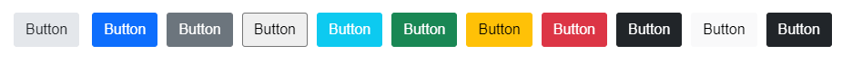
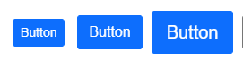
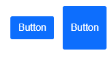
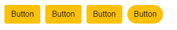
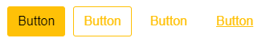

# Components Rendering Overview

The R1 2022 release introduces new rendering for several components. In the long run, we will make similar rendering improvements in all the UI components in the suite. These are breaking changes that affect both the SASS and the LESS-based themes. 

- [What is the Reason Behind These Changes?](#what-is-the-reason-behind-these-changes)
- [Styling Options](#styling-options)
- [List of Updated Components](#updated-components)
- [Migrating from LESS Themes](#less-themes-migration)
- [CSS Classes Migration](#css-classes-migration)
- [JQuery Selectors Migration](#jquery-selectors-migration)


## What is the Reason Behind These Changes?

The new rendering gives developers more flexibility when customizing the look-and-feel of our components. The Kendo UI themes support several common options on a component level, which allow customizing the appearance of the component. This helps to avoid the need of manually overriding the CSS styles of a component.

The feedback we have received from our customers shows that they need an easier way of modifying the appearance of the components. The new rendering aims to ease the customization of the components and to allow developers to implement any design requirements with less work. 

## Styling Options

We use a set of CSS classes and depending on the value of the corresponding styling option, a different class is applied to the rendered component element. A component may or may not support a particular option. For example a `textarea` element can have a configurable `overflow` option, however this option doesn't make sense in the context of a `button` element.

In the old rendering styling was applied through a single class with a `k-` prefix, for example `k-button`. The new rendering has a separate CSS class for each styling property.

The new rendering of the components supports several common options on a component level:

- [`ThemeColor`](#theme-color)
- [`Size`](#size)
- [`Shape`](#shape)
- [`Rounded`](#rounded)
- [`FillMode`](#fill-mode)

Each component has its own appearance documentation article with information about the supported options and their values. 

For a list of all the updated components and their respective articles, see the [Updated Components](#updated-components) section.

### Theme Color

The `ThemeColor` property controls the color used to style the component. The property is dependant on the [`FillMode`](#fill-mode) and cannot be used separately. The structure of the CSS class is `k-{component}-{fillMode}-{themeColor}`.

The following example shows how a Button with `Solid` fill mode and `Base` theme color is rendered:

```html
<button type="button" class="k-button k-button-solid k-button-solid-base">
    <span class="k-button-text">Text</span>
</button>
```

The following image demonstrates the result of applying the different `ThemeColor` values to a button:



For more information about the available `ThemeColor` values, visit the [Appearance documentation](#updated-components) of the respective component.

### Size

The `Size` property controls the overall size of the component. The structure of the CSS class is `k-{component}-{size}`.

The `size` part of the class is set depending on the value of the `Size` property:

- `sm`—small size (when `Size` is set to `Small`)
- `md`—medium size (when `Size` is set to `Medium`)
- `lg`—large size (when `Size` is set to `Large`)

The default size of the components is `Medium`.

The following example shows the rendering of a Button with large size (`lg`):

```html
<button type="button" class="k-button k-button-lg">
    <span class="k-button-text">Text</span>
</button>
```

The following image demonstrates the appearance of a Button, with different `Size` values applied:



For more information about the available `Size` values, visit the [Appearance documentation](#updated-components) of the respective component.

### Shape

The `Shape` property controls the shape of the component. The structure of the CSS class is `k-{component}-{shape}`. 

The following example shows a Button with a `Square` value set to its `Shape` option:

```html
<button type="button" class="k-button k-button-square">
    <span class="k-button-text">Text</span>
</button>
```

The following image demonstrates the appearance of a Button, with different `Shape` values applied:



For more information about the available `Shape` option values, visit the [Appearance documentation](#updated-components) of the respective component.

### Rounded

The `Rounded` property controls the border radius of the component. The structure of the CSS class is `k-rounded-{rounded}`.

The `Rounded` values follow the already established concept of class names:

- `sm`—small border radius (when `Rounded` is set to `Small`)
- `md`—medium border radius (when `Rounded` is set to `Medium`)
- `lg`—large border radius (when `Rounded` is set to `Large`)

The default border radius of the components is `Medium`.

The following example shows the rendering of a Button with large border radius (`lg`):

```html
<button type="button" class="k-button k-rounded-lg">
    <span class="k-button-text">Text</span>
</button>
```

The following image demonstrates the appearance of a Button, with different `Rounded` values applied:



For more information about the available `Rounded` option values, visit the [Appearance documentation](#updated-components) of the respective component.

### Fill Mode

The `FillMode` property controls how the color is applied to the component. The structure of the CSS class is `k-{component}-{fillMode}`. 

The following example shows a Button with a `Solid` fill mode:

```html
<button type="button" class="k-button k-button-solid">
    <span class="k-button-text">Text</span>
</button>
```

The following image demonstrates the appearance of a Button, with different `FillMode` values applied:



For more information about the available `FillMode` option values, visit the [Appearance documentation](#updated-components) of the respective component.

## Updated Components

| Component   | Appearance Documentation  |
|:---         |:---       |
| `AutoComplete` | [AutoComplete Appearance Documentation]()
| `Button` | [Button Appearance Documentation]()
| `CheckBox` | [CheckBox Appearance Documentation]()
| `ColorPicker` | [ColorPicker Appearance Documentation]()
| `ComboBox` | [ComboBox Appearance Documentation]()
| `DateInput` | 
| `DatePicker` | [DatePicker Appearance Documentation]()
| `DateRangePicker` | [DateRangePicker Appearance Documentation]()
| `DateTimePicker` | [DateTimePicker Appearance Documentation]()
| `DropDownList` | [DropDownList Appearance Documentation]()
| `DropDownTree` | 
| `MaskedTextBox` | 
| `MultiColumnComboBox` | 
| `MultiSelect` | 
| `NumericTextBox` | [NumericTextBox Appearance Documentation]()
| `RadioButton` | [RadioButton Appearance Documentation]()
| `Switch` | [Switch Appearance Documentation]()
| `TextArea` | [TextArea Appearance Documentation]()
| `TextBox` | [TextBox Appearance Documentation]()
| `TimePicker` | 

## LESS Themes Migration

> The LESS themes will be deprecated with the R1 2023 release.

This section concerns developers who use the original LESS-based themes and have not migrated to the SASS-based themes yet.

### Why Must I Migrate to a SASS Theme?

There are technical limitations in the LESS themes that prevent us from bringing the desired level of customization to the components. In order to keep evolving the UI of the components, the LESS themes need to be left behind.

The new rendering for existing components is available for the LESS themes, however, it supports only the default values of the component [`styling options`](#styling-options). New components or new features that require a new design, will be available only in the SASS themes.

Visit the [LESS Migration]() help article for additonal information about the steps that you need to follow, in order to migrate to a SASS theme.

### How Do I Know If I Am Using a LESS Theme?

The easiest way to verify whether you are using the LESS themes, is to check if you have multiple Kendo CSS files referenced, specifically files that use the following naming convention: 

- kendo.common.min.css
- kendo.[theme-name].min.css
- kendo.mobile.min.css
- kendo.rtl.min.css

If you are not using multiple CSS files and instead have a single CSS file referenced, for example `kendo.default-main.min.css`, then you are using the SASS themes and this section can safely be skipped.

## CSS Classes Migration

This section concerns developers who have modified the appearance of the components through the `k-{classname}` CSS classes. If you haven't made any customizations using the Kendo classes as selectors, you can safely skip this section.

### Why Must I Migrate to Different Class Names?

We have preserved the old look of the components, as much as possible. The new classes are more of a granular representation of the old CSS styling. As demonstrated in the [Styling Options](#styling-options) section, the major difference is that each of the new styling options has its own class now.

The new rendering of the components requires the existing CSS classes and HTML structure to be changed to some extent. If you have overridden or used any of the Kendo UI classes to apply custom styling to the components, you may have to update some of the selectors of your custom CSS rules. The respective selectors must be updated, to reflect the current rendering of the components.

### How Do I Know If I Have Overridden a Class Name?

The easiest way to verify whether you have overridden a particular class, is to check if you have any custom CSS rules, that contain a `k-{classname}` structure.

Example of the old Button rendering:

```html
<button class="k-button k-button-icontext">
    <span class=" k-icon k-i-folder"></span>
    Button
</button>
```

Example of the new Button rendering:

```html
<button class="k-button k-button-solid k-button-md k-button-rectangle k-rounded-md k-button-solid-base">
    <span class="k-button-icon k-icon k-i-folder"></span>
    <span class="k-button-text">Button</span>
</button>
```

As demonstrated in the examples above, the `k-button-icontext` class is no longer present in the button element. Any custom CSS rules that use the `k-button-icontext` class as a selector will no longer have the expected effect. You need to find the CSS rules that use non-existing classes in your code, and update their selectors with one of the new classes.

### How Can I Update the Reference to Target the Element In the New Rendering? 

The easiest way to solve the [issue with missing classes](#how-do-i-know-if-i-have-overriden-a-class-name) is to update the selectors of the CSS rules that target a  specific element.

The following example shows a CSS rule that uses an old class selector `k-button-icontext`, which does not exist in the new rendering:

```css
.k-button-icontext {
    background-color: red; /* Doesn't work in the new rendering. */
}
```

The following example shows a CSS rule that uses the `k-button` class as a selector, which is available in the new rendering:

```css
.k-button {
    background-color: red; /* Works in the new rendering. */
}
```

Examples of the old rendering, old classes, new rendering, and new classes are available in the [appearance documentation](#updated-components) of each component.

## JQuery Selectors Migration

This section concerns developers who use the `k-{classname}` class selectors in custom JavaScript logic.

### Why Must I Migrate to Different Selectors?

As mentioned earlier in the [CSS migration](#css-classes-migration) section, the new rendering updates the Html and class structure of the components. If you have used any of the Kendo classes to execute custom logic, you may have to update the [`jQuery selectors`](https://api.jquery.com/category/selectors/), if the used classes are no longer available.

### How Do I Find And Update the Selectors?

The easiest way to know if you have custom logic that is dependant on the Kendo classes is to look for the following code structure in your application:

```javascript
$(".k-{classname}")
```

You can check the [appearance documentation](#updated-components) of the specific component and verify if the class that is used as a selector is still available or not. If the class is no longer in use, update the selector in your JavaScript logic accordingly, and use an available class instead.
