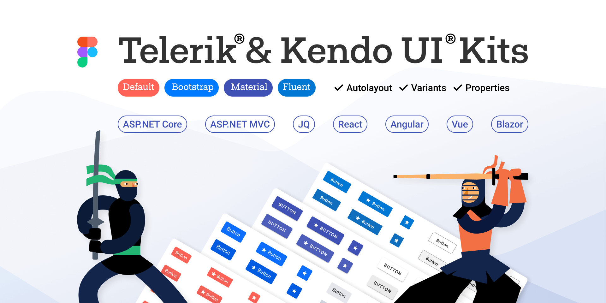


# Telerik UI Design Kits for Figma ({{site.framework}})

Design Files for Figma&mdash;building blocks for designers matching UI for {{site.framework}} components.

To achieve efficient collaboration between designers and developers, we have created three Telerik UI kits for Figma (one for each of the top three themes we ship with {{site.product}}): Material, Bootstrap and Default (our own styling). 

<a href="https://www.figma.com/@progress" class="track--download-kendoui" style="display: inline-flex;" title="Download Telerik UI Kits">
<button importance="ghost" style="display: flex;
                                max-height: 50px;
                                -webkit-box-align: center;
                                align-items: center;
                                -webkit-box-pack: center;
                                justify-content: center;
                                outline: none;
                                cursor: pointer;
                                user-select: none;
                                border-radius: 2px;
                                font-weight: 500;
                                font-size: 18px;
                                line-height: 29px;
                                padding: 0.5rem 1rem;
                                background-color: transparent;
                                border: 2px solid rgba(148, 216, 255, 0.533);
                                color: rgb(101, 101, 101);">

Download Telerik UI Kits
</button>
</a>

These professional UI kits incorporate pre-built reusable design components that act in accordance with the [atomic design principles](https://atomicdesign.bradfrost.com/chapter-2/).

The design files include 30+ of the most widely used UI for {{site.framework}} components such as Grid, Scheduler, Dropdowns, Inputs, with their detailed anatomical structures, colors, indicators, and icons. The included building blocks and elements enable smooth collaboration between designers and developers and our goal is to continuously grow the number of included components and ensure full coverage.

## Benefits of Using the Telerik UI Design Kits for Figma 
You can enjoy the following advantages when using the UI kits: 

- The UI kits include information about which components are available, their states, and how they are connected.
- Developers will be able to easily match the UI for {{site.framework}} components with corresponding design requirements.
- The edited templates can be quickly converted into a [shared Figma library](https://www.figma.com/best-practices/components-styles-and-shared-libraries/).

## Downloading the Telerik UI Design Kits for Figma 

The Telerik UI Design Kit for Figma can be downloaded from the links below - follow the instructions on [duplicating a file from the Figma Community](https://help.figma.com/hc/en-us/articles/360038510873-Use-files-from-the-Community#Duplicate).

- [Telerik UI Kit for Material](https://www.figma.com/community/file/971704350762479492)
- [Telerik UI Kit for Bootstrap](https://www.figma.com/community/file/971704996235717509)
- [Telerik UI Kit Default](https://www.figma.com/community/file/971702824494731137)

## Exploring the Telerik UI Kits' Structure 

The Telerik UI Kits for Figma use [base components and nested instances](https://www.figma.com/best-practices/creating-and-organizing-variants/using-variants-effectively/) for better component management. Furthermore, we have added [variant support](https://help.figma.com/hc/en-us/articles/360055471353-Prepare-for-variants) for certain components to make them even more intuitive to use. 

Each UI kit contains the following pages:

- **Cover**&mdash;UI kit front page.
- **Getting Started**&mdash;all you need to know to start operating with the UI kits.
- **Styles**&mdash;typography, colors, and effects affecting the components and their variants.
- **Icons**&mdash;all icons in the form of convenient components.
- **Components & Variants**&mdash;all available components and their variants.
- **\_Base (Structural Components)**&mdash;building blocks which can serve as a base component to many component states and types (normal, active, hover, solid, flat, etc.). As a result, a change in the base component will affect all components using this base.
- **Scenarios**&mdash;different use case scenarios for the included components (work in progress).
- **Change log**&mdash;release history of the kit changes.

Multiple frames for grouping similar design assets are available for most pages.

## Customizing a Telerik UI Design Kit 

Telerik's Figma UI Kit is very flexible and can be fully customized according to your vision and needs. In addition, it allows you to apply the scalability of design changes.  

Changes to multiple component variants can be propagated by:

- Customizing the base components.
- Customizing the typography, colors, and effects on the Styles page.

You can apply changes to a single component variant which will affect only the individual variants on the Components page.  

> You can [publish the modified template as a library](https://help.figma.com/hc/en-us/articles/360041051154#h_b9cf5ead-791e-4ae2-9dd8-aded2fe54fe6), once the desired design is achieved.

## Choosing How to Use the UI Kits 

You can apply three different levels of component customization, depending on your requirements: 

1. **Out-of-the-box components**&mdash;select one of the available kits and using the included components as they are start creating your own application design as a faster solution with seamless handover and design implementation.
1. **Components with customized colors**&mdash;apply colors according to your brand requirements by transferring them to the {{site.framework}} components with the [Theme Builder application]().
1. **Unique design system**&mdash;change the look and feel of the components entirely. In case you need consultation or help with the implementation, [contact](https://www.telerik.com/services/ui-ux-design) with our solution experts who will help you plan, prototype, and build your design system. 

## See Also
* [Getting Started with {{site.product}}]()
* [Browse the Components](https://demos.telerik.com/{{site.platform}}/)


# Telerik UI Design Kits for Figma ({{site.framework}})

The Design Files for Figma are building blocks for designers that match the Telerik UI for ASP.NET MVC components.

We’ve created three distinct Telerik UI kits for Figma for each of the most popular themes shipped with UI for ASP.NET MVC library, thus aiming to facilitate efficient collaboration between designers and developers in their efforts for creating and implementing the perfect project design. 

<a href="https://www.figma.com/@progress" class="track--download-kendoui" style="display: inline-flex;" title="Download Telerik UI Kits">
<button importance="ghost" style="display: flex;
                                max-height: 50px;
                                -webkit-box-align: center;
                                align-items: center;
                                -webkit-box-pack: center;
                                justify-content: center;
                                outline: none;
                                cursor: pointer;
                                user-select: none;
                                border-radius: 2px;
                                font-weight: 500;
                                font-size: 18px;
                                line-height: 29px;
                                padding: 0.5rem 1rem;
                                background-color: transparent;
                                border: 2px solid rgba(148, 216, 255, 0.533);
                                color: rgb(101, 101, 101);">

Download Telerik UI Kits
</button>
</a>

The Telerik UI Design Kits offer pre-built design components that can be reused as is, customized and are created according to the [atomic design principles](https://atomicdesign.bradfrost.com/chapter-2/). They allow perfect delivery of design to the developer by providing more than 30 of the most widely used ASP.NET MVC components.

## Advantages of the Telerik UI Design Kits for Figma  

You can easily match the ASP.NET MVC UI components to your design requirements with the available information on the type of components, their states and connection, Furthermore, you can effortlessly convert templates into a [shared Figma library](https://www.figma.com/best-practices/components-styles-and-shared-libraries/).

## Downloading the Telerik UI Design Kits for Figma 

You can download the Telerik Kits for Figma by following the links provided below. Instructions on how to duplicate a file are available in the [Figma Community](https://help.figma.com/hc/en-us/articles/360038510873-Use-files-from-the-Community#Duplicate).

- [Telerik UI Kit for Material](https://www.figma.com/community/file/971704350762479492)
- [Telerik UI Kit for Bootstrap](https://www.figma.com/community/file/971704996235717509)
- [Telerik UI Kit Default](https://www.figma.com/community/file/971702824494731137)

## Exploring the Telerik UI Kits' Structure 

The Telerik Kits for Figma come with [support for component variants](https://help.figma.com/hc/en-us/articles/360055471353-Prepare-for-variants) and options for component management &mdash; utilization of [nested instances and base components](https://www.figma.com/best-practices/creating-and-organizing-variants/using-variants-effectively/).

Each kit includes a **Cover** page, information on how to start using the UI kits (**Getting Started** page), **Styles, Icons, Components & Variants, Change Log, Scenarios** and **_Base** page. The **Styles** and **Icons** pages display all the available customizations for the components. In the **_Base** page, you can find structural components (building blocks) for base components. Different use case scenarios are available in the **Scenarios** page. You can also view the release history of kit changes in the **Change Log** page. 

You can find different grouping frames for the available design assets. 

## Customizing a Telerik UI Design Kit 

The Telerik Figma Kit can be completely customized to match your requirements, vision and needs. It allows you to tailor the base components, typography, effects, and colors on the **Styles** page. 

Modifying a single component variant will change only the individual variants. 

You can apply changes to a single component variant which will affect only the individual variants on the Components page.  

> The modified template can be [published as a library](https://help.figma.com/hc/en-us/articles/360041051154#h_b9cf5ead-791e-4ae2-9dd8-aded2fe54fe6) once the desired customization is achieved.

## Choosing How to Use the UI Kits 

You can apply three different levels of component customization, depending on your requirements: 

The Telerik UI Figma Kits allow you to customize the available components on three different levels – create your own application design by selecting one of the available kits, apply colors according to your brand guidelines with the [Theme Builder]() application, and change the look and feel of the component entirely with the unique design system. [Contact](https://www.telerik.com/services/ui-ux-design) our solution experts if you need help with building your unique design system. 
## See Also
* [Getting Started with {{site.product}}]()
* [Browse the Components](https://demos.telerik.com/{{site.platform}}/)


