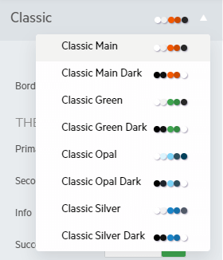

# LESS to SASS Theme Migration

> R1 2023 is the last official release of Telerik UI for {{ site.framework }}, where LESS Themes are supported and shipped with the product.

In this article you will learn how to migrate your project from a LESS theme to a SASS theme. If you are not sure whether you are using a LESS theme, check the following section of the [Components Rendering Overview](#how-do-i-know-if-i-am-using-a-less-theme) article.

For additional information about the SASS themes, visit the [`SASS-Based Themes`](https://docs.telerik.com/kendo-ui/styles-and-layout/sass-themes) article.

## Why Do I Need to Migrate to a SASS Theme?

> The LESS-based themes support only the default values of the new [Components Styling Options](#styling-options).

The LESS-based themes will receive the new [styling options](#styling-options) just like the SASS themes, however after 2022 the LESS themes will be officially deprecated. Customers who continue to use LESS themes after their deprecation will not be able to take advantage of the newest visual updates, features and bug fixes. This also means that Telerik UI for {{ site.framework }} versions starting from 2023 will be incompatible with the LESS themes and you won't be able to use the new versions with the LESS themes.

The SASS-based themes provide unique swatches that are based on the main theme and can be updated at once. This allows us to change the design and color scheme of our components in a more timely manner which in turn leaves more time for new themes and swatches to be developed.

With the LESS-based themes, each individual theme has its own code base. When a new component is introduced, or an existing one is updated, we must recreate each LESS theme to ensure that the new addition is rendered without problems. As a result, keeping the LESS-based themes updated takes a tremendous amount of time and resources.

Ultimately, the goal behind these changes is to allow us to free resources which will be used to update existing SASS themes and also create new themes that have been requested by our clients.

## How Do I Migrate to a SASS Theme?

The migration to a SASS theme is straightforward:

1. Remove the old LESS theme references, for example:

   ```html
        <!-- The following styles are required for the LESS Default theme. -->
        <link rel="stylesheet" href="https://kendo.cdn.telerik.com/2021.3.1207/styles/kendo.common.min.css" />
        <link rel="stylesheet" href="https://kendo.cdn.telerik.com/2021.3.1207/styles/kendo.default.min.css" />
        <link rel="stylesheet" href="https://kendo.cdn.telerik.com/2021.3.1207/styles/kendo.default.mobile.min.css" />
   ```

1. Add a reference to the SASS theme that you want to use, for example:

   ```html
        <!-- The following styles are required for the SASS Default theme. -->
        <link rel="stylesheet" href="https://kendo.cdn.telerik.com/themes/{{ site.themesCdnVersion }}/default/default-main.css" />
   ```

With the new rendering of the components, some of CSS classes used in the old rendering will be removed. If you use any of those classes to customize a component, you will have to update the selectors of your custom CSS rules. Otherwise the customizations will no longer work. For more details, see the [CSS Classes Migration](#css-classes-migration) section of the [Components Rendering Overview]() article.

## How Do I Know Which SASS Theme Corresponds to My Current LESS Theme?

The LESS themes have SASS swatches which are under the `Classic` theme.



The following table contains the name of the LESS theme and its SASS counterpart:

| Less Theme   | Sass Theme | Status | Sass Theme CDN
|:---         |:---        |:---        |:---
| `Default` | `Classic - Main` | Available | https://kendo.cdn.telerik.com/themes/{{ site.themesCdnVersion }}/classic/classic-main.css |
| `Default Dark` | `Classic - Main Dark` | Available | https://kendo.cdn.telerik.com/themes/{{ site.themesCdnVersion }}/classic/classic-main-dark.css |
| `Black` | `Classic - Opal Dark` | Available | https://kendo.cdn.telerik.com/themes/{{ site.themesCdnVersion }}/classic/classic-opal-dark.css |
| `Blue Opal` | `Classic - Opal` | Available | https://kendo.cdn.telerik.com/themes/{{ site.themesCdnVersion }}/classic/classic-opal.css |
| `Silver` | `Classic - Silver` | Available | https://kendo.cdn.telerik.com/themes/{{ site.themesCdnVersion }}/classic/classic-silver.css |
| `Metro` | `Classic - Metro` | In Research | TBA |
| `Metro Black` | `Classic - Metro Dark` | In Research | TBA |
| `Moonlight` | `Classic - Moonlight` | In Research | TBA |
| `Bootstrap 3` | `Bootstrap - Bootstrap 3` | Available | https://kendo.cdn.telerik.com/themes/{{ site.themesCdnVersion }}/bootstrap/bootstrap-3.css |
| `Bootstrap 3 Dark` | `Bootstrap - Bootstrap 3 Dark` | Available | https://kendo.cdn.telerik.com/themes/{{ site.themesCdnVersion }}/bootstrap/bootstrap-3-dark.css |
| `Flat` | `Bootstrap - Turquoise` | In Progress | ETA March 2023 |
| `Flat Dark` | `Bootstrap - Turquoise Dark` | In Progress | ETA March 2023 |
| `Material` | `Material - Main` | Available | https://kendo.cdn.telerik.com/themes/{{ site.themesCdnVersion }}/material/material-main.css |
| `Material Black` | `Material - Main Dark` | Available | https://kendo.cdn.telerik.com/themes/{{ site.themesCdnVersion }}/material/material-dark.css |
| `Nova` | `Material - Nova` | Available | https://kendo.cdn.telerik.com/themes/{{ site.themesCdnVersion }}/material/material-nova.css |
| `Office 365` | `Fluent - Main` | Available | https://kendo.cdn.telerik.com/themes/{{ site.themesCdnVersion }}/fluent/fluent-main.css |
| `High Contrast` | N/A | In Research | TBA |
| `Fiori` | N/A | Needs Validation | N/A |
| `Uniform` | N/A | Needs Validation | N/A |

> The Bootstrap and Material LESS themes will not have their own SASS swatches. The dedicated Bootstrap and Material SASS themes should be used instead.

The following example shows how to add the Clasic SASS theme to your project:

```html
<link rel="stylesheet" href="https://kendo.cdn.telerik.com/themes/{{ site.themesCdnVersion }}/classic/classic-main.css" /> 
```

The reference above must be added to the `head` element of the Layout.

## Which Styling Options Are Available For the LESS Themes?

The LESS-based themes support only the default values of the new [Components Styling Options](#styling-options). If you wish to utilize the full potential of the new rendering of the components, you must use a SASS-based theme or swatch.

## See More

* [Telerik and Kendo UI LESS Themes future plans blog post](https://www.telerik.com/blogs/future-plans-telerik-kendo-ui-less-themes)
* [Styling Overview Article]()
