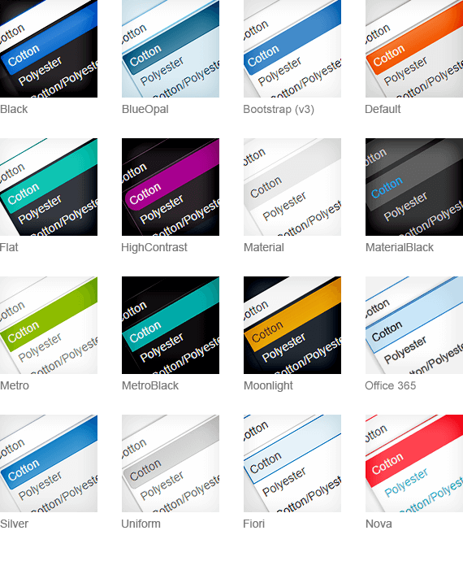

# Overview

> * R1 2023 is the last official release of Telerik UI for {{ site.framework }}, where LESS Themes are supported and shipped with the product.
> * The LESS themes support only the default values of the new [Components Styling Options](#styling-options).
> * As of 2022 R1, the default value for the [Rounded styling option](#rounded) of the components is `Medium`. It is applyed through the `k-rounded-md` class. See the [Backwards Compatibility](#backwards-compatibility) section, for more details.

The appearance of the Telerik UI for {{ site.framework }} components is achieved by rendering predefined classes in the various Html elements of the components. The themes use these classes, to apply styles to the respective elements. 



## Adding a Theme to Your Project

To add a LESS theme to your project, reference a common (base) stylesheet and a theme stylesheet.

* `kendo.common.css`&mdash;This is a common (base) stylesheet. It applies styles related to element positioning and component dimensions.
* `kendo.[theme].css`&mdash;This stylesheet applies theme-specific styles such as: color palette, background gradients, patterns, etc.

The following example demonstrates how to reference the required stylesheets of the `Default` LESS theme in your project, when using local files:

```html
    <html>
    <head>
        <link rel="stylesheet" href="[file path]/kendo.common.min.css" />
        <link rel="stylesheet" href="[file path]/kendo.default.min.css" />
    </head>
```

> * You must add the common CSS file before the theme CSS file.
> * Only one pair of common and theme CSS files should be referenced.

The following example demonstrates how to reference the required stylesheets of the `Default` LESS theme in your project, when using the Kendo CDN:

```html
    <link rel="stylesheet" href="https://kendo.cdn.telerik.com/2022.3.1109/styles/kendo.common.min.css">
    <link rel="stylesheet" href="https://kendo.cdn.telerik.com/2022.3.1109/styles/kendo.default.min.css">
```

## Common CSS Files

Some of the LESS themes require the `kendo.common.css` common (base) stylesheet, others require a different common stylesheet. The following table shows the various themes dependencies on the common files:

| CSS Files   | Contents and Application |
|:---         |:---                     |
| `kendo.common.css`                | The default base stylesheet. Required by the majority of the LESS themes. |
| `kendo.common-bootstrap.css`      | The base stylesheet for the Bootstrap (v3) theme. Use this file instead of `kendo.common.css` and only with `kendo.bootstrap.css` theme file to achieve Bootstrap-like component dimensions. |
| `kendo.common-material.css`       | The base stylesheet for the Material and MaterialBlack themes. Use this file instead of `kendo.common.css` and only with `kendo.material.css` or `kendo.materialblack.css` theme files. |
| `kendo.common-nova.css`           | The base stylesheet for the Nova theme. Use this file instead of `kendo.common.css` and only with `kendo.nova.css`. |
| `kendo.common-fiori.css`          | The base stylesheet for the Fiori theme. Use this file instead of `kendo.common.css` and only with `kendo.fiori.css`. |
| `kendo.common-office365.css`      | The base stylesheet for the Office365 theme. Use this file instead of `kendo.common.css` and only with `kendo.office365.css`. |

## Theme-Related Folders

Apart from the common stylesheet and theme stylesheet, you must make the following folders available in your application.

* `/ThemeName/`&mdash;This is the folder, which contains all images required by the LESS themes. The folder name matches the theme name, e.g. `Default`, `Bootstrap`, `Silver`, etc. The theme image folders for unused themes can be removed.
* `/fonts/`&mdash;This is where the `KendoUIGlyphs` and `DejaVu` font files reside. The `KendoUIGlyphs` font describes the Kendo UI font icons used by the components.
* `/images/`&mdash;This where the Kendo UI font icons for the components reside.
* `/textures/`&mdash;This is where some fallback theme images are stored for browsers that do not support the CSS3 linear gradients.

## Primitives

The Telerik UI for {{ site.framework }} components use primitives, meaning that different HTML elements in different components use the same CSS classes to provide a level of abstraction and allow common styling. To learn how to modify the primitives, check the [Overriding Primitives](#overriding-primitives) documentation section.

### Common CSS Classes

| CSS Class   | Behavior  |
|:---         |:---       |
| `k-widget`  | The class is applied to the component wrapper to set a border, text and background color. In addition to `k-widget`, every component has its own specific CSS class, such as `k-menu`, `k-panelbar`, `k-tabstrip`, etc.|
| `k-header`  | Applied to Grid headers, Menu top level items, PanelBar top level items, TabStrip items, and DropDownLists to set a background image and a background color. |
| `k-link`    | Applied to hyperlinks and clickable text items to set a text color.|
| `k-button`  | Applied to elements that are expected to look like push buttons. The class sets a text color, background color, background image, and hover styling. This is the recommended class for styling form buttons.|
| `k-input`   | Applied to textboxes inside input components like ComboBox and AutoComplete to set border, text and background color.|
| `k-textbox` | Same as `k-input`, but used for standalone (generic) `input` elements that are not part of a component. This is the recommended class for styling form `input` elements as it provides the same look, height, and vertical alignment as the input components.|
| `k-checkbox`| Applied to checkboxes inside the TreeView component, when checkboxes are enabled for it.|
| `k-group` and `k-content`| Applied to various containers to set a background and border color. |
| `k-popup`   | Applied to popup containers that are detached from their opener component and are placed in the `body` element. |
| `k-icon` and `k-sprite`| Applied to elements that display part of a sprite image as background to initialize their dimensions. |
| `k-image`   | Applied to inline images to set their dimensions. |
| `k-item`    | Applied to various repeating component items, for example, Menu, TabStrip, TreeView, PanelBar, ComboBox, DropDownList, etc. This CSS class does not apply any particular global styles and sports `display: block`.|
| `k-first` and `k-last` | Set on the first and the last `k-item` respectively, where a special type of styling is needed, for example, rounded corners and removing borders. |

### The k-state Classes

The appearance of a component may well depend on its state, which is also tied to CSS classes.

| Class   | Behavior  |
|:---               |:---       |
| `k-hover`   | Set to items when they are hovered to apply their hovered look. |
| `k-focused` | Applied on focused, mostly `input` elements and the DropDownList. |
| `k-active`  | Set on activated `k-link` elements. |
| `k-selected`| Set to selected items to apply their selected look like in the PanelBar and TabStrip. |
| `k-disabled` | Applied to disabled items. |

## Backwards Compatibility

This section includes issues related to the backwards compatibility. 

### Rounded Components with the High Contrast Theme

As of 2022 R1, the default value of the [`Rounded` option](#rounded) of the components is set to `Medium`.

To revert back to the previous border-radius (9999px) value, set the `Rounded` option of the component to `Full`.

## See Also

* [Sass Themes Overview]()
* [SVG Icons]()
* [Web Font Icons]()
