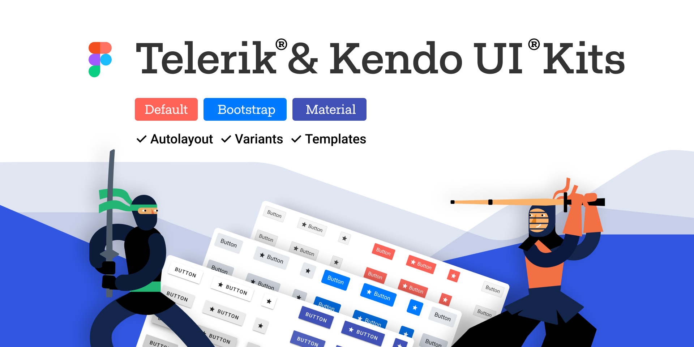
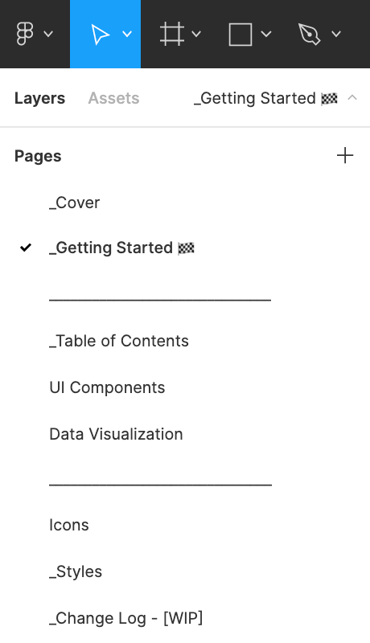
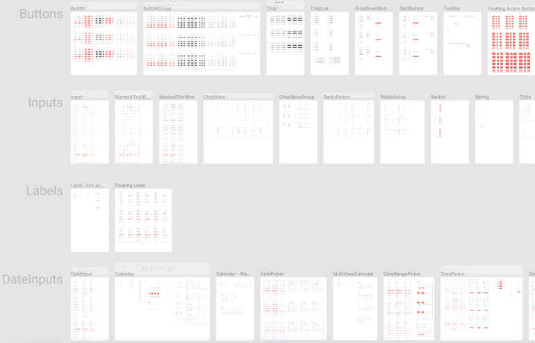


# Telerik and Kendo UI Design Kits for Figma ({{site.framework}})

Design Files for Figma&mdash;building blocks for designers matching the UI for {{site.framework}} components.

To foster the efficient collaboration between designers and developers, the Telerik designers created four Telerik and Kendo UI Kits for Figma (one for each of the top four themes shipped with {{site.product}}): Material, Bootstrap, Fluent, and Default (our own styling)).

<a href="https://www.figma.com/@progress" class="track--download-kendoui" style="display: inline-flex;" title="Download Telerik UI Kits">
<button importance="ghost" style="display: flex;
                                max-height: 50px;
                                -webkit-box-align: center;
                                align-items: center;
                                -webkit-box-pack: center;
                                justify-content: center;
                                outline: none;
                                cursor: pointer;
                                user-select: none;
                                border-radius: 2px;
                                font-weight: 500;
                                font-size: 18px;
                                line-height: 29px;
                                padding: 0.5rem 1rem;
                                background-color: transparent;
                                border: 2px solid rgba(148, 216, 255, 0.533);
                                color: rgb(101, 101, 101);">

Download UI Kits
</button>
</a>

These professional UI kits incorporate pre-built reusable design components that act in accordance with the [atomic design principles](https://atomicdesign.bradfrost.com/chapter-2/).

The design files represent the {{site.framework}} UI components in every possible state, their detailed anatomy, colors, metrics, and icons. All these elements enable the seamless handover of the design to the developers.

## Benefits of Using the UI Kits

You can enjoy the following advantages when using the UI kits: 

- The UI kits include information about which components are available, their states, and how they are connected.
- Developers will be able to easily match the UI for {{site.framework}} components with corresponding design requirements.
- The edited templates can be quickly converted into a [shared Figma library](https://www.figma.com/best-practices/components-styles-and-shared-libraries/).

## Downloading the UI Kits

You can download the Telerik and Kendo UI Kits for Figma can from the links below&mdash;follow the instructions on [duplicating a file from the Figma Community](https://help.figma.com/hc/en-us/articles/360038510873-Use-files-from-the-Community#Duplicate).

- [Telerik & Kendo UI Kit for Material](https://www.figma.com/community/file/971704350762479492)
- [Telerik & Kendo UI Kit for Bootstrap](https://www.figma.com/community/file/971704996235717509)
- [Telerik & Kendo UI Kit Default](https://www.figma.com/community/file/971702824494731137)
- [Telerik & Kendo UI Kit for MS Fluent](https://www.figma.com/community/file/1174728993763737426)

## Exploring the UI Kits' Structure

The Telerik and Kendo UI Kits for Figma use [base components and nested instances](https://www.figma.com/best-practices/creating-and-organizing-variants/using-variants-effectively/) for better component management. Furthermore, the offer [variant support](https://help.figma.com/hc/en-us/articles/360055471353-Prepare-for-variants) for certain components to make them even more intuitive to use.

Each Telerik and Kendo UI Kit for Figma contains the following pages, most of which provide multiple frames that group similar design assets:

* **_Cover**&mdash;The cover page of the UI kit.
* **_Getting Started**&mdash;Briefly explains what you need to know to start using the UI kits.
* **_Table of Contents**&mdash;An index with hyperlinks that you can use to quickly navigate within the UI kits.
* **UI Components**&mdash;Contains all components and their variants.
* **Data Visualization**&mdash;Contains visual equivalents of all charts supported by the Telerik and Kendo UI web component libraries.
* **Icons**&mdash;Contains all icons in the form of convenient components.
* **_Styles**&mdash;An informational page with all styles that are applied to the components, such as typography, colors, and effects.
* **_Change Log**&mdash;A list with the changes in the UI kit.

Most pages contain multiple frames that group similar design assets.

## Customizing the UI Kits

The Telerik and Kendo UI Kits for Figma are flexible and fully customizable to your vision and needs. Furthermore, the UI kits enable the scalability of the changes that you apply to the design.

To achieve the highest impact and to propagate your changes to multiple components and variants, customize the components on the **_Base** frames of the **UI Components** page.

> You can [publish the modified template as a library](https://help.figma.com/hc/en-us/articles/360041051154#h_b9cf5ead-791e-4ae2-9dd8-aded2fe54fe6), once the desired design is achieved.

## Upgrading to Newer Versions

To upgrade to newer versions of the UI kits while keeping your styles, download the free <a href="https://www.figma.com/community/plugin/1047874318864404919/InstaRelinker" target="_blank">InstaRelinker tool</a> that is available as a plugin in the Figma community. With this tool, you won’t have to manually swap instances and replace remote with local styles.

The InstaRelinker plugin enables you to re-link nested remote instances and styles within selected local main components to their local equivalents. When the plugin runs, it scans the current Figma file for local main components and automatically re-links any remote instances with names that match a local main component. If the plugin doesn't find a match, it allows you to manually select the local main component for each remote instance and re-link it. The InstaRelinker applies the same process for remote styles.

## Choosing How to Use the UI Kits

You can apply three different levels of component customization, depending on your requirements: 

1. **Out-of-the-box components**&mdash;select one of the available kits and using the included components as they are start creating your own application design as a faster solution with seamless handover and design implementation.
1. **Components with customized colors**&mdash;apply colors according to your brand requirements by transferring them to the {{site.framework}} components with the [ThemeBuilder application]().
1. **Unique design system**&mdash;change the look and feel of the components entirely. In case you need consultation or help with the implementation, [contact](https://www.telerik.com/services/ui-ux-design) with our solution experts who will help you plan, prototype, and build your design system. 

## See Also

* [Getting Started with {{site.product}}]()
* [Browse the Components](https://demos.telerik.com/{{site.platform}}/)
* [Figma for Developers (blog)](https://www.telerik.com/blogs/figma-developers)
* [Design Systems for Developers (blog)](https://www.telerik.com/blogs/design-systems-developers)


# Telerik and Kendo UI Design Kits for Figma ({{site.framework}})

The Design Files for Figma are building blocks for designers that match the Telerik UI for ASP.NET MVC components.

The Telerik designers created four distinct Telerik and Kendo UI kits for Figma&mdash;one for each of the most popular themes shipped with the UI for ASP.NET MVC library. These kits help to facilitate the efficient collaboration between designers and developers in their efforts to create and implement the perfect project design.

<a href="https://www.figma.com/@progress" class="track--download-kendoui" style="display: inline-flex;" title="Download Telerik UI Kits">
<button importance="ghost" style="display: flex;
                                max-height: 50px;
                                -webkit-box-align: center;
                                align-items: center;
                                -webkit-box-pack: center;
                                justify-content: center;
                                outline: none;
                                cursor: pointer;
                                user-select: none;
                                border-radius: 2px;
                                font-weight: 500;
                                font-size: 18px;
                                line-height: 29px;
                                padding: 0.5rem 1rem;
                                background-color: transparent;
                                border: 2px solid rgba(148, 216, 255, 0.533);
                                color: rgb(101, 101, 101);">

Download UI Kits
</button>
</a>

The Telerik and Kendo UI Design Kits offer pre-built design components that you can use as they are or customize them. The UI kits are created according to the [atomic design principles](https://atomicdesign.bradfrost.com/chapter-2/). By representing all of the ASP.NET MVC components and their states, the designers can easily communicate their requirements with the developer.

## Downloading the UI Kits

You can download the Telerik and Kendo UI Kits for Figma by following the links provided below. Instructions on how to duplicate a Figma file are available in the [Figma Community](https://help.figma.com/hc/en-us/articles/360038510873-Use-files-from-the-Community#Duplicate).

- [Telerik & Kendo UI Kit for Material](https://www.figma.com/community/file/971704350762479492)
- [Telerik & Kendo UI Kit for Bootstrap](https://www.figma.com/community/file/971704996235717509)
- [Telerik & Kendo UI Kit Default](https://www.figma.com/community/file/971702824494731137)
- [Telerik & Kendo UI Kit for MS Fluent](https://www.figma.com/community/file/1174728993763737426)

## Exploring the UI Kits' Structure

The Telerik and Kendo UI Kits for Figma come with [support for component variants](https://help.figma.com/hc/en-us/articles/360055471353-Prepare-for-variants) and options for component management&mdash;for example, they utilize [nested instances and base components](https://www.figma.com/best-practices/creating-and-organizing-variants/using-variants-effectively/).

Each UI kit includes the following pages:

* **_Cover**&mdash;The cover page of the UI kit.
* **_Getting Started**&mdash;Briefly explains what you need to know to start using the UI kits.
* **_Table of Contents**&mdash;An index with hyperlinks that you can use to quickly navigate within the UI kits.
* **UI Components**&mdash;Contains all components and their variants.
* **Data Visualization**&mdash;Contains visual equivalents of all charts supported by the Telerik and Kendo UI web component libraries.
* **Icons**&mdash;Contains all icons in the form of convenient components.
* **_Styles**&mdash;An informational page with all styles that are applied to the components, such as typography, colors, and effects.
* **_Change Log**&mdash;A list with the changes in the UI kit.

The UI kits group similar design assets into frames.

## Customizing the UI Kits 

The Telerik and Kendo UI Kits for Figma are flexible and fully customizable to your vision and needs. Also, the UI kits enable the scalability of the changes that you apply to the design.

To achieve the highest impact and to propagate your changes to multiple components and variants, customize the components on the **_Base** frames of the **UI Components** page.  

> The modified template can be [published as a library](https://help.figma.com/hc/en-us/articles/360041051154#h_b9cf5ead-791e-4ae2-9dd8-aded2fe54fe6) once the desired customization is achieved.

## Choosing How to Use the UI Kits 

You can apply three different levels of component customization, depending on your requirements: 

The Telerik UI Figma Kits allow you to customize the available components on three different levels:

* Create your own application design by selecting one of the available kits.

* Apply colors according to your brand guidelines with the [Theme Builder]() application.

* Entirely change the look and feel of the components by creating your unique design system. [Contact](https://www.telerik.com/services/ui-ux-design) our solution experts if you need help with building your unique design system.

## See Also

* [Getting Started with {{site.product}}]()
* [Browse the Components](https://demos.telerik.com/{{site.platform}}/)
* [Figma for Developers (blog)](https://www.telerik.com/blogs/figma-developers)
* [Design Systems for Developers (blog)](https://www.telerik.com/blogs/design-systems-developers)


