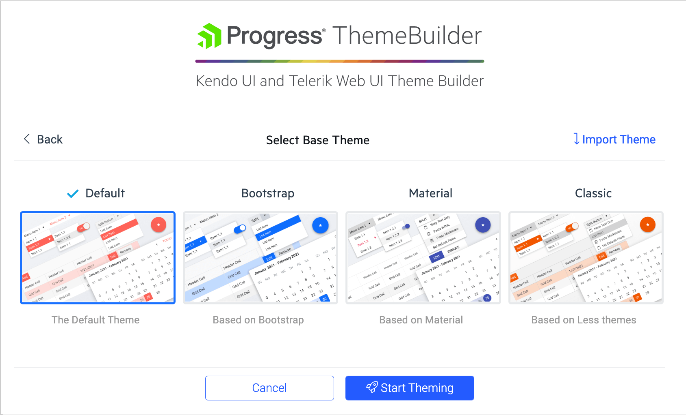
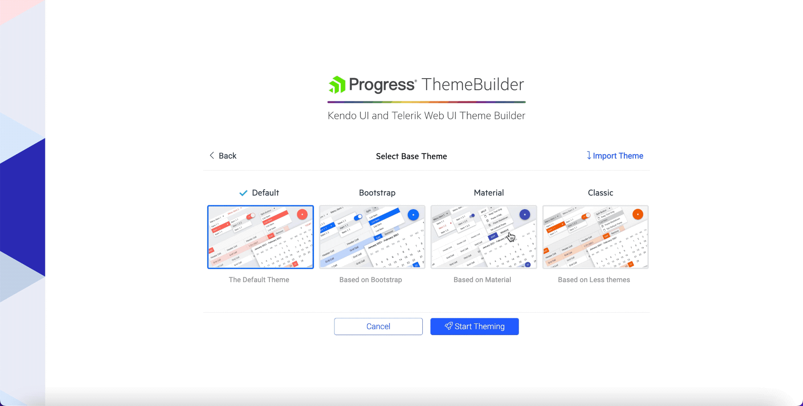
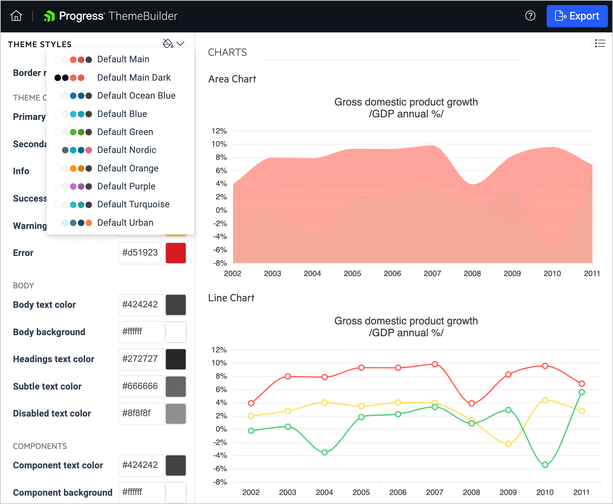

# Using ThemeBuilder

[**Progress ThemeBuilder**](https://themebuilder.telerik.com/{{ site.platform }}) for {{ site.product_short }} is a web application that enables you to create new or customize existing themes. With ThemeBuilder, you are in full control over the appearance each UI component.

ThemeBuilder allows you to render the same look and feel for all UI components from all Kendo UI suites and gives you full control over their visual elements. When you apply visual customizations to complex components like the Grid, ThemeBuilder automatically updates the styles of all underlying components (Button, AutoComplete, DropDownList, DatePicker, and more). After you achieve the desired look and feel, you can download and integrate the theme into your project.



## Creating New Themes

To create a new theme:

1. Open [ThemeBuilder](https://themebuilder.telerik.com/{{ site.platform }}).
1. Select one of the four base themes that serve as a starting point.
1. Select **Start Theming**.
1. To reduce the number of the rendered components, open the **SELECT COMPONENTS** screen and check only the UI components that you need. You can change the selection at a later stage.



### Customizing Themes

To customize a theme, use any of the following ThemeBuilder features:

* Built-in [color swatches]()&mdash;The color swatches are color variations of the base themes. The swatches use the same variables as their base theme but with different color values. To open the color swatches menu, use the dropdown button with the fill drip icon .

* Color pickers&mdash;All color variables provide color pickers that you can use to set the desired values.

* Manual updates of the component elements&mdash;You can directly enter the desired values into the input field of the selected variable.



## Using Existing Themes

To customize a theme you previously created:

1. Open [ThemeBuilder](https://themebuilder.telerik.com/{{ site.platform }}).

1. Select the **Import Theme** button on the right.

   

1. Upload the `.json` file that is part of the ZIP archive that you have previously downloaded from ThemeBuilder. It contains the current parameters of the customized theme. As a result, the selected components and styling elements are loaded.

1. Start customizing your theme by using the ThemeBuilder features your project requires.

### JSON File Structure

The JSON file holds the information about the modified variables of the customized theme. The structure of the file is defined in the [kendo-swatch JSON schema](https://github.com/telerik/kendo-theme-tasks/blob/develop/lib/schemas/kendo-swatch.json) part of the [kendo-theme-tasks package](https://github.com/telerik/kendo-theme-tasks).

If you don't have a JSON file and your custom theme targets all components, you can create the JSON file manually from the existing SCSS file. Make sure you consider the following specifics:

* `THEME_NAME`&mdash;Indicates the name of your custom theme.
* `BASE_THEME`&mdash;The name of your base theme, for example, **default**, **bootstrap**, **material**, and so on.
* `THEME_VERSION`&mdash;The recommended version of the [Kendo UI Themes](https://github.com/telerik/kendo-themes) against which you compile your theme.
* `components`&mdash;The list of all components that will be included in the compiled theme. Leave empty for all.
* `groups`&mdash;The list of variables that will be customized in the Theme Builder, organized in groups.
* `key` and `value` variables&mdash;The `key` of the variable outputs its name. The `value` of the variable outputs its value.

For example:

        ```json
        "border-radius": {
            "name": "Border radius",
            "type": "number",
            "value": "2px"
        }
        ```

      outputs

      ```scss
      $border-radius: 2px;
      ```

The following example demonstrates the JSON file for the **Default** and **Bootstrap** base themes.

```json
{
    "name": "THEME_NAME",
    "product": "kendo",
    "base": "@progress/kendo-theme-BASE_THEME",
    "version": "THEME_VERSION",
    "components": [],
    "groups": [
        {
            "variables": {
                "border-radius": {
                    "name": "Border radius",
                    "type": "number",
                    "value": "2px"
                }
            }
        },
        {
            "name": "Theme colors",
            "variables": {
                "primary": {
                    "name": "Primary",
                    "type": "color",
                    "value": "#ff6358"
                },
                "secondary": {
                    "name": "Secondary",
                    "type": "color",
                    "value": "#f6f6f6"
                },
                "info": {
                    "name": "Info",
                    "type": "color",
                    "value": "#3e80ed"
                },
                "success": {
                    "name": "Success",
                    "type": "color",
                    "value": "#5ec232"
                },
                "warning": {
                    "name": "Warning",
                    "type": "color",
                    "value": "#fdce3e"
                },
                "error": {
                    "name": "Error",
                    "type": "color",
                    "value": "#d51923"
                }
            }
        },
        {
            "name": "Body",
            "variables": {
                "body-text": {
                    "name": "Body text color",
                    "type": "color",
                    "value": "#424242"
                },
                "body-bg": {
                    "name": "Body background",
                    "type": "color",
                    "value": "#ffffff"
                },
                "headings-text": {
                    "name": "Headings text color",
                    "type": "color",
                    "value": "#272727"
                },
                "subtle-text": {
                    "name": "Subtle text color",
                    "type": "color",
                    "value": "#666666"
                },
                "disabled-text": {
                    "name": "Disabled text color",
                    "type": "color",
                    "value": "#8f8f8f"
                }
            }
        },
        {
            "name": "Components",
            "variables": {
                "component-text": {
                    "name": "Component text color",
                    "type": "color",
                    "value": "#424242"
                },
                "component-bg": {
                    "name": "Component background",
                    "type": "color",
                    "value": "#ffffff"
                },
                "base-text": {
                    "name": "Header text color",
                    "type": "color",
                    "value": "#424242"
                },
                "base-bg": {
                    "name": "Header background",
                    "type": "color",
                    "value": "#fafafa"
                },
                "hovered-text": {
                    "name": "Hover text color",
                    "type": "color",
                    "value": "#424242"
                },
                "hovered-bg": {
                    "name": "Hover background",
                    "type": "color",
                    "value": "#ececec"
                },
                "selected-text": {
                    "name": "Selected text color",
                    "type": "color",
                    "value": "#ffffff"
                },
                "selected-bg": {
                    "name": "Selected background",
                    "type": "color",
                    "value": "#ff6358"
                }
            }
        },
        {
            "name": "Button",
            "variables": {
                "kendo-button-text": {
                    "name": "Button text color",
                    "type": "color",
                    "value": "#424242"
                },
                "kendo-button-bg": {
                    "name": "Button background",
                    "type": "color",
                    "value": "#f5f5f5"
                }
            }
        },
        {
            "name": "Link",
            "variables": {
                "link-text": {
                    "name": "Link text color",
                    "type": "color",
                    "value": "#ff6358"
                },
                "link-hover-text": {
                    "name": "Link hover text color",
                    "type": "color",
                    "value": "#d6534a"
                }
            }
        },
        {
            "name": "Dataviz",
            "variables": {
                "series-a": {
                    "name": "Series A",
                    "type": "color",
                    "value": "#ff6358"
                },
                "series-b": {
                    "name": "Series B",
                    "type": "color",
                    "value": "#ffe162"
                },
                "series-c": {
                    "name": "Series C",
                    "type": "color",
                    "value": "#4cd180"
                },
                "series-d": {
                    "name": "Series D",
                    "type": "color",
                    "value": "#4b5ffa"
                },
                "series-e": {
                    "name": "Series E",
                    "type": "color",
                    "value": "#ac58ff"
                },
                "series-f": {
                    "name": "Series F",
                    "type": "color",
                    "value": "#ff5892"
                }
            }
        }
    ]
}
```

The following example demonstrates the JSON file for the **Material** base theme.

```json
{
    "name": "THEME_NAME",
    "product": "kendo",
    "base": "@progress/kendo-theme-BASE_THEME",
    "version": "THEME_VERSION",
    "components": [],
    "groups": [
        {
            "variables": {
                "border-radius": {
                    "name": "Border radius",
                    "type": "number",
                    "value": "2px"
                }
            }
        },
        {
            "name": "Theme colors",
            "variables": {
                "primary-palette-name": {
                    "name": "Primary",
                    "type": "material-colorlist",
                    "enum": [
                        {
                            "value": "red",
                            "text": "Red",
                            "preview": "#f44336"
                        },
                        {
                            "value": "pink",
                            "text": "Pink",
                            "preview": "#e91e63"
                        },
                        {
                            "value": "purple",
                            "text": "Purple",
                            "preview": "#9c27b0"
                        },
                        {
                            "value": "deepPurple",
                            "text": "Deep Purple",
                            "preview": "#673ab7"
                        },
                        {
                            "value": "indigo",
                            "text": "Indigo",
                            "preview": "#3f51b5"
                        },
                        {
                            "value": "blue",
                            "text": "Blue",
                            "preview": "#2196f3"
                        },
                        {
                            "value": "lightBlue",
                            "text": "Light Blue",
                            "preview": "#03a9f4"
                        },
                        {
                            "value": "cyan",
                            "text": "Cyan",
                            "preview": "#00bcd4"
                        },
                        {
                            "value": "teal",
                            "text": "Teal",
                            "preview": "#009688"
                        },
                        {
                            "value": "green",
                            "text": "Green",
                            "preview": "#4caf50"
                        },
                        {
                            "value": "lightGreen",
                            "text": "Light Green",
                            "preview": "#8bc34a"
                        },
                        {
                            "value": "lime",
                            "text": "Lime",
                            "preview": "#cddc39"
                        },
                        {
                            "value": "yellow",
                            "text": "Yellow",
                            "preview": "#ffeb3b"
                        },
                        {
                            "value": "amber",
                            "text": "Amber",
                            "preview": "#ffc107"
                        },
                        {
                            "value": "orange",
                            "text": "Orange",
                            "preview": "#ff9800"
                        },
                        {
                            "value": "deepOrange",
                            "text": "Deep Orange",
                            "preview": "#ff5722"
                        },
                        {
                            "value": "brown",
                            "text": "Brown",
                            "preview": "#795548"
                        },
                        {
                            "value": "gray",
                            "text": "Gray",
                            "preview": "#9e9e9e"
                        },
                        {
                            "value": "blueGray",
                            "text": "Blue Gray",
                            "preview": "#607d8b"
                        }
                    ],
                    "value": "indigo"
                },
                "secondary-palette-name": {
                    "name": "Secondary",
                    "type": "material-colorlist",
                    "enum": [
                        {
                            "value": "red",
                            "text": "Red",
                            "preview": "#f44336"
                        },
                        {
                            "value": "pink",
                            "text": "Pink",
                            "preview": "#e91e63"
                        },
                        {
                            "value": "purple",
                            "text": "Purple",
                            "preview": "#9c27b0"
                        },
                        {
                            "value": "deepPurple",
                            "text": "Deep Purple",
                            "preview": "#673ab7"
                        },
                        {
                            "value": "indigo",
                            "text": "Indigo",
                            "preview": "#3f51b5"
                        },
                        {
                            "value": "blue",
                            "text": "Blue",
                            "preview": "#2196f3"
                        },
                        {
                            "value": "lightBlue",
                            "text": "Light Blue",
                            "preview": "#03a9f4"
                        },
                        {
                            "value": "cyan",
                            "text": "Cyan",
                            "preview": "#00bcd4"
                        },
                        {
                            "value": "teal",
                            "text": "Teal",
                            "preview": "#009688"
                        },
                        {
                            "value": "green",
                            "text": "Green",
                            "preview": "#4caf50"
                        },
                        {
                            "value": "lightGreen",
                            "text": "Light Green",
                            "preview": "#8bc34a"
                        },
                        {
                            "value": "lime",
                            "text": "Lime",
                            "preview": "#cddc39"
                        },
                        {
                            "value": "yellow",
                            "text": "Yellow",
                            "preview": "#ffeb3b"
                        },
                        {
                            "value": "amber",
                            "text": "Amber",
                            "preview": "#ffc107"
                        },
                        {
                            "value": "orange",
                            "text": "Orange",
                            "preview": "#ff9800"
                        },
                        {
                            "value": "deepOrange",
                            "text": "Deep Orange",
                            "preview": "#ff5722"
                        },
                        {
                            "value": "brown",
                            "text": "Brown",
                            "preview": "#795548"
                        },
                        {
                            "value": "gray",
                            "text": "Gray",
                            "preview": "#9e9e9e"
                        },
                        {
                            "value": "blueGray",
                            "text": "Blue Gray",
                            "preview": "#607d8b"
                        }
                    ],
                    "value": "pink"
                },
                "theme-type": {
                    "name": "Theme luminosity",
                    "type": "color-mode",
                    "enum": [
                        {
                            "value": "light",
                            "text": "Light",
                            "preview": "#ffffff"
                        },
                        {
                            "value": "dark",
                            "text": "Dark",
                            "preview": "#000000"
                        }
                    ],
                    "value": "light"
                },
                "adjust-contrast": {
                    "name": "Adjust contrast",
                    "type": "boolean",
                    "value": true
                }
            }
        }
    ]
}
```

## Adding the Themes to Your Project

When you complete the modifications and the theme is ready:



1. To download the theme as a ZIP archive, select **Export**.
1. Unpack the archive, copy the `THEME_NAME.css` file, and paste it in the `wwwroot` folder of your application.
1. Include the `THEME_NAME.css` file in the [client-side resources](https://docs.telerik.com/aspnet-core/getting-started/installation/getting-started-copy-client-resources) of your application.

> Reference only the `THEME_NAME.css` file because the exported CSS file contains all styles you need.



1. To download the theme as a ZIP archive, select **Export**.
1. Unpack the archive, copy the downloaded `THEME_NAME.css` file, and paste it in the `Content` folder of your application.
1. Bundle the styles to render them or directly reference the styles in `Layout.cshtml`. For more information on CSS bundling in Telerik UI for ASP.NET MVC applications, refer to the article on [CSS bundling fundamentals](#css-bundling).

> Reference or bundle only the `THEME_NAME.css` file because the exported CSS file contains all styles you need.



## See Also

* [Cards]()
